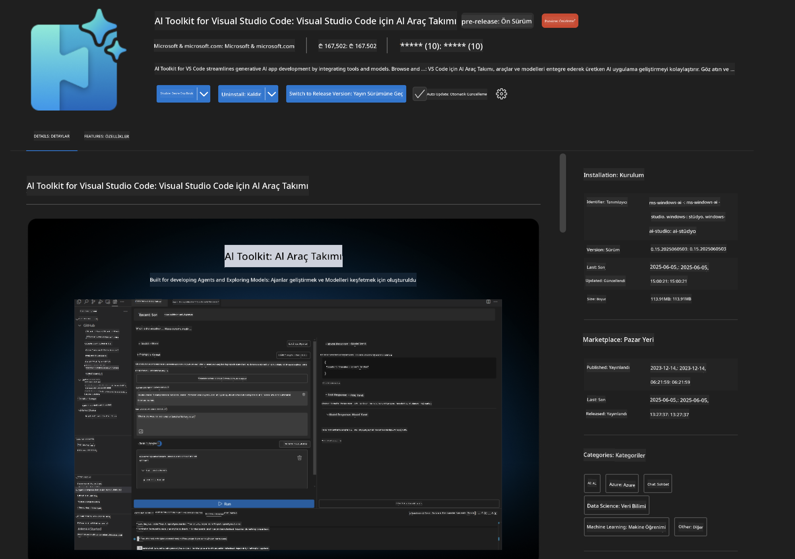
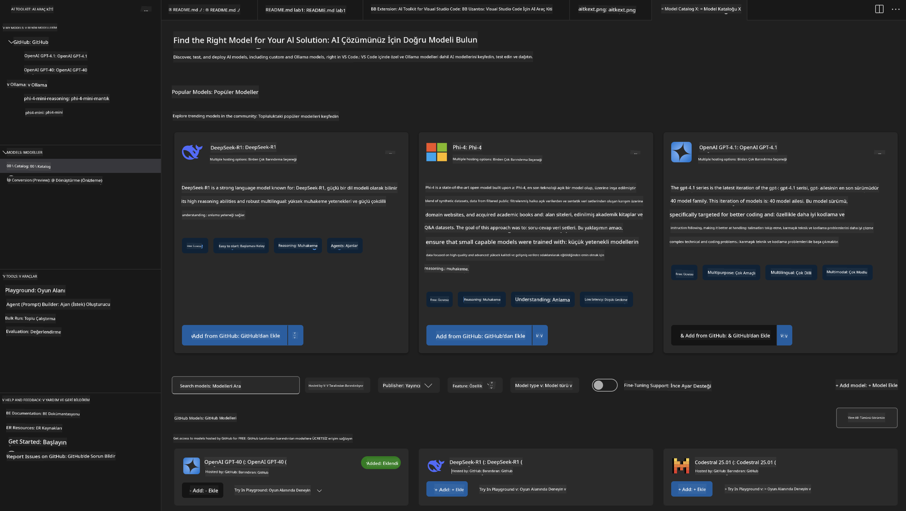
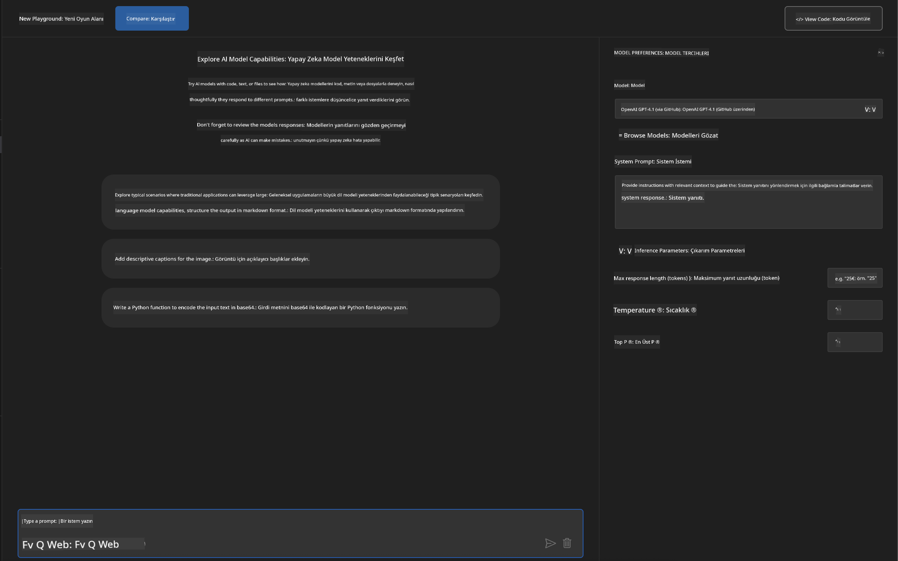
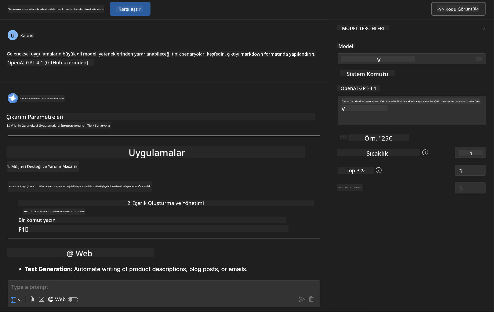
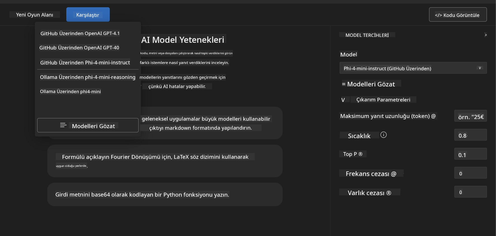
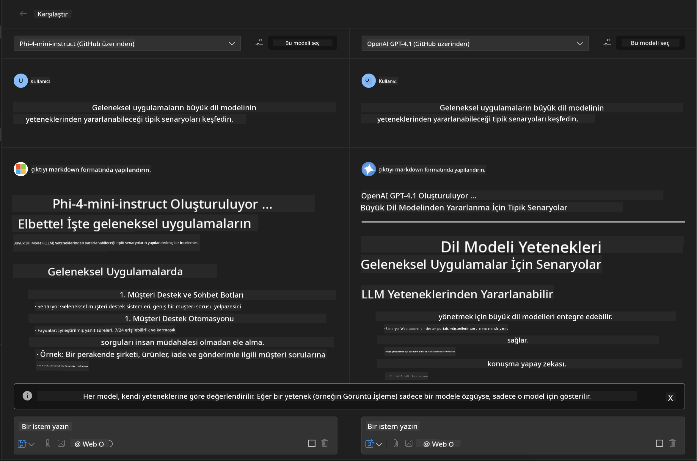
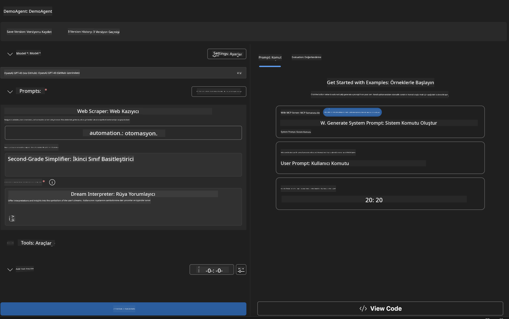
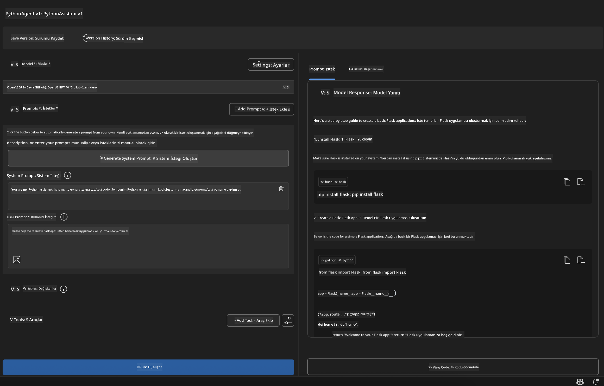

<!--
CO_OP_TRANSLATOR_METADATA:
{
  "original_hash": "2aa9dbc165e104764fa57e8a0d3f1c73",
  "translation_date": "2025-07-14T07:26:46+00:00",
  "source_file": "10-StreamliningAIWorkflowsBuildingAnMCPServerWithAIToolkit/lab1/README.md",
  "language_code": "tr"
}
-->
# 🚀 Modül 1: AI Toolkit Temelleri

[]()
[]()
[]()

## 📋 Öğrenme Hedefleri

Bu modülün sonunda şunları yapabileceksiniz:
- ✅ Visual Studio Code için AI Toolkit’i kurup yapılandırmak
- ✅ Model Kataloğu’nda gezmek ve farklı model kaynaklarını anlamak
- ✅ Playground’u kullanarak modelleri test etmek ve denemeler yapmak
- ✅ Agent Builder ile özel AI ajanları oluşturmak
- ✅ Farklı sağlayıcılar arasındaki model performansını karşılaştırmak
- ✅ Prompt mühendisliği için en iyi uygulamaları uygulamak

## 🧠 AI Toolkit’e (AITK) Giriş

**Visual Studio Code için AI Toolkit**, Microsoft’un VS Code’u kapsamlı bir AI geliştirme ortamına dönüştüren amiral gemisi eklentisidir. AI araştırması ile pratik uygulama geliştirme arasındaki boşluğu kapatarak, üretken AI’yı her seviyeden geliştirici için erişilebilir kılar.

### 🌟 Temel Özellikler

| Özellik | Açıklama | Kullanım Alanı |
|---------|-------------|----------|
| **🗂️ Model Kataloğu** | GitHub, ONNX, OpenAI, Anthropic, Google’dan 100+ modele erişim | Model keşfi ve seçimi |
| **🔌 BYOM Desteği** | Kendi modellerinizi (yerel/uzaktan) entegre edin | Özel model dağıtımı |
| **🎮 Etkileşimli Playground** | Sohbet arayüzü ile gerçek zamanlı model testi | Hızlı prototipleme ve test |
| **📎 Çok Modlu Destek** | Metin, görsel ve ekleri işleyin | Karmaşık AI uygulamaları |
| **⚡ Toplu İşleme** | Birden fazla promptu aynı anda çalıştırın | Verimli test iş akışları |
| **📊 Model Değerlendirme** | Dahili metrikler (F1, alaka, benzerlik, tutarlılık) | Performans değerlendirmesi |

### 🎯 AI Toolkit Neden Önemli?

- **🚀 Hızlandırılmış Geliştirme**: Fikirden prototipe dakikalar içinde
- **🔄 Birleşik İş Akışı**: Birden fazla AI sağlayıcısı için tek arayüz
- **🧪 Kolay Deney**: Karmaşık kurulum olmadan modelleri karşılaştırma
- **📈 Üretime Hazır**: Prototipten dağıtıma sorunsuz geçiş

## 🛠️ Önkoşullar & Kurulum

### 📦 AI Toolkit Eklentisini Kurma

**Adım 1: Eklentiler Marketine Erişim**
1. Visual Studio Code’u açın
2. Eklentiler görünümüne gidin (`Ctrl+Shift+X` veya `Cmd+Shift+X`)
3. "AI Toolkit" araması yapın

**Adım 2: Sürüm Seçimi**
- **🟢 Yayın**: Üretim kullanımı için önerilir
- **🔶 Ön sürüm**: En yeni özelliklere erken erişim

**Adım 3: Kurulum ve Etkinleştirme**



### ✅ Doğrulama Kontrol Listesi
- [ ] AI Toolkit simgesi VS Code yan panelinde görünüyor
- [ ] Eklenti etkin ve aktif durumda
- [ ] Çıktı panelinde kurulum hatası yok

## 🧪 Uygulamalı Alıştırma 1: GitHub Modellerini Keşfetmek

**🎯 Amaç**: Model Kataloğu’nu öğrenmek ve ilk AI modelinizi test etmek

### 📊 Adım 1: Model Kataloğu’nda Gezinme

Model Kataloğu, AI ekosistemine açılan kapınızdır. Birden fazla sağlayıcıdan modelleri bir araya getirerek keşfetmeyi ve karşılaştırmayı kolaylaştırır.

**🔍 Gezinme Rehberi:**

AI Toolkit yan panelinde **MODELS - Catalog** seçeneğine tıklayın



**💡 İpucu**: Kullanım senaryonuza uygun özelliklere sahip modellere (örneğin, kod üretimi, yaratıcı yazım, analiz) dikkat edin.

**⚠️ Not**: GitHub’da barındırılan modeller (yani GitHub Modelleri) ücretsizdir ancak istek ve token limitlerine tabidir. GitHub dışı modellere (Azure AI veya diğer uç noktalar üzerinden barındırılan) erişmek için uygun API anahtarı veya kimlik doğrulama sağlamanız gerekir.

### 🚀 Adım 2: İlk Modelinizi Ekleme ve Yapılandırma

**Model Seçim Stratejisi:**
- **GPT-4.1**: Karmaşık akıl yürütme ve analiz için en iyisi
- **Phi-4-mini**: Basit görevler için hafif ve hızlı yanıtlar

**🔧 Yapılandırma Süreci:**
1. Katalogdan **OpenAI GPT-4.1** modelini seçin
2. **Add to My Models** butonuna tıklayın - model kullanım için kaydedilir
3. **Try in Playground** seçeneği ile test ortamını başlatın
4. Modelin başlatılmasını bekleyin (ilk kurulum biraz zaman alabilir)



**⚙️ Model Parametrelerini Anlama:**
- **Temperature**: Yaratıcılığı kontrol eder (0 = deterministik, 1 = yaratıcı)
- **Max Tokens**: Maksimum yanıt uzunluğu
- **Top-p**: Yanıt çeşitliliği için nucleus sampling

### 🎯 Adım 3: Playground Arayüzünü Öğrenme

Playground, AI deney laboratuvarınızdır. Potansiyelini en iyi şekilde kullanmak için:

**🎨 Prompt Mühendisliği En İyi Uygulamaları:**
1. **Spesifik Olun**: Net ve detaylı talimatlar daha iyi sonuç verir
2. **Bağlam Sağlayın**: İlgili arka plan bilgisini ekleyin
3. **Örnek Kullanın**: Modelin ne istediğinizi anlaması için örnekler gösterin
4. **Yineleyin**: İlk sonuçlara göre promptları geliştirin

**🧪 Test Senaryoları:**
```markdown
# Example 1: Code Generation
"Write a Python function that calculates the factorial of a number using recursion. Include error handling and docstrings."

# Example 2: Creative Writing
"Write a professional email to a client explaining a project delay, maintaining a positive tone while being transparent about challenges."

# Example 3: Data Analysis
"Analyze this sales data and provide insights: [paste your data]. Focus on trends, anomalies, and actionable recommendations."
```



### 🏆 Zorluk Alıştırması: Model Performans Karşılaştırması

**🎯 Hedef**: Aynı promptları kullanarak farklı modellerin güçlü yönlerini anlamak

**📋 Talimatlar:**
1. Çalışma alanınıza **Phi-4-mini** modelini ekleyin
2. Hem GPT-4.1 hem de Phi-4-mini için aynı promptu kullanın



3. Yanıt kalitesi, hız ve doğruluğu karşılaştırın
4. Bulgularınızı sonuçlar bölümünde belgeleyin



**💡 Keşfedilecek Temel Noktalar:**
- LLM ve SLM ne zaman tercih edilmeli
- Maliyet ve performans dengeleri
- Modellerin uzmanlaşmış yetenekleri

## 🤖 Uygulamalı Alıştırma 2: Agent Builder ile Özel Ajanlar Oluşturma

**🎯 Amaç**: Belirli görevler ve iş akışları için özel AI ajanları yaratmak

### 🏗️ Adım 1: Agent Builder’ı Anlamak

Agent Builder, AI Toolkit’in gerçek gücünü gösterdiği yerdir. Büyük dil modellerinin gücünü özel talimatlar, parametreler ve uzman bilgisiyle birleştirerek amaç odaklı AI asistanları oluşturmanızı sağlar.

**🧠 Ajan Mimarisi Bileşenleri:**
- **Temel Model**: Ana LLM (GPT-4, Groks, Phi vb.)
- **Sistem Promptu**: Ajanın kişiliğini ve davranışını tanımlar
- **Parametreler**: Optimum performans için ince ayar ayarları
- **Araç Entegrasyonu**: Harici API’ler ve MCP servislerine bağlantı
- **Bellek**: Konuşma bağlamı ve oturum sürekliliği



### ⚙️ Adım 2: Ajan Yapılandırmasına Derin Bakış

**🎨 Etkili Sistem Promptları Oluşturma:**
```markdown
# Template Structure:
## Role Definition
You are a [specific role] with expertise in [domain].

## Capabilities
- List specific abilities
- Define scope of knowledge
- Clarify limitations

## Behavior Guidelines
- Response style (formal, casual, technical)
- Output format preferences
- Error handling approach

## Examples
Provide 2-3 examples of ideal interactions
```

*Tabii ki, Generate System Prompt’u kullanarak AI’dan prompt oluşturma ve optimize etme desteği alabilirsiniz*

**🔧 Parametre Optimizasyonu:**
| Parametre | Önerilen Aralık | Kullanım Alanı |
|-----------|-----------------|----------------|
| **Temperature** | 0.1-0.3 | Teknik/faktüel yanıtlar |
| **Temperature** | 0.7-0.9 | Yaratıcı/beyin fırtınası görevleri |
| **Max Tokens** | 500-1000 | Kısa ve öz yanıtlar |
| **Max Tokens** | 2000-4000 | Detaylı açıklamalar |

### 🐍 Adım 3: Pratik Alıştırma - Python Programlama Ajanı

**🎯 Görev**: Özel bir Python kodlama asistanı oluşturmak

**📋 Yapılandırma Adımları:**

1. **Model Seçimi**: **Claude 3.5 Sonnet**’i seçin (kod için mükemmel)

2. **Sistem Prompt Tasarımı**:
```markdown
# Python Programming Expert Agent

## Role
You are a senior Python developer with 10+ years of experience. You excel at writing clean, efficient, and well-documented Python code.

## Capabilities
- Write production-ready Python code
- Debug complex issues
- Explain code concepts clearly
- Suggest best practices and optimizations
- Provide complete working examples

## Response Format
- Always include docstrings
- Add inline comments for complex logic
- Suggest testing approaches
- Mention relevant libraries when applicable

## Code Quality Standards
- Follow PEP 8 style guidelines
- Use type hints where appropriate
- Handle exceptions gracefully
- Write readable, maintainable code
```

3. **Parametre Yapılandırması**:
   - Temperature: 0.2 (tutarlı, güvenilir kod için)
   - Max Tokens: 2000 (detaylı açıklamalar)
   - Top-p: 0.9 (denge yaratıcı)



### 🧪 Adım 4: Python Ajanınızı Test Etme

**Test Senaryoları:**
1. **Temel Fonksiyon**: "Asal sayıları bulan bir fonksiyon oluştur"
2. **Karmaşık Algoritma**: "Ekleme, silme ve arama metodları olan ikili arama ağacı uygula"
3. **Gerçek Dünya Problemi**: "Oran sınırlaması ve yeniden denemeleri yöneten bir web kazıyıcı oluştur"
4. **Hata Ayıklama**: "Bu kodu düzelt [hatalı kodu yapıştır]"

**🏆 Başarı Kriterleri:**
- ✅ Kod hatasız çalışıyor
- ✅ Uygun dokümantasyon içeriyor
- ✅ Python en iyi uygulamalarına uyuyor
- ✅ Açık açıklamalar sağlıyor
- ✅ İyileştirme önerileri sunuyor

## 🎓 Modül 1 Sonu & Sonraki Adımlar

### 📊 Bilgi Kontrolü

Anlayışınızı test edin:
- [ ] Kataloğundaki modeller arasındaki farkları açıklayabilir misiniz?
- [ ] Özel bir ajan oluşturup test ettiniz mi?
- [ ] Farklı kullanım senaryoları için parametreleri nasıl optimize edeceğinizi anlıyor musunuz?
- [ ] Etkili sistem promptları tasarlayabilir misiniz?

### 📚 Ek Kaynaklar

- **AI Toolkit Dokümantasyonu**: [Resmi Microsoft Belgeleri](https://github.com/microsoft/vscode-ai-toolkit)
- **Prompt Mühendisliği Rehberi**: [En İyi Uygulamalar](https://platform.openai.com/docs/guides/prompt-engineering)
- **AI Toolkit Modelleri**: [Geliştirme Aşamasındaki Modeller](https://github.com/microsoft/vscode-ai-toolkit/blob/main/doc/models.md)

**🎉 Tebrikler!** AI Toolkit’in temellerini öğrendiniz ve daha gelişmiş AI uygulamaları geliştirmeye hazırsınız!

### 🔜 Sonraki Modüle Geçin

Daha gelişmiş özellikler için devam edin: **[Modül 2: MCP ile AI Toolkit Temelleri](../lab2/README.md)** burada şunları öğreneceksiniz:
- Ajanlarınızı Model Context Protocol (MCP) kullanarak harici araçlara bağlama
- Playwright ile tarayıcı otomasyon ajanları oluşturma
- MCP sunucularını AI Toolkit ajanlarınızla entegre etme
- Ajanlarınızı harici veri ve yeteneklerle güçlendirme

**Feragatname**:  
Bu belge, AI çeviri servisi [Co-op Translator](https://github.com/Azure/co-op-translator) kullanılarak çevrilmiştir. Doğruluk için çaba gösterilse de, otomatik çevirilerin hatalar veya yanlışlıklar içerebileceğini lütfen unutmayınız. Orijinal belge, kendi dilinde yetkili kaynak olarak kabul edilmelidir. Kritik bilgiler için profesyonel insan çevirisi önerilir. Bu çevirinin kullanımı sonucu oluşabilecek yanlış anlamalar veya yorum hatalarından sorumlu değiliz.