<!--
CO_OP_TRANSLATOR_METADATA:
{
  "original_hash": "a22b7dd11cd7690f99f9195877cafdc3",
  "translation_date": "2025-07-14T07:51:35+00:00",
  "source_file": "10-StreamliningAIWorkflowsBuildingAnMCPServerWithAIToolkit/lab2/README.md",
  "language_code": "tr"
}
-->
# 🌐 Modül 2: AI Toolkit Temelleri ile MCP

[]()
[]()
[]()

## 📋 Öğrenme Hedefleri

Bu modülün sonunda şunları yapabileceksiniz:
- ✅ Model Context Protocol (MCP) mimarisini ve faydalarını anlamak
- ✅ Microsoft’un MCP sunucu ekosistemini keşfetmek
- ✅ MCP sunucularını AI Toolkit Agent Builder ile entegre etmek
- ✅ Playwright MCP kullanarak işlevsel bir tarayıcı otomasyon ajanı oluşturmak
- ✅ Ajanlarınızda MCP araçlarını yapılandırmak ve test etmek
- ✅ MCP destekli ajanları üretim için dışa aktarmak ve dağıtmak

## 🎯 Modül 1 Üzerine İnşa Etmek

Modül 1’de AI Toolkit temellerini öğrendik ve ilk Python Ajanımızı oluşturduk. Şimdi ajanlarınızı devrim niteliğindeki **Model Context Protocol (MCP)** ile dış araçlar ve servislerle bağlayarak **güçlendireceğiz**.

Bunu basit bir hesap makinesinden tam donanımlı bir bilgisayara geçiş olarak düşünebilirsiniz — AI ajanlarınız artık:
- 🌐 Web sitelerinde gezinebilir ve etkileşimde bulunabilir
- 📁 Dosyalara erişip onları yönetebilir
- 🔧 Kurumsal sistemlerle entegre olabilir
- 📊 API’lerden gerçek zamanlı veri işleyebilir

## 🧠 Model Context Protocol (MCP) Nedir?

### 🔍 MCP Nedir?

Model Context Protocol (MCP), AI uygulamaları için **“USB-C”** gibidir — Büyük Dil Modellerini (LLM) dış araçlara, veri kaynaklarına ve servislere bağlayan devrim niteliğinde açık bir standarttır. USB-C’nin kablo karmaşasını tek bir evrensel bağlantı ile ortadan kaldırması gibi, MCP de AI entegrasyon karmaşasını tek bir standart protokolle çözer.

### 🎯 MCP’nin Çözdüğü Sorun

**MCP’den Önce:**
- 🔧 Her araç için özel entegrasyonlar
- 🔄 Tedarikçi bağımlılığı ve kapalı çözümler  
- 🔒 Geçici bağlantılardan kaynaklanan güvenlik açıkları
- ⏱️ Temel entegrasyonlar için aylar süren geliştirme

**MCP ile:**
- ⚡ Tak-çalıştır araç entegrasyonu
- 🔄 Tedarikçiden bağımsız mimari
- 🛡️ Yerleşik güvenlik en iyi uygulamaları
- 🚀 Yeni özelliklerin dakikalar içinde eklenmesi

### 🏗️ MCP Mimarisi Detayları

MCP, güvenli ve ölçeklenebilir bir ekosistem yaratan **istemci-sunucu mimarisi** izler:

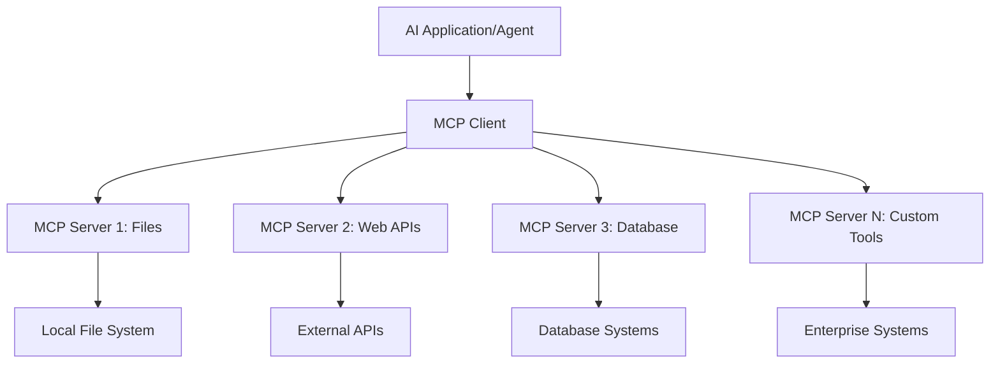

**🔧 Temel Bileşenler:**

| Bileşen | Rolü | Örnekler |
|---------|------|----------|
| **MCP Hosts** | MCP servislerini kullanan uygulamalar | Claude Desktop, VS Code, AI Toolkit |
| **MCP Clients** | Protokol yöneticileri (sunucularla 1:1) | Host uygulamalara entegre |
| **MCP Servers** | Standart protokolle yetenek sunanlar | Playwright, Files, Azure, GitHub |
| **Taşıma Katmanı** | İletişim yöntemleri | stdio, HTTP, WebSockets |

## 🏢 Microsoft’un MCP Sunucu Ekosistemi

Microsoft, gerçek dünya iş ihtiyaçlarını karşılayan kapsamlı kurumsal sınıf MCP sunucuları ile ekosisteme öncülük ediyor.

### 🌟 Öne Çıkan Microsoft MCP Sunucuları

#### 1. ☁️ Azure MCP Sunucusu  
**🔗 Depo**: [azure/azure-mcp](https://github.com/azure/azure-mcp)  
**🎯 Amaç**: AI entegrasyonlu kapsamlı Azure kaynak yönetimi

**✨ Temel Özellikler:**  
- Bildirimsel altyapı sağlama  
- Gerçek zamanlı kaynak izleme  
- Maliyet optimizasyon önerileri  
- Güvenlik uyumluluğu kontrolü  

**🚀 Kullanım Senaryoları:**  
- AI destekli Infrastructure-as-Code  
- Otomatik kaynak ölçeklendirme  
- Bulut maliyet optimizasyonu  
- DevOps iş akışı otomasyonu  

#### 2. 📊 Microsoft Dataverse MCP  
**📚 Dokümantasyon**: [Microsoft Dataverse Integration](https://go.microsoft.com/fwlink/?linkid=2320176)  
**🎯 Amaç**: İş verileri için doğal dil arayüzü

**✨ Temel Özellikler:**  
- Doğal dil ile veritabanı sorguları  
- İş bağlamı anlayışı  
- Özelleştirilebilir prompt şablonları  
- Kurumsal veri yönetimi  

**🚀 Kullanım Senaryoları:**  
- İş zekası raporlaması  
- Müşteri veri analizi  
- Satış hattı içgörüleri  
- Uyumluluk veri sorguları  

#### 3. 🌐 Playwright MCP Sunucusu  
**🔗 Depo**: [microsoft/playwright-mcp](https://github.com/microsoft/playwright-mcp)  
**🎯 Amaç**: Tarayıcı otomasyonu ve web etkileşimleri

**✨ Temel Özellikler:**  
- Çoklu tarayıcı otomasyonu (Chrome, Firefox, Safari)  
- Akıllı öğe tespiti  
- Ekran görüntüsü ve PDF oluşturma  
- Ağ trafiği izleme  

**🚀 Kullanım Senaryoları:**  
- Otomatik test iş akışları  
- Web kazıma ve veri çıkarma  
- UI/UX izleme  
- Rekabet analizi otomasyonu  

#### 4. 📁 Files MCP Sunucusu  
**🔗 Depo**: [microsoft/files-mcp-server](https://github.com/microsoft/files-mcp-server)  
**🎯 Amaç**: Akıllı dosya sistemi işlemleri

**✨ Temel Özellikler:**  
- Bildirimsel dosya yönetimi  
- İçerik senkronizasyonu  
- Versiyon kontrol entegrasyonu  
- Meta veri çıkarımı  

**🚀 Kullanım Senaryoları:**  
- Dokümantasyon yönetimi  
- Kod deposu organizasyonu  
- İçerik yayın iş akışları  
- Veri hattı dosya işlemleri  

#### 5. 📝 MarkItDown MCP Sunucusu  
**🔗 Depo**: [microsoft/markitdown](https://github.com/microsoft/markitdown)  
**🎯 Amaç**: Gelişmiş Markdown işleme ve düzenleme

**✨ Temel Özellikler:**  
- Zengin Markdown ayrıştırma  
- Format dönüşümü (MD ↔ HTML ↔ PDF)  
- İçerik yapı analizi  
- Şablon işleme  

**🚀 Kullanım Senaryoları:**  
- Teknik dokümantasyon iş akışları  
- İçerik yönetim sistemleri  
- Rapor oluşturma  
- Bilgi tabanı otomasyonu  

#### 6. 📈 Clarity MCP Sunucusu  
**📦 Paket**: [@microsoft/clarity-mcp-server](https://www.npmjs.com/package/@microsoft/clarity-mcp-server)  
**🎯 Amaç**: Web analitiği ve kullanıcı davranış içgörüleri

**✨ Temel Özellikler:**  
- Isı haritası veri analizi  
- Kullanıcı oturumu kayıtları  
- Performans metrikleri  
- Dönüşüm hunisi analizi  

**🚀 Kullanım Senaryoları:**  
- Web sitesi optimizasyonu  
- Kullanıcı deneyimi araştırması  
- A/B testi analizi  
- İş zekası panoları  

### 🌍 Topluluk Ekosistemi

Microsoft’un sunucularının yanı sıra MCP ekosistemi şunları içerir:  
- **🐙 GitHub MCP**: Depo yönetimi ve kod analizi  
- **🗄️ Veritabanı MCP’leri**: PostgreSQL, MySQL, MongoDB entegrasyonları  
- **☁️ Bulut Sağlayıcı MCP’leri**: AWS, GCP, Digital Ocean araçları  
- **📧 İletişim MCP’leri**: Slack, Teams, E-posta entegrasyonları  

## 🛠️ Uygulamalı Laboratuvar: Tarayıcı Otomasyon Ajanı Oluşturma

**🎯 Proje Hedefi**: Playwright MCP sunucusunu kullanarak web sitelerinde gezinebilen, bilgi çıkarabilen ve karmaşık web etkileşimleri yapabilen akıllı bir tarayıcı otomasyon ajanı oluşturmak.

### 🚀 Aşama 1: Ajan Temel Kurulumu

#### Adım 1: Ajanınızı Başlatın  
1. **AI Toolkit Agent Builder’ı açın**  
2. **Yeni Ajan Oluşturun** ve aşağıdaki yapılandırmayı kullanın:  
   - **Ad**: `BrowserAgent`  
   - **Model**: GPT-4o seçin  

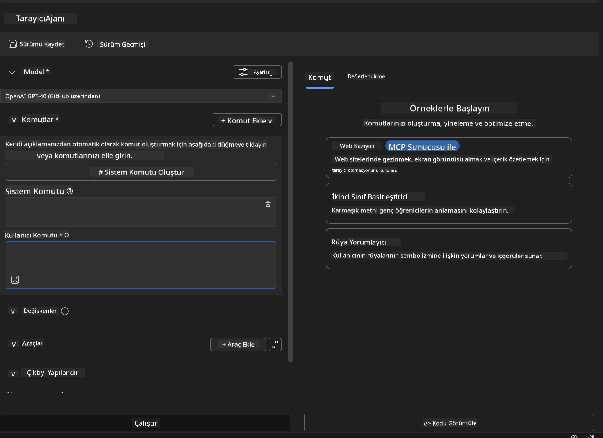

### 🔧 Aşama 2: MCP Entegrasyon İş Akışı

#### Adım 3: MCP Sunucu Entegrasyonu Ekle  
1. Agent Builder’da **Araçlar Bölümüne** gidin  
2. **"Araç Ekle"** butonuna tıklayarak entegrasyon menüsünü açın  
3. Mevcut seçeneklerden **"MCP Server"** seçeneğini seçin  

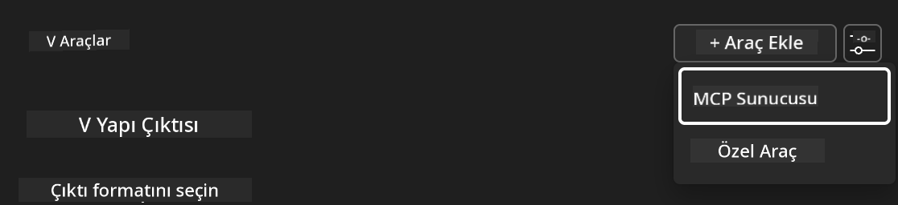

**🔍 Araç Türlerini Anlamak:**  
- **Yerleşik Araçlar**: Önceden yapılandırılmış AI Toolkit fonksiyonları  
- **MCP Sunucuları**: Dış servis entegrasyonları  
- **Özel API’ler**: Kendi servis uç noktalarınız  
- **Fonksiyon Çağrısı**: Model fonksiyonlarına doğrudan erişim  

#### Adım 4: MCP Sunucu Seçimi  
1. Devam etmek için **"MCP Server"** seçeneğini seçin  
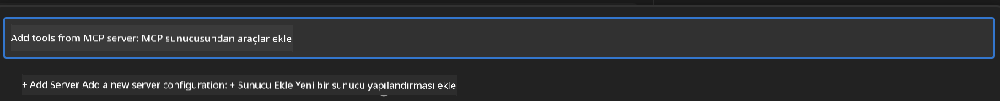

2. Mevcut entegrasyonları keşfetmek için **MCP Kataloğunu** inceleyin  
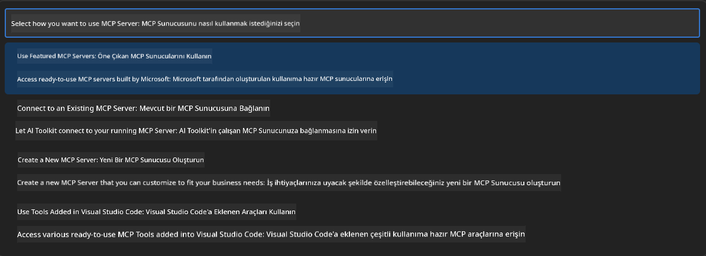

### 🎮 Aşama 3: Playwright MCP Yapılandırması

#### Adım 5: Playwright’i Seçin ve Yapılandırın  
1. Microsoft’un doğrulanmış sunucularına erişmek için **"Öne Çıkan MCP Sunucularını Kullan"** butonuna tıklayın  
2. Listeden **"Playwright"** seçeneğini seçin  
3. Varsayılan MCP ID’yi kabul edin veya ortamınıza göre özelleştirin  

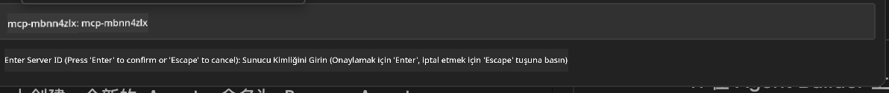

#### Adım 6: Playwright Özelliklerini Etkinleştirin  
**🔑 Kritik Adım**: Maksimum işlevsellik için mevcut tüm Playwright yöntemlerini seçin  

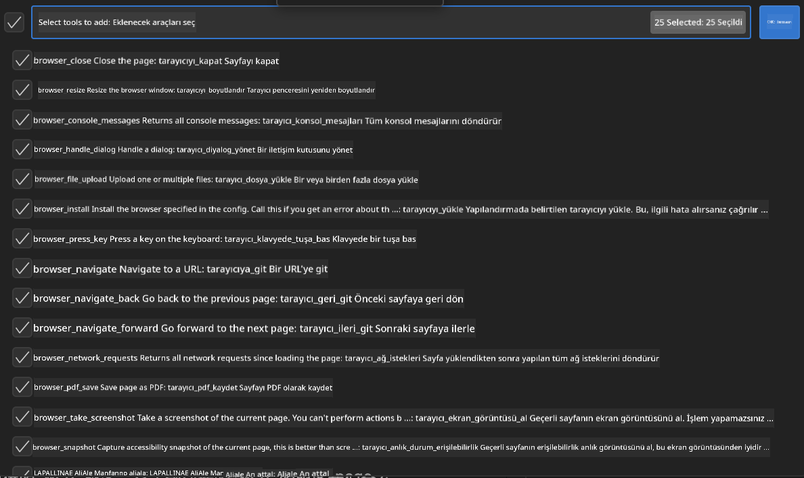

**🛠️ Temel Playwright Araçları:**  
- **Gezinme**: `goto`, `goBack`, `goForward`, `reload`  
- **Etkileşim**: `click`, `fill`, `press`, `hover`, `drag`  
- **Veri Çıkarma**: `textContent`, `innerHTML`, `getAttribute`  
- **Doğrulama**: `isVisible`, `isEnabled`, `waitForSelector`  
- **Yakalama**: `screenshot`, `pdf`, `video`  
- **Ağ**: `setExtraHTTPHeaders`, `route`, `waitForResponse`  

#### Adım 7: Entegrasyonun Başarısını Doğrulayın  
**✅ Başarı Göstergeleri:**  
- Tüm araçlar Agent Builder arayüzünde görünür  
- Entegrasyon panelinde hata mesajı yok  
- Playwright sunucu durumu “Connected” olarak gösterilir  

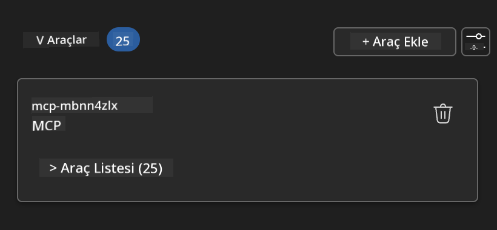

**🔧 Yaygın Sorun Giderme:**  
- **Bağlantı Başarısız**: İnternet bağlantınızı ve güvenlik duvarı ayarlarını kontrol edin  
- **Araç Eksikliği**: Kurulum sırasında tüm yeteneklerin seçildiğinden emin olun  
- **İzin Hataları**: VS Code’un gerekli sistem izinlerine sahip olduğunu doğrulayın  

### 🎯 Aşama 4: Gelişmiş Prompt Mühendisliği

#### Adım 8: Akıllı Sistem Promtları Tasarlayın  
Playwright’in tüm yeteneklerini kullanacak karmaşık promptlar oluşturun:  

```markdown
# Web Automation Expert System Prompt

## Core Identity
You are an advanced web automation specialist with deep expertise in browser automation, web scraping, and user experience analysis. You have access to Playwright tools for comprehensive browser control.

## Capabilities & Approach
### Navigation Strategy
- Always start with screenshots to understand page layout
- Use semantic selectors (text content, labels) when possible
- Implement wait strategies for dynamic content
- Handle single-page applications (SPAs) effectively

### Error Handling
- Retry failed operations with exponential backoff
- Provide clear error descriptions and solutions
- Suggest alternative approaches when primary methods fail
- Always capture diagnostic screenshots on errors

### Data Extraction
- Extract structured data in JSON format when possible
- Provide confidence scores for extracted information
- Validate data completeness and accuracy
- Handle pagination and infinite scroll scenarios

### Reporting
- Include step-by-step execution logs
- Provide before/after screenshots for verification
- Suggest optimizations and alternative approaches
- Document any limitations or edge cases encountered

## Ethical Guidelines
- Respect robots.txt and rate limiting
- Avoid overloading target servers
- Only extract publicly available information
- Follow website terms of service
```

#### Adım 9: Dinamik Kullanıcı Promptları Oluşturun  
Çeşitli yetenekleri gösteren promptlar tasarlayın:  

**🌐 Web Analizi Örneği:**  
```markdown
Navigate to github.com/kinfey and provide a comprehensive analysis including:
1. Repository structure and organization
2. Recent activity and contribution patterns  
3. Documentation quality assessment
4. Technology stack identification
5. Community engagement metrics
6. Notable projects and their purposes

Include screenshots at key steps and provide actionable insights.
```

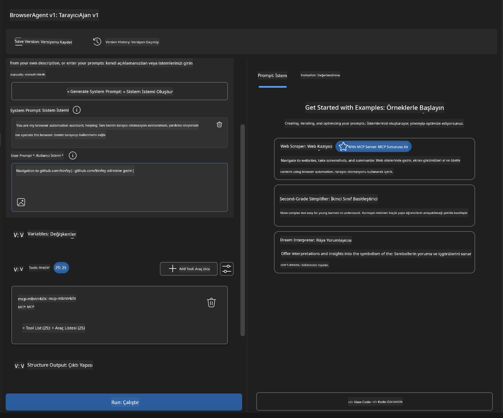

### 🚀 Aşama 5: Çalıştırma ve Test

#### Adım 10: İlk Otomasyonunuzu Çalıştırın  
1. Otomasyon dizisini başlatmak için **"Run"** butonuna tıklayın  
2. Gerçek zamanlı yürütmeyi izleyin:  
   - Chrome tarayıcı otomatik açılır  
   - Ajan hedef web sitesine gider  
   - Her önemli adımda ekran görüntüleri alınır  
   - Analiz sonuçları gerçek zamanlı akar  

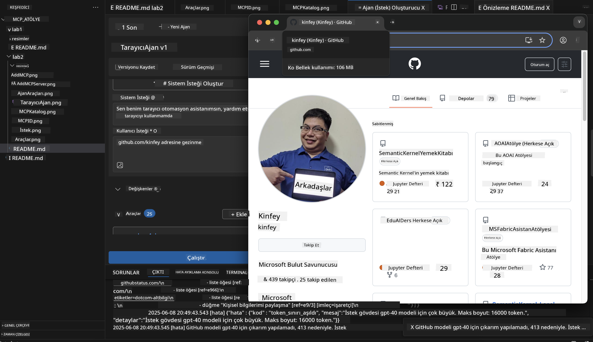

#### Adım 11: Sonuçları ve İçgörüleri Analiz Edin  
Agent Builder arayüzünde kapsamlı analizleri inceleyin:  

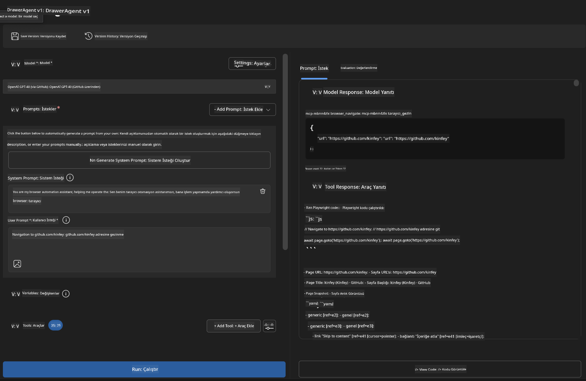

### 🌟 Aşama 6: Gelişmiş Özellikler ve Dağıtım

#### Adım 12: Dışa Aktarma ve Üretim Dağıtımı  
Agent Builder, çeşitli dağıtım seçeneklerini destekler:  

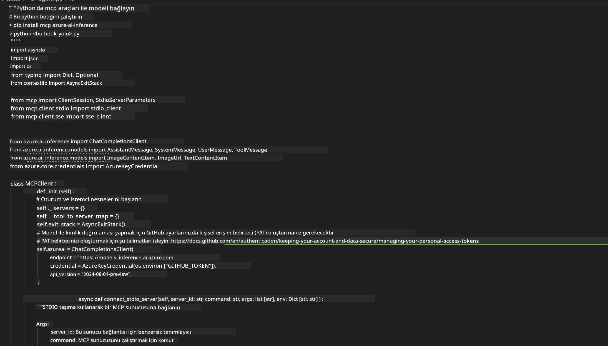

## 🎓 Modül 2 Özeti ve Sonraki Adımlar

### 🏆 Başarı Kazanıldı: MCP Entegrasyon Ustası

**✅ Kazanılan Beceriler:**  
- [ ] MCP mimarisi ve faydalarını anlama  
- [ ] Microsoft’un MCP sunucu ekosisteminde gezinme  
- [ ] Playwright MCP’yi AI Toolkit ile entegre etme  
- [ ] Gelişmiş tarayıcı otomasyon ajanları oluşturma  
- [ ] Web otomasyonu için ileri düzey prompt mühendisliği  

### 📚 Ek Kaynaklar

- **🔗 MCP Spesifikasyonu**: [Resmi Protokol Dokümantasyonu](https://modelcontextprotocol.io/)  
- **🛠️ Playwright API**: [Tam Metot Referansı](https://playwright.dev/docs/api/class-playwright)  
- **🏢 Microsoft MCP Sunucuları**: [Kurumsal Entegrasyon Rehberi](https://github.com/microsoft/mcp-servers)  
- **🌍 Topluluk Örnekleri**: [MCP Sunucu Galerisi](https://github.com/modelcontextprotocol/servers)  

**🎉 Tebrikler!** MCP entegrasyonunu başarıyla öğrendiniz ve artık dış araç yeteneklerine sahip üretim hazır AI ajanları oluşturabilirsiniz!

### 🔜 Sonraki Modüle Geçin

MCP becerilerinizi bir üst seviyeye taşımaya hazır mısınız? **[Modül 3: AI Toolkit ile Gelişmiş MCP Geliştirme](../lab3/README.md)** bölümüne geçerek:  
- Kendi özel MCP sunucularınızı oluşturmayı  
- En yeni MCP Python SDK’sını yapılandırıp kullanmayı  
- MCP Inspector ile hata ayıklamayı  
- Gelişmiş MCP sunucu geliştirme iş akışlarını ustalıkla yönetmeyi öğreneceksiniz
- Baştan sona bir Weather MCP Sunucusu oluşturun

**Feragatname**:  
Bu belge, AI çeviri servisi [Co-op Translator](https://github.com/Azure/co-op-translator) kullanılarak çevrilmiştir. Doğruluk için çaba göstersek de, otomatik çevirilerin hatalar veya yanlışlıklar içerebileceğini lütfen unutmayınız. Orijinal belge, kendi dilinde yetkili kaynak olarak kabul edilmelidir. Kritik bilgiler için profesyonel insan çevirisi önerilir. Bu çevirinin kullanımı sonucu oluşabilecek yanlış anlamalar veya yorum hatalarından sorumlu değiliz.