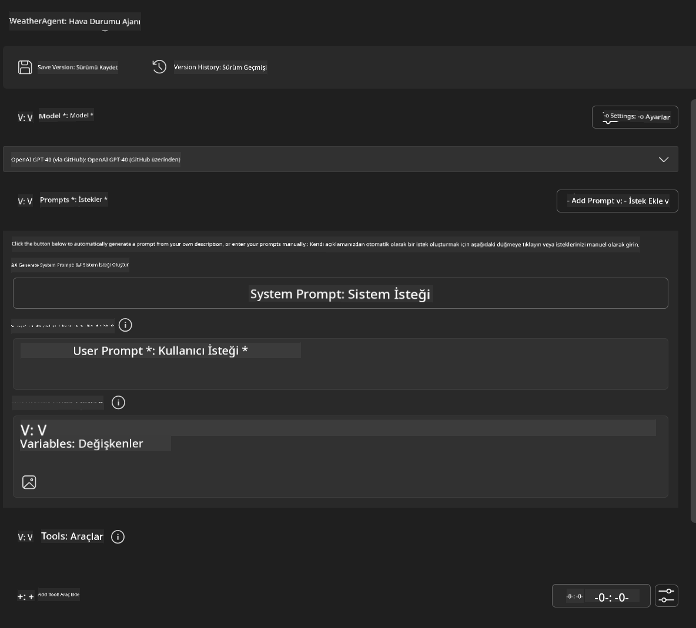
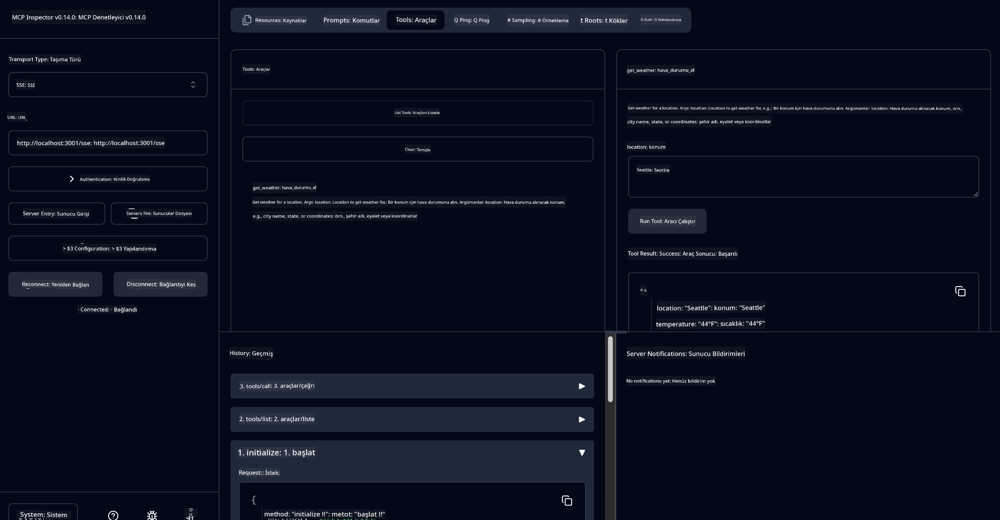

<!--
CO_OP_TRANSLATOR_METADATA:
{
  "original_hash": "dd8da3f75addcef453fe11f02a270217",
  "translation_date": "2025-06-10T06:11:00+00:00",
  "source_file": "10-StreamliningAIWorkflowsBuildingAnMCPServerWithAIToolkit/lab3/README.md",
  "language_code": "tr"
}
-->
# 🔧 Modül 3: AI Toolkit ile İleri Seviye MCP Geliştirme


## 🎯 Öğrenme Hedefleri

Bu laboratuvarın sonunda şunları yapabileceksiniz:

- ✅ AI Toolkit kullanarak özel MCP sunucuları oluşturmak
- ✅ En son MCP Python SDK (v1.9.3) yapılandırması ve kullanımı
- ✅ MCP Inspector’u kurup hata ayıklamada kullanmak
- ✅ Hem Agent Builder hem de Inspector ortamlarında MCP sunucularını hata ayıklamak
- ✅ İleri seviye MCP sunucu geliştirme iş akışlarını anlamak

## 📋 Ön Koşullar

- Lab 2 (MCP Temelleri) tamamlanmış olmalı
- AI Toolkit uzantısı yüklü VS Code
- Python 3.10+ ortamı
- Inspector kurulumu için Node.js ve npm

## 🏗️ Neler İnşa Edeceksiniz

Bu laboratuvarda, aşağıdakileri gösteren bir **Weather MCP Server** oluşturacaksınız:
- Özel MCP sunucu uygulaması
- AI Toolkit Agent Builder ile entegrasyon
- Profesyonel hata ayıklama iş akışları
- Modern MCP SDK kullanım kalıpları

---

## 🔧 Temel Bileşenler Genel Bakış

### 🐍 MCP Python SDK  
Model Context Protocol Python SDK, özel MCP sunucuları oluşturmak için temel sağlar. Gelişmiş hata ayıklama özelliklerine sahip 1.9.3 sürümünü kullanacaksınız.

### 🔍 MCP Inspector  
Güçlü bir hata ayıklama aracı olup şunları sunar:  
- Gerçek zamanlı sunucu izleme  
- Araç yürütme görselleştirmesi  
- Ağ istek/yanıt incelemesi  
- Etkileşimli test ortamı  

---

## 📖 Adım Adım Uygulama

### Adım 1: Agent Builder’da WeatherAgent Oluşturma

1. VS Code’da AI Toolkit uzantısı ile **Agent Builder’ı başlatın**  
2. Aşağıdaki konfigürasyonla **yeni bir agent oluşturun:**  
   - Agent Adı: `WeatherAgent`



### Adım 2: MCP Sunucu Projesini Başlatma

1. Agent Builder’da **Tools → Add Tool** menüsüne gidin  
2. Mevcut seçeneklerden **"MCP Server"** seçin  
3. **"Create A new MCP Server"** seçeneğini işaretleyin  
4. `python-weather` şablonunu seçin  
5. Sunucunuza isim verin: `weather_mcp`


### Adım 3: Projeyi Açıp İnceleyin

1. Oluşturulan projeyi VS Code’da açın  
2. Proje yapısını gözden geçirin:  
   ```
   weather_mcp/
   ├── src/
   │   ├── __init__.py
   │   └── server.py
   ├── inspector/
   │   ├── package.json
   │   └── package-lock.json
   ├── .vscode/
   │   ├── launch.json
   │   └── tasks.json
   ├── pyproject.toml
   └── README.md
   ```

### Adım 4: MCP SDK’yı En Son Sürüme Güncelleyin

> **🔍 Neden Güncelleme?** Daha gelişmiş özellikler ve daha iyi hata ayıklama için en son MCP SDK (v1.9.3) ve Inspector servisini (0.14.0) kullanmak istiyoruz.

#### 4a. Python Bağımlılıklarını Güncelleme

**`pyproject.toml`:** update [./code/weather_mcp/pyproject.toml](../../../../10-StreamliningAIWorkflowsBuildingAnMCPServerWithAIToolkit/lab3/code/weather_mcp/pyproject.toml)


#### 4b. Update Inspector Configuration

**Edit `inspector/package.json`:** update [./code/weather_mcp/inspector/package.json](../../../../10-StreamliningAIWorkflowsBuildingAnMCPServerWithAIToolkit/lab3/code/weather_mcp/inspector/package.json)

#### 4c. Update Inspector Dependencies

**Edit `inspector/package-lock.json`:** update [./code/weather_mcp/inspector/package-lock.json](../../../../10-StreamliningAIWorkflowsBuildingAnMCPServerWithAIToolkit/lab3/code/weather_mcp/inspector/package-lock.json)

> **📝 Note:** This file contains extensive dependency definitions. Below is the essential structure - the full content ensures proper dependency resolution.


> **⚡ Full Package Lock:** The complete package-lock.json contains ~3000 lines of dependency definitions. The above shows the key structure - use the provided file for complete dependency resolution.

### Step 5: Configure VS Code Debugging

*Note: Please copy the file in the specified path to replace the corresponding local file*

#### 5a. Update Launch Configuration

**Edit `.vscode/launch.json` dosyalarını düzenleyin:**

```json
{
  "version": "0.2.0",
  "configurations": [
    {
      "name": "Attach to Local MCP",
      "type": "debugpy",
      "request": "attach",
      "connect": {
        "host": "localhost",
        "port": 5678
      },
      "presentation": {
        "hidden": true
      },
      "internalConsoleOptions": "neverOpen",
      "postDebugTask": "Terminate All Tasks"
    },
    {
      "name": "Launch Inspector (Edge)",
      "type": "msedge",
      "request": "launch",
      "url": "http://localhost:6274?timeout=60000&serverUrl=http://localhost:3001/sse#tools",
      "cascadeTerminateToConfigurations": [
        "Attach to Local MCP"
      ],
      "presentation": {
        "hidden": true
      },
      "internalConsoleOptions": "neverOpen"
    },
    {
      "name": "Launch Inspector (Chrome)",
      "type": "chrome",
      "request": "launch",
      "url": "http://localhost:6274?timeout=60000&serverUrl=http://localhost:3001/sse#tools",
      "cascadeTerminateToConfigurations": [
        "Attach to Local MCP"
      ],
      "presentation": {
        "hidden": true
      },
      "internalConsoleOptions": "neverOpen"
    }
  ],
  "compounds": [
    {
      "name": "Debug in Agent Builder",
      "configurations": [
        "Attach to Local MCP"
      ],
      "preLaunchTask": "Open Agent Builder",
    },
    {
      "name": "Debug in Inspector (Edge)",
      "configurations": [
        "Launch Inspector (Edge)",
        "Attach to Local MCP"
      ],
      "preLaunchTask": "Start MCP Inspector",
      "stopAll": true
    },
    {
      "name": "Debug in Inspector (Chrome)",
      "configurations": [
        "Launch Inspector (Chrome)",
        "Attach to Local MCP"
      ],
      "preLaunchTask": "Start MCP Inspector",
      "stopAll": true
    }
  ]
}
```

**`.vscode/tasks.json` dosyasını düzenleyin:**

```
{
  "version": "2.0.0",
  "tasks": [
    {
      "label": "Start MCP Server",
      "type": "shell",
      "command": "python -m debugpy --listen 127.0.0.1:5678 src/__init__.py sse",
      "isBackground": true,
      "options": {
        "cwd": "${workspaceFolder}",
        "env": {
          "PORT": "3001"
        }
      },
      "problemMatcher": {
        "pattern": [
          {
            "regexp": "^.*$",
            "file": 0,
            "location": 1,
            "message": 2
          }
        ],
        "background": {
          "activeOnStart": true,
          "beginsPattern": ".*",
          "endsPattern": "Application startup complete|running"
        }
      }
    },
    {
      "label": "Start MCP Inspector",
      "type": "shell",
      "command": "npm run dev:inspector",
      "isBackground": true,
      "options": {
        "cwd": "${workspaceFolder}/inspector",
        "env": {
          "CLIENT_PORT": "6274",
          "SERVER_PORT": "6277",
        }
      },
      "problemMatcher": {
        "pattern": [
          {
            "regexp": "^.*$",
            "file": 0,
            "location": 1,
            "message": 2
          }
        ],
        "background": {
          "activeOnStart": true,
          "beginsPattern": "Starting MCP inspector",
          "endsPattern": "Proxy server listening on port"
        }
      },
      "dependsOn": [
        "Start MCP Server"
      ]
    },
    {
      "label": "Open Agent Builder",
      "type": "shell",
      "command": "echo ${input:openAgentBuilder}",
      "presentation": {
        "reveal": "never"
      },
      "dependsOn": [
        "Start MCP Server"
      ],
    },
    {
      "label": "Terminate All Tasks",
      "command": "echo ${input:terminate}",
      "type": "shell",
      "problemMatcher": []
    }
  ],
  "inputs": [
    {
      "id": "openAgentBuilder",
      "type": "command",
      "command": "ai-mlstudio.agentBuilder",
      "args": {
        "initialMCPs": [ "local-server-weather_mcp" ],
        "triggeredFrom": "vsc-tasks"
      }
    },
    {
      "id": "terminate",
      "type": "command",
      "command": "workbench.action.tasks.terminate",
      "args": "terminateAll"
    }
  ]
}
```

---

## 🚀 MCP Sunucunuzu Çalıştırma ve Test Etme

### Adım 6: Bağımlılıkları Yükleyin

Yapılandırma değişikliklerinden sonra aşağıdaki komutları çalıştırın:

**Python bağımlılıklarını yükleyin:**  
```bash
uv sync
```

**Inspector bağımlılıklarını yükleyin:**  
```bash
cd inspector
npm install
```

### Adım 7: Agent Builder ile Hata Ayıklama

1. **F5 tuşuna basın** veya **"Debug in Agent Builder"** yapılandırmasını kullanın  
2. Hata ayıklama panelinden birleşik konfigürasyonu seçin  
3. Sunucunun başlamasını ve Agent Builder’ın açılmasını bekleyin  
4. Hava durumu MCP sunucunuzu doğal dil sorgularıyla test edin

Aşağıdaki gibi bir girdi kullanabilirsiniz

SYSTEM_PROMPT

```
You are my weather assistant
```

USER_PROMPT

```
How's the weather like in Seattle
```


### Adım 8: MCP Inspector ile Hata Ayıklama

1. **"Debug in Inspector"** yapılandırmasını kullanın (Edge veya Chrome)  
2. `http://localhost:6274` adresinde Inspector arayüzünü açın  
3. Etkileşimli test ortamını keşfedin:  
   - Mevcut araçları görüntüleyin  
   - Araç yürütmesini test edin  
   - Ağ isteklerini izleyin  
   - Sunucu yanıtlarını hata ayıklayın  



---

## 🎯 Temel Öğrenme Sonuçları

Bu laboratuvarı tamamlayarak:

- [x] AI Toolkit şablonlarını kullanarak **özel bir MCP sunucu oluşturdunuz**  
- [x] Daha gelişmiş işlevsellik için **en son MCP SDK (v1.9.3) sürümüne yükselttiniz**  
- [x] Hem Agent Builder hem de Inspector için **profesyonel hata ayıklama iş akışları yapılandırdınız**  
- [x] Etkileşimli sunucu testi için **MCP Inspector’u kurdunuz**  
- [x] MCP geliştirme için **VS Code hata ayıklama ayarlarını ustaca kullandınız**

## 🔧 Keşfedilen İleri Seviye Özellikler

| Özellik                   | Açıklama                      | Kullanım Durumu              |
|---------------------------|-------------------------------|-----------------------------|
| **MCP Python SDK v1.9.3** | En son protokol uygulaması    | Modern sunucu geliştirme    |
| **MCP Inspector 0.14.0**  | Etkileşimli hata ayıklama aracı | Gerçek zamanlı sunucu testi |
| **VS Code Debugging**     | Entegre geliştirme ortamı     | Profesyonel hata ayıklama iş akışı |
| **Agent Builder Entegrasyonu** | Doğrudan AI Toolkit bağlantısı | Uçtan uca agent testi       |

## 📚 Ek Kaynaklar

- [MCP Python SDK Dokümantasyonu](https://modelcontextprotocol.io/docs/sdk/python)  
- [AI Toolkit Uzantı Rehberi](https://code.visualstudio.com/docs/ai/ai-toolkit)  
- [VS Code Hata Ayıklama Dokümantasyonu](https://code.visualstudio.com/docs/editor/debugging)  
- [Model Context Protocol Spesifikasyonu](https://modelcontextprotocol.io/docs/concepts/architecture)

---

**🎉 Tebrikler!** Lab 3’ü başarıyla tamamladınız ve artık profesyonel geliştirme iş akışlarıyla özel MCP sunucuları oluşturabilir, hata ayıklayabilir ve dağıtabilirsiniz.

### 🔜 Sonraki Modüle Geçin

MCP becerilerinizi gerçek dünya geliştirme iş akışlarında uygulamaya hazır mısınız? **[Modül 4: Pratik MCP Geliştirme - Özel GitHub Klon Sunucusu](../lab4/README.md)** bölümüne geçerek:  
- GitHub depo işlemlerini otomatikleştiren üretim hazır bir MCP sunucusu oluşturacaksınız  
- MCP üzerinden GitHub depo klonlama işlevselliği uygulayacaksınız  
- Özel MCP sunucularını VS Code ve GitHub Copilot Agent Modu ile entegre edeceksiniz  
- Üretim ortamlarında özel MCP sunucularını test edip dağıtacaksınız  
- Geliştiriciler için pratik iş akışı otomasyonlarını öğreneceksiniz

**Feragatname**:  
Bu belge, AI çeviri hizmeti [Co-op Translator](https://github.com/Azure/co-op-translator) kullanılarak çevrilmiştir. Doğruluk için çaba göstersek de, otomatik çevirilerin hatalar veya yanlışlıklar içerebileceğini lütfen unutmayın. Orijinal belge, kendi dilinde yetkili kaynak olarak kabul edilmelidir. Kritik bilgiler için profesyonel insan çevirisi önerilir. Bu çevirinin kullanımı sonucu oluşabilecek yanlış anlamalar veya yanlış yorumlamalardan sorumlu değiliz.