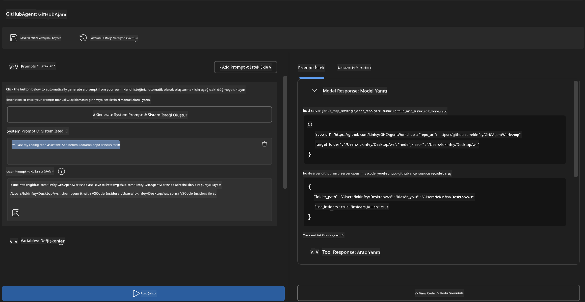
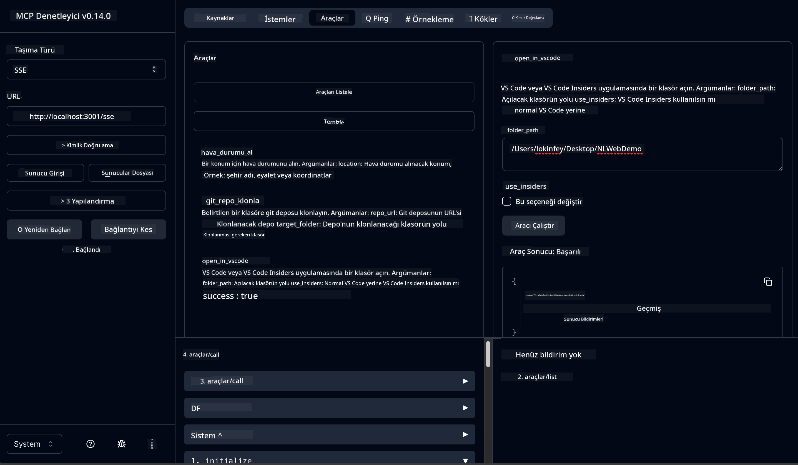

<!--
CO_OP_TRANSLATOR_METADATA:
{
  "original_hash": "f83bc722dc758efffd68667d6a1db470",
  "translation_date": "2025-06-10T06:49:31+00:00",
  "source_file": "10-StreamliningAIWorkflowsBuildingAnMCPServerWithAIToolkit/lab4/README.md",
  "language_code": "tr"
}
-->
# 🐙 Modül 4: Pratik MCP Geliştirme - Özel GitHub Klon Sunucusu


> **⚡ Hızlı Başlangıç:** Sadece 30 dakikada GitHub depo klonlama ve VS Code entegrasyonunu otomatikleştiren, üretime hazır bir MCP sunucusu oluşturun!

## 🎯 Öğrenme Hedefleri

Bu laboratuvarın sonunda şunları yapabileceksiniz:

- ✅ Gerçek dünya geliştirme iş akışları için özel bir MCP sunucusu oluşturmak
- ✅ MCP aracılığıyla GitHub depo klonlama işlevselliğini uygulamak
- ✅ Özel MCP sunucularını VS Code ve Agent Builder ile entegre etmek
- ✅ GitHub Copilot Agent Modunu özel MCP araçlarıyla kullanmak
- ✅ Özel MCP sunucularını test etmek ve üretim ortamlarında dağıtmak

## 📋 Ön Koşullar

- Laboratuvar 1-3’ün tamamlanması (MCP temelleri ve ileri geliştirme)
- GitHub Copilot aboneliği ([ücretsiz kayıt mevcut](https://github.com/github-copilot/signup))
- AI Toolkit ve GitHub Copilot uzantılarına sahip VS Code
- Kurulu ve yapılandırılmış Git CLI

## 🏗️ Proje Genel Bakışı

### **Gerçek Dünya Geliştirme Zorluğu**  
Geliştiriciler olarak sık sık GitHub’dan depoları klonlayıp VS Code veya VS Code Insiders’da açıyoruz. Bu manuel süreç şunları içerir:  
1. Terminal/komut istemcisini açmak  
2. İstenen dizine gitmek  
3. `git clone` komutunu çalıştırmak  
4. Klonlanan dizinde VS Code’u açmak  

**Bizim MCP çözümümüz bunu tek, akıllı bir komutla hallediyor!**

### **Ne İnşa Edeceksiniz**  
Bir **GitHub Klon MCP Sunucusu** (`git_mcp_server`) oluşturacaksınız; özellikleri:

| Özellik | Açıklama | Faydası |
|---------|----------|---------|
| 🔄 **Akıllı Depo Klonlama** | GitHub depolarını doğrulama ile klonlama | Otomatik hata kontrolü |
| 📁 **Akıllı Dizin Yönetimi** | Dizinleri güvenli kontrol ve oluşturma | Üzerine yazmayı önler |
| 🚀 **Çapraz Platform VS Code Entegrasyonu** | Projeleri VS Code/Insiders’da açma | Kesintisiz iş akışı geçişi |
| 🛡️ **Güçlü Hata Yönetimi** | Ağ, izin ve yol sorunlarını yönetme | Üretime hazır güvenilirlik |

---

## 📖 Adım Adım Uygulama

### Adım 1: Agent Builder’da GitHub Ajanı Oluşturun

1. AI Toolkit uzantısı üzerinden **Agent Builder’ı başlatın**  
2. Aşağıdaki yapılandırmayla **yeni bir ajan oluşturun:**  
   ```
   Agent Name: GitHubAgent
   ```  

3. **Özel MCP sunucusunu başlatın:**  
   - **Araçlar** → **Araç Ekle** → **MCP Sunucusu**  
   - **"Yeni Bir MCP Sunucusu Oluştur"** seçeneğini işaretleyin  
   - Maksimum esneklik için **Python şablonunu** seçin  
   - **Sunucu Adı:** `git_mcp_server`  

### Adım 2: GitHub Copilot Agent Modunu Yapılandırın

1. VS Code’da **GitHub Copilot’u açın** (Ctrl/Cmd + Shift + P → "GitHub Copilot: Open")  
2. Copilot arayüzünde **Agent Modeli seçin**  
3. Gelişmiş akıl yürütme için **Claude 3.7 modelini seçin**  
4. Araç erişimi için **MCP entegrasyonunu etkinleştirin**  

> **💡 İpucu:** Claude 3.7, geliştirme iş akışları ve hata yönetimi kalıplarını daha iyi anlar.

### Adım 3: Temel MCP Sunucu İşlevselliğini Uygulayın

**GitHub Copilot Agent Modu ile aşağıdaki ayrıntılı komutu kullanın:**  

```
Create two MCP tools with the following comprehensive requirements:

🔧 TOOL A: clone_repository
Requirements:
- Clone any GitHub repository to a specified local folder
- Return the absolute path of the successfully cloned project
- Implement comprehensive validation:
  ✓ Check if target directory already exists (return error if exists)
  ✓ Validate GitHub URL format (https://github.com/user/repo)
  ✓ Verify git command availability (prompt installation if missing)
  ✓ Handle network connectivity issues
  ✓ Provide clear error messages for all failure scenarios

🚀 TOOL B: open_in_vscode
Requirements:
- Open specified folder in VS Code or VS Code Insiders
- Cross-platform compatibility (Windows/Linux/macOS)
- Use direct application launch (not terminal commands)
- Auto-detect available VS Code installations
- Handle cases where VS Code is not installed
- Provide user-friendly error messages

Additional Requirements:
- Follow MCP 1.9.3 best practices
- Include proper type hints and documentation
- Implement logging for debugging purposes
- Add input validation for all parameters
- Include comprehensive error handling
```

### Adım 4: MCP Sunucunuzu Test Edin

#### 4a. Agent Builder’da Test

1. Agent Builder için **hata ayıklama yapılandırmasını başlatın**  
2. Ajanınızı aşağıdaki sistem komutuyla yapılandırın:  

```
SYSTEM_PROMPT:
You are my intelligent coding repository assistant. You help developers efficiently clone GitHub repositories and set up their development environment. Always provide clear feedback about operations and handle errors gracefully.
```  

3. Gerçekçi kullanıcı senaryolarıyla test edin:  

```
USER_PROMPT EXAMPLES:

Scenario : Basic Clone and Open
"Clone {Your GitHub Repo link such as https://github.com/kinfey/GHCAgentWorkshop
 } and save to {The global path you specify}, then open it with VS Code Insiders"
```  

  

**Beklenen Sonuçlar:**  
- ✅ Yol doğrulaması ile başarılı klonlama  
- ✅ Otomatik VS Code açılışı  
- ✅ Geçersiz durumlar için net hata mesajları  
- ✅ Kenar durumların düzgün yönetimi  

#### 4b. MCP Inspector’da Test  


  

---  

**🎉 Tebrikler!** Gerçek geliştirme iş akışı zorluklarını çözen, pratik ve üretime hazır bir MCP sunucusu oluşturmayı başardınız. Özel GitHub klon sunucunuz, geliştirici verimliliğini otomatikleştirme ve artırma gücünü gösteriyor.

### 🏆 Kazanımlarınız:  
- ✅ **MCP Geliştiricisi** - Özel MCP sunucusu oluşturdu  
- ✅ **İş Akışı Otomatörü** - Geliştirme süreçlerini hızlandırdı  
- ✅ **Entegrasyon Uzmanı** - Birden çok geliştirme aracını bağladı  
- ✅ **Üretime Hazır** - Dağıtıma uygun çözümler geliştirdi  

---

## 🎓 Atölye Tamamlama: Model Context Protocol Yolculuğunuz

**Sevgili Atölye Katılımcısı,**

Model Context Protocol atölyesinin dört modülünü başarıyla tamamladığınız için tebrikler! Temel AI Toolkit kavramlarından başlayıp, gerçek dünya geliştirme zorluklarını çözen üretime hazır MCP sunucuları oluşturmaya kadar uzun bir yol katettiniz.

### 🚀 Öğrenme Yolculuğunuzun Özeti:

**[Modül 1](../lab1/README.md)**: AI Toolkit temellerini, model testlerini ve ilk AI ajanınızı oluşturmayı keşfettiniz.

**[Modül 2](../lab2/README.md)**: MCP mimarisini öğrendiniz, Playwright MCP’yi entegre ettiniz ve ilk tarayıcı otomasyon ajanınızı geliştirdiniz.

**[Modül 3](../lab3/README.md)**: Weather MCP sunucusu ile özel MCP geliştirmede ilerlediniz ve hata ayıklama araçlarını ustalıkla kullandınız.

**[Modül 4](../lab4/README.md)**: Şimdi ise tüm öğrendiklerinizi pratik bir GitHub depo iş akışı otomasyon aracı oluşturmak için uyguladınız.

### 🌟 Uzmanlaştığınız Konular:

- ✅ **AI Toolkit Ekosistemi**: Modeller, ajanlar ve entegrasyon kalıpları  
- ✅ **MCP Mimarisi**: İstemci-sunucu tasarımı, taşıma protokolleri ve güvenlik  
- ✅ **Geliştirici Araçları**: Playground’dan Inspector’a ve üretime dağıtıma kadar  
- ✅ **Özel Geliştirme**: Kendi MCP sunucularınızı oluşturma, test etme ve dağıtma  
- ✅ **Pratik Uygulamalar**: AI ile gerçek dünya iş akışı zorluklarını çözme  

### 🔮 Sonraki Adımlarınız:

1. **Kendi MCP Sunucunuzu İnşa Edin:** Bu becerileri kullanarak benzersiz iş akışlarınızı otomatikleştirin  
2. **MCP Topluluğuna Katılın:** Çalışmalarınızı paylaşın ve başkalarından öğrenin  
3. **Gelişmiş Entegrasyonları Keşfedin:** MCP sunucularını kurumsal sistemlere bağlayın  
4. **Açık Kaynağa Katkıda Bulunun:** MCP araçları ve dokümantasyonunu geliştirin  

Unutmayın, bu atölye sadece bir başlangıç. Model Context Protocol ekosistemi hızla gelişiyor ve siz artık yapay zeka destekli geliştirme araçlarının ön saflarında yer almaya hazırsınız.

**Katılımınız ve öğrenmeye olan bağlılığınız için teşekkür ederiz!**

Bu atölyenin, geliştirme yolculuğunuzda AI araçlarıyla nasıl etkileşime geçeceğinize dair fikirler uyandırmasını umuyoruz.

**İyi kodlamalar!**

---

**Feragatname**:  
Bu belge, AI çeviri hizmeti [Co-op Translator](https://github.com/Azure/co-op-translator) kullanılarak çevrilmiştir. Doğruluk için çaba göstersek de, otomatik çevirilerin hatalar veya yanlışlıklar içerebileceğini lütfen unutmayınız. Orijinal belge, kendi ana dilindeki haliyle yetkili kaynak olarak kabul edilmelidir. Kritik bilgiler için profesyonel insan çevirisi önerilir. Bu çevirinin kullanımı sonucu ortaya çıkabilecek yanlış anlamalar veya yorumlamalardan sorumlu değiliz.