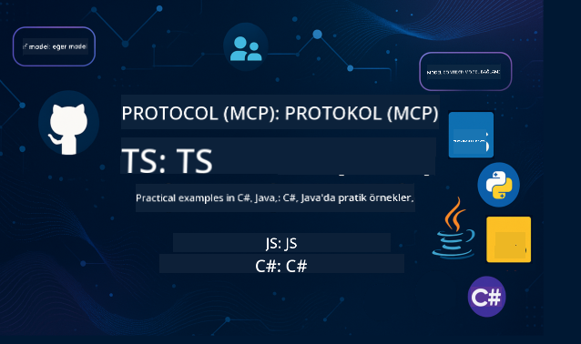

<!--
CO_OP_TRANSLATOR_METADATA:
{
  "original_hash": "db69f754d127d295e6449e29c08ed5c8",
  "translation_date": "2025-09-15T20:24:18+00:00",
  "source_file": "README.md",
  "language_code": "tr"
}
-->
 

Bu kaynakları kullanmaya başlamak için aşağıdaki adımları takip edin:
1. **Depoyu Çatallayın**:  bağlantısına tıklayın.
2. **Depoyu Klonlayın**:   `git clone https://github.com/microsoft/mcp-for-beginners.git`
3. [**Azure AI Foundry Discord'a katılın ve uzmanlarla, diğer geliştiricilerle tanışın**](https://discord.com/invite/ByRwuEEgH4)

### 🌐 Çok Dilli Destek

#### GitHub Action ile Desteklenir (Otomatik ve Her Zaman Güncel)

 [Arapça](../ar/README.md) | [Bengalce](../bn/README.md) | [Bulgarca](../bg/README.md) | [Burma (Myanmar)](../my/README.md) | [Çince (Basitleştirilmiş)](../zh/README.md) | [Çince (Geleneksel, Hong Kong)](../hk/README.md) | [Çince (Geleneksel, Macau)](../mo/README.md) | [Çince (Geleneksel, Tayvan)](../tw/README.md) | [Hırvatça](../hr/README.md) | [Çekçe](../cs/README.md) | [Danca](../da/README.md) | [Felemenkçe](../nl/README.md) | [Fince](../fi/README.md) | [Fransızca](../fr/README.md) | [Almanca](../de/README.md) | [Yunanca](../el/README.md) | [İbranice](../he/README.md) | [Hintçe](../hi/README.md) | [Macarca](../hu/README.md) | [Endonezce](../id/README.md) | [İtalyanca](../it/README.md) | [Japonca](../ja/README.md) | [Korece](../ko/README.md) | [Malayca](../ms/README.md) | [Marathi](../mr/README.md) | [Nepalce](../ne/README.md) | [Norveççe](../no/README.md) | [Farsça](../fa/README.md) | [Lehçe](../pl/README.md) | [Portekizce (Brezilya)](../br/README.md) | [Portekizce (Portekiz)](../pt/README.md) | [Pencapça (Gurmukhi)](../pa/README.md) | [Romence](../ro/README.md) | [Rusça](../ru/README.md) | [Sırpça (Kiril)](../sr/README.md) | [Slovakça](../sk/README.md) | [Slovence](../sl/README.md) | [İspanyolca](../es/README.md) | [Swahili](../sw/README.md) | [İsveççe](../sv/README.md) | [Tagalog (Filipince)](../tl/README.md) | [Tayca](../th/README.md) | [Türkçe](./README.md) | [Ukraynaca](../uk/README.md) | [Urduca](../ur/README.md) | [Vietnamca](../vi/README.md)

# 🚀 Model Context Protocol (MCP) Başlangıç Müfredatı

## **C#, Java, JavaScript, Rust, Python ve TypeScript ile Uygulamalı Kod Örnekleriyle MCP Öğrenin**

## 🧠 Model Context Protocol Müfredatına Genel Bakış

**Model Context Protocol (MCP)**, yapay zeka modelleri ile istemci uygulamaları arasındaki etkileşimleri standartlaştırmak için tasarlanmış ileri düzey bir çerçevedir. Bu açık kaynaklı müfredat, C#, Java, JavaScript, TypeScript ve Python gibi popüler programlama dillerinde pratik kod örnekleri ve gerçek dünya kullanım senaryolarıyla yapılandırılmış bir öğrenme yolu sunar.

Yapay zeka geliştiricisi, sistem mimarı veya yazılım mühendisi olmanız fark etmeksizin, bu rehber MCP'nin temel prensiplerini ve uygulama stratejilerini öğrenmek için kapsamlı bir kaynaktır.

## 🔗 Resmi MCP Kaynakları

- 📘 [MCP Belgeleri](https://modelcontextprotocol.io/) – Detaylı eğitimler ve kullanıcı kılavuzları  
- 📜 [MCP Spesifikasyonu](https://modelcontextprotocol.io/docs/) – Protokol mimarisi ve teknik referanslar  
- 📜 [Orijinal MCP Spesifikasyonu](https://spec.modelcontextprotocol.io/) – Eski teknik referanslar (ek detaylar içerebilir)  
- 🧑‍💻 [MCP GitHub Deposu](https://github.com/modelcontextprotocol) – Açık kaynaklı SDK'lar, araçlar ve kod örnekleri
- 🌐 [MCP Topluluğu](https://github.com/orgs/modelcontextprotocol/discussions) – Tartışmalara katılın ve topluluğa katkıda bulunun

## 🧭 MCP Müfredatına Genel Bakış

### 📚 Tam Müfredat Yapısı

| Modül | Konu | Açıklama | Bağlantı |
|--------|-------|-------------|------|
| **Modül 1-3: Temel Bilgiler** | | | |
| 00 | MCP'ye Giriş | Model Context Protocol'ün genel tanıtımı ve yapay zeka süreçlerindeki önemi | [Daha fazla oku](./00-Introduction/README.md) |
| 01 | Temel Kavramlar | MCP'nin temel kavramlarının detaylı incelemesi | [Daha fazla oku](./01-CoreConcepts/README.md) |
| 02 | MCP'de Güvenlik | Güvenlik tehditleri ve en iyi uygulamalar | [Daha fazla oku](./02-Security/README.md) |
| 03 | MCP ile Başlangıç | Ortam kurulumu, temel sunucular/istemciler, entegrasyon | [Daha fazla oku](./03-GettingStarted/README.md) |
| **Modül 3: İlk Sunucu ve İstemciyi Oluşturma** | | | |
| 3.1 | İlk Sunucu | İlk MCP sunucunuzu oluşturun | [Rehber](./03-GettingStarted/01-first-server/README.md) |
| 3.2 | İlk İstemci | Temel bir MCP istemcisi geliştirin | [Rehber](./03-GettingStarted/02-client/README.md) |
| 3.3 | LLM ile İstemci | Büyük dil modellerini entegre edin | [Rehber](./03-GettingStarted/03-llm-client/README.md) |
| 3.4 | VS Code Entegrasyonu | MCP sunucularını VS Code'da kullanın | [Rehber](./03-GettingStarted/04-vscode/README.md) |
| 3.5 | stdio Sunucu | stdio taşıma yöntemiyle sunucular oluşturun | [Rehber](./03-GettingStarted/05-stdio-server/README.md) |
| 3.6 | HTTP Akışı | MCP'de HTTP akışını uygulayın | [Rehber](./03-GettingStarted/06-http-streaming/README.md) |
| 3.7 | AI Toolkit | MCP ile AI Toolkit kullanımı | [Rehber](./03-GettingStarted/07-aitk/README.md) |
| 3.8 | Test | MCP sunucu uygulamanızı test edin | [Rehber](./03-GettingStarted/08-testing/README.md) |
| 3.9 | Dağıtım | MCP sunucularını üretime dağıtın | [Rehber](./03-GettingStarted/09-deployment/README.md) |
| **Modül 4-5: Pratik ve İleri Düzey** | | | |
| 04 | Pratik Uygulama | SDK'lar, hata ayıklama, test, yeniden kullanılabilir istemci şablonları | [Daha fazla oku](./04-PracticalImplementation/README.md) |
| 05 | MCP'de İleri Konular | Çok modlu yapay zeka, ölçeklendirme, kurumsal kullanım | [Daha fazla oku](./05-AdvancedTopics/README.md) |
| 5.1 | Azure Entegrasyonu | MCP'nin Azure ile entegrasyonu | [Rehber](./05-AdvancedTopics/mcp-integration/README.md) |
| 5.2 | Çok Modluluk | Birden fazla mod ile çalışma | [Rehber](./05-AdvancedTopics/mcp-multi-modality/README.md) |
| 5.3 | OAuth2 Demo | OAuth2 kimlik doğrulamasını uygulayın | [Rehber](./05-AdvancedTopics/mcp-oauth2-demo/README.md) |
| 5.4 | Kök Bağlamlar | Kök bağlamları anlayın ve uygulayın | [Rehber](./05-AdvancedTopics/mcp-root-contexts/README.md) |
| 5.5 | Yönlendirme | MCP yönlendirme stratejileri | [Rehber](./05-AdvancedTopics/mcp-routing/README.md) |
| 5.6 | Örnekleme | MCP'de örnekleme teknikleri | [Rehber](./05-AdvancedTopics/mcp-sampling/README.md) |
| 5.7 | Ölçeklendirme | MCP uygulamalarını ölçeklendirin | [Rehber](./05-AdvancedTopics/mcp-scaling/README.md) |
| 5.8 | Güvenlik | İleri düzey güvenlik hususları | [Rehber](./05-AdvancedTopics/mcp-security/README.md) |
| 5.9 | Web Arama | Web arama yeteneklerini uygulayın | [Rehber](./05-AdvancedTopics/web-search-mcp/README.md) |
| 5.10 | Gerçek Zamanlı Akış | Gerçek zamanlı akış işlevselliği oluşturun | [Rehber](./05-AdvancedTopics/mcp-realtimestreaming/README.md) |
| 5.11 | Gerçek Zamanlı Arama | Gerçek zamanlı arama uygulayın | [Rehber](./05-AdvancedTopics/mcp-realtimesearch/README.md) |
| 5.12 | Entra ID Kimlik Doğrulama | Microsoft Entra ID ile kimlik doğrulama | [Rehber](./05-AdvancedTopics/mcp-security-entra/README.md) |
| 5.13 | Foundry Entegrasyonu | Azure AI Foundry ile entegrasyon | [Rehber](./05-AdvancedTopics/mcp-foundry-agent-integration/README.md) |
| 5.14 | Bağlam Mühendisliği | Etkili bağlam mühendisliği teknikleri | [Rehber](./05-AdvancedTopics/mcp-contextengineering/README.md) |
| 5.15 | MCP Özel Taşıma | Özel Taşıma uygulamaları | [Rehber](./05-AdvancedTopics/mcp-transport/README.md) |

| **Modül 6-10: Topluluk ve En İyi Uygulamalar** | | | |
| 06 | Topluluk Katkıları | MCP ekosistemine nasıl katkıda bulunulur | [Rehber](./06-CommunityContributions/README.md) |
| 07 | Erken Benimseme Deneyimleri | Gerçek dünya uygulama hikayeleri | [Rehber](./07-LessonsFromEarlyAdoption/README.md) |
| 08 | MCP için En İyi Uygulamalar | Performans, hata toleransı, dayanıklılık | [Rehber](./08-BestPractices/README.md) |
| 09 | MCP Vaka Çalışmaları | Pratik uygulama örnekleri | [Rehber](./09-CaseStudy/README.md) |
| 10 | Uygulamalı Atölye Çalışması | AI Toolkit ile bir MCP Sunucusu oluşturma | [Laboratuvar](./10-StreamliningAIWorkflowsBuildingAnMCPServerWithAIToolkit/README.md) |

### 💻 Örnek Kod Projeleri

#### Temel MCP Hesap Makinesi Örnekleri

| Dil | Açıklama | Bağlantı |
|----------|-------------|------|
| C# | MCP Sunucu Örneği | [Kod Görüntüle](./03-GettingStarted/samples/csharp/README.md) |
| Java | MCP Hesap Makinesi | [Kod Görüntüle](./03-GettingStarted/samples/java/calculator/README.md) |
| JavaScript | MCP Demo | [Kod Görüntüle](./03-GettingStarted/samples/javascript/README.md) |
| Python | MCP Sunucu | [Kod Görüntüle](../../03-GettingStarted/samples/python/mcp_calculator_server.py) |
| TypeScript | MCP Örneği | [Kod Görüntüle](./03-GettingStarted/samples/typescript/README.md) |
| Rust | MCP Örneği | [Kod Görüntüle](./03-GettingStarted/samples/rust/README.md) |
#### Gelişmiş MCP Uygulamaları

| Dil | Açıklama | Bağlantı |
|-----|----------|----------|
| C# | Gelişmiş Örnek | [Kod Görüntüle](./04-PracticalImplementation/samples/csharp/README.md) |
| Java ve Spring | Container Uygulama Örneği | [Kod Görüntüle](./04-PracticalImplementation/samples/java/containerapp/README.md) |
| JavaScript | Gelişmiş Örnek | [Kod Görüntüle](./04-PracticalImplementation/samples/javascript/README.md) |
| Python | Karmaşık Uygulama | [Kod Görüntüle](../../04-PracticalImplementation/samples/python/READMEmd) |
| TypeScript | Container Örneği | [Kod Görüntüle](./04-PracticalImplementation/samples/typescript/README.md) |

## 🎯 MCP Öğrenimi için Ön Koşullar

Bu müfredattan en iyi şekilde faydalanmak için aşağıdaki bilgilere sahip olmalısınız:

- C#, Java, JavaScript, Python veya TypeScript dillerinden en az birinde temel programlama bilgisi
- İstemci-sunucu modeli ve API'ler hakkında bilgi
- REST ve HTTP kavramlarına aşinalık
- (Opsiyonel) AI/ML kavramları hakkında temel bilgi

- Destek için topluluk tartışmalarımıza katılmak

## 📚 Çalışma Kılavuzu ve Kaynaklar

Bu depo, etkili bir şekilde gezinmenize ve öğrenmenize yardımcı olacak çeşitli kaynaklar içerir:

### Çalışma Kılavuzu

Bu depoyu etkili bir şekilde kullanmanıza yardımcı olacak kapsamlı bir [Çalışma Kılavuzu](./study_guide.md) mevcuttur. Kılavuz şunları içerir:

- Ele alınan tüm konuları gösteren görsel bir müfredat haritası
- Her depo bölümünün ayrıntılı bir açıklaması
- Örnek projelerin nasıl kullanılacağına dair rehberlik
- Farklı beceri seviyeleri için önerilen öğrenme yolları
- Öğrenme yolculuğunuzu tamamlayacak ek kaynaklar

### Değişiklik Günlüğü

Müfredat materyallerine yapılan tüm önemli güncellemeleri izleyen ayrıntılı bir [Değişiklik Günlüğü](./changelog.md) tutuyoruz. Güncellemeler şunları içerir:

- Yeni içerik eklemeleri
- Yapısal değişiklikler
- Özellik iyileştirmeleri
- Dokümantasyon güncellemeleri

## 🛠️ Bu Müfredatı Etkili Bir Şekilde Kullanma

Bu rehberdeki her ders şunları içerir:

1. MCP kavramlarının net açıklamaları  
2. Birden fazla dilde canlı kod örnekleri  
3. Gerçek MCP uygulamaları oluşturmak için egzersizler  
4. İleri düzey öğreniciler için ek kaynaklar  

## Etkinlikler 

### [MCP Dev Days Temmuz 2025](https://developer.microsoft.com/en-us/reactor/series/S-1563/)
#### [➡️Talep Üzerine İzle - MCP Dev Days](https://developer.microsoft.com/en-us/reactor/series/S-1563/)
AI modelleri ve bunların dayandığı araçlar arasında köprü kuran yeni standart Model Context Protocol (MCP) üzerine odaklanan sanal bir etkinlik olan MCP Dev Days'de iki gün boyunca derin teknik bilgiler, topluluk bağlantıları ve uygulamalı öğrenime hazır olun. Etkinlik sayfamızdan kayıt olarak MCP Dev Days'i izleyebilirsiniz: https://aka.ms/mcpdevdays. 

#### [1. Gün: MCP Verimliliği, Geliştirici Araçları ve Topluluk:](https://developer.microsoft.com/en-us/reactor/series/S-1563/)

Geliştiricilerin MCP'yi iş akışlarında kullanmalarını güçlendirmek ve harika MCP topluluğunu kutlamak üzerine odaklanıyor. Microsoft ile iş birliği yaparak açık, genişletilebilir bir MCP ekosistemi şekillendiren Arcade, Block, Okta ve Neon gibi topluluk üyeleri ve ortaklarla bir araya geleceğiz. 
Gerçek dünya demoları: VS Code, Visual Studio, GitHub Copilot ve popüler topluluk araçları
Pratik, bağlama dayalı geliştirici iş akışları
Topluluk liderliğinde oturumlar ve içgörüler
MCP'ye yeni başlıyorsanız veya zaten MCP ile çalışıyorsanız, 1. Gün ilham ve uygulanabilir çıkarımlarla sahneyi hazırlayacak.

#### [2. Gün: MCP Sunucularını Güvenle Oluşturun](https://developer.microsoft.com/en-us/reactor/series/S-1563/)

MCP geliştiricileri için. MCP sunucuları oluşturma ve AI iş akışlarına MCP entegrasyonu için uygulama stratejileri ve en iyi uygulamalar üzerine derinlemesine bir inceleme yapacağız.

#### Konular şunları içerir:

- MCP Sunucuları oluşturma ve bunları ajan deneyimlerine entegre etme
- Prompt odaklı geliştirme
- Güvenlik en iyi uygulamaları
- Functions, ACA ve API Management gibi yapı taşlarını kullanma
- Kayıt hizalaması ve araçlar (1P + 3P)

Bir geliştirici, araç oluşturucu veya AI ürün stratejistiyseniz, bu gün ölçeklenebilir, güvenli ve geleceğe hazır MCP çözümleri oluşturmak için ihtiyaç duyduğunuz içgörülerle dolu.

### MCP Boot Camp Ağustos 2025
MCP sunucuları oluşturmayı, VS Code ile entegrasyonu ve MCP for Beginners müfredatından içeriklere dayalı olarak Azure'da profesyonel bir şekilde dağıtmayı öğrenin. Bu yoğun video oturumlarıyla teknoloji hakkında pratik beceriler edinin.

#### [➡️Talep Üzerine İzle MCP Bootcamp | İngilizce](https://developer.microsoft.com/en-us/reactor/series/s-1568/)
#### [➡️Talep Üzerine İzle MCP Bootcamp | Brezilya](https://developer.microsoft.com/en-us/reactor/series/S-1566/)
#### [➡️Talep Üzerine İzle MCP Bootcamp | İspanyolca](https://developer.microsoft.com/en-us/reactor/series/S-1567/)

### C# ile MCP Öğrenelim - Eğitim Serisi
Model Context Protocol (MCP), AI modelleri ve istemci uygulamaları arasındaki etkileşimleri standartlaştırmak için tasarlanmış ileri teknoloji bir çerçeve hakkında bilgi edinelim. Bu başlangıç dostu oturumda, MCP'yi tanıtacağız ve ilk MCP sunucunuzu oluşturmanız için size rehberlik edeceğiz.
#### C#: [https://aka.ms/letslearnmcp-csharp](https://aka.ms/letslearnmcp-csharp)
#### Java: [https://aka.ms/letslearnmcp-java](https://aka.ms/letslearnmcp-java)
#### JavaScript: [https://aka.ms/letslearnmcp-javascript](https://aka.ms/letslearnmcp-javascript)
#### Python: [https://aka.ms/letslearnmcp-python](https://aka.ms/letslearnmcp-python)

## 🌟 Topluluk Teşekkürü

Önemli kod örnekleri katkılarından dolayı Microsoft Değerli Profesyonel [Shivam Goyal](https://www.linkedin.com/in/shivam2003/) teşekkür ederiz. 

## 📜 Lisans Bilgileri

Bu içerik **MIT Lisansı** altında lisanslanmıştır. Şartlar ve koşullar için [LICENSE](../../LICENSE) dosyasına bakın.

## 🤝 Katkı Rehberi

Bu proje katkılara ve önerilere açıktır. Çoğu katkı, bir Katkı Lisans Sözleşmesi (CLA) imzalamanızı gerektirir. Bu sözleşme, katkınızı kullanma hakkını bize verdiğinizi ve gerçekten bu hakkı verdiğinizi beyan eder. Ayrıntılar için <https://cla.opensource.microsoft.com> adresini ziyaret edin.

Bir pull request gönderdiğinizde, bir CLA botu otomatik olarak bir CLA sağlayıp sağlamanız gerekip gerekmediğini belirleyecek ve PR'ı uygun şekilde süsleyecektir (örneğin, durum kontrolü, yorum). Bot tarafından sağlanan talimatları takip etmeniz yeterlidir. Bunu tüm CLA kullanan depolar için yalnızca bir kez yapmanız gerekecek.

Bu proje [Microsoft Açık Kaynak Davranış Kuralları](https://opensource.microsoft.com/codeofconduct/) benimsemiştir. Daha fazla bilgi için [Davranış Kuralları SSS](https://opensource.microsoft.com/codeofconduct/faq/) adresine bakın veya [opencode@microsoft.com](mailto:opencode@microsoft.com) adresine ek sorular veya yorumlar gönderin.

## 📂 Depo Yapısı

Depo şu şekilde organize edilmiştir:

- **Çekirdek Müfredat (00-10)**: On ardışık modülde düzenlenmiş ana içerik
- **images/**: Müfredat boyunca kullanılan diyagramlar ve görseller
- **translations/**: Otomatik çevirilerle çok dilli destek
- **translated_images/**: Diyagramların ve görsellerin yerelleştirilmiş versiyonları
- **study_guide.md**: Depoyu gezinmek için kapsamlı rehber
- **changelog.md**: Müfredat materyallerine yapılan tüm önemli değişikliklerin kaydı
- **mcp.json**: MCP spesifikasyonu için yapılandırma dosyası
- **CODE_OF_CONDUCT.md, LICENSE, SECURITY.md, SUPPORT.md**: Proje yönetim belgeleri

## 🎒 Diğer Kurslar
Ekibimiz başka kurslar da üretiyor! Şunlara göz atın:

- [AI Agents For Beginners](https://github.com/microsoft/ai-agents-for-beginners?WT.mc_id=academic-105485-koreyst)
- [Generative AI for Beginners using .NET](https://github.com/microsoft/Generative-AI-for-beginners-dotnet?WT.mc_id=academic-105485-koreyst)
- [Generative AI for Beginners using JavaScript](https://github.com/microsoft/generative-ai-with-javascript?WT.mc_id=academic-105485-koreyst)
- [Generative AI for Beginners](https://github.com/microsoft/generative-ai-for-beginners?WT.mc_id=academic-105485-koreyst)
- [Generative AI for Beginners using Java](https://github.com/microsoft/generative-ai-for-beginners-java?WT.mc_id=academic-105485-koreyst)
- [ML for Beginners](https://aka.ms/ml-beginners?WT.mc_id=academic-105485-koreyst)
- [Data Science for Beginners](https://aka.ms/datascience-beginners?WT.mc_id=academic-105485-koreyst)
- [AI for Beginners](https://aka.ms/ai-beginners?WT.mc_id=academic-105485-koreyst)
- [Cybersecurity for Beginners](https://github.com/microsoft/Security-101?WT.mc_id=academic-96948-sayoung)
- [Web Dev for Beginners](https://aka.ms/webdev-beginners?WT.mc_id=academic-105485-koreyst)
- [IoT for Beginners](https://aka.ms/iot-beginners?WT.mc_id=academic-105485-koreyst)
- [XR Development for Beginners](https://github.com/microsoft/xr-development-for-beginners?WT.mc_id=academic-105485-koreyst)
- [Mastering GitHub Copilot for AI Paired Programming](https://aka.ms/GitHubCopilotAI?WT.mc_id=academic-105485-koreyst)
- [Mastering GitHub Copilot for C#/.NET Developers](https://github.com/microsoft/mastering-github-copilot-for-dotnet-csharp-developers?WT.mc_id=academic-105485-koreyst)
- [Choose Your Own Copilot Adventure](https://github.com/microsoft/CopilotAdventures?WT.mc_id=academic-105485-koreyst)

## ™️ Ticari Marka Bildirimi

Bu proje, projeler, ürünler veya hizmetler için ticari markalar veya logolar içerebilir. Microsoft ticari markalarının veya logolarının yetkili kullanımı, [Microsoft Ticari Marka ve Marka Yönergeleri](https://www.microsoft.com/legal/intellectualproperty/trademarks/usage/general) ile uyumlu olmalıdır. Bu projenin değiştirilmiş versiyonlarında Microsoft ticari markalarının veya logolarının kullanımı, karışıklığa neden olmamalı veya Microsoft sponsorluğunu ima etmemelidir. Üçüncü taraf ticari markalarının veya logolarının kullanımı, ilgili üçüncü tarafların politikalarına tabidir.

---

**Feragatname**:  
Bu belge, AI çeviri hizmeti [Co-op Translator](https://github.com/Azure/co-op-translator) kullanılarak çevrilmiştir. Doğruluk için çaba göstersek de, otomatik çevirilerin hata veya yanlışlıklar içerebileceğini lütfen unutmayın. Belgenin orijinal dili, yetkili kaynak olarak kabul edilmelidir. Kritik bilgiler için profesyonel insan çevirisi önerilir. Bu çevirinin kullanımından kaynaklanan yanlış anlamalar veya yanlış yorumlamalar için sorumluluk kabul etmiyoruz.