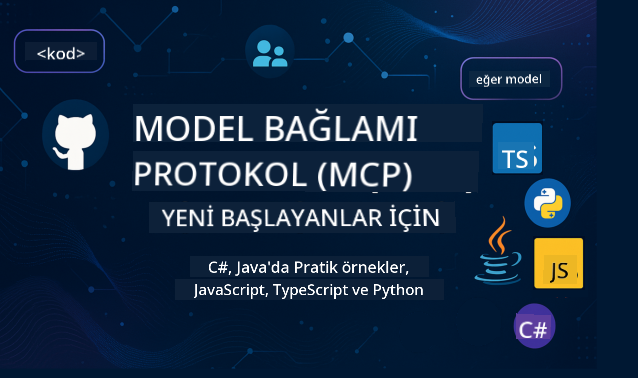

<!--
CO_OP_TRANSLATOR_METADATA:
{
  "original_hash": "2a21391378c12ecfef50f866329dfde0",
  "translation_date": "2025-05-17T05:24:55+00:00",
  "source_file": "README.md",
  "language_code": "tr"
}
-->

Bu kaynakları kullanmaya başlamak için şu adımları izleyin:
1. **Depoyu Çatallayın**: Tıklayın 
2. **Depoyu Klonlayın**: `git clone https://github.com/microsoft/mcp-for-beginners.git`
3. [**Microsoft Azure AI Foundry Discord'una Katılın ve uzmanlar ve diğer geliştiricilerle tanışın**](https://discord.com/invite/ByRwuEEgH4)

### 🌐 Çok Dilli Destek

#### GitHub Action ile Destekleniyor (Otomatik ve Her Zaman Güncel)
[Fransızca](../fr/README.md) | [İspanyolca](../es/README.md) | [Almanca](../de/README.md) | [Rusça](../ru/README.md) | [Arapça](../ar/README.md) | [Farsça](../fa/README.md) | [Urduca](../ur/README.md) | [Çince (Basitleştirilmiş)](../zh/README.md) | [Çince (Geleneksel, Makao)](../mo/README.md) | [Çince (Geleneksel, Hong Kong)](../hk/README.md) | [Çince (Geleneksel, Tayvan)](../tw/README.md) | [Japonca](../ja/README.md) | [Korece](../ko/README.md) | [Hintçe](../hi/README.md) | [Bengalce](../bn/README.md) | [Marathi](../mr/README.md) | [Nepalce](../ne/README.md) | [Pencapça (Gurmukhi)](../pa/README.md) | [Portekizce (Portekiz)](../pt/README.md) | [Portekizce (Brezilya)](../br/README.md) | [İtalyanca](../it/README.md) | [Lehçe](../pl/README.md) | [Türkçe](./README.md) | [Yunanca](../el/README.md) | [Tayca](../th/README.md) | [İsveççe](../sv/README.md) | [Danca](../da/README.md) | [Norveççe](../no/README.md) | [Fince](../fi/README.md) | [Felemenkçe](../nl/README.md) | [İbranice](../he/README.md) | [Vietnamca](../vi/README.md) | [Endonezce](../id/README.md) | [Malayca](../ms/README.md) | [Tagalog (Filipince)](../tl/README.md) | [Swahili](../sw/README.md) | [Macarca](../hu/README.md) | [Çekçe](../cs/README.md) | [Slovakça](../sk/README.md) | [Romence](../ro/README.md) | [Bulgarca](../bg/README.md) | [Sırpça (Kiril)](../sr/README.md) | [Hırvatça](../hr/README.md) | [Slovence](../sl/README.md) Lütfen çıktıyı soldan sağa doğru yazın.
# 🚀 Yeni Başlayanlar için Model Bağlam Protokolü (MCP) Müfredatına Kapsamlı Rehber

## **C#, Java, JavaScript, Python ve TypeScript ile Uygulamalı Kod Örnekleriyle MCP Öğrenin**

## 🧠 Model Bağlam Protokolü Müfredatına Genel Bakış

**Model Bağlam Protokolü (MCP)**, AI modelleri ve istemci uygulamaları arasındaki etkileşimleri standartlaştırmak için tasarlanmış son teknoloji bir çerçevedir. Bu açık kaynaklı müfredat, C#, Java, JavaScript, TypeScript ve Python gibi popüler programlama dilleri üzerinde pratik kod örnekleri ve gerçek dünya kullanım senaryoları ile yapılandırılmış bir öğrenme yolu sunar.

Bir AI geliştiricisi, sistem mimarı veya yazılım mühendisi olun, bu rehber MCP temellerini ve uygulama stratejilerini öğrenmek için kapsamlı bir kaynağınızdır.

## 🔗 Resmi MCP Kaynakları

- 📘 [MCP Belgeleri](https://modelcontextprotocol.io/) – Detaylı eğitimler ve kullanıcı kılavuzları  
- 📜 [MCP Spesifikasyonu](https://spec.modelcontextprotocol.io/) – Protokol mimarisi ve teknik referanslar  
- 🧑‍💻 [MCP GitHub Deposu](https://github.com/modelcontextprotocol) – Açık kaynaklı SDK'lar, araçlar ve kod örnekleri  

## 🧭 Tam MCP Müfredat Yapısı

### 📌 [MCP'ye Giriş](./00-Introduction/README.md)

- Model Bağlam Protokolü nedir?
- AI boru hatlarında standartlaşmanın önemi
- MCP'nin pratik kullanım senaryoları ve faydaları

### 🧩 [Temel Kavramlar Açıklanıyor](./01-CoreConcepts/README.md)

- MCP'de istemci-sunucu mimarisini anlama
- Ana protokol bileşenleri: istekler, yanıtlar ve şemalar
- MCP mesajlaşma ve veri değişim desenleri

### 🔐 [MCP'de Güvenlik](./02-Security/readme.md)

- MCP tabanlı sistemlerde güvenlik tehditlerini belirleme
- Uygulamaları güvenli hale getirme teknikleri ve en iyi uygulamalar

### 🚀 [MCP ile Başlarken](./03-GettingStarted/README.md)

- Ortam kurulum ve yapılandırması
- Temel MCP sunucuları ve istemcileri oluşturma
- MCP'yi mevcut uygulamalarla entegre etme

#### 🧮 MCP Hesap Makinesi Örnek Projeleri:

  
<strong>Dile Göre Kod Uygulamalarını Keşfedin</strong>

  - [C# MCP Sunucu Örneği](./03-GettingStarted/samples/csharp/README.md)
  - [Java MCP Hesap Makinesi](./03-GettingStarted/samples/java/calculator/README.md)
  - [JavaScript MCP Demo](./03-GettingStarted/samples/javascript/README.md)
  - [Python MCP Sunucu](../../03-GettingStarted/samples/python/mcp_calculator_server.py)
  - [TypeScript MCP Örneği](./03-GettingStarted/samples/typescript/README.md)

### 🛠️ [Pratik Uygulama](./04-PracticalImplementation/README.md)

- Farklı dillerde SDK kullanımı
- Hata ayıklama, test etme ve doğrulama
- Yeniden kullanılabilir istemci şablonları ve iş akışları oluşturma

#### 💡 MCP Gelişmiş Hesap Makinesi Projeleri:

  
<strong>Gelişmiş Örnekleri Keşfedin</strong>

  - [Gelişmiş C# Örneği](./04-PracticalImplementation/samples/csharp/README.md)
  - [Java Konteyner Uygulama Örneği](./04-PracticalImplementation/samples/java/containerapp/README.md)
  - [JavaScript Gelişmiş Örneği](./04-PracticalImplementation/samples/javascript/README.md)
  - [Python Karmaşık Uygulama](../../04-PracticalImplementation/samples/python/mcp_sample.py)
  - [TypeScript Konteyner Örneği](./04-PracticalImplementation/samples/typescript/README.md)

### 🎓 [MCP'de İleri Konular](./05-AdvancedTopics/README.md)

- Çok modlu AI iş akışları ve genişletilebilirlik
- Güvenli ölçekleme stratejileri
- MCP'nin kurumsal ekosistemlerdeki yeri

### 🌍 [Topluluk Katkıları](./06-CommunityContributions/README.md)

- Kod ve belgeleri nasıl katkıda bulunabilirsiniz
- GitHub üzerinden işbirliği
- Topluluk tarafından yönlendirilen iyileştirmeler ve geri bildirim

### 📈 [Erken Benimsemeden Elde Edilen İçgörüler](./07-CaseStudies/README.md)

- Gerçek dünya uygulamaları ve işe yarayanlar
- MCP tabanlı çözümler oluşturma ve dağıtma
- Eğilimler ve gelecekteki yol haritası

### 📏 [MCP için En İyi Uygulamalar](./08-BestPractices/README.md)

- Performans ayarlama ve optimizasyon
- Hata toleranslı MCP sistemleri tasarlama
- Test ve dayanıklılık stratejileri

### 📊 [MCP Vaka Çalışmaları](./09-CaseStudy/Readme.md)

- MCP çözüm mimarilerine derinlemesine bakış
- Dağıtım planları ve entegrasyon ipuçları
- Anotasyonlu diyagramlar ve proje incelemeleri

## 🎯 MCP Öğrenmek İçin Ön Koşullar

Bu müfredattan en iyi şekilde yararlanmak için:

- Temel C#, Java veya Python bilgisi
- İstemci-sunucu modeli ve API'ler hakkında anlayış
- (Opsiyonel) Makine öğrenimi kavramlarına aşinalık

## 🛠️ Bu Müfredatı Etkili Kullanma

Bu rehberdeki her ders şunları içerir:

1. MCP kavramlarının net açıklamaları  
2. Birden fazla dilde canlı kod örnekleri  
3. Gerçek MCP uygulamaları oluşturmak için egzersizler  
4. İleri düzey öğreniciler için ekstra kaynaklar  

## 📜 Lisans Bilgileri

Bu içerik **MIT Lisansı** altında lisanslanmıştır. Şartlar ve koşullar için [LİSANS](../../LICENSE) dosyasına bakın.

## 🤝 Katkı Yönergeleri

Bu proje katkıları ve önerileri memnuniyetle karşılar. Çoğu katkının, bize katkınızı kullanma haklarını verdiğinizi ve gerçekten de bu haklara sahip olduğunuzu beyan eden bir Katkı Sağlayıcı Lisans Anlaşması'nı (CLA) kabul etmenizi gerektirir. Detaylar için <https://cla.opensource.microsoft.com> adresini ziyaret edin.

Bir çekme isteği gönderdiğinizde, bir CLA botu otomatik olarak bir CLA sunup sunmanız gerektiğini belirleyecek ve PR'ı uygun şekilde süsleyecektir (örn. durum kontrolü, yorum). Bot tarafından sağlanan talimatları basitçe takip edin. Bu işlemi, CLA'mızı kullanan tüm depolar arasında yalnızca bir kez yapmanız gerekecektir.

Bu proje, [Microsoft Açık Kaynak Davranış Kuralları](https://opensource.microsoft.com/codeofconduct/) benimsemiştir. Daha fazla bilgi için [Davranış Kuralları SSS](https://opensource.microsoft.com/codeofconduct/faq/) adresine bakın veya ek sorularınız veya yorumlarınız için [opencode@microsoft.com](mailto:opencode@microsoft.com) ile iletişime geçin.

## ™️ Ticari Marka Bildirimi

Bu proje, projeler, ürünler veya hizmetler için ticari markalar veya logolar içerebilir. Microsoft ticari markalarının veya logolarının yetkili kullanımı, [Microsoft'un Ticari Marka ve Marka Yönergeleri](https://www.microsoft.com/legal/intellectualproperty/trademarks/usage/general) ile uyumlu olmalı ve bu yönergeleri takip etmelidir. Bu projenin değiştirilmiş sürümlerinde Microsoft ticari markalarının veya logolarının kullanımı karışıklığa neden olmamalı veya Microsoft sponsorluğunu ima etmemelidir. Üçüncü taraf ticari markaların veya logoların kullanımı, ilgili üçüncü tarafların politikalarına tabidir.

**Feragatname**:  
Bu belge, AI çeviri hizmeti [Co-op Translator](https://github.com/Azure/co-op-translator) kullanılarak çevrilmiştir. Doğruluğu sağlamak için çaba göstersek de, otomatik çevirilerin hata veya yanlışlıklar içerebileceğini lütfen unutmayın. Belgenin orijinal dilindeki hali yetkili kaynak olarak kabul edilmelidir. Kritik bilgiler için profesyonel insan çevirisi önerilir. Bu çevirinin kullanımından kaynaklanan yanlış anlamalar veya yanlış yorumlamalardan sorumlu değiliz.