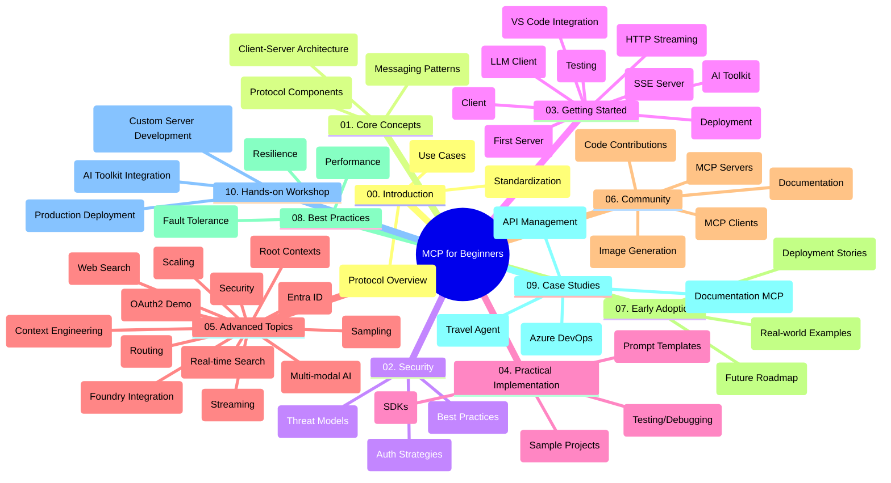

<!--
CO_OP_TRANSLATOR_METADATA:
{
  "original_hash": "5f321ea583cf087a94e47ee74c62b504",
  "translation_date": "2025-07-17T05:31:22+00:00",
  "source_file": "study_guide.md",
  "language_code": "tr"
}
-->
# Yeni Başlayanlar için Model Context Protocol (MCP) - Çalışma Rehberi

Bu çalışma rehberi, "Yeni Başlayanlar için Model Context Protocol (MCP)" müfredatının depo yapısı ve içeriği hakkında genel bir bakış sunar. Depoyu verimli bir şekilde gezmek ve mevcut kaynaklardan en iyi şekilde yararlanmak için bu rehberi kullanın.

## Depo Genel Bakış

Model Context Protocol (MCP), yapay zeka modelleri ile istemci uygulamalar arasındaki etkileşimler için standartlaştırılmış bir çerçevedir. İlk olarak Anthropic tarafından oluşturulan MCP, artık resmi GitHub organizasyonu aracılığıyla geniş MCP topluluğu tarafından sürdürülmektedir. Bu depo, yapay zeka geliştiricileri, sistem mimarları ve yazılım mühendisleri için C#, Java, JavaScript, Python ve TypeScript dillerinde uygulamalı kod örnekleri içeren kapsamlı bir müfredat sunar.

## Görsel Müfredat Haritası

## Depo Yapısı

Depo, MCP’nin farklı yönlerine odaklanan on ana bölüme ayrılmıştır:

1. **Giriş (00-Introduction/)**
   - Model Context Protocol’e genel bakış
   - Yapay zeka süreçlerinde standartlaşmanın önemi
   - Pratik kullanım senaryoları ve faydalar

2. **Temel Kavramlar (01-CoreConcepts/)**
   - İstemci-sunucu mimarisi
   - Protokolün temel bileşenleri
   - MCP’de mesajlaşma kalıpları

3. **Güvenlik (02-Security/)**
   - MCP tabanlı sistemlerde güvenlik tehditleri
   - Güvenli uygulamalar için en iyi uygulamalar
   - Kimlik doğrulama ve yetkilendirme stratejileri

4. **Başlarken (03-GettingStarted/)**
   - Ortam kurulumu ve yapılandırma
   - Temel MCP sunucu ve istemcilerinin oluşturulması
   - Mevcut uygulamalarla entegrasyon
   - İçerdiği bölümler:
     - İlk sunucu uygulaması
     - İstemci geliştirme
     - LLM istemci entegrasyonu
     - VS Code entegrasyonu
     - Server-Sent Events (SSE) sunucusu
     - HTTP akışı
     - AI Toolkit entegrasyonu
     - Test stratejileri
     - Dağıtım rehberi

5. **Pratik Uygulama (04-PracticalImplementation/)**
   - Farklı programlama dillerinde SDK kullanımı
   - Hata ayıklama, test ve doğrulama teknikleri
   - Yeniden kullanılabilir prompt şablonları ve iş akışları oluşturma
   - Uygulama örnekleri içeren örnek projeler

6. **İleri Konular (05-AdvancedTopics/)**
   - Bağlam mühendisliği teknikleri
   - Foundry ajan entegrasyonu
   - Çok modlu yapay zeka iş akışları
   - OAuth2 kimlik doğrulama demoları
   - Gerçek zamanlı arama özellikleri
   - Gerçek zamanlı akış
   - Root context uygulamaları
   - Yönlendirme stratejileri
   - Örnekleme teknikleri
   - Ölçeklendirme yaklaşımları
   - Güvenlik hususları
   - Entra ID güvenlik entegrasyonu
   - Web arama entegrasyonu

7. **Topluluk Katkıları (06-CommunityContributions/)**
   - Kod ve dokümantasyon katkısı nasıl yapılır
   - GitHub üzerinden iş birliği
   - Topluluk odaklı geliştirmeler ve geri bildirimler
   - Çeşitli MCP istemcilerinin kullanımı (Claude Desktop, Cline, VSCode)
   - Popüler MCP sunucularıyla çalışma, görüntü oluşturma dahil

8. **Erken Benimsemeden Alınan Dersler (07-LessonsfromEarlyAdoption/)**
   - Gerçek dünya uygulamaları ve başarı hikayeleri
   - MCP tabanlı çözümlerin geliştirilmesi ve dağıtımı
   - Trendler ve gelecek yol haritası

9. **En İyi Uygulamalar (08-BestPractices/)**
   - Performans ayarlama ve optimizasyon
   - Hata toleranslı MCP sistemleri tasarımı
   - Test ve dayanıklılık stratejileri

10. **Vaka Çalışmaları (09-CaseStudy/)**
    - Vaka çalışması: Azure API Management entegrasyonu
    - Vaka çalışması: Seyahat acentesi uygulaması
    - Vaka çalışması: Azure DevOps ve YouTube entegrasyonu
    - Ayrıntılı dokümantasyonlu uygulama örnekleri

11. **Uygulamalı Atölye (10-StreamliningAIWorkflowsBuildingAnMCPServerWithAIToolkit/)**
    - MCP ile AI Toolkit’i birleştiren kapsamlı uygulamalı atölye
    - Yapay zeka modellerini gerçek dünya araçlarıyla birleştiren akıllı uygulamalar geliştirme
    - Temeller, özel sunucu geliştirme ve üretim dağıtım stratejilerini kapsayan pratik modüller
    - Adım adım talimatlarla laboratuvar tabanlı öğrenme yaklaşımı

## Ek Kaynaklar

Depo, destekleyici kaynaklar içerir:

- **Images klasörü**: Müfredat boyunca kullanılan diyagramlar ve görseller
- **Çeviriler**: Dokümantasyonun otomatik çok dilli çevirileri
- **Resmi MCP Kaynakları**:
  - [MCP Documentation](https://modelcontextprotocol.io/)
  - [MCP Specification](https://spec.modelcontextprotocol.io/)
  - [MCP GitHub Repository](https://github.com/modelcontextprotocol)

## Bu Depo Nasıl Kullanılır

1. **Sıralı Öğrenme**: Yapılandırılmış bir öğrenme deneyimi için bölümleri sırayla (00’dan 10’a kadar) takip edin.
2. **Dil Odaklı İnceleme**: Belirli bir programlama diliyle ilgileniyorsanız, örnekler klasörlerinde tercih ettiğiniz dildeki uygulamalara göz atın.
3. **Pratik Uygulama**: Ortamınızı kurmak ve ilk MCP sunucu ile istemcinizi oluşturmak için "Başlarken" bölümünden başlayın.
4. **İleri Düzey Keşif**: Temelleri öğrendikten sonra bilgilerinizi genişletmek için ileri konulara dalın.
5. **Topluluk Katılımı**: MCP topluluğuna GitHub tartışmaları ve Discord kanalları aracılığıyla katılarak uzmanlar ve diğer geliştiricilerle bağlantı kurun.

## MCP İstemcileri ve Araçları

Müfredat, çeşitli MCP istemcileri ve araçlarını kapsar:

1. **Resmi İstemciler**:
   - Visual Studio Code
   - Visual Studio Code içindeki MCP
   - Claude Desktop
   - VSCode içindeki Claude
   - Claude API

2. **Topluluk İstemcileri**:
   - Cline (terminal tabanlı)
   - Cursor (kod editörü)
   - ChatMCP
   - Windsurf

3. **MCP Yönetim Araçları**:
   - MCP CLI
   - MCP Manager
   - MCP Linker
   - MCP Router

## Popüler MCP Sunucuları

Depo, çeşitli MCP sunucularını tanıtır:

1. **Resmi Referans Sunucuları**:
   - Filesystem
   - Fetch
   - Memory
   - Sequential Thinking

2. **Görüntü Oluşturma**:
   - Azure OpenAI DALL-E 3
   - Stable Diffusion WebUI
   - Replicate

3. **Geliştirme Araçları**:
   - Git MCP
   - Terminal Control
   - Code Assistant

4. **Özel Sunucular**:
   - Salesforce
   - Microsoft Teams
   - Jira & Confluence

## Katkıda Bulunma

Bu depo, topluluk katkılarına açıktır. MCP ekosistemine etkili katkı sağlamak için Topluluk Katkıları bölümüne bakabilirsiniz.

## Değişiklik Günlüğü

| Tarih | Değişiklikler |
|-------|---------------|
| 16 Temmuz 2025 | - Depo yapısı güncellenerek mevcut içerik yansıtıldı - MCP İstemcileri ve Araçları bölümü eklendi - Popüler MCP Sunucuları bölümü eklendi - Tüm güncel konuları içeren Görsel Müfredat Haritası güncellendi - İleri Konular bölümü tüm uzmanlık alanlarıyla genişletildi - Vaka Çalışmaları gerçek örneklerle güncellendi - MCP’nin Anthropic tarafından oluşturulduğu netleştirildi |
| 11 Haziran 2025 | - Çalışma rehberi ilk kez oluşturuldu - Görsel Müfredat Haritası eklendi - Depo yapısı özetlendi - Örnek projeler ve ek kaynaklar dahil edildi |

---

*Bu çalışma rehberi 16 Temmuz 2025 tarihinde güncellenmiş olup, o tarihteki depo içeriğinin genel bir özetini sunmaktadır. Depo içeriği bu tarihten sonra güncellenmiş olabilir.*

**Feragatname**:  
Bu belge, AI çeviri servisi [Co-op Translator](https://github.com/Azure/co-op-translator) kullanılarak çevrilmiştir. Doğruluk için çaba göstersek de, otomatik çevirilerin hatalar veya yanlışlıklar içerebileceğini lütfen unutmayınız. Orijinal belge, kendi dilinde yetkili kaynak olarak kabul edilmelidir. Kritik bilgiler için profesyonel insan çevirisi önerilir. Bu çevirinin kullanımı sonucu ortaya çıkabilecek yanlış anlamalar veya yorum hatalarından sorumlu değiliz.