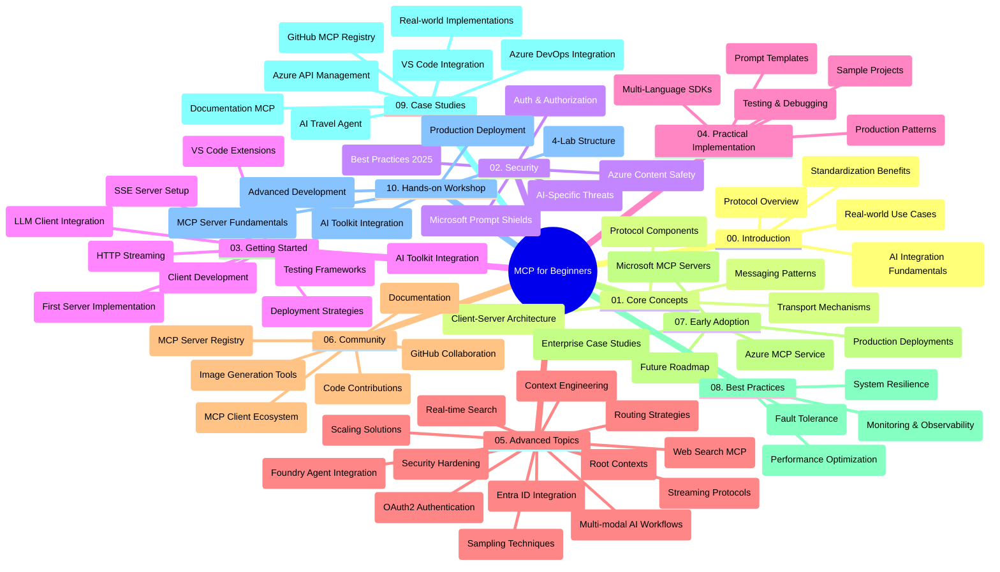

<!--
CO_OP_TRANSLATOR_METADATA:
{
  "original_hash": "719117a0a5f34ade7b5dfb61ee06fb13",
  "translation_date": "2025-09-26T18:23:33+00:00",
  "source_file": "study_guide.md",
  "language_code": "tr"
}
-->
# Model Context Protocol (MCP) için Yeni Başlayanlar - Çalışma Kılavuzu

Bu çalışma kılavuzu, "Model Context Protocol (MCP) için Yeni Başlayanlar" müfredatına ait depo yapısı ve içeriği hakkında genel bir bakış sunar. Depoyu verimli bir şekilde gezinmek ve mevcut kaynaklardan en iyi şekilde yararlanmak için bu kılavuzu kullanabilirsiniz.

## Depo Genel Bakışı

Model Context Protocol (MCP), yapay zeka modelleri ile istemci uygulamaları arasındaki etkileşimler için standartlaştırılmış bir çerçevedir. İlk olarak Anthropic tarafından oluşturulan MCP, artık resmi GitHub organizasyonu aracılığıyla daha geniş MCP topluluğu tarafından sürdürülmektedir. Bu depo, C#, Java, JavaScript, Python ve TypeScript dillerinde uygulamalı kod örnekleri içeren kapsamlı bir müfredat sunar ve yapay zeka geliştiricileri, sistem mimarları ve yazılım mühendisleri için tasarlanmıştır.

## Görsel Müfredat Haritası

## Depo Yapısı

Depo, MCP'nin farklı yönlerine odaklanan on ana bölümden oluşmaktadır:

1. **Giriş (00-Introduction/)**
   - Model Context Protocol'e genel bakış
   - Yapay zeka süreçlerinde standartlaşmanın önemi
   - Pratik kullanım senaryoları ve faydaları

2. **Temel Kavramlar (01-CoreConcepts/)**
   - İstemci-sunucu mimarisi
   - Protokolün temel bileşenleri
   - MCP'deki mesajlaşma desenleri

3. **Güvenlik (02-Security/)**
   - MCP tabanlı sistemlerde güvenlik tehditleri
   - Uygulamaları güvence altına almak için en iyi uygulamalar
   - Kimlik doğrulama ve yetkilendirme stratejileri
   - **Kapsamlı Güvenlik Belgeleri**:
     - MCP Güvenlik En İyi Uygulamaları 2025
     - Azure İçerik Güvenliği Uygulama Kılavuzu
     - MCP Güvenlik Kontrolleri ve Teknikleri
     - MCP En İyi Uygulamalar Hızlı Referans
   - **Önemli Güvenlik Konuları**:
     - Prompt enjeksiyonu ve araç zehirlenmesi saldırıları
     - Oturum ele geçirme ve karışık vekil sorunları
     - Token geçişi açıkları
     - Aşırı izinler ve erişim kontrolü
     - Yapay zeka bileşenleri için tedarik zinciri güvenliği
     - Microsoft Prompt Shields entegrasyonu

4. **Başlangıç (03-GettingStarted/)**
   - Ortam kurulum ve yapılandırma
   - Temel MCP sunucuları ve istemcileri oluşturma
   - Mevcut uygulamalarla entegrasyon
   - Şunları içeren bölümler:
     - İlk sunucu uygulaması
     - İstemci geliştirme
     - LLM istemci entegrasyonu
     - VS Code entegrasyonu
     - Server-Sent Events (SSE) sunucusu
     - HTTP akışı
     - Yapay Zeka Araç Seti entegrasyonu
     - Test stratejileri
     - Dağıtım yönergeleri

5. **Pratik Uygulama (04-PracticalImplementation/)**
   - Farklı programlama dillerinde SDK'ların kullanımı
   - Hata ayıklama, test ve doğrulama teknikleri
   - Yeniden kullanılabilir prompt şablonları ve iş akışları oluşturma
   - Uygulama örnekleri içeren örnek projeler

6. **İleri Düzey Konular (05-AdvancedTopics/)**
   - Bağlam mühendisliği teknikleri
   - Foundry ajan entegrasyonu
   - Çok modlu yapay zeka iş akışları
   - OAuth2 kimlik doğrulama demoları
   - Gerçek zamanlı arama yetenekleri
   - Gerçek zamanlı akış
   - Kök bağlamların uygulanması
   - Yönlendirme stratejileri
   - Örnekleme teknikleri
   - Ölçeklendirme yaklaşımları
   - Güvenlik hususları
   - Entra ID güvenlik entegrasyonu
   - Web arama entegrasyonu

7. **Topluluk Katkıları (06-CommunityContributions/)**
   - Kod ve belgeler nasıl katkıda bulunulur
   - GitHub üzerinden iş birliği
   - Topluluk odaklı iyileştirmeler ve geri bildirim
   - Çeşitli MCP istemcilerinin kullanımı (Claude Desktop, Cline, VSCode)
   - Görüntü oluşturma dahil popüler MCP sunucularıyla çalışma

8. **Erken Benimsemeden Alınan Dersler (07-LessonsfromEarlyAdoption/)**
   - Gerçek dünya uygulamaları ve başarı hikayeleri
   - MCP tabanlı çözümler oluşturma ve dağıtma
   - Trendler ve gelecekteki yol haritası
   - **Microsoft MCP Sunucuları Kılavuzu**: 10 üretime hazır Microsoft MCP sunucusuna yönelik kapsamlı kılavuz, şunları içerir:
     - Microsoft Learn Docs MCP Sunucusu
     - Azure MCP Sunucusu (15+ özel bağlayıcı)
     - GitHub MCP Sunucusu
     - Azure DevOps MCP Sunucusu
     - MarkItDown MCP Sunucusu
     - SQL Server MCP Sunucusu
     - Playwright MCP Sunucusu
     - Dev Box MCP Sunucusu
     - Azure AI Foundry MCP Sunucusu
     - Microsoft 365 Agents Toolkit MCP Sunucusu

9. **En İyi Uygulamalar (08-BestPractices/)**
   - Performans ayarlama ve optimizasyon
   - Hata toleranslı MCP sistemleri tasarlama
   - Test ve dayanıklılık stratejileri

10. **Vaka Çalışmaları (09-CaseStudy/)**
    - MCP'nin çeşitli senaryolardaki esnekliğini gösteren **yedi kapsamlı vaka çalışması**:
    - **Azure AI Seyahat Acenteleri**: Azure OpenAI ve AI Search ile çoklu ajan orkestrasyonu
    - **Azure DevOps Entegrasyonu**: YouTube veri güncellemeleriyle iş akışı süreçlerini otomatikleştirme
    - **Gerçek Zamanlı Belge Alma**: HTTP akışı ile Python konsol istemcisi
    - **Etkileşimli Çalışma Planı Oluşturucu**: Konuşma yapay zekası ile Chainlit web uygulaması
    - **Editör İçi Belgelendirme**: GitHub Copilot iş akışları ile VS Code entegrasyonu
    - **Azure API Yönetimi**: MCP sunucusu oluşturma ile kurumsal API entegrasyonu
    - **GitHub MCP Kaydı**: Ekosistem geliştirme ve ajan entegrasyon platformu
    - Kurumsal entegrasyon, geliştirici verimliliği ve ekosistem geliştirme alanlarında uygulama örnekleri

11. **Uygulamalı Atölye Çalışması (10-StreamliningAIWorkflowsBuildingAnMCPServerWithAIToolkit/)**
    - MCP ile AI Toolkit'i birleştiren kapsamlı uygulamalı atölye çalışması
    - Yapay zeka modellerini gerçek dünya araçlarıyla birleştiren akıllı uygulamalar oluşturma
    - Temel bilgiler, özel sunucu geliştirme ve üretim dağıtım stratejilerini kapsayan pratik modüller
    - **Laboratuvar Yapısı**:
      - Laboratuvar 1: MCP Sunucu Temelleri
      - Laboratuvar 2: İleri Düzey MCP Sunucu Geliştirme
      - Laboratuvar 3: AI Toolkit Entegrasyonu
      - Laboratuvar 4: Üretim Dağıtımı ve Ölçeklendirme
    - Adım adım talimatlarla laboratuvar tabanlı öğrenme yaklaşımı

## Ek Kaynaklar

Depo, destekleyici kaynaklar içerir:

- **Görseller klasörü**: Müfredat boyunca kullanılan diyagramlar ve illüstrasyonlar içerir
- **Çeviriler**: Belgelerin otomatik çevirileri ile çok dilli destek
- **Resmi MCP Kaynakları**:
  - [MCP Belgeleri](https://modelcontextprotocol.io/)
  - [MCP Spesifikasyonu](https://spec.modelcontextprotocol.io/)
  - [MCP GitHub Deposu](https://github.com/modelcontextprotocol)

## Bu Depo Nasıl Kullanılır

1. **Sıralı Öğrenme**: Yapılandırılmış bir öğrenme deneyimi için bölümleri sırayla takip edin (00'dan 10'a kadar).
2. **Dil Odaklı Çalışma**: Belirli bir programlama diliyle ilgileniyorsanız, tercih ettiğiniz dildeki uygulamaları görmek için örnek dizinleri keşfedin.
3. **Pratik Uygulama**: Ortamınızı kurmak ve ilk MCP sunucunuzu ve istemcinizi oluşturmak için "Başlangıç" bölümünden başlayın.
4. **İleri Düzey Keşif**: Temel bilgilere hakim olduktan sonra, ileri düzey konulara dalarak bilginizi genişletin.
5. **Topluluk Katılımı**: GitHub tartışmaları ve Discord kanalları aracılığıyla MCP topluluğuna katılarak uzmanlar ve diğer geliştiricilerle bağlantı kurun.

## MCP İstemcileri ve Araçları

Müfredat, çeşitli MCP istemcileri ve araçlarını kapsar:

1. **Resmi İstemciler**:
   - Visual Studio Code 
   - MCP Visual Studio Code'da
   - Claude Desktop
   - Claude VSCode'da 
   - Claude API

2. **Topluluk İstemcileri**:
   - Cline (terminal tabanlı)
   - Cursor (kod editörü)
   - ChatMCP
   - Windsurf

3. **MCP Yönetim Araçları**:
   - MCP CLI
   - MCP Manager
   - MCP Linker
   - MCP Router

## Popüler MCP Sunucuları

Depo, çeşitli MCP sunucularını tanıtır, bunlar arasında:

1. **Resmi Microsoft MCP Sunucuları**:
   - Microsoft Learn Docs MCP Sunucusu
   - Azure MCP Sunucusu (15+ özel bağlayıcı)
   - GitHub MCP Sunucusu
   - Azure DevOps MCP Sunucusu
   - MarkItDown MCP Sunucusu
   - SQL Server MCP Sunucusu
   - Playwright MCP Sunucusu
   - Dev Box MCP Sunucusu
   - Azure AI Foundry MCP Sunucusu
   - Microsoft 365 Agents Toolkit MCP Sunucusu

2. **Resmi Referans Sunucuları**:
   - Dosya Sistemi
   - Fetch
   - Bellek
   - Sıralı Düşünme

3. **Görüntü Oluşturma**:
   - Azure OpenAI DALL-E 3
   - Stable Diffusion WebUI
   - Replicate

4. **Geliştirme Araçları**:
   - Git MCP
   - Terminal Kontrolü
   - Kod Asistanı

5. **Özel Sunucular**:
   - Salesforce
   - Microsoft Teams
   - Jira & Confluence

## Katkıda Bulunma

Bu depo, topluluktan gelen katkılara açıktır. MCP ekosistemine etkili bir şekilde katkıda bulunma konusunda rehberlik için Topluluk Katkıları bölümüne bakın.

## Değişiklik Günlüğü

| Tarih | Değişiklikler |
|------|---------|
| 26 Eylül 2025 | - GitHub MCP Kaydı vaka çalışmasını 09-CaseStudy bölümüne ekledi - Vaka Çalışmaları bölümünü yedi kapsamlı vaka çalışmasını yansıtacak şekilde güncelledi - Vaka çalışması açıklamalarını belirli uygulama detaylarıyla geliştirdi - Görsel Müfredat Haritasını GitHub MCP Kaydını içerecek şekilde güncelledi - Çalışma kılavuzu yapısını ekosistem geliştirme odaklı olarak revize etti |
| 18 Temmuz 2025 | - Depo yapısını Microsoft MCP Sunucuları Kılavuzunu içerecek şekilde güncelledi - 10 üretime hazır Microsoft MCP sunucusunun kapsamlı listesini ekledi - Popüler MCP Sunucuları bölümünü Resmi Microsoft MCP Sunucuları ile geliştirdi - Vaka Çalışmaları bölümünü gerçek dosya örnekleriyle güncelledi - Uygulamalı Atölye Çalışması için Laboratuvar Yapısı detaylarını ekledi |
| 16 Temmuz 2025 | - Depo yapısını mevcut içeriği yansıtacak şekilde güncelledi - MCP İstemcileri ve Araçları bölümünü ekledi - Popüler MCP Sunucuları bölümünü ekledi - Görsel Müfredat Haritasını tüm mevcut konuları içerecek şekilde güncelledi - İleri Düzey Konular bölümünü tüm özel alanlarla geliştirdi - Vaka Çalışmaları bölümünü gerçek örneklerle güncelledi - MCP'nin Anthropic tarafından oluşturulduğunu netleştirdi |
| 11 Haziran 2025 | - Çalışma kılavuzunun ilk oluşturulması - Görsel Müfredat Haritasını ekledi - Depo yapısını özetledi - Örnek projeler ve ek kaynaklar içerdi |

---

*Bu çalışma kılavuzu 26 Eylül 2025 tarihinde güncellenmiş olup, bu tarih itibarıyla depo hakkında genel bir bakış sunmaktadır. Depo içeriği bu tarihten sonra güncellenebilir.*

---

