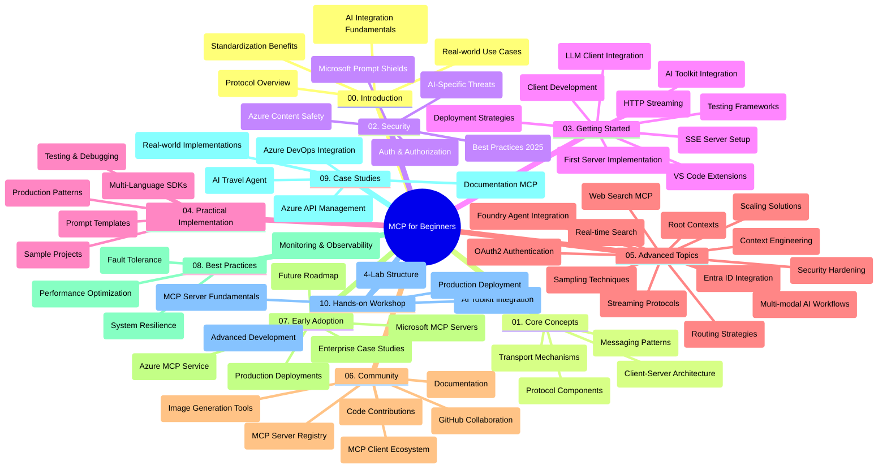

<!--
CO_OP_TRANSLATOR_METADATA:
{
  "original_hash": "e2c6ed897fa98fa08e0146101776c7ff",
  "translation_date": "2025-07-18T09:47:40+00:00",
  "source_file": "study_guide.md",
  "language_code": "tr"
}
-->
# Model Context Protocol (MCP) Yeni Başlayanlar için - Çalışma Rehberi

Bu çalışma rehberi, "Model Context Protocol (MCP) Yeni Başlayanlar için" müfredatının depo yapısı ve içeriği hakkında genel bir bakış sunar. Depoyu verimli bir şekilde gezmek ve mevcut kaynaklardan en iyi şekilde yararlanmak için bu rehberi kullanın.

## Depo Genel Bakışı

Model Context Protocol (MCP), yapay zeka modelleri ile istemci uygulamalar arasındaki etkileşimler için standartlaştırılmış bir çerçevedir. Başlangıçta Anthropic tarafından oluşturulan MCP, artık resmi GitHub organizasyonu aracılığıyla geniş MCP topluluğu tarafından sürdürülmektedir. Bu depo, AI geliştiricileri, sistem mimarları ve yazılım mühendisleri için C#, Java, JavaScript, Python ve TypeScript dillerinde uygulamalı kod örnekleri içeren kapsamlı bir müfredat sunar.

## Görsel Müfredat Haritası

## Depo Yapısı

Depo, MCP’nin farklı yönlerine odaklanan on ana bölüme ayrılmıştır:

1. **Giriş (00-Introduction/)**
   - Model Context Protocol’e genel bakış
   - AI süreçlerinde standartlaşmanın önemi
   - Pratik kullanım senaryoları ve faydalar

2. **Temel Kavramlar (01-CoreConcepts/)**
   - İstemci-sunucu mimarisi
   - Protokolün temel bileşenleri
   - MCP’de mesajlaşma kalıpları

3. **Güvenlik (02-Security/)**
   - MCP tabanlı sistemlerde güvenlik tehditleri
   - Güvenli uygulamalar için en iyi uygulamalar
   - Kimlik doğrulama ve yetkilendirme stratejileri
   - **Kapsamlı Güvenlik Dokümantasyonu**:
     - MCP Güvenlik En İyi Uygulamaları 2025
     - Azure İçerik Güvenliği Uygulama Rehberi
     - MCP Güvenlik Kontrolleri ve Teknikleri
     - MCP En İyi Uygulamalar Hızlı Referans
   - **Önemli Güvenlik Konuları**:
     - Prompt enjeksiyonu ve araç zehirleme saldırıları
     - Oturum kaçırma ve confused deputy problemleri
     - Token geçişi açıkları
     - Aşırı izinler ve erişim kontrolü
     - AI bileşenleri için tedarik zinciri güvenliği
     - Microsoft Prompt Shields entegrasyonu

4. **Başlarken (03-GettingStarted/)**
   - Ortam kurulumu ve yapılandırma
   - Temel MCP sunucu ve istemcilerinin oluşturulması
   - Mevcut uygulamalarla entegrasyon
   - İçerdiği bölümler:
     - İlk sunucu uygulaması
     - İstemci geliştirme
     - LLM istemci entegrasyonu
     - VS Code entegrasyonu
     - Server-Sent Events (SSE) sunucusu
     - HTTP akışı
     - AI Toolkit entegrasyonu
     - Test stratejileri
     - Dağıtım rehberi

5. **Pratik Uygulama (04-PracticalImplementation/)**
   - Farklı programlama dillerinde SDK kullanımı
   - Hata ayıklama, test ve doğrulama teknikleri
   - Yeniden kullanılabilir prompt şablonları ve iş akışları oluşturma
   - Uygulama örnekleri içeren örnek projeler

6. **İleri Konular (05-AdvancedTopics/)**
   - Bağlam mühendisliği teknikleri
   - Foundry agent entegrasyonu
   - Çok modlu AI iş akışları
   - OAuth2 kimlik doğrulama demoları
   - Gerçek zamanlı arama yetenekleri
   - Gerçek zamanlı akış
   - Root context uygulamaları
   - Yönlendirme stratejileri
   - Örnekleme teknikleri
   - Ölçeklendirme yaklaşımları
   - Güvenlik hususları
   - Entra ID güvenlik entegrasyonu
   - Web arama entegrasyonu

7. **Topluluk Katkıları (06-CommunityContributions/)**
   - Kod ve dokümantasyon katkısı nasıl yapılır
   - GitHub üzerinden iş birliği
   - Topluluk odaklı geliştirmeler ve geri bildirimler
   - Çeşitli MCP istemcilerinin kullanımı (Claude Desktop, Cline, VSCode)
   - Popüler MCP sunucularıyla çalışma, görüntü oluşturma dahil

8. **Erken Benimsemeden Alınan Dersler (07-LessonsfromEarlyAdoption/)**
   - Gerçek dünya uygulamaları ve başarı hikayeleri
   - MCP tabanlı çözümlerin oluşturulması ve dağıtımı
   - Trendler ve gelecek yol haritası
   - **Microsoft MCP Sunucuları Rehberi**: 10 üretime hazır Microsoft MCP sunucusunu kapsayan kapsamlı rehber:
     - Microsoft Learn Docs MCP Sunucusu
     - Azure MCP Sunucusu (15+ özel bağlayıcı)
     - GitHub MCP Sunucusu
     - Azure DevOps MCP Sunucusu
     - MarkItDown MCP Sunucusu
     - SQL Server MCP Sunucusu
     - Playwright MCP Sunucusu
     - Dev Box MCP Sunucusu
     - Azure AI Foundry MCP Sunucusu
     - Microsoft 365 Agents Toolkit MCP Sunucusu

9. **En İyi Uygulamalar (08-BestPractices/)**
   - Performans ayarlamaları ve optimizasyon
   - Hata toleranslı MCP sistemleri tasarımı
   - Test ve dayanıklılık stratejileri

10. **Vaka Çalışmaları (09-CaseStudy/)**
    - Azure API Management entegrasyon örneği
    - Seyahat acentesi uygulama örneği
    - Azure DevOps entegrasyonu ve YouTube güncellemeleri
    - Dokümantasyon MCP uygulama örnekleri
    - Detaylı dokümantasyonlu uygulama örnekleri

11. **Uygulamalı Atölye (10-StreamliningAIWorkflowsBuildingAnMCPServerWithAIToolkit/)**
    - MCP ile AI Toolkit’i birleştiren kapsamlı uygulamalı atölye
    - AI modelleri ile gerçek dünya araçlarını birleştiren akıllı uygulamalar geliştirme
    - Temeller, özel sunucu geliştirme ve üretim dağıtım stratejilerini kapsayan pratik modüller
    - **Lab Yapısı**:
      - Lab 1: MCP Sunucu Temelleri
      - Lab 2: İleri MCP Sunucu Geliştirme
      - Lab 3: AI Toolkit Entegrasyonu
      - Lab 4: Üretim Dağıtımı ve Ölçeklendirme
    - Adım adım talimatlarla laboratuvar tabanlı öğrenme yaklaşımı

## Ek Kaynaklar

Depo, destekleyici kaynaklar içerir:

- **Images klasörü**: Müfredat boyunca kullanılan diyagramlar ve görseller
- **Çeviriler**: Dokümantasyonun çok dilli otomatik çevirileri
- **Resmi MCP Kaynakları**:
  - [MCP Documentation](https://modelcontextprotocol.io/)
  - [MCP Specification](https://spec.modelcontextprotocol.io/)
  - [MCP GitHub Repository](https://github.com/modelcontextprotocol)

## Bu Depo Nasıl Kullanılır

1. **Sıralı Öğrenme**: Yapılandırılmış bir öğrenme deneyimi için bölümleri sırayla (00’dan 10’a kadar) takip edin.
2. **Dil Odaklı İnceleme**: Belirli bir programlama diliyle ilgileniyorsanız, örnekler klasöründe tercih ettiğiniz dildeki uygulamalara göz atın.
3. **Pratik Uygulama**: Ortamınızı kurmak ve ilk MCP sunucu ile istemcinizi oluşturmak için "Başlarken" bölümünden başlayın.
4. **İleri Düzey Keşif**: Temelleri öğrendikten sonra bilgilerinizi genişletmek için ileri konulara geçin.
5. **Topluluk Katılımı**: MCP topluluğuna GitHub tartışmaları ve Discord kanalları aracılığıyla katılarak uzmanlar ve diğer geliştiricilerle bağlantı kurun.

## MCP İstemcileri ve Araçları

Müfredat, çeşitli MCP istemcileri ve araçlarını kapsar:

1. **Resmi İstemciler**:
   - Visual Studio Code
   - Visual Studio Code içindeki MCP
   - Claude Desktop
   - VSCode içindeki Claude
   - Claude API

2. **Topluluk İstemcileri**:
   - Cline (terminal tabanlı)
   - Cursor (kod editörü)
   - ChatMCP
   - Windsurf

3. **MCP Yönetim Araçları**:
   - MCP CLI
   - MCP Manager
   - MCP Linker
   - MCP Router

## Popüler MCP Sunucuları

Depo, çeşitli MCP sunucularını tanıtır:

1. **Resmi Microsoft MCP Sunucuları**:
   - Microsoft Learn Docs MCP Sunucusu
   - Azure MCP Sunucusu (15+ özel bağlayıcı)
   - GitHub MCP Sunucusu
   - Azure DevOps MCP Sunucusu
   - MarkItDown MCP Sunucusu
   - SQL Server MCP Sunucusu
   - Playwright MCP Sunucusu
   - Dev Box MCP Sunucusu
   - Azure AI Foundry MCP Sunucusu
   - Microsoft 365 Agents Toolkit MCP Sunucusu

2. **Resmi Referans Sunucuları**:
   - Filesystem
   - Fetch
   - Memory
   - Sequential Thinking

3. **Görüntü Oluşturma**:
   - Azure OpenAI DALL-E 3
   - Stable Diffusion WebUI
   - Replicate

4. **Geliştirme Araçları**:
   - Git MCP
   - Terminal Control
   - Code Assistant

5. **Özel Sunucular**:
   - Salesforce
   - Microsoft Teams
   - Jira & Confluence

## Katkıda Bulunma

Bu depo, topluluk katkılarına açıktır. MCP ekosistemine etkili katkı sağlamak için Topluluk Katkıları bölümündeki rehbere bakabilirsiniz.

## Değişiklik Günlüğü

| Tarih | Değişiklikler |
|-------|--------------|
| 18 Temmuz 2025 | - Depo yapısı Microsoft MCP Sunucuları Rehberi’ni içerecek şekilde güncellendi - 10 üretime hazır Microsoft MCP sunucusunun kapsamlı listesi eklendi - Popüler MCP Sunucuları bölümü Resmi Microsoft MCP Sunucuları ile genişletildi - Vaka Çalışmaları bölümü gerçek dosya örnekleriyle güncellendi - Uygulamalı Atölye için Lab Yapısı detayları eklendi |
| 16 Temmuz 2025 | - Depo yapısı mevcut içeriği yansıtacak şekilde güncellendi - MCP İstemcileri ve Araçları bölümü eklendi - Popüler MCP Sunucuları bölümü eklendi - Görsel Müfredat Haritası tüm güncel konularla güncellendi - İleri Konular bölümü tüm uzmanlık alanlarıyla genişletildi - Vaka Çalışmaları gerçek örneklerle güncellendi - MCP’nin Anthropic tarafından oluşturulduğu netleştirildi |
| 11 Haziran 2025 | - Çalışma rehberi ilk kez oluşturuldu - Görsel Müfredat Haritası eklendi - Depo yapısı özetlendi - Örnek projeler ve ek kaynaklar dahil edildi |

---

*Bu çalışma rehberi 18 Temmuz 2025 tarihinde güncellenmiş olup, o tarihteki depo içeriğinin genel bir özetini sunmaktadır. Depo içeriği bu tarihten sonra güncellenmiş olabilir.*

**Feragatname**:  
Bu belge, AI çeviri servisi [Co-op Translator](https://github.com/Azure/co-op-translator) kullanılarak çevrilmiştir. Doğruluk için çaba göstersek de, otomatik çevirilerin hatalar veya yanlışlıklar içerebileceğini lütfen unutmayın. Orijinal belge, kendi dilinde yetkili kaynak olarak kabul edilmelidir. Kritik bilgiler için profesyonel insan çevirisi önerilir. Bu çevirinin kullanımı sonucu ortaya çıkabilecek yanlış anlamalar veya yorum hatalarından sorumlu değiliz.