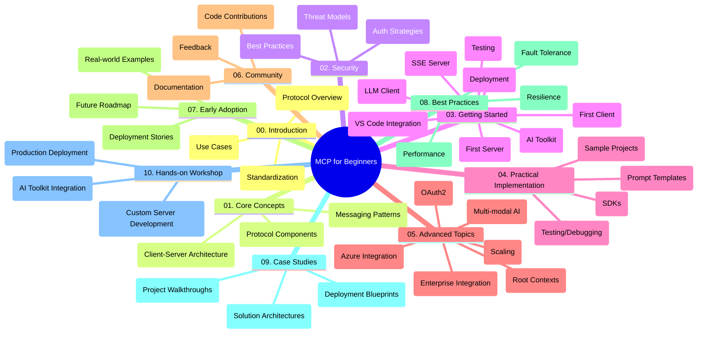

<!--
CO_OP_TRANSLATOR_METADATA:
{
  "original_hash": "a607d4febc94caee9a12b77795f7fc9a",
  "translation_date": "2025-06-11T16:43:43+00:00",
  "source_file": "study_guide.md",
  "language_code": "tr"
}
-->
# Model Context Protocol (MCP) Yeni Başlayanlar İçin - Çalışma Rehberi

Bu çalışma rehberi, "Model Context Protocol (MCP) Yeni Başlayanlar İçin" müfredatının depo yapısı ve içeriği hakkında genel bir bakış sunar. Depoyu etkin bir şekilde gezmek ve mevcut kaynaklardan en iyi şekilde yararlanmak için bu rehberi kullanın.

## Depo Genel Bakışı

Model Context Protocol (MCP), yapay zeka modelleri ile istemci uygulamalar arasındaki etkileşimler için standartlaştırılmış bir çerçevedir. Bu depo, C#, Java, JavaScript, Python ve TypeScript dillerinde uygulamalı kod örnekleri içeren kapsamlı bir müfredat sunar ve yapay zeka geliştiricileri, sistem mimarları ve yazılım mühendisleri için tasarlanmıştır.

## Görsel Müfredat Haritası

## Depo Yapısı

Depo, MCP'nin farklı yönlerine odaklanan on ana bölüm halinde düzenlenmiştir:

1. **Giriş (00-Introduction/)**
   - Model Context Protocol'e genel bakış
   - AI süreçlerinde standartlaşmanın önemi
   - Pratik kullanım senaryoları ve faydalar

2. **Temel Kavramlar (01-CoreConcepts/)**
   - İstemci-sunucu mimarisi
   - Protokolün temel bileşenleri
   - MCP'deki mesajlaşma desenleri

3. **Güvenlik (02-Security/)**
   - MCP tabanlı sistemlerde güvenlik tehditleri
   - Güvenli uygulamalar için en iyi yöntemler
   - Kimlik doğrulama ve yetkilendirme stratejileri

4. **Başlarken (03-GettingStarted/)**
   - Ortam kurulumu ve yapılandırma
   - Temel MCP sunucuları ve istemcileri oluşturma
   - Mevcut uygulamalarla entegrasyon
   - İlk sunucu, ilk istemci, LLM istemcisi, VS Code entegrasyonu, SSE sunucusu, AI Toolkit, test ve dağıtım alt bölümleri

5. **Pratik Uygulama (04-PracticalImplementation/)**
   - Farklı programlama dillerinde SDK kullanımı
   - Hata ayıklama, test ve doğrulama teknikleri
   - Yeniden kullanılabilir prompt şablonları ve iş akışları oluşturma
   - Uygulama örnekleri içeren örnek projeler

6. **İleri Konular (05-AdvancedTopics/)**
   - Çok modlu AI iş akışları ve genişletilebilirlik
   - Güvenli ölçeklendirme stratejileri
   - Kurumsal ekosistemlerde MCP
   - Azure entegrasyonu, çok modluluk, OAuth2, root context'ler, yönlendirme, örnekleme, ölçeklendirme, güvenlik, web arama entegrasyonu ve akış konuları dahil özel başlıklar

7. **Topluluk Katkıları (06-CommunityContributions/)**
   - Kod ve dokümantasyon katkısı yapma yolları
   - GitHub üzerinden iş birliği
   - Topluluk odaklı geliştirmeler ve geri bildirimler

8. **Erken Benimsemeden Dersler (07-LessonsfromEarlyAdoption/)**
   - Gerçek dünya uygulamaları ve başarı hikayeleri
   - MCP tabanlı çözümler geliştirme ve dağıtma
   - Trendler ve gelecek yol haritası

9. **En İyi Uygulamalar (08-BestPractices/)**
   - Performans ayarlama ve optimizasyon
   - Hata toleranslı MCP sistemleri tasarımı
   - Test ve dayanıklılık stratejileri

10. **Vaka Çalışmaları (09-CaseStudy/)**
    - MCP çözüm mimarilerine derinlemesine bakış
    - Dağıtım planları ve entegrasyon ipuçları
    - Açıklamalı diyagramlar ve proje incelemeleri

11. **Uygulamalı Atölye (10-StreamliningAIWorkflowsBuildingAnMCPServerWithAIToolkit/)**
    - Microsoft’un AI Toolkit’i ile MCP’yi birleştiren kapsamlı uygulamalı atölye
    - AI modelleri ile gerçek dünya araçları arasında akıllı uygulamalar geliştirme
    - Temel bilgiler, özel sunucu geliştirme ve üretim dağıtım stratejilerini içeren pratik modüller

## Örnek Projeler

Depoda, farklı programlama dillerinde MCP uygulamalarını gösteren birçok örnek proje bulunmaktadır:

### Temel MCP Hesap Makinesi Örnekleri
- C# MCP Sunucu Örneği
- Java MCP Hesap Makinesi
- JavaScript MCP Demo
- Python MCP Sunucu
- TypeScript MCP Örneği

### İleri MCP Hesap Makinesi Projeleri
- İleri C# Örneği
- Java Konteyner Uygulaması Örneği
- JavaScript İleri Örnek
- Python Karmaşık Uygulama
- TypeScript Konteyner Örneği

## Ek Kaynaklar

Depo destekleyici kaynaklar içerir:

- **Images klasörü**: Müfredat boyunca kullanılan diyagramlar ve görseller
- **Çeviriler**: Dokümantasyonun çok dilli otomatik çevirileri
- **Resmi MCP Kaynakları**:
  - [MCP Documentation](https://modelcontextprotocol.io/)
  - [MCP Specification](https://spec.modelcontextprotocol.io/)
  - [MCP GitHub Repository](https://github.com/modelcontextprotocol)

## Bu Depo Nasıl Kullanılır

1. **Sıralı Öğrenme**: Yapılandırılmış bir öğrenme deneyimi için bölümleri sırayla (00’dan 10’a kadar) takip edin.
2. **Dil Odaklı İnceleme**: Belirli bir programlama diliyle ilgileniyorsanız, tercih ettiğiniz dildeki örnekler klasörlerini keşfedin.
3. **Pratik Uygulama**: Ortamınızı kurmak ve ilk MCP sunucu ile istemcinizi oluşturmak için "Başlarken" bölümünden başlayın.
4. **İleri Düzey Keşif**: Temelleri öğrendikten sonra bilgilerinizi genişletmek için ileri konulara geçin.
5. **Topluluk Katılımı**: Uzmanlar ve diğer geliştiricilerle bağlantı kurmak için [Azure AI Foundry Discord](https://discord.com/invite/ByRwuEEgH4) kanalına katılın.

## Katkıda Bulunma

Bu depo topluluk katkılarına açıktır. Katkıda bulunma rehberi için Topluluk Katkıları bölümüne bakınız.

---

*Bu çalışma rehberi 11 Haziran 2025 tarihinde oluşturulmuş olup, o tarihteki depo içeriğinin genel bir özetini sunmaktadır. Depo içeriği o tarihten sonra güncellenmiş olabilir.*

**Feragatname**:  
Bu belge, AI çeviri servisi [Co-op Translator](https://github.com/Azure/co-op-translator) kullanılarak çevrilmiştir. Doğruluk için çaba göstersek de, otomatik çevirilerin hata veya yanlışlık içerebileceğini lütfen unutmayınız. Orijinal belge, kendi dilinde yetkili kaynak olarak kabul edilmelidir. Kritik bilgiler için profesyonel insan çevirisi önerilir. Bu çevirinin kullanımı sonucu oluşabilecek herhangi bir yanlış anlama veya yanlış yorumlamadan sorumlu değiliz.