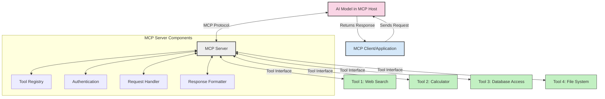
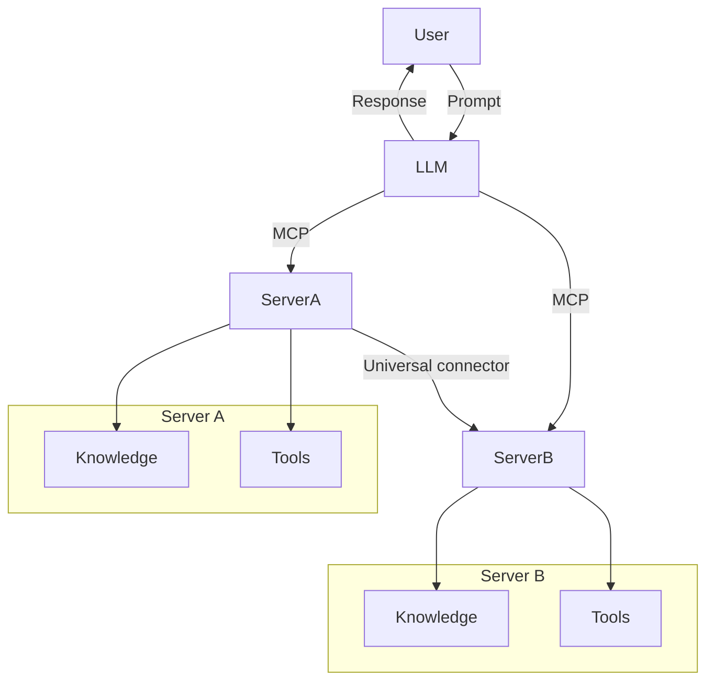

<!--
CO_OP_TRANSLATOR_METADATA:
{
  "original_hash": "1d88dee994dcbb3fa52c271d0c0817b5",
  "translation_date": "2025-05-20T20:41:38+00:00",
  "source_file": "00-Introduction/README.md",
  "language_code": "tw"
}
-->
# Model Context Protocol (MCP) 簡介：為什麼它對可擴展的 AI 應用很重要

生成式 AI 應用是很大的進步，因為它們通常允許使用者用自然語言提示與應用互動。然而，當投入越來越多時間和資源在這類應用上時，你會希望能輕鬆整合功能和資源，使得系統容易擴充，能支援多個模型並處理各種模型細節。簡單來說，建立生成式 AI 應用一開始很容易，但隨著系統成長變得複雜，你就需要開始定義架構，並可能需要依靠標準來確保應用以一致的方式建構。這就是 MCP 出場，幫助組織並提供標準。

---

## **🔍 什麼是 Model Context Protocol (MCP)?**

**Model Context Protocol (MCP)** 是一個 **開放且標準化的介面**，讓大型語言模型 (LLM) 能無縫地與外部工具、API 和資料來源互動。它提供一致的架構，讓 AI 模型功能超越訓練資料，打造更聰明、可擴展且反應更靈敏的 AI 系統。

---

## **🎯 為什麼 AI 需要標準化**

隨著生成式 AI 應用越來越複雜，採用能確保 **可擴展性、可延展性** 和 **可維護性** 的標準變得非常重要。MCP 解決了這些需求，具體表現在：

- 統一模型與工具的整合方式
- 減少脆弱且一次性的客製化解決方案
- 允許多個模型共存於同一生態系統

---

## **📚 學習目標**

讀完本文，你將能：

- 定義 **Model Context Protocol (MCP)** 及其應用場景
- 了解 MCP 如何標準化模型與工具的溝通
- 辨識 MCP 架構的核心元件
- 探索 MCP 在企業和開發上的實際應用

---

## **💡 為什麼 Model Context Protocol (MCP) 是遊戲規則改變者**

### **🔗 MCP 解決 AI 互動的碎片化問題**

在 MCP 出現前，模型與工具整合常需要：

- 每對工具與模型寫客製化程式碼
- 每家廠商使用非標準化 API
- 更新時常造成中斷
- 工具越多，擴展性越差

### **✅ MCP 標準化的好處**

| **好處**                 | **說明**                                                                         |
|--------------------------|----------------------------------------------------------------------------------|
| 互通性                   | LLM 能與不同廠商的工具無縫合作                                                 |
| 一致性                   | 在各平台與工具間保持統一行為                                                     |
| 可重用性                 | 工具只需建置一次，可跨專案和系統使用                                           |
| 加速開發                 | 利用標準化、即插即用的介面，縮短開發時間                                       |

---

## **🧱 MCP 高階架構概覽**

MCP 採用 **客戶端-伺服器模型**，其中：

- **MCP Hosts** 執行 AI 模型
- **MCP Clients** 發起請求
- **MCP Servers** 提供上下文、工具和功能

### **主要元件：**

- **Resources** – 模型使用的靜態或動態資料  
- **Prompts** – 預先定義的工作流程，引導生成  
- **Tools** – 可執行的功能，如搜尋、計算  
- **Sampling** – 透過遞迴互動實現代理行為

---

## MCP 伺服器如何運作

MCP 伺服器的運作流程如下：

- **請求流程**：  
    1. MCP Client 向運行在 MCP Host 的 AI 模型發送請求。  
    2. AI 模型判斷是否需要外部工具或資料。  
    3. 模型使用標準化協議與 MCP Server 通訊。

- **MCP Server 功能**：  
    - 工具註冊表：維護可用工具及其功能目錄。  
    - 身份驗證：驗證工具存取權限。  
    - 請求處理器：處理模型發出的工具請求。  
    - 回應格式化：將工具輸出整理成模型可理解格式。

- **工具執行**：  
    - 伺服器將請求導向適當的外部工具。  
    - 工具執行其專門功能（搜尋、計算、資料庫查詢等）。  
    - 結果以一致格式回傳給模型。

- **回應完成**：  
    - AI 模型將工具輸出整合進回應。  
    - 最終回應送回客戶端應用。

## 👨‍💻 如何建立 MCP 伺服器（附範例）

MCP 伺服器讓你能擴充 LLM 的能力，提供資料和功能。

準備好試試看了嗎？以下是用不同語言建立簡單 MCP 伺服器的範例：

- **Python 範例**: https://github.com/modelcontextprotocol/python-sdk

- **TypeScript 範例**: https://github.com/modelcontextprotocol/typescript-sdk

- **Java 範例**: https://github.com/modelcontextprotocol/java-sdk

- **C#/.NET 範例**: https://github.com/modelcontextprotocol/csharp-sdk

## 🌍 MCP 的實際應用案例

MCP 透過擴充 AI 功能，支援多種應用：

| **應用場景**               | **說明**                                                                        |
|----------------------------|---------------------------------------------------------------------------------|
| 企業資料整合               | 將 LLM 連接到資料庫、CRM 或內部工具                                           |
| 代理式 AI 系統             | 讓自主代理能存取工具並執行決策流程                                            |
| 多模態應用                 | 在單一 AI 應用中結合文字、影像和音訊工具                                      |
| 即時資料整合               | 將即時資料帶入 AI 互動，產生更精準且最新的輸出                                |

### 🧠 MCP = AI 互動的通用標準

Model Context Protocol (MCP) 就像 USB-C 標準化裝置的物理連接一樣，是 AI 互動的通用標準。在 AI 世界裡，MCP 提供一致介面，讓模型（客戶端）能無縫整合外部工具和資料提供者（伺服器）。這消除了為每個 API 或資料來源寫不同自訂協議的需求。

符合 MCP 的工具（即 MCP 伺服器）遵循統一標準，能列出所提供的工具或動作，並在 AI 代理請求時執行。支援 MCP 的 AI 代理平台能從伺服器發現可用工具，並透過此標準協議調用。

### 💡 促進知識存取

除了提供工具，MCP 也促進知識存取。它讓應用能為大型語言模型 (LLM) 提供上下文，將它們連結到各種資料來源。例如，MCP 伺服器可能代表公司的文件庫，讓代理按需取得相關資訊。另一個伺服器可能負責特定動作，如寄信或更新紀錄。對代理來說，這些都是它能使用的工具——有些工具回傳資料（知識上下文），有些執行動作。MCP 有效管理兩者。

代理連接到 MCP 伺服器時，會自動透過標準格式學習伺服器可用的功能和資料。這種標準化讓工具能動態加入。例如，新增一個 MCP 伺服器到代理系統中，其功能立刻可用，無需額外調整代理指令。

這種順暢整合與下方的 mermaid 圖示流程相符，伺服器同時提供工具和知識，確保系統間無縫協作。

### 👉 範例：可擴展的代理解決方案

## 🔐 MCP 的實際好處

使用 MCP 的實際好處包括：

- **即時性**：模型能存取訓練資料外的最新資訊  
- **能力延伸**：模型能利用專門工具完成原本無法處理的任務  
- **減少幻覺**：外部資料來源提供事實依據  
- **隱私保護**：敏感資料可留在安全環境，不需直接寫入提示詞中

## 📌 重要重點整理

使用 MCP 的關鍵重點：

- **MCP** 標準化 AI 模型與工具及資料的互動方式  
- 促進 **擴展性、一致性與互通性**  
- MCP 幫助 **縮短開發時間、提升可靠性，並擴展模型能力**  
- 客戶端-伺服器架構讓 AI 應用更靈活、易擴充

## 🧠 練習題

想想你有興趣打造的 AI 應用：

- 哪些 **外部工具或資料** 可以增強它的能力？  
- MCP 怎麼讓整合變得 **更簡單且更可靠**？

## 其他資源

- [MCP GitHub Repository](https://github.com/modelcontextprotocol)

## 下一步

下一章：[Chapter 1: Core Concepts](/01-CoreConcepts/README.md)

**免責聲明**：  
本文件係使用 AI 翻譯服務 [Co-op Translator](https://github.com/Azure/co-op-translator) 進行翻譯。雖然我們力求準確，但請注意自動翻譯可能包含錯誤或不準確之處。原始文件的母語版本應視為權威來源。對於重要資訊，建議採用專業人工翻譯。我們不對因使用本翻譯所產生之任何誤解或誤譯負責。