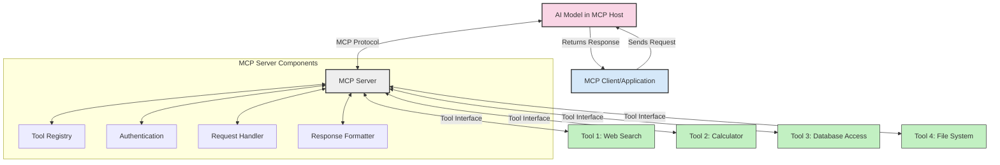
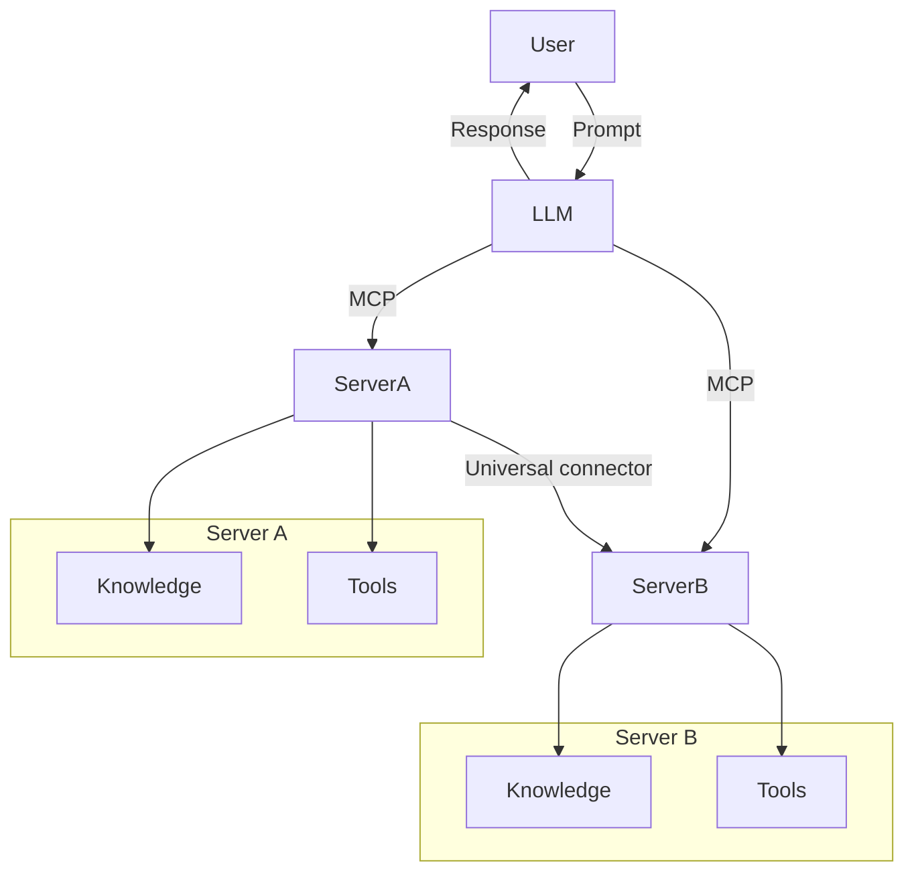

<!--
CO_OP_TRANSLATOR_METADATA:
{
  "original_hash": "02301140adbd807ecf0f17720fa307bc",
  "translation_date": "2025-05-17T05:55:29+00:00",
  "source_file": "00-Introduction/README.md",
  "language_code": "tw"
}
-->
# 模型上下文协议 (MCP) 简介：为什么它对可扩展的 AI 应用程序至关重要

生成式 AI 应用程序是一个重要的进步，因为它们通常允许用户使用自然语言提示与应用程序互动。然而，随着在这些应用程序上的时间和资源投入越来越多，你希望确保能够轻松整合功能和资源，以便轻松扩展，让你的应用程序能够满足多个模型的使用需求及其复杂性。简而言之，构建生成式 AI 应用程序一开始很容易，但随着它的成长和变得复杂，你需要开始定义架构，并可能需要依赖一个标准来确保你的应用程序以一致的方式构建。这就是 MCP 的作用所在，它为组织提供了一个标准。

---

## **🔍 什么是模型上下文协议 (MCP)?**

**模型上下文协议 (MCP)** 是一个**开放、标准化的接口**，允许大型语言模型 (LLMs) 无缝地与外部工具、API 和数据源互动。它提供了一种一致的架构来增强 AI 模型的功能，超越其训练数据，实现更智能、可扩展和更具响应性的 AI 系统。

---

## **🎯 为什么 AI 标准化很重要**

随着生成式 AI 应用程序变得更加复杂，采用确保**可扩展性、可扩展性**和**可维护性**的标准至关重要。MCP 通过以下方式满足这些需求：

- 统一模型工具整合
- 减少脆弱的、一次性定制解决方案
- 允许多个模型在一个生态系统中共存

---

## **📚 学习目标**

阅读完本文后，你将能够：

- 定义**模型上下文协议 (MCP)**及其使用案例
- 理解 MCP 如何标准化模型与工具的通信
- 识别 MCP 架构的核心组件
- 探索 MCP 在企业和开发环境中的实际应用

---

## **💡 为什么模型上下文协议 (MCP) 是一个改变游戏规则的工具**

### **🔗 MCP 解决了 AI 互动中的碎片化问题**

在 MCP 之前，集成模型与工具需要：

- 每个工具模型对的自定义代码
- 每个供应商的非标准 API
- 更新导致的频繁中断
- 随着更多工具的加入，扩展性差

### **✅ MCP 标准化的好处**

| **好处**                   | **描述**                                                                       |
|----------------------------|--------------------------------------------------------------------------------|
| 互操作性                   | LLMs 能够与不同供应商的工具无缝协作                                            |
| 一致性                     | 跨平台和工具的统一行为                                                         |
| 可重用性                   | 一次构建的工具可以在项目和系统中使用                                           |
| 加速开发                   | 通过使用标准化的即插即用接口减少开发时间                                       |

---

## **🧱 高级 MCP 架构概述**

MCP 遵循**客户端-服务器模型**，其中：

- **MCP 主机**运行 AI 模型
- **MCP 客户端**发起请求
- **MCP 服务器**提供上下文、工具和功能

### **关键组件：**

- **资源** – 模型的静态或动态数据  
- **提示** – 用于引导生成的预定义工作流  
- **工具** – 可执行的功能，如搜索、计算  
- **采样** – 通过递归互动实现代理行为

---

## MCP 服务器如何工作

MCP 服务器以以下方式操作：

- **请求流程**: 
    1. MCP 客户端向运行在 MCP 主机中的 AI 模型发送请求。
    2. AI 模型识别何时需要外部工具或数据。
    3. 模型使用标准化协议与 MCP 服务器通信。

- **MCP 服务器功能**:
    - 工具注册表: 维护可用工具及其功能的目录。
    - 身份验证: 验证工具访问权限。
    - 请求处理器: 处理来自模型的工具请求。
    - 响应格式化器: 将工具输出结构化为模型可以理解的格式。

- **工具执行**: 
    - 服务器将请求路由到适当的外部工具
    - 工具执行其专业功能（搜索、计算、数据库查询等）
    - 结果以一致格式返回给模型。

- **响应完成**: 
    - AI 模型将工具输出整合到其响应中。
    - 最终响应发送回客户端应用程序。

## 👨‍💻 如何构建 MCP 服务器（附示例）

MCP 服务器允许你通过提供数据和功能来扩展 LLM 的能力。

准备好试试了吗？以下是用不同语言创建简单 MCP 服务器的示例：

- **Python 示例**: https://github.com/modelcontextprotocol/python-sdk

- **TypeScript 示例**: https://github.com/modelcontextprotocol/typescript-sdk

- **Java 示例**: https://github.com/modelcontextprotocol/java-sdk

- **C#/.NET 示例**: https://github.com/modelcontextprotocol/csharp-sdk

## 🌍 MCP 的实际应用案例

MCP 通过扩展 AI 能力实现广泛的应用：

| **应用**                     | **描述**                                                                       |
|------------------------------|--------------------------------------------------------------------------------|
| 企业数据集成                 | 将 LLMs 连接到数据库、CRM 或内部工具                                          |
| 代理 AI 系统                 | 启用具有工具访问和决策工作流的自主代理                                        |
| 多模态应用                   | 在一个统一的 AI 应用中结合文本、图像和音频工具                                |
| 实时数据集成                 | 将实时数据引入 AI 互动中，以获得更准确、最新的输出                             |

### 🧠 MCP = AI 互动的通用标准

模型上下文协议 (MCP) 作为 AI 互动的通用标准，就像 USB-C 标准化设备的物理连接一样。在 AI 的世界中，MCP 提供了一致的接口，允许模型（客户端）无缝地与外部工具和数据提供者（服务器）集成。这消除了每个 API 或数据源的多样化、自定义协议的需求。

在 MCP 下，一个 MCP 兼容的工具（称为 MCP 服务器）遵循统一标准。这些服务器可以列出它们提供的工具或操作，并在 AI 代理请求时执行这些操作。支持 MCP 的 AI 代理平台能够发现服务器提供的可用工具，并通过这一标准协议调用它们。

### 💡 促进知识访问

除了提供工具，MCP 还促进了知识访问。它使应用程序能够通过将大型语言模型 (LLMs) 链接到各种数据源来提供上下文。例如，一个 MCP 服务器可能代表公司的文档存储库，允许代理按需检索相关信息。另一个服务器可以处理特定操作，如发送电子邮件或更新记录。从代理的角度来看，这些只是它可以使用的工具——有些工具返回数据（知识上下文），而其他工具执行操作。MCP 有效地管理两者。

连接到 MCP 服务器的代理会自动通过标准格式了解服务器的可用功能和可访问数据。这种标准化实现了动态工具可用性。例如，将一个新的 MCP 服务器添加到代理的系统中，使其功能立即可用，而无需进一步定制代理的指令。

这种简化的集成与美人鱼图中描绘的流程一致，服务器提供工具和知识，确保系统间的无缝协作。

### 👉 示例：可扩展代理解决方案

## 🔐 MCP 的实际好处

以下是使用 MCP 的一些实际好处：

- **新鲜度**: 模型可以访问超出其训练数据的最新信息
- **能力扩展**: 模型可以利用专业工具完成它们未训练过的任务
- **减少幻觉**: 外部数据源提供事实基础
- **隐私**: 敏感数据可以留在安全环境中，而不是嵌入在提示中

## 📌 关键要点

使用 MCP 的关键要点如下：

- **MCP** 标准化了 AI 模型与工具和数据的互动方式
- 促进**可扩展性、一致性和互操作性**
- MCP 有助于**减少开发时间、提高可靠性和扩展模型功能**
- 客户端-服务器架构**实现灵活、可扩展的 AI 应用程序**

## 🧠 练习

考虑一下你感兴趣构建的 AI 应用程序。

- 哪些**外部工具或数据**可以增强其功能？
- MCP 如何使集成**更简单、更可靠？**

## 其他资源

- [MCP GitHub 存储库](https://github.com/modelcontextprotocol)

## 接下来是什么

接下来: [第一章：核心概念](/01-CoreConcepts/README.md)

**免責聲明**：
本文件使用 AI 翻譯服務 [Co-op Translator](https://github.com/Azure/co-op-translator) 進行翻譯。儘管我們努力追求準確性，但請注意自動翻譯可能包含錯誤或不準確之處。應將原始文件的母語版本視為權威來源。對於關鍵信息，建議使用專業人工翻譯。我們對使用此翻譯所產生的任何誤解或誤釋不承擔責任。