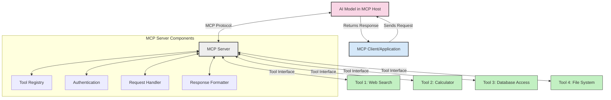
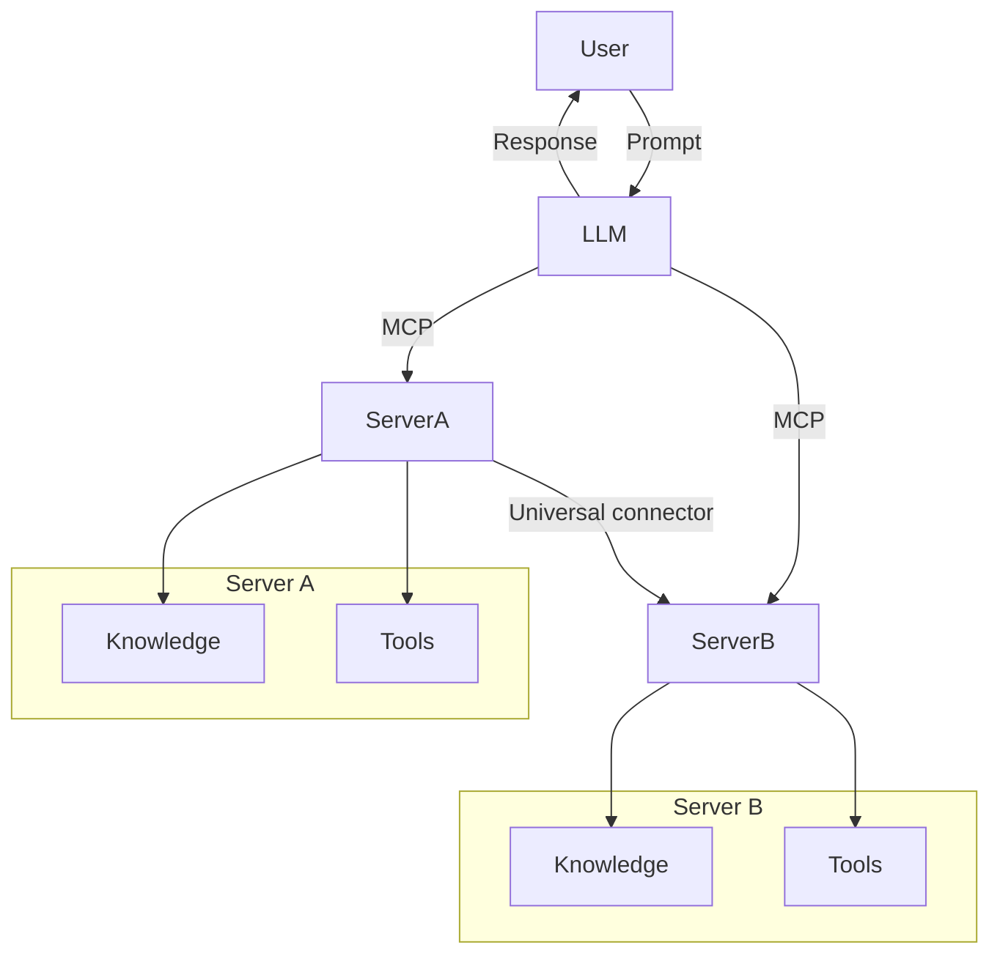

<!--
CO_OP_TRANSLATOR_METADATA:
{
  "original_hash": "cf84f987e1b771d2201408e110dfd2db",
  "translation_date": "2025-05-20T16:10:20+00:00",
  "source_file": "00-Introduction/README.md",
  "language_code": "tw"
}
-->
# 介紹 Model Context Protocol (MCP)：為什麼它對可擴展的 AI 應用很重要

生成式 AI 應用是一大進步，因為它們通常讓使用者能用自然語言提示與應用互動。然而，隨著投入更多時間和資源，你會希望能輕鬆整合功能和資源，讓擴充變得簡單，應用能支援多模型共存及其複雜性。簡言之，建構生成式 AI 應用一開始很容易，但隨著規模和複雜度增加，你需要開始定義架構，並且很可能得依賴一套標準，確保應用建構一致。這正是 MCP 的用武之地，幫助組織並提供標準。

---

## **🔍 什麼是 Model Context Protocol (MCP)?**

**Model Context Protocol (MCP)** 是一個 **開放且標準化的介面**，讓大型語言模型（LLMs）能與外部工具、API 和資料來源無縫互動。它提供一致的架構，強化 AI 模型功能超越訓練資料，讓 AI 系統更聰明、可擴展且反應更靈敏。

---

## **🎯 為什麼 AI 需要標準化**

隨著生成式 AI 應用變得更複雜，採用標準以確保 **可擴展性、可延展性** 及 **可維護性** 變得非常重要。MCP 回應這些需求，透過：

- 統一模型與工具的整合
- 減少脆弱且一次性的客製化解決方案
- 允許多個模型共存於同一生態系統

---

## **📚 學習目標**

讀完這篇文章，你將能夠：

- 定義 **Model Context Protocol (MCP)** 及其使用場景
- 了解 MCP 如何標準化模型與工具的溝通
- 識別 MCP 架構的核心元件
- 探索 MCP 在企業和開發環境中的實際應用

---

## **💡 為什麼 Model Context Protocol (MCP) 是遊戲規則改變者**

### **🔗 MCP 解決 AI 互動的分散問題**

在 MCP 出現之前，模型與工具整合需要：

- 每對工具與模型寫客製化程式碼
- 每個廠商都有非標準 API
- 更新頻繁導致整合斷裂
- 工具越多，擴展性越差

### **✅ MCP 標準化的好處**

| **好處**               | **說明**                                                                 |
|------------------------|--------------------------------------------------------------------------|
| 互通性                 | LLM 可與不同廠商的工具無縫合作                                          |
| 一致性                 | 跨平台和工具的行為一致                                                  |
| 可重用性               | 工具只需建置一次，可用於多個專案和系統                                  |
| 加速開發               | 利用標準化、即插即用的介面減少開發時間                                  |

---

## **🧱 MCP 高階架構概覽**

MCP 採用 **客戶端-伺服器模型**，其中：

- **MCP Hosts** 執行 AI 模型
- **MCP Clients** 發起請求
- **MCP Servers** 提供上下文、工具和能力

### **主要元件：**

- **Resources** – 提供模型靜態或動態資料  
- **Prompts** – 預設的工作流程引導生成  
- **Tools** – 可執行功能，如搜尋、計算  
- **Sampling** – 透過遞迴互動展現代理行為

---

## MCP 伺服器如何運作

MCP 伺服器的運作方式如下：

- **請求流程**：
    1. MCP Client 向執行 AI 模型的 MCP Host 發送請求。
    2. AI 模型判斷何時需要外部工具或資料。
    3. 模型透過標準化協議與 MCP Server 溝通。

- **MCP Server 功能**：
    - 工具註冊表：維護可用工具及其功能目錄。
    - 認證：驗證工具存取權限。
    - 請求處理器：處理模型發出的工具請求。
    - 回應格式化器：將工具輸出組織成模型可理解的格式。

- **工具執行**：
    - 伺服器將請求導向適當的外部工具
    - 工具執行其專門功能（搜尋、計算、資料庫查詢等）
    - 結果以一致格式回傳給模型。

- **回應完成**：
    - AI 模型將工具輸出整合進回應中。
    - 最終回應送回客戶端應用。

## 👨‍💻 如何建置 MCP 伺服器（含範例）

MCP 伺服器讓你能擴展 LLM 的能力，提供資料與功能。

想試試看嗎？這裡有用不同語言建立簡單 MCP 伺服器的範例：

- **Python 範例**：https://github.com/modelcontextprotocol/python-sdk

- **TypeScript 範例**：https://github.com/modelcontextprotocol/typescript-sdk

- **Java 範例**：https://github.com/modelcontextprotocol/java-sdk

- **C#/.NET 範例**：https://github.com/modelcontextprotocol/csharp-sdk

## 🌍 MCP 的實際應用案例

MCP 透過擴展 AI 功能，支持多種應用：

| **應用**                   | **說明**                                                                 |
|----------------------------|--------------------------------------------------------------------------|
| 企業資料整合               | 連接 LLM 與資料庫、CRM 或內部工具                                       |
| 代理式 AI 系統             | 讓自主代理能使用工具並進行決策流程                                     |
| 多模態應用                 | 在單一統一 AI 應用中結合文字、影像和音訊工具                           |
| 即時資料整合               | 將即時資料帶入 AI 互動，提升輸出準確度                                 |

### 🧠 MCP = AI 互動的通用標準

Model Context Protocol (MCP) 就像 USB-C 標準化裝置的實體連接一樣，是 AI 互動的通用標準。MCP 提供一致介面，讓模型（客戶端）能無縫整合外部工具和資料提供者（伺服器）。這樣就不需要為每個 API 或資料來源設計各種不同的自訂協議。

符合 MCP 的工具（稱為 MCP 伺服器）遵循統一標準，能列出所提供的工具或動作，並在 AI 代理請求時執行。支援 MCP 的 AI 代理平台可以從伺服器發現可用工具，並透過標準協議呼叫它們。

### 💡 促進知識存取

除了提供工具外，MCP 也促進知識存取。它讓應用能為大型語言模型提供上下文，透過連結多種資料來源。舉例來說，MCP 伺服器可能代表公司的文件庫，讓代理按需取得相關資訊；另一個伺服器則負責特定動作，如發送電子郵件或更新紀錄。從代理角度看，這些都是它能使用的工具——有些回傳資料（知識上下文），有些執行動作。MCP 有效管理兩者。

代理連接 MCP 伺服器時，會自動透過標準格式了解伺服器可用的功能與資料。這種標準化讓工具可動態提供。例如，新增 MCP 伺服器到代理系統後，其功能即可立即使用，無需修改代理指令。

這種流暢整合與 mermaid 圖中所示流程相符，伺服器同時提供工具和知識，確保系統間無縫協作。

### 👉 範例：可擴展代理解決方案

## 🔐 MCP 的實際好處

使用 MCP 的實際好處包括：

- **資訊即時性**：模型能存取訓練資料外的最新資訊
- **能力擴展**：模型可利用專門工具完成未訓練任務
- **減少幻覺**：外部資料來源提供事實依據
- **隱私保護**：敏感資料可留在安全環境，不需寫入提示

## 📌 主要重點整理

以下是使用 MCP 的關鍵重點：

- **MCP** 標準化 AI 模型與工具、資料的互動方式
- 促進 **可擴展性、一致性與互通性**
- MCP 幫助 **減少開發時間、提升可靠性並擴展模型能力**
- 客戶端-伺服器架構 **支持靈活且可延展的 AI 應用**

## 🧠 練習

想想你有興趣開發的 AI 應用。

- 哪些 **外部工具或資料** 可以提升它的能力？
- MCP 如何讓整合變得 **更簡單且更可靠？**

## 附加資源

- [MCP GitHub Repository](https://github.com/modelcontextprotocol)

## 接下來

下一章： [Chapter 1: Core Concepts](/01-CoreConcepts/README.md)

**免責聲明**：  
本文件係使用 AI 翻譯服務 [Co-op Translator](https://github.com/Azure/co-op-translator) 進行翻譯。雖然我們致力於翻譯的準確性，但請注意，自動翻譯可能包含錯誤或不準確之處。原始文件之母語版本應視為權威來源。對於重要資訊，建議採用專業人工翻譯。我們不對因使用本翻譯而產生之任何誤解或誤譯負責。