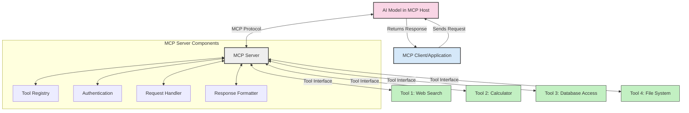
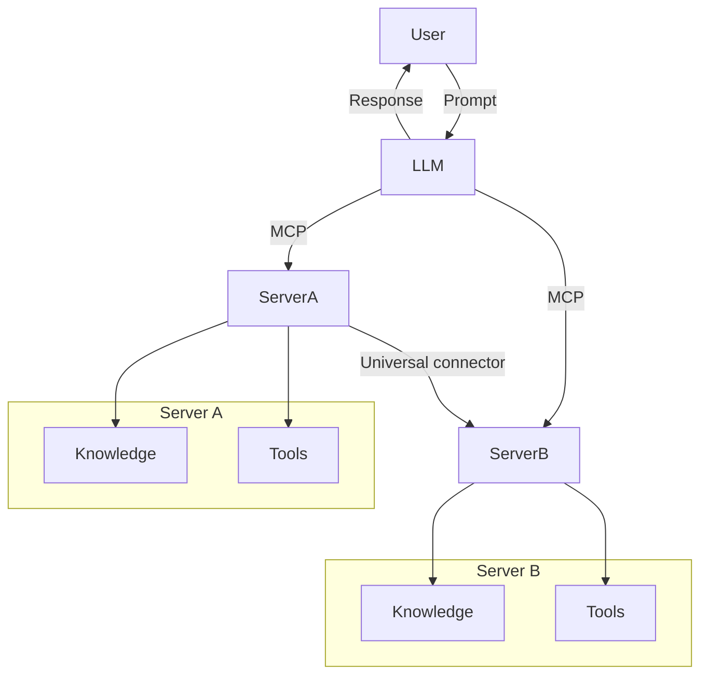
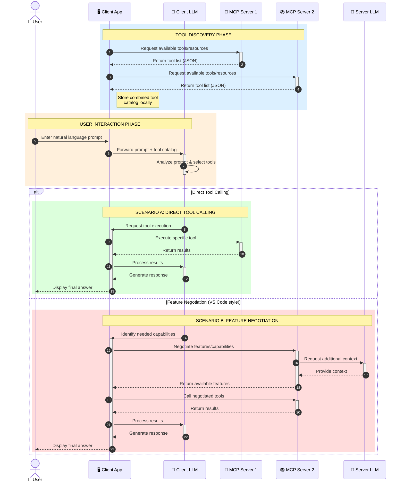

<!--
CO_OP_TRANSLATOR_METADATA:
{
  "original_hash": "25a94c681cf43612ff394d8cf78a74de",
  "translation_date": "2025-05-27T15:57:44+00:00",
  "source_file": "00-Introduction/README.md",
  "language_code": "tw"
}
-->
# Introduction to Model Context Protocol (MCP): Why It Matters for Scalable AI Applications

生成式 AI 應用是一大進步，因為它們通常允許使用者用自然語言提示與應用互動。不過，隨著投入更多時間和資源，你會希望能輕鬆整合各種功能和資源，使系統易於擴充，能支援多個模型同時運作，並處理各種模型細節。簡言之，開發生成式 AI 應用起步容易，但隨著規模和複雜度增加，就需要開始定義架構，並且很可能要依賴一套標準，確保應用開發一致性。這正是 MCP 用來組織並提供標準的地方。

---

## **🔍 什麼是 Model Context Protocol (MCP)?**

**Model Context Protocol (MCP)** 是一個**開放且標準化的介面**，讓大型語言模型（LLM）能無縫地與外部工具、API 和資料來源互動。它提供一致的架構，強化 AI 模型功能，超越訓練資料的限制，打造更聰明、可擴充且反應靈敏的 AI 系統。

---

## **🎯 為什麼 AI 需要標準化**

隨著生成式 AI 應用越來越複雜，採用標準來確保**可擴充性、可延展性**和**可維護性**變得非常重要。MCP 解決這些需求，透過：

- 統一模型與工具的整合方式
- 減少脆弱且一次性的客製化解決方案
- 允許多個模型在同一生態系統中共存

---

## **📚 學習目標**

閱讀完本文後，你將能夠：

- 定義 **Model Context Protocol (MCP)** 及其應用場景
- 理解 MCP 如何標準化模型與工具的溝通
- 辨識 MCP 架構的核心元件
- 探索 MCP 在企業和開發環境中的實際應用

---

## **💡 為什麼 Model Context Protocol (MCP) 是改變遊戲規則的技術**

### **🔗 MCP 解決 AI 互動碎片化問題**

在 MCP 出現之前，模型與工具整合需要：

- 每對工具和模型寫客製化程式碼
- 各供應商使用非標準 API
- 更新時常常造成系統中斷
- 工具越多，擴充性越差

### **✅ MCP 標準化的好處**

| **好處**                 | **說明**                                                               |
|--------------------------|------------------------------------------------------------------------|
| 互通性                   | LLM 能與不同供應商的工具無縫協作                                      |
| 一致性                   | 平台和工具間行為一致                                                   |
| 可重複使用               | 工具只需建置一次，可在多個專案和系統中使用                             |
| 加速開發                 | 利用標準化、即插即用介面，縮短開發時間                               |

---

## **🧱 MCP 高階架構概覽**

MCP 採用**客戶端-伺服器模型**，其中：

- **MCP Hosts** 執行 AI 模型
- **MCP Clients** 發起請求
- **MCP Servers** 提供上下文、工具和功能

### **主要元件：**

- **Resources** – 靜態或動態的模型資料  
- **Prompts** – 預先定義的工作流程以引導生成  
- **Tools** – 可執行的功能，如搜尋、計算  
- **Sampling** – 透過遞迴互動實現代理行為

---

## MCP 伺服器如何運作

MCP 伺服器的運作流程：

- **請求流程**：  
    1. MCP Client 向運行在 MCP Host 上的 AI 模型發送請求。  
    2. AI 模型判斷何時需要外部工具或資料。  
    3. 模型透過標準化協議與 MCP Server 通訊。

- **MCP Server 功能**：  
    - 工具註冊：維護可用工具及其功能目錄。  
    - 身份驗證：驗證工具存取權限。  
    - 請求處理：處理模型發出的工具請求。  
    - 回應格式化：將工具輸出整理成模型可理解的格式。

- **工具執行**：  
    - 伺服器將請求導向適當的外部工具。  
    - 工具執行其專門功能（搜尋、計算、資料庫查詢等）。  
    - 結果以一致格式回傳給模型。

- **回應完成**：  
    - AI 模型將工具輸出納入回應中。  
    - 最終回應傳回客戶端應用。

## 👨‍💻 如何建立 MCP 伺服器（含範例）

MCP 伺服器讓你能擴充 LLM 功能，提供資料和操作能力。

準備好試試看了嗎？以下是用不同語言建立簡易 MCP 伺服器的範例：

- **Python 範例**: https://github.com/modelcontextprotocol/python-sdk

- **TypeScript 範例**: https://github.com/modelcontextprotocol/typescript-sdk

- **Java 範例**: https://github.com/modelcontextprotocol/java-sdk

- **C#/.NET 範例**: https://github.com/modelcontextprotocol/csharp-sdk

## 🌍 MCP 的實際應用場景

MCP 擴展 AI 功能，支持多種應用：

| **應用**                   | **說明**                                                              |
|----------------------------|----------------------------------------------------------------------|
| 企業資料整合               | 將 LLM 連接到資料庫、CRM 或內部工具                                  |
| 代理式 AI 系統             | 讓自主代理能使用工具並執行決策流程                                  |
| 多模態應用                 | 在單一統一 AI 應用中結合文字、影像和音訊工具                        |
| 即時資料整合               | 將即時資料帶入 AI 互動，提升輸出準確度                              |

### 🧠 MCP = AI 互動的通用標準

Model Context Protocol (MCP) 就像 USB-C 標準化裝置間的實體連接，在 AI 世界中提供一致介面，讓模型（客戶端）能無縫整合外部工具和資料提供者（伺服器）。這消除了每個 API 或資料來源都需不同客製協議的問題。

在 MCP 之下，符合 MCP 的工具（稱為 MCP 伺服器）遵循統一標準，能列出提供的工具或操作，並在 AI 代理請求時執行。支援 MCP 的 AI 代理平台能發現伺服器上可用的工具，並透過此標準協議調用。

### 💡 促進知識存取

除了提供工具外，MCP 也促進知識存取。它讓應用能將上下文提供給大型語言模型，透過連結各種資料來源。例如，某個 MCP 伺服器可能代表公司的文件庫，讓代理隨需取得相關資訊。另一個伺服器可能負責特定動作，如發送郵件或更新紀錄。對代理來說，這些都是可用工具—有些工具回傳資料（知識上下文），有些執行動作。MCP 有效管理這兩種需求。

代理連接 MCP 伺服器時，會自動透過標準格式了解伺服器可用的功能和資料。此標準化讓工具能動態加入，例如新增 MCP 伺服器後，代理即可立刻使用其功能，無需額外調整指令。

這種流暢整合符合下方 mermaid 圖所示流程，伺服器同時提供工具和知識，確保系統間協作無縫。

### 👉 範例：可擴充代理解決方案

### 🔄 進階 MCP 場景：客戶端 LLM 整合

除了基本 MCP 架構外，還有進階場景是客戶端和伺服器端都包含 LLM，實現更複雜的互動：

## 🔐 MCP 的實際好處

使用 MCP 的實際好處包括：

- **資訊新鮮度**：模型能存取超越訓練資料的即時資訊  
- **能力擴展**：模型可利用專門工具完成未訓練任務  
- **減少幻覺**：外部資料來源提供事實依據  
- **隱私保護**：敏感資料留在安全環境，不必嵌入提示中

## 📌 重要重點

MCP 使用的關鍵重點：

- **MCP** 標準化 AI 模型與工具及資料的互動方式  
- 促進 **可延展性、一致性和互通性**  
- MCP 幫助 **縮短開發時間、提升可靠性，並擴展模型能力**  
- 客戶端-伺服器架構支援靈活且可擴充的 AI 應用

## 🧠 練習

想想你有興趣開發的 AI 應用。

- 哪些**外部工具或資料**能提升它的功能？  
- MCP 如何讓整合變得**更簡單、更可靠**？

## 其他資源

- [MCP GitHub Repository](https://github.com/modelcontextprotocol)

## 下一步

下一章：[Chapter 1: Core Concepts](/01-CoreConcepts/README.md)

**免責聲明**：  
本文件係使用 AI 翻譯服務 [Co-op Translator](https://github.com/Azure/co-op-translator) 所翻譯。雖然我們致力於翻譯的準確性，但請注意，自動翻譯可能包含錯誤或不精確之處。原始文件之母語版本應視為權威來源。對於重要資訊，建議採用專業人工翻譯。我們不對因使用本翻譯而產生的任何誤解或誤譯負責。