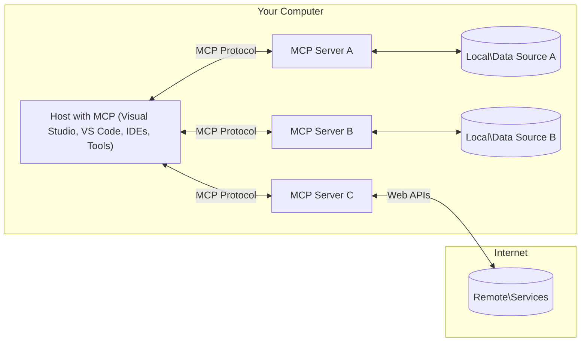

<!--
CO_OP_TRANSLATOR_METADATA:
{
  "original_hash": "11010ad254e48628bb6a457be2211640",
  "translation_date": "2025-08-12T07:32:02+00:00",
  "source_file": "01-CoreConcepts/README.md",
  "language_code": "tw"
}
-->
# 📖 MCP 核心概念：掌握 AI 整合的模型上下文協議

[](https://youtu.be/earDzWGtE84)

_（點擊上方圖片觀看本課程的影片）_

[模型上下文協議 (MCP)](https://github.com/modelcontextprotocol) 是一個強大且標準化的框架，用於優化大型語言模型（LLMs）與外部工具、應用程式和數據來源之間的溝通。本指南將帶您深入了解 MCP 的核心概念，確保您掌握其客戶端-伺服器架構、基本組件、通信機制以及最佳實踐。

## 概述

本課程將探討構成模型上下文協議 (MCP) 生態系統的基本架構和組件。您將學習 MCP 的客戶端-伺服器架構、關鍵組件以及驅動 MCP 交互的通信機制。

## 👩‍🎓 主要學習目標

完成本課程後，您將能夠：

- 理解 MCP 的客戶端-伺服器架構。
- 確認 Hosts、Clients 和 Servers 的角色與職責。
- 分析 MCP 作為靈活整合層的核心特性。
- 學習 MCP 生態系統中的信息流動方式。
- 通過 .NET、Java、Python 和 JavaScript 的程式碼範例獲得實用見解。

## 🔎 MCP 架構：深入解析

MCP 生態系統基於客戶端-伺服器模型。這種模組化結構使 AI 應用程式能夠高效地與工具、數據庫、API 和上下文資源進行交互。我們來分解這個架構的核心組件。

MCP 的核心是客戶端-伺服器架構，其中主機應用程式可以連接到多個伺服器：



- **MCP Hosts**：例如 VSCode、Claude Desktop、IDE 或希望通過 MCP 訪問數據的 AI 工具。
- **MCP Clients**：維持與伺服器 1:1 連接的協議客戶端。
- **MCP Servers**：輕量級程式，通過標準化的模型上下文協議提供特定功能。
- **本地數據來源**：MCP 伺服器可安全訪問的計算機文件、數據庫和服務。
- **遠端服務**：MCP 伺服器可通過 API 連接的互聯網外部系統。

MCP 協議是一個不斷演進的標準。您可以查看 [協議規範](https://modelcontextprotocol.io/specification/2025-06-18/) 的最新更新。

### 1. Hosts

在模型上下文協議 (MCP) 中，Hosts 是用戶與協議交互的主要介面。Hosts 是啟動與 MCP 伺服器連接以訪問數據、工具和提示的應用程式或環境。例子包括 Visual Studio Code 等集成開發環境（IDEs）、Claude Desktop 等 AI 工具，或為特定任務設計的自定義代理。

**Hosts** 是啟動與 LLMs 連接的應用程式。它們：

- 執行或與 AI 模型交互以生成回應。
- 啟動與 MCP 伺服器的連接。
- 管理對話流程和用戶介面。
- 控制權限和安全約束。
- 處理用戶對數據共享和工具執行的同意。

### 2. Clients

Clients 是促進 Hosts 與 MCP 伺服器交互的關鍵組件。Clients 作為中介，幫助 Hosts 訪問和利用 MCP 伺服器提供的功能。它們在確保 MCP 架構內的順暢通信和高效數據交換方面發揮了重要作用。

**Clients** 是主機應用程式內的連接器。它們：

- 使用提示/指令向伺服器發送請求。
- 與伺服器協商功能。
- 管理來自模型的工具執行請求。
- 處理並向用戶顯示回應。

### 3. Servers

Servers 負責處理來自 MCP 客戶端的請求並提供適當的回應。通常，伺服器作為工具，為 LLM 提供特定功能。它們管理數據檢索、工具執行和提示生成等各種操作。伺服器確保客戶端與 Hosts 之間的通信高效可靠，維持交互過程的完整性。

**Servers** 是提供上下文和功能的服務。它們：

- 註冊可用功能（資源、提示、工具）。
- 接收並執行來自客戶端的工具調用。
- 提供上下文信息以增強模型回應。
- 將輸出返回給客戶端。
- 在需要時維持交互狀態。

任何人都可以開發伺服器，以通過專業功能擴展模型能力。

### 4. Server 功能

MCP 中的伺服器提供了基本構建模塊，支持客戶端、Hosts 和語言模型之間的豐富交互。這些功能旨在通過提供結構化上下文、工具和提示來增強 MCP 的能力。

MCP 伺服器可以提供以下任何功能：

#### 📑 資源

MCP 中的資源涵蓋用戶或 AI 模型可利用的各種上下文和數據，包括：

- **上下文數據**：用戶或 AI 模型可用於決策和任務執行的信息和上下文。
- **知識庫和文檔庫**：結構化和非結構化數據的集合，例如文章、手冊和研究報告，提供有價值的見解和信息。
- **本地文件和數據庫**：存儲在設備或數據庫中的數據，可用於處理和分析。
- **API 和網絡服務**：提供額外數據和功能的外部介面和服務，支持與各種在線資源和工具的整合。

資源的例子可以是數據庫架構或文件，訪問方式如下：

```text
file://log.txt
database://schema
```

### 🤖 提示

MCP 中的提示包括各種預定義模板和交互模式，旨在簡化用戶工作流程並增強溝通。這些包括：

- **模板化消息和工作流程**：預結構化的消息和流程，引導用戶完成特定任務和交互。
- **預定義交互模式**：標準化的操作和回應序列，促進一致且高效的溝通。
- **專業對話模板**：為特定類型的對話量身定制的可自定義模板，確保相關且上下文適當的交互。

提示模板可能如下所示：

```markdown
Generate a product slogan based on the following {{product}} with the following {{keywords}}
```

#### ⛏️ 工具

MCP 中的工具是 AI 模型可執行的功能，用於完成特定任務。這些工具旨在通過提供結構化且可靠的操作來增強 AI 模型的能力。主要特點包括：

- **AI 模型可執行的功能**：工具是可執行的功能，AI 模型可以調用它們來執行各種任務。
- **唯一名稱和描述**：每個工具都有一個獨特的名稱和詳細的描述，解釋其用途和功能。
- **參數和輸出**：工具接受特定參數並返回結構化輸出，確保結果一致且可預測。
- **離散功能**：工具執行離散功能，例如網絡搜索、計算和數據庫查詢。

工具的例子可能如下所示：

```typescript
server.tool(
  "GetProducts",
  {
    pageSize: z.string().optional(),
    pageCount: z.string().optional()
  }, () => {
    // return results from API
  }
)
```

## 客戶端功能

在 MCP 中，客戶端為伺服器提供了幾個關鍵功能，增強了協議內的整體功能和交互。其中一個顯著功能是 Sampling。

### 👉 Sampling

- **伺服器啟動的代理行為**：客戶端使伺服器能夠自主啟動特定操作或行為，增強系統的動態能力。
- **遞歸 LLM 交互**：此功能支持與大型語言模型（LLMs）的遞歸交互，實現更複雜和迭代的任務處理。
- **請求額外的模型補全**：伺服器可以請求模型提供額外的補全，確保回應全面且上下文相關。

## MCP 中的信息流

MCP 定義了 Hosts、Clients、Servers 和模型之間結構化的信息流。理解這種流動有助於澄清用戶請求的處理方式以及外部工具和數據如何整合到模型回應中。

- **Host 啟動連接**  
  主機應用程式（例如 IDE 或聊天介面）通過 STDIO、WebSocket 或其他支持的傳輸方式建立與 MCP 伺服器的連接。

- **功能協商**  
  嵌入在主機中的客戶端與伺服器交換有關其支持的功能、工具、資源和協議版本的信息。這確保雙方了解會話中可用的功能。

- **用戶請求**  
  用戶與主機交互（例如輸入提示或命令）。主機收集此輸入並將其傳遞給客戶端進行處理。

- **資源或工具使用**  
  - 客戶端可能會向伺服器請求額外的上下文或資源（例如文件、數據庫條目或知識庫文章），以豐富模型的理解。
  - 如果模型確定需要工具（例如獲取數據、執行計算或調用 API），客戶端會向伺服器發送工具調用請求，指定工具名稱和參數。

- **伺服器執行**  
  伺服器接收資源或工具請求，執行必要的操作（例如運行功能、查詢數據庫或檢索文件），並以結構化格式將結果返回給客戶端。

- **回應生成**  
  客戶端將伺服器的回應（資源數據、工具輸出等）整合到正在進行的模型交互中。模型使用這些信息生成全面且上下文相關的回應。

- **結果展示**  
  主機從客戶端接收最終輸出並將其展示給用戶，通常包括模型生成的文本以及工具執行或資源查詢的結果。

這種流動使 MCP 能夠通過無縫連接模型與外部工具和數據來源，支持先進的、交互式的、上下文感知的 AI 應用程式。

## 協議詳情

MCP（模型上下文協議）基於 [JSON-RPC 2.0](https://www.jsonrpc.org/)，提供了一種標準化、與語言無關的消息格式，用於 Hosts、Clients 和 Servers 之間的通信。這一基礎支持跨多種平台和程式語言的可靠、結構化和可擴展的交互。

### 協議的關鍵特性

MCP 在 JSON-RPC 2.0 的基礎上擴展了工具調用、資源訪問和提示管理的附加約定。它支持多種傳輸層（STDIO、WebSocket、SSE），並實現了安全、可擴展且與語言無關的組件通信。

#### 🧢 基礎協議

- **JSON-RPC 消息格式**：所有請求和回應均使用 JSON-RPC 2.0 規範，確保方法調用、參數、結果和錯誤處理的結構一致。
- **有狀態連接**：MCP 會話在多個請求之間保持狀態，支持持續對話、上下文累積和資源管理。
- **功能協商**：在連接設置期間，客戶端和伺服器交換有關支持的功能、協議版本、可用工具和資源的信息。這確保雙方了解彼此的能力並能相應調整。

#### ➕ 附加工具

以下是 MCP 提供的一些附加工具和協議擴展，用於提升開發者體驗並支持高級場景：

- **配置選項**：MCP 允許動態配置會話參數，例如工具權限、資源訪問和模型設置，針對每次交互進行調整。
- **進度跟蹤**：長時間運行的操作可以報告進度更新，支持響應式用戶介面並在複雜任務期間提供更好的用戶體驗。
- **請求取消**：客戶端可以取消正在進行的請求，允許用戶中斷不再需要或耗時過長的操作。
- **錯誤報告**：標準化的錯誤消息和代碼有助於診斷問題、優雅處理故障，並為用戶和開發者提供可操作的反饋。
- **日誌記錄**：客戶端和伺服器均可發出結構化日誌，用於審計、調試和監控協議交互。

通過利用這些協議特性，MCP 確保語言模型與外部工具或數據來源之間的通信穩健、安全且靈活。

### 🔐 安全考量

MCP 的實現應遵循幾個關鍵安全原則，以確保交互的安全性和可信性：

- **用戶同意與控制**：用戶必須在任何數據被訪問或操作執行之前提供明確同意。他們應該能夠清楚地控制共享的數據和授權的操作，並通過直觀的用戶介面審查和批准活動。

- **數據隱私**：僅在獲得明確同意的情況下暴露用戶數據，並必須通過適當的訪問控制進行保護。MCP 的實現必須防止未經授權的數據傳輸，並確保在所有交互過程中維護隱私。

- **工具安全性**：在調用任何工具之前，需要獲得用戶的明確同意。用戶應該清楚了解每個工具的功能，並強制執行穩健的安全邊界，以防止意外或不安全的工具執行。

通過遵循這些原則，MCP 確保在所有協議交互中維護用戶信任、隱私和安全。

## 程式碼範例：關鍵組件

以下是幾種流行程式語言的程式碼範例，展示如何實現 MCP 伺服器的關鍵組件和工具。

### .NET 範例：創建具有工具的簡單 MCP 伺服器

以下是一個實用的 .NET 程式碼範例，展示如何實現具有自定義工具的簡單 MCP 伺服器。此範例展示了如何定義和註冊工具、處理請求以及使用模型上下文協議連接伺服器。

```csharp
using System;
using System.Threading.Tasks;
using ModelContextProtocol.Server;
using ModelContextProtocol.Server.Transport;
using ModelContextProtocol.Server.Tools;

public class WeatherServer
{
    public static async Task Main(string[] args)
    {
        // Create an MCP server
        var server = new McpServer(
            name: "Weather MCP Server",
            version: "1.0.0"
        );
        
        // Register our custom weather tool
        server.AddTool<string, WeatherData>("weatherTool", 
            description: "Gets current weather for a location",
            execute: async (location) => {
                // Call weather API (simplified)
                var weatherData = await GetWeatherDataAsync(location);
                return weatherData;
            });
        
        // Connect the server using stdio transport
        var transport = new StdioServerTransport();
        await server.ConnectAsync(transport);
        
        Console.WriteLine("Weather MCP Server started");
        
        // Keep the server running until process is terminated
        await Task.Delay(-1);
    }
    
    private static async Task<WeatherData> GetWeatherDataAsync(string location)
    {
        // This would normally call a weather API
        // Simplified for demonstration
        await Task.Delay(100); // Simulate API call
        return new WeatherData { 
            Temperature = 72.5,
            Conditions = "Sunny",
            Location = location
        };
    }
}

public class WeatherData
{
    public double Temperature { get; set; }
    public string Conditions { get; set; }
    public string Location { get; set; }
}
```

### Java 範例：MCP 伺服器組件

此範例展示了與上述 .NET 範例相同的 MCP 伺服器和工具註冊，但使用 Java 實現。

```java
import io.modelcontextprotocol.server.McpServer;
import io.modelcontextprotocol.server.McpToolDefinition;
import io.modelcontextprotocol.server.transport.StdioServerTransport;
import io.modelcontextprotocol.server.tool.ToolExecutionContext;
import io.modelcontextprotocol.server.tool.ToolResponse;

public class WeatherMcpServer {
    public static void main(String[] args) throws Exception {
        // Create an MCP server
        McpServer server = McpServer.builder()
            .name("Weather MCP Server")
            .version("1.0.0")
            .build();
            
        // Register a weather tool
        server.registerTool(McpToolDefinition.builder("weatherTool")
            .description("Gets current weather for a location")
            .parameter("location", String.class)
            .execute((ToolExecutionContext ctx) -> {
                String location = ctx.getParameter("location", String.class);
                
                // Get weather data (simplified)
                WeatherData data = getWeatherData(location);
                
                // Return formatted response
                return ToolResponse.content(
                    String.format("Temperature: %.1f°F, Conditions: %s, Location: %s", 
                    data.getTemperature(), 
                    data.getConditions(), 
                    data.getLocation())
                );
            })
            .build());
        
        // Connect the server using stdio transport
        try (StdioServerTransport transport = new StdioServerTransport()) {
            server.connect(transport);
            System.out.println("Weather MCP Server started");
            // Keep server running until process is terminated
            Thread.currentThread().join();
        }
    }
    
    private static WeatherData getWeatherData(String location) {
        // Implementation would call a weather API
        // Simplified for example purposes
        return new WeatherData(72.5, "Sunny", location);
    }
}

class WeatherData {
    private double temperature;
    private String conditions;
    private String location;
    
    public WeatherData(double temperature, String conditions, String location) {
        this.temperature = temperature;
        this.conditions = conditions;
        this.location = location;
    }
    
    public double getTemperature() {
        return temperature;
    }
    
    public String getConditions() {
        return conditions;
    }
    
    public String getLocation() {
        return location;
    }
}
```

### Python 範例：構建 MCP 伺服器

在此範例中，我們展示如何在 Python 中構建 MCP 伺服器。您還將看到兩種不同的工具創建方式。

```python
#!/usr/bin/env python3
import asyncio
from mcp.server.fastmcp import FastMCP
from mcp.server.transports.stdio import serve_stdio

# Create a FastMCP server
mcp = FastMCP(
    name="Weather MCP Server",
    version="1.0.0"
)

@mcp.tool()
def get_weather(location: str) -> dict:
    """Gets current weather for a location."""
    # This would normally call a weather API
    # Simplified for demonstration
    return {
        "temperature": 72.5,
        "conditions": "Sunny",
        "location": location
    }

# Alternative approach using a class
class WeatherTools:
    @mcp.tool()
    def forecast(self, location: str, days: int = 1) -> dict:
        """Gets weather forecast for a location for the specified number of days."""
        # This would normally call a weather API forecast endpoint
        # Simplified for demonstration
        return {
            "location": location,
            "forecast": [
                {"day": i+1, "temperature": 70 + i, "conditions": "Partly Cloudy"}
                for i in range(days)
            ]
        }

# Instantiate the class to register its tools
weather_tools = WeatherTools()

# Start the server using stdio transport
if __name__ == "__main__":
    asyncio.run(serve_stdio(mcp))
```

### JavaScript 範例：創建 MCP 伺服器
此範例展示了如何在 JavaScript 中建立 MCP 伺服器，並註冊兩個與天氣相關的工具。

```javascript
// Using the official Model Context Protocol SDK
import { McpServer } from "@modelcontextprotocol/sdk/server/mcp.js";
import { StdioServerTransport } from "@modelcontextprotocol/sdk/server/stdio.js";
import { z } from "zod"; // For parameter validation

// Create an MCP server
const server = new McpServer({
  name: "Weather MCP Server",
  version: "1.0.0"
});

// Define a weather tool
server.tool(
  "weatherTool",
  {
    location: z.string().describe("The location to get weather for")
  },
  async ({ location }) => {
    // This would normally call a weather API
    // Simplified for demonstration
    const weatherData = await getWeatherData(location);
    
    return {
      content: [
        { 
          type: "text", 
          text: `Temperature: ${weatherData.temperature}°F, Conditions: ${weatherData.conditions}, Location: ${weatherData.location}` 
        }
      ]
    };
  }
);

// Define a forecast tool
server.tool(
  "forecastTool",
  {
    location: z.string(),
    days: z.number().default(3).describe("Number of days for forecast")
  },
  async ({ location, days }) => {
    // This would normally call a weather API
    // Simplified for demonstration
    const forecast = await getForecastData(location, days);
    
    return {
      content: [
        { 
          type: "text", 
          text: `${days}-day forecast for ${location}: ${JSON.stringify(forecast)}` 
        }
      ]
    };
  }
);

// Helper functions
async function getWeatherData(location) {
  // Simulate API call
  return {
    temperature: 72.5,
    conditions: "Sunny",
    location: location
  };
}

async function getForecastData(location, days) {
  // Simulate API call
  return Array.from({ length: days }, (_, i) => ({
    day: i + 1,
    temperature: 70 + Math.floor(Math.random() * 10),
    conditions: i % 2 === 0 ? "Sunny" : "Partly Cloudy"
  }));
}

// Connect the server using stdio transport
const transport = new StdioServerTransport();
server.connect(transport).catch(console.error);

console.log("Weather MCP Server started");
```

此 JavaScript 範例展示了如何建立一個 MCP 客戶端，連接到伺服器，發送提示，並處理回應，包括任何已執行的工具調用。

## 安全性與授權

MCP 包含多種內建概念與機制，用於在整個協議中管理安全性與授權：

1. **工具權限控制**：  
   客戶端可以指定模型在會話期間允許使用哪些工具。這確保只有明確授權的工具可供使用，降低了意外或不安全操作的風險。權限可以根據使用者偏好、組織政策或互動上下文動態配置。

2. **身份驗證**：  
   伺服器可以要求身份驗證後才授予對工具、資源或敏感操作的訪問權限。這可能涉及 API 金鑰、OAuth 令牌或其他身份驗證機制。適當的身份驗證確保只有受信任的客戶端和使用者能調用伺服器端功能。

3. **驗證**：  
   所有工具調用都會執行參數驗證。每個工具定義了其參數的預期類型、格式和約束，伺服器會相應地驗證傳入的請求。這可防止格式錯誤或惡意輸入影響工具實現，並有助於維持操作的完整性。

4. **速率限制**：  
   為防止濫用並確保伺服器資源的公平使用，MCP 伺服器可以對工具調用和資源訪問實施速率限制。速率限制可以按使用者、會話或全域應用，有助於防範拒絕服務攻擊或過度資源消耗。

透過結合這些機制，MCP 為將語言模型與外部工具和數據源整合提供了安全的基礎，同時為使用者和開發者提供了細緻的訪問與使用控制。

## 協議訊息

MCP 通信使用結構化的 JSON 訊息，以促進客戶端、伺服器和模型之間清晰且可靠的互動。主要的訊息類型包括：

- **客戶端請求**  
  從客戶端發送到伺服器的訊息，通常包括：
  - 使用者的提示或指令
  - 對話歷史以提供上下文
  - 工具配置與權限
  - 任何額外的元數據或會話資訊

- **模型回應**  
  由模型（通過客戶端）返回的訊息，包含：
  - 根據提示和上下文生成的文本或完成內容
  - 如果模型判斷需要調用工具，則包含工具調用指令
  - 需要時的資源引用或額外上下文

- **工具請求**  
  當需要執行工具時，從客戶端發送到伺服器的訊息。此訊息包括：
  - 要調用的工具名稱
  - 工具所需的參數（根據工具的結構進行驗證）
  - 用於追蹤請求的上下文資訊或標識符

- **工具回應**  
  工具執行後由伺服器返回的訊息，提供：
  - 工具執行的結果（結構化數據或內容）
  - 如果工具調用失敗，則包含任何錯誤或狀態資訊
  - 可選的額外元數據或與執行相關的日誌

這些結構化訊息確保 MCP 工作流程中的每一步都明確、可追蹤且可擴展，支持多輪對話、工具鏈接以及穩健的錯誤處理等高級場景。

## 關鍵要點

- MCP 使用客戶端-伺服器架構將模型與外部功能連接
- 生態系統由客戶端、主機、伺服器、工具和數據源組成
- 通信可以通過 STDIO、SSE 或 WebSockets 進行
- 工具是模型可訪問的基本功能單元
- 結構化通信協議確保一致的互動

## 練習

設計一個在您的領域中有用的簡單 MCP 工具，定義：
1. 該工具的名稱
2. 它接受的參數
3. 它返回的輸出
4. 模型可能如何使用此工具來解決使用者問題

---

## 下一步

下一章：[第 2 章：安全性](../02-Security/README.md)

**免責聲明**：  
本文件使用 AI 翻譯服務 [Co-op Translator](https://github.com/Azure/co-op-translator) 進行翻譯。我們致力於提供準確的翻譯，但請注意，自動翻譯可能包含錯誤或不準確之處。應以原始語言的文件作為權威來源。對於關鍵資訊，建議尋求專業人工翻譯。我們對因使用此翻譯而產生的任何誤解或錯誤解讀概不負責。