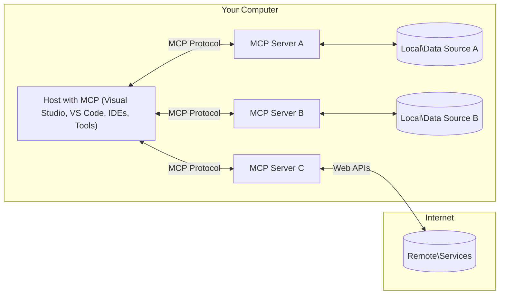

<!--
CO_OP_TRANSLATOR_METADATA:
{
  "original_hash": "904b59de1de9264801242d90a42cdd9d",
  "translation_date": "2025-09-05T10:29:20+00:00",
  "source_file": "01-CoreConcepts/README.md",
  "language_code": "tw"
}
-->
# MCP 核心概念：掌握 AI 整合的模型上下文協議

[](https://youtu.be/earDzWGtE84)

_（點擊上方圖片觀看本課程影片）_

[模型上下文協議 (MCP)](https://github.com/modelcontextprotocol) 是一個強大且標準化的框架，旨在優化大型語言模型（LLMs）與外部工具、應用程式及數據來源之間的溝通。本指南將帶您深入了解 MCP 的核心概念，包括其客戶端-伺服器架構、基本組件、通信機制及實作最佳實踐。

- **明確的用戶同意**：所有數據訪問和操作在執行前都需要獲得用戶的明確批准。用戶必須清楚了解將訪問哪些數據以及將執行哪些操作，並能對權限和授權進行細緻控制。

- **數據隱私保護**：用戶數據僅在獲得明確同意後才會暴露，並且在整個交互過程中必須受到嚴格的訪問控制保護。實作需防止未經授權的數據傳輸，並維持嚴格的隱私界限。

- **工具執行安全性**：每次工具調用都需要用戶明確同意，並清楚了解工具的功能、參數及可能的影響。需設置強大的安全邊界以防止意外、不安全或惡意的工具執行。

- **傳輸層安全性**：所有通信通道應使用適當的加密和身份驗證機制。遠端連接應實作安全的傳輸協議及妥善的憑證管理。

#### 實作指南：

- **權限管理**：實作細緻的權限系統，允許用戶控制哪些伺服器、工具和資源可被訪問
- **身份驗證與授權**：使用安全的身份驗證方法（如 OAuth、API 金鑰），並妥善管理令牌及其過期時間  
- **輸入驗證**：根據定義的架構驗證所有參數和數據輸入，以防止注入攻擊
- **審計日誌**：維護全面的操作日誌以進行安全監控和合規性檢查

## 概述

本課程將探討構成模型上下文協議（MCP）生態系統的基本架構和組件。您將學習 MCP 的客戶端-伺服器架構、關鍵組件及驅動 MCP 交互的通信機制。

## 核心學習目標

完成本課程後，您將能夠：

- 理解 MCP 的客戶端-伺服器架構。
- 識別 Hosts、Clients 和 Servers 的角色及責任。
- 分析 MCP 作為靈活整合層的核心特性。
- 學習 MCP 生態系統中的信息流動方式。
- 通過 .NET、Java、Python 和 JavaScript 的程式碼範例獲得實用見解。

## MCP 架構：深入解析

MCP 生態系統基於客戶端-伺服器模型構建。這種模組化結構使 AI 應用程式能夠高效地與工具、數據庫、API 和上下文資源交互。讓我們將此架構分解為核心組件。

MCP 的核心是客戶端-伺服器架構，其中主機應用程式可以連接到多個伺服器：



- **MCP Hosts**：如 VSCode、Claude Desktop、IDE 或希望通過 MCP 訪問數據的 AI 工具
- **MCP Clients**：維持與伺服器 1:1 連接的協議客戶端
- **MCP Servers**：輕量級程式，通過標準化的模型上下文協議暴露特定功能
- **本地數據來源**：MCP 伺服器可安全訪問的電腦文件、數據庫和服務
- **遠端服務**：MCP 伺服器可通過 API 連接的互聯網外部系統

MCP 協議是一個使用基於日期的版本控制（YYYY-MM-DD 格式）的演進標準。目前的協議版本為 **2025-06-18**。您可以查看 [協議規範的最新更新](https://modelcontextprotocol.io/specification/2025-06-18/)

### 1. Hosts

在模型上下文協議（MCP）中，**Hosts** 是作為用戶與協議交互主要介面的 AI 應用程式。Hosts 通過為每個伺服器連接創建專用的 MCP 客戶端來協調和管理與多個 MCP 伺服器的連接。Hosts 的例子包括：

- **AI 應用程式**：Claude Desktop、Visual Studio Code、Claude Code
- **開發環境**：整合 MCP 的 IDE 和程式碼編輯器  
- **自定義應用程式**：專門構建的 AI 代理和工具

**Hosts** 是協調 AI 模型交互的應用程式。它們：

- **協調 AI 模型**：執行或與 LLM 交互以生成回應並協調 AI 工作流程
- **管理客戶端連接**：為每個 MCP 伺服器連接創建並維護一個 MCP 客戶端
- **控制用戶介面**：處理對話流程、用戶交互及回應展示  
- **執行安全控制**：管理權限、安全約束及身份驗證
- **處理用戶同意**：管理用戶對數據共享和工具執行的批准

### 2. Clients

**Clients** 是維持 Hosts 與 MCP 伺服器之間專用一對一連接的關鍵組件。每個 MCP 客戶端由 Host 實例化以連接到特定的 MCP 伺服器，確保通信通道的有序性和安全性。多個客戶端使 Hosts 能夠同時連接到多個伺服器。

**Clients** 是主機應用程式中的連接器組件。它們：

- **協議通信**：使用 JSON-RPC 2.0 向伺服器發送請求，包含提示和指令
- **功能協商**：在初始化期間與伺服器協商支持的功能和協議版本
- **工具執行**：管理來自模型的工具執行請求並處理回應
- **即時更新**：處理來自伺服器的通知和即時更新
- **回應處理**：處理並格式化伺服器回應以展示給用戶

### 3. Servers

**Servers** 是為 MCP 客戶端提供上下文、工具和功能的程式。它們可以在本地執行（與 Host 位於同一台機器上）或遠端執行（在外部平台上），負責處理客戶端請求並提供結構化回應。伺服器通過標準化的模型上下文協議暴露特定功能。

**Servers** 是提供上下文和功能的服務。它們：

- **功能註冊**：註冊並向客戶端暴露可用的基本功能（資源、提示、工具）
- **請求處理**：接收並執行來自客戶端的工具調用、資源請求及提示請求
- **上下文提供**：提供上下文信息和數據以增強模型回應
- **狀態管理**：維護會話狀態並在需要時處理有狀態的交互
- **即時通知**：向連接的客戶端發送功能變更和更新通知

伺服器可以由任何人開發，以通過專門功能擴展模型能力，並支持本地和遠端部署場景。

### 4. Server Primitives

模型上下文協議（MCP）中的伺服器提供三個核心 **基本功能（primitives）**，這些功能定義了客戶端、Hosts 和語言模型之間豐富交互的基本構建塊。這些基本功能指定了協議中可用的上下文信息和操作類型。

MCP 伺服器可以暴露以下三種核心基本功能的任意組合：

#### 資源（Resources）

**資源** 是為 AI 應用程式提供上下文信息的數據來源。它們代表靜態或動態內容，可增強模型的理解和決策能力：

- **上下文數據**：為 AI 模型消費的結構化信息和上下文
- **知識庫**：文檔庫、文章、手冊和研究論文
- **本地數據來源**：文件、數據庫和本地系統信息  
- **外部數據**：API 回應、網絡服務和遠端系統數據
- **動態內容**：根據外部條件更新的即時數據

資源通過 URI 標識，並支持通過 `resources/list` 發現和通過 `resources/read` 檢索：

```text
file://documents/project-spec.md
database://production/users/schema
api://weather/current
```

#### 提示（Prompts）

**提示** 是幫助結構化與語言模型交互的可重用模板。它們提供標準化的交互模式和模板化工作流程：

- **基於模板的交互**：預先結構化的消息和對話開端
- **工作流程模板**：常見任務和交互的標準化序列
- **少樣本示例**：基於示例的模型指導模板
- **系統提示**：定義模型行為和上下文的基礎提示
- **動態模板**：根據特定上下文調整的參數化提示

提示支持變量替換，並可通過 `prompts/list` 發現，通過 `prompts/get` 檢索：

```markdown
Generate a {{task_type}} for {{product}} targeting {{audience}} with the following requirements: {{requirements}}
```

#### 工具（Tools）

**工具** 是 AI 模型可調用以執行特定操作的可執行功能。它們代表 MCP 生態系統中的「動詞」，使模型能夠與外部系統交互：

- **可執行功能**：模型可調用的具體操作，帶有特定參數
- **外部系統整合**：API 調用、數據庫查詢、文件操作、計算
- **唯一標識**：每個工具都有獨特的名稱、描述和參數架構
- **結構化輸入/輸出**：工具接受經驗證的參數並返回結構化、類型化的回應
- **操作能力**：使模型能夠執行實際操作並檢索即時數據

工具通過 JSON 架構定義參數驗證，並可通過 `tools/list` 發現，通過 `tools/call` 執行：

```typescript
server.tool(
  "search_products", 
  {
    query: z.string().describe("Search query for products"),
    category: z.string().optional().describe("Product category filter"),
    max_results: z.number().default(10).describe("Maximum results to return")
  }, 
  async (params) => {
    // Execute search and return structured results
    return await productService.search(params);
  }
);
```

## 客戶端基本功能

在模型上下文協議（MCP）中，**客戶端** 可以暴露基本功能，使伺服器能夠向主機應用程式請求額外的功能。這些客戶端基本功能允許伺服器實現更豐富、更具交互性的功能，並能訪問 AI 模型能力和用戶交互。

### 取樣（Sampling）

**取樣** 允許伺服器向客戶端的 AI 應用程式請求語言模型補全。這一基本功能使伺服器能夠訪問 LLM 功能，而無需嵌入自己的模型依賴：

- **模型無關訪問**：伺服器可請求補全，而無需包含 LLM SDK 或管理模型訪問
- **伺服器主動生成**：使伺服器能夠自主使用客戶端的 AI 模型生成內容
- **遞歸 LLM 交互**：支持伺服器需要 AI 協助進行處理的複雜場景
- **動態內容生成**：允許伺服器使用主機的模型創建上下文回應

取樣通過 `sampling/complete` 方法啟動，伺服器向客戶端發送補全請求。

### 引導（Elicitation）

**引導** 使伺服器能夠通過客戶端介面向用戶請求額外信息或確認：

- **用戶輸入請求**：伺服器可在工具執行需要時請求額外信息
- **確認對話框**：請求用戶批准敏感或影響重大的操作
- **交互式工作流程**：使伺服器能夠創建逐步的用戶交互
- **動態參數收集**：在工具執行期間收集缺失或可選參數

引導請求通過 `elicitation/request` 方法發送，以通過客戶端介面收集用戶輸入。

### 日誌記錄（Logging）

**日誌記錄** 允許伺服器向客戶端發送結構化日誌消息，用於調試、監控和操作可見性：

- **調試支持**：使伺服器能夠提供詳細的執行日誌以進行故障排除
- **操作監控**：向客戶端發送狀態更新和性能指標
- **錯誤報告**：提供詳細的錯誤上下文和診斷信息
- **審計追蹤**：創建伺服器操作和決策的全面日誌

日誌消息發送到客戶端，以提供伺服器操作的透明性並促進調試。

## MCP 中的信息流

模型上下文協議（MCP）定義了 Hosts、Clients、Servers 和模型之間結構化的信息流。理解這一流程有助於澄清用戶請求如何被處理，以及外部工具和數據如何整合到模型回應中。

- **主機啟動連接**  
  主機應用程式（如 IDE 或聊天介面）與 MCP 伺服器建立連接，通常通過 STDIO、WebSocket 或其他支持的傳輸方式。

- **功能協商**  
  嵌入在主機中的客戶端與伺服器交換有關支持功能、工具、資源和協議版本的信息。這確保雙方了解會話中可用的功能。

- **用戶請求**  
  用戶與主機交互（例如輸入提示或命令）。主機收集此輸入並將其傳遞給客戶端進行處理。

- **資源或工具使用**  
  - 客戶端可能會向伺服器請求額外的上下文或資源（如文件、數據庫條目或知識庫文章），以豐富模型的理解。
  - 如果模型確定需要工具（例如獲取數據、執行計算或調用 API），客戶端會向伺服器發送工具調用請求，指定工具名稱和參數。

- **伺服器執行**  
  伺服器接收資源或工具請求，執行必要的操作（如運行功能、查詢數據庫或檢索文件），並以結構化格式將結果返回給客戶端。

- **回應生成**  
  客戶端將伺服器的回應（資源數據、工具輸出等）整合到正在進行的模型交互中。模型使用這些信息生成全面且上下文相關的回應。

- **結果展示**  
  主機從客戶端接收最終輸出並展示給用戶，通常包括模型生成的文本以及工具執行或資源查找的結果。

這一流程使 MCP 能夠通過無縫連接模型與外部工具和數據來源，支持先進、交互式和上下文感知的 AI 應用程式。

## 協議架構與層級

MCP 包含兩個協同工作的獨立架構層，提供完整的通信框架：

### 數據層

**數據層** 使用 **JSON-RPC 2.0** 作為基礎實作核心 MCP 協議。該層定義了消息結構、語義和交互模式：

#### 核心組件：
- **JSON-RPC 2.0 協議**：所有通信均使用標準化的 JSON-RPC 2.0 消息格式進行方法調用、響應和通知  
- **生命周期管理**：負責客戶端與服務器之間的連接初始化、能力協商以及會話終止  
- **服務器基元**：使服務器能夠通過工具、資源和提示提供核心功能  
- **客戶端基元**：使服務器能夠請求 LLM 的抽樣、引導用戶輸入以及發送日誌消息  
- **即時通知**：支持異步通知，無需輪詢即可進行動態更新  

#### 核心功能：

- **協議版本協商**：使用基於日期的版本控制（YYYY-MM-DD）以確保兼容性  
- **能力發現**：客戶端和服務器在初始化期間交換支持的功能信息  
- **有狀態會話**：在多次交互中保持連接狀態以確保上下文連續性  

### 傳輸層

**傳輸層**負責 MCP 參與者之間的通信通道、消息框架和身份驗證：

#### 支持的傳輸機制：

1. **STDIO 傳輸**：
   - 使用標準輸入/輸出流進行直接進程通信  
   - 適合同一台機器上的本地進程，無網絡開銷  
   - 常用於本地 MCP 服務器的實現  

2. **可流式 HTTP 傳輸**：
   - 使用 HTTP POST 發送客戶端到服務器的消息  
   - 可選的 Server-Sent Events (SSE) 用於服務器到客戶端的流式通信  
   - 支持跨網絡的遠程服務器通信  
   - 支持標準 HTTP 身份驗證（Bearer Tokens、API Keys、自定義標頭）  
   - MCP 建議使用 OAuth 進行安全的基於令牌的身份驗證  

#### 傳輸抽象：

傳輸層將通信細節從數據層抽象出來，使所有傳輸機制均使用相同的 JSON-RPC 2.0 消息格式。此抽象允許應用程序在本地和遠程服務器之間無縫切換。

### 安全考量

MCP 的實現必須遵守多項關鍵安全原則，以確保所有協議操作的安全性、可信性和可靠性：

- **用戶同意與控制**：在訪問任何數據或執行操作之前，必須獲得用戶的明確同意。用戶應能清楚地控制共享的數據以及授權的操作，並通過直觀的用戶界面審查和批准活動。

- **數據隱私**：僅在獲得明確同意的情況下暴露用戶數據，並必須通過適當的訪問控制進行保護。MCP 的實現必須防止未授權的數據傳輸，並確保在所有交互中保持隱私。

- **工具安全性**：在調用任何工具之前，必須獲得用戶的明確同意。用戶應清楚了解每個工具的功能，並強制執行穩健的安全邊界以防止意外或不安全的工具執行。

通過遵循這些安全原則，MCP 確保在所有協議交互中維持用戶信任、隱私和安全，同時實現強大的 AI 集成。

## 代碼示例：核心組件

以下是幾種流行編程語言的代碼示例，展示如何實現 MCP 服務器的核心組件和工具。

### .NET 示例：使用工具創建簡單的 MCP 服務器

以下是一個實用的 .NET 代碼示例，展示如何實現具有自定義工具的簡單 MCP 服務器。此示例展示了如何定義和註冊工具、處理請求以及使用模型上下文協議連接服務器。

```csharp
using System;
using System.Threading.Tasks;
using ModelContextProtocol.Server;
using ModelContextProtocol.Server.Transport;
using ModelContextProtocol.Server.Tools;

public class WeatherServer
{
    public static async Task Main(string[] args)
    {
        // Create an MCP server
        var server = new McpServer(
            name: "Weather MCP Server",
            version: "1.0.0"
        );
        
        // Register our custom weather tool
        server.AddTool<string, WeatherData>("weatherTool", 
            description: "Gets current weather for a location",
            execute: async (location) => {
                // Call weather API (simplified)
                var weatherData = await GetWeatherDataAsync(location);
                return weatherData;
            });
        
        // Connect the server using stdio transport
        var transport = new StdioServerTransport();
        await server.ConnectAsync(transport);
        
        Console.WriteLine("Weather MCP Server started");
        
        // Keep the server running until process is terminated
        await Task.Delay(-1);
    }
    
    private static async Task<WeatherData> GetWeatherDataAsync(string location)
    {
        // This would normally call a weather API
        // Simplified for demonstration
        await Task.Delay(100); // Simulate API call
        return new WeatherData { 
            Temperature = 72.5,
            Conditions = "Sunny",
            Location = location
        };
    }
}

public class WeatherData
{
    public double Temperature { get; set; }
    public string Conditions { get; set; }
    public string Location { get; set; }
}
```

### Java 示例：MCP 服務器組件

此示例展示了與上述 .NET 示例相同的 MCP 服務器和工具註冊，但使用 Java 實現。

```java
import io.modelcontextprotocol.server.McpServer;
import io.modelcontextprotocol.server.McpToolDefinition;
import io.modelcontextprotocol.server.transport.StdioServerTransport;
import io.modelcontextprotocol.server.tool.ToolExecutionContext;
import io.modelcontextprotocol.server.tool.ToolResponse;

public class WeatherMcpServer {
    public static void main(String[] args) throws Exception {
        // Create an MCP server
        McpServer server = McpServer.builder()
            .name("Weather MCP Server")
            .version("1.0.0")
            .build();
            
        // Register a weather tool
        server.registerTool(McpToolDefinition.builder("weatherTool")
            .description("Gets current weather for a location")
            .parameter("location", String.class)
            .execute((ToolExecutionContext ctx) -> {
                String location = ctx.getParameter("location", String.class);
                
                // Get weather data (simplified)
                WeatherData data = getWeatherData(location);
                
                // Return formatted response
                return ToolResponse.content(
                    String.format("Temperature: %.1f°F, Conditions: %s, Location: %s", 
                    data.getTemperature(), 
                    data.getConditions(), 
                    data.getLocation())
                );
            })
            .build());
        
        // Connect the server using stdio transport
        try (StdioServerTransport transport = new StdioServerTransport()) {
            server.connect(transport);
            System.out.println("Weather MCP Server started");
            // Keep server running until process is terminated
            Thread.currentThread().join();
        }
    }
    
    private static WeatherData getWeatherData(String location) {
        // Implementation would call a weather API
        // Simplified for example purposes
        return new WeatherData(72.5, "Sunny", location);
    }
}

class WeatherData {
    private double temperature;
    private String conditions;
    private String location;
    
    public WeatherData(double temperature, String conditions, String location) {
        this.temperature = temperature;
        this.conditions = conditions;
        this.location = location;
    }
    
    public double getTemperature() {
        return temperature;
    }
    
    public String getConditions() {
        return conditions;
    }
    
    public String getLocation() {
        return location;
    }
}
```

### Python 示例：構建 MCP 服務器

此示例使用 fastmcp，請確保先安裝它：

```python
pip install fastmcp
```  
代碼示例：

```python
#!/usr/bin/env python3
import asyncio
from fastmcp import FastMCP
from fastmcp.transports.stdio import serve_stdio

# Create a FastMCP server
mcp = FastMCP(
    name="Weather MCP Server",
    version="1.0.0"
)

@mcp.tool()
def get_weather(location: str) -> dict:
    """Gets current weather for a location."""
    return {
        "temperature": 72.5,
        "conditions": "Sunny",
        "location": location
    }

# Alternative approach using a class
class WeatherTools:
    @mcp.tool()
    def forecast(self, location: str, days: int = 1) -> dict:
        """Gets weather forecast for a location for the specified number of days."""
        return {
            "location": location,
            "forecast": [
                {"day": i+1, "temperature": 70 + i, "conditions": "Partly Cloudy"}
                for i in range(days)
            ]
        }

# Register class tools
weather_tools = WeatherTools()

# Start the server
if __name__ == "__main__":
    asyncio.run(serve_stdio(mcp))
```

### JavaScript 示例：創建 MCP 服務器

此示例展示了如何在 JavaScript 中創建 MCP 服務器並註冊兩個與天氣相關的工具。

```javascript
// Using the official Model Context Protocol SDK
import { McpServer } from "@modelcontextprotocol/sdk/server/mcp.js";
import { StdioServerTransport } from "@modelcontextprotocol/sdk/server/stdio.js";
import { z } from "zod"; // For parameter validation

// Create an MCP server
const server = new McpServer({
  name: "Weather MCP Server",
  version: "1.0.0"
});

// Define a weather tool
server.tool(
  "weatherTool",
  {
    location: z.string().describe("The location to get weather for")
  },
  async ({ location }) => {
    // This would normally call a weather API
    // Simplified for demonstration
    const weatherData = await getWeatherData(location);
    
    return {
      content: [
        { 
          type: "text", 
          text: `Temperature: ${weatherData.temperature}°F, Conditions: ${weatherData.conditions}, Location: ${weatherData.location}` 
        }
      ]
    };
  }
);

// Define a forecast tool
server.tool(
  "forecastTool",
  {
    location: z.string(),
    days: z.number().default(3).describe("Number of days for forecast")
  },
  async ({ location, days }) => {
    // This would normally call a weather API
    // Simplified for demonstration
    const forecast = await getForecastData(location, days);
    
    return {
      content: [
        { 
          type: "text", 
          text: `${days}-day forecast for ${location}: ${JSON.stringify(forecast)}` 
        }
      ]
    };
  }
);

// Helper functions
async function getWeatherData(location) {
  // Simulate API call
  return {
    temperature: 72.5,
    conditions: "Sunny",
    location: location
  };
}

async function getForecastData(location, days) {
  // Simulate API call
  return Array.from({ length: days }, (_, i) => ({
    day: i + 1,
    temperature: 70 + Math.floor(Math.random() * 10),
    conditions: i % 2 === 0 ? "Sunny" : "Partly Cloudy"
  }));
}

// Connect the server using stdio transport
const transport = new StdioServerTransport();
server.connect(transport).catch(console.error);

console.log("Weather MCP Server started");
```

此 JavaScript 示例展示了如何創建 MCP 客戶端，連接到服務器，發送提示並處理響應，包括任何工具調用。

## 安全性與授權

MCP 包含多種內置概念和機制，用於在協議中管理安全性和授權：

1. **工具許可控制**：  
   客戶端可以指定模型在會話期間允許使用哪些工具。這確保只有明確授權的工具可用，降低意外或不安全操作的風險。許可可以根據用戶偏好、組織政策或交互上下文動態配置。

2. **身份驗證**：  
   服務器可以要求身份驗證後才授予工具、資源或敏感操作的訪問權限。這可能涉及 API Keys、OAuth Tokens 或其他身份驗證方案。適當的身份驗證確保只有受信任的客戶端和用戶可以調用服務器端功能。

3. **驗證**：  
   所有工具調用都強制執行參數驗證。每個工具定義其參數的預期類型、格式和約束，服務器根據要求驗證傳入的請求。這防止了格式錯誤或惡意輸入到達工具實現，並有助於維護操作的完整性。

4. **速率限制**：  
   為防止濫用並確保公平使用服務器資源，MCP 服務器可以對工具調用和資源訪問實施速率限制。速率限制可以按用戶、按會話或全局應用，有助於防止拒絕服務攻擊或過度資源消耗。

通過結合這些機制，MCP 提供了一個安全的基礎，用於將語言模型與外部工具和數據源集成，同時為用戶和開發者提供細粒度的訪問和使用控制。

## 協議消息與通信流程

MCP 通信使用結構化的 **JSON-RPC 2.0** 消息，以促進主機、客戶端和服務器之間清晰可靠的交互。協議為不同類型的操作定義了特定的消息模式：

### 核心消息類型：

#### **初始化消息**
- **`initialize` 請求**：建立連接並協商協議版本和能力  
- **`initialize` 響應**：確認支持的功能和服務器信息  
- **`notifications/initialized`**：表示初始化完成，會話已準備就緒  

#### **發現消息**
- **`tools/list` 請求**：從服務器發現可用工具  
- **`resources/list` 請求**：列出可用資源（數據源）  
- **`prompts/list` 請求**：檢索可用的提示模板  

#### **執行消息**  
- **`tools/call` 請求**：使用提供的參數執行特定工具  
- **`resources/read` 請求**：從特定資源中檢索內容  
- **`prompts/get` 請求**：使用可選參數獲取提示模板  

#### **客戶端消息**
- **`sampling/complete` 請求**：服務器請求客戶端完成 LLM  
- **`elicitation/request`**：服務器通過客戶端界面請求用戶輸入  
- **日誌消息**：服務器向客戶端發送結構化日誌消息  

#### **通知消息**
- **`notifications/tools/list_changed`**：服務器通知客戶端工具更改  
- **`notifications/resources/list_changed`**：服務器通知客戶端資源更改  
- **`notifications/prompts/list_changed`**：服務器通知客戶端提示更改  

### 消息結構：

所有 MCP 消息均遵循 JSON-RPC 2.0 格式，包括：
- **請求消息**：包含 `id`、`method` 和可選的 `params`  
- **響應消息**：包含 `id` 和 `result` 或 `error`  
- **通知消息**：包含 `method` 和可選的 `params`（無 `id` 或響應）  

此結構化通信確保可靠、可追溯且可擴展的交互，支持高級場景，如即時更新、工具鏈接和穩健的錯誤處理。

## 核心要點

- **架構**：MCP 使用客戶端-服務器架構，主機管理多個客戶端與服務器的連接  
- **參與者**：生態系統包括主機（AI 應用）、客戶端（協議連接器）和服務器（能力提供者）  
- **傳輸機制**：通信支持 STDIO（本地）和可流式 HTTP（遠程，帶可選 SSE）  
- **核心基元**：服務器暴露工具（可執行功能）、資源（數據源）和提示（模板）  
- **客戶端基元**：服務器可以請求抽樣（LLM 完成）、引導（用戶輸入）和日誌記錄  
- **協議基礎**：基於 JSON-RPC 2.0，使用基於日期的版本控制（當前版本：2025-06-18）  
- **即時功能**：支持通知以進行動態更新和即時同步  
- **安全至上**：明確的用戶同意、數據隱私保護和安全傳輸是核心要求  

## 練習

設計一個在您的領域中有用的簡單 MCP 工具。定義：
1. 工具的名稱  
2. 接受的參數  
3. 返回的輸出  
4. 模型如何使用此工具解決用戶問題  

---

## 下一步

下一章：[第 2 章：安全性](../02-Security/README.md)  

---

**免責聲明**：  
本文件使用 AI 翻譯服務 [Co-op Translator](https://github.com/Azure/co-op-translator) 進行翻譯。我們致力於提供準確的翻譯，但請注意，自動翻譯可能包含錯誤或不準確之處。應以原始語言的文件作為權威來源。對於關鍵資訊，建議尋求專業人工翻譯。我們對因使用此翻譯而產生的任何誤解或錯誤解讀概不負責。