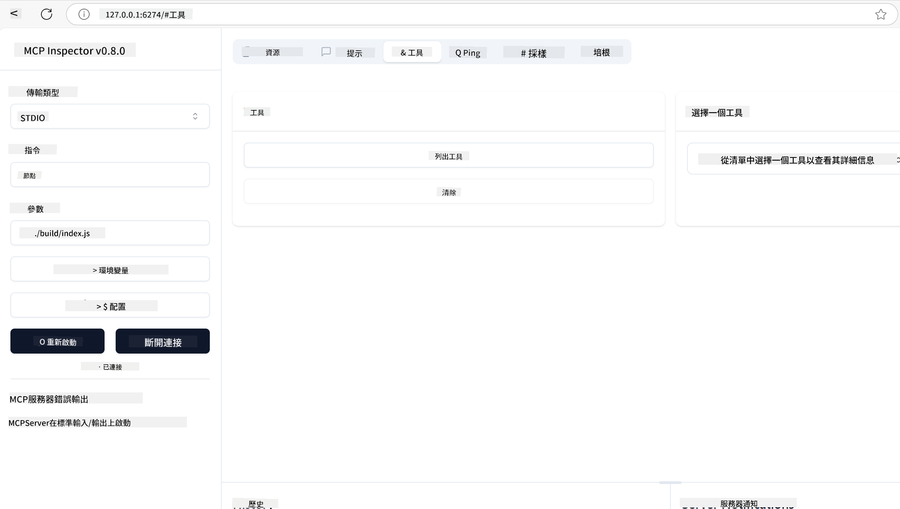
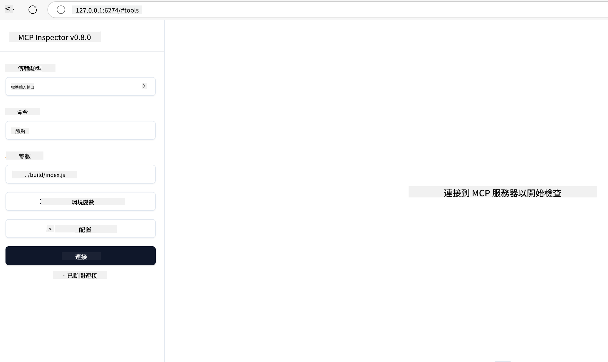
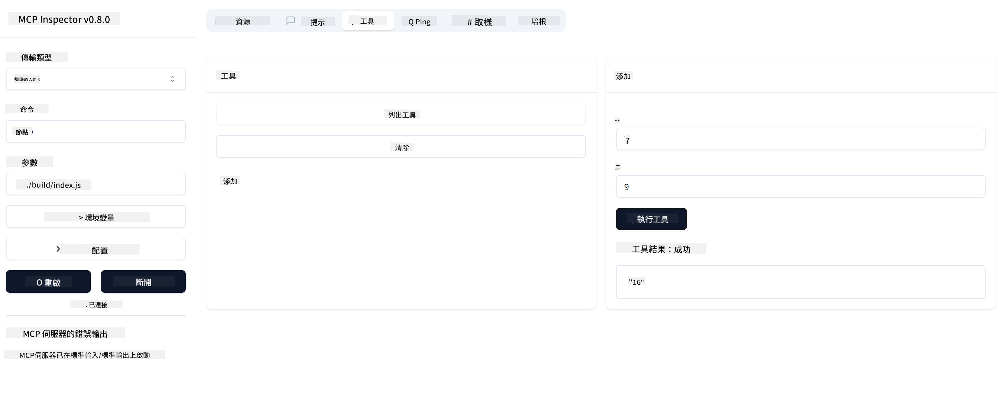

<!--
CO_OP_TRANSLATOR_METADATA:
{
  "original_hash": "5331ffd328a54b90f76706c52b673e27",
  "translation_date": "2025-05-17T08:25:09+00:00",
  "source_file": "03-GettingStarted/01-first-server/README.md",
  "language_code": "tw"
}
-->
# 開始使用 MCP

歡迎踏出使用 Model Context Protocol (MCP) 的第一步！無論您是 MCP 的新手，還是想要深入了解它的運作，本指南將帶您了解基本的設定和開發過程。您將發現 MCP 如何促進 AI 模型與應用程式之間的無縫整合，並學習如何快速準備環境以建立和測試由 MCP 驅動的解決方案。

> 簡而言之：如果您構建 AI 應用程式，您知道可以為大型語言模型（LLM）添加工具和其他資源，以使其更加博學。然而，如果您將這些工具和資源放在伺服器上，任何客戶端無論是否具有 LLM 都可以使用應用程式和伺服器的功能。

## 概述

本課程提供有關設置 MCP 環境和建立您的第一個 MCP 應用程式的實用指南。您將學習如何設置必要的工具和框架，建立基本的 MCP 伺服器，創建主機應用程式，並測試您的實作。

Model Context Protocol (MCP) 是一個開放協議，標準化了應用程式如何為 LLM 提供上下文。將 MCP 想像成 AI 應用程式的 USB-C 接口——它提供了一種標準化的方法來連接 AI 模型到不同的數據來源和工具。

## 學習目標

在本課程結束時，您將能夠：

- 為 MCP 設置 C#、Java、Python、TypeScript 和 JavaScript 的開發環境
- 建立並部署具有自訂功能（資源、提示和工具）的基本 MCP 伺服器
- 創建連接到 MCP 伺服器的主機應用程式
- 測試和除錯 MCP 實作

## 設置您的 MCP 環境

在開始使用 MCP 之前，準備好您的開發環境並了解基本工作流程是很重要的。本節將引導您完成初始設置步驟，以確保順利開始使用 MCP。

### 先決條件

在深入 MCP 開發之前，請確保您已具備：

- **開發環境**：適用於您選擇的語言（C#、Java、Python、TypeScript 或 JavaScript）
- **IDE/編輯器**：Visual Studio、Visual Studio Code、IntelliJ、Eclipse、PyCharm 或任何現代代碼編輯器
- **套件管理器**：NuGet、Maven/Gradle、pip 或 npm/yarn
- **API 金鑰**：適用於您計劃在主機應用程式中使用的任何 AI 服務

## 基本 MCP 伺服器結構

一個 MCP 伺服器通常包括：

- **伺服器配置**：設置端口、驗證和其他設置
- **資源**：提供給 LLM 的數據和上下文
- **工具**：模型可以調用的功能
- **提示**：用於生成或結構化文本的模板

以下是一個用 TypeScript 編寫的簡化範例：

```typescript
import { Server, Tool, Resource } from "@modelcontextprotocol/typescript-server-sdk";

// Create a new MCP server
const server = new Server({
  port: 3000,
  name: "Example MCP Server",
  version: "1.0.0"
});

// Register a tool
server.registerTool({
  name: "calculator",
  description: "Performs basic calculations",
  parameters: {
    expression: {
      type: "string",
      description: "The math expression to evaluate"
    }
  },
  handler: async (params) => {
    const result = eval(params.expression);
    return { result };
  }
});

// Start the server
server.start();
```

在上述代碼中，我們：

- 從 MCP TypeScript SDK 匯入必要的類。
- 創建並配置一個新的 MCP 伺服器實例。
- 使用處理函數註冊自訂工具（`calculator`）。
- 啟動伺服器以接收傳入的 MCP 請求。

## 測試和除錯

在開始測試您的 MCP 伺服器之前，了解可用的工具和最佳的除錯實踐是很重要的。有效的測試確保您的伺服器按預期運行，並幫助您快速識別和解決問題。以下部分概述了驗證您的 MCP 實作的推薦方法。

MCP 提供工具來幫助您測試和除錯您的伺服器：

- **檢查工具**，這個圖形界面允許您連接到您的伺服器並測試您的工具、提示和資源。
- **curl**，您也可以使用命令行工具如 curl 或其他能夠創建和運行 HTTP 命令的客戶端連接到您的伺服器。

### 使用 MCP 檢查工具

[MCP 檢查工具](https://github.com/modelcontextprotocol/inspector) 是一個視覺化測試工具，幫助您：

1. **發現伺服器功能**：自動檢測可用的資源、工具和提示
2. **測試工具執行**：嘗試不同的參數並即時查看回應
3. **查看伺服器元數據**：檢查伺服器信息、架構和配置

```bash
# ex TypeScript, installing and running MCP Inspector
npx @modelcontextprotocol/inspector node build/index.js
```

當您運行上述命令時，MCP 檢查工具將在您的瀏覽器中啟動一個本地網頁界面。您可以預期看到一個儀表板，顯示您註冊的 MCP 伺服器、其可用的工具、資源和提示。該界面允許您互動式地測試工具執行、檢查伺服器元數據並查看即時回應，使您更容易驗證和除錯您的 MCP 伺服器實作。

這是它可能的樣子：



## 常見設置問題和解決方案

| 問題 | 可能的解決方案 |
|-------|-------------------|
| 連接被拒絕 | 檢查伺服器是否運行以及端口是否正確 |
| 工具執行錯誤 | 檢查參數驗證和錯誤處理 |
| 驗證失敗 | 驗證 API 金鑰和權限 |
| 架構驗證錯誤 | 確保參數符合定義的架構 |
| 伺服器未啟動 | 檢查端口衝突或缺少的依賴 |
| CORS 錯誤 | 為跨來源請求配置正確的 CORS 標頭 |
| 驗證問題 | 驗證令牌的有效性和權限 |

## 本地開發

對於本地開發和測試，您可以直接在您的機器上運行 MCP 伺服器：

1. **啟動伺服器進程**：運行您的 MCP 伺服器應用程式
2. **配置網絡**：確保伺服器可以在預期的端口上訪問
3. **連接客戶端**：使用本地連接 URL，如 `http://localhost:3000`

```bash
# Example: Running a TypeScript MCP server locally
npm run start
# Server running at http://localhost:3000
```

## 建立您的第一個 MCP 伺服器

我們在之前的課程中已經涵蓋了[核心概念](/01-CoreConcepts/README.md)，現在是時候將這些知識付諸實踐。

### 伺服器可以做什麼

在我們開始編寫代碼之前，讓我們提醒自己伺服器可以做什麼：

一個 MCP 伺服器可以，例如：

- 訪問本地文件和數據庫
- 連接到遠程 API
- 執行計算
- 與其他工具和服務集成
- 提供用戶界面以進行交互

很好，現在我們知道可以為它做什麼，讓我們開始編碼。

## 練習：創建一個伺服器

要創建一個伺服器，您需要遵循以下步驟：

- 安裝 MCP SDK。
- 創建一個項目並設置項目結構。
- 編寫伺服器代碼。
- 測試伺服器。

### -1- 安裝 SDK

這會根據您選擇的運行時稍有不同，因此請選擇以下其中一個運行時：

生成式 AI 可以生成文本、圖像，甚至代碼。
您已經訓練到 2023 年 10 月的數據。

### -2- 創建項目

現在您已經安裝了 SDK，讓我們接下來創建一個項目：

### -3- 創建項目文件

### -4- 創建伺服器代碼

### -5- 添加工具和資源

通過添加以下代碼來添加工具和資源：

### -6 最終代碼

讓我們添加我們需要的最後代碼，以便伺服器可以啟動：

### -7- 測試伺服器

使用以下命令啟動伺服器：

### -8- 使用檢查工具運行

檢查工具是一個很棒的工具，它可以啟動您的伺服器並讓您與它交互，以便您可以測試它是否正常工作。讓我們啟動它：

> [!NOTE]
> 它在 "command" 欄位中可能看起來不同，因為它包含了運行伺服器的特定運行時命令

您應該會看到以下用戶界面：



1. 通過選擇 "Connect" 按鈕連接到伺服器
   一旦您連接到伺服器，您現在應該會看到以下內容：

   

1. 選擇 "Tools" 和 "listTools"，您應該會看到 "Add" 出現，選擇 "Add" 並填寫參數值。

   您應該會看到以下回應，即來自 "add" 工具的結果：

   

恭喜，您已成功創建並運行您的第一個伺服器！

### 官方 SDK

MCP 提供多種語言的官方 SDK：
- [C# SDK](https://github.com/modelcontextprotocol/csharp-sdk) - 與 Microsoft 合作維護
- [Java SDK](https://github.com/modelcontextprotocol/java-sdk) - 與 Spring AI 合作維護
- [TypeScript SDK](https://github.com/modelcontextprotocol/typescript-sdk) - 官方 TypeScript 實現
- [Python SDK](https://github.com/modelcontextprotocol/python-sdk) - 官方 Python 實現
- [Kotlin SDK](https://github.com/modelcontextprotocol/kotlin-sdk) - 官方 Kotlin 實現
- [Swift SDK](https://github.com/modelcontextprotocol/swift-sdk) - 與 Loopwork AI 合作維護
- [Rust SDK](https://github.com/modelcontextprotocol/rust-sdk) - 官方 Rust 實現

## 關鍵要點

- 使用語言特定的 SDK 設置 MCP 開發環境非常簡單
- 構建 MCP 伺服器涉及創建和註冊具有清晰架構的工具
- 測試和除錯對於可靠的 MCP 實作至關重要

## 範例

- [Java 計算器](../samples/java/calculator/README.md)
- [.Net 計算器](../../../../03-GettingStarted/samples/csharp)
- [JavaScript 計算器](../samples/javascript/README.md)
- [TypeScript 計算器](../samples/typescript/README.md)
- [Python 計算器](../../../../03-GettingStarted/samples/python)

## 作業

創建一個帶有您選擇的工具的簡單 MCP 伺服器：
1. 在您喜歡的語言中實作該工具（.NET、Java、Python 或 JavaScript）。
2. 定義輸入參數和返回值。
3. 運行檢查工具以確保伺服器按預期工作。
4. 使用各種輸入測試實作。

## 解決方案

[解決方案](./solution/README.md)

## 其他資源

- [MCP GitHub 資源庫](https://github.com/microsoft/mcp-for-beginners)

## 下一步

下一步：[開始使用 MCP 客戶端](/03-GettingStarted/02-client/README.md)

**免責聲明**：
本文檔已使用 AI 翻譯服務 [Co-op Translator](https://github.com/Azure/co-op-translator) 進行翻譯。儘管我們力求準確，但請注意，自動翻譯可能包含錯誤或不精確之處。原始文檔應被視為權威來源。對於關鍵信息，建議使用專業人工翻譯。我們不對因使用此翻譯而引起的任何誤解或誤讀負責。