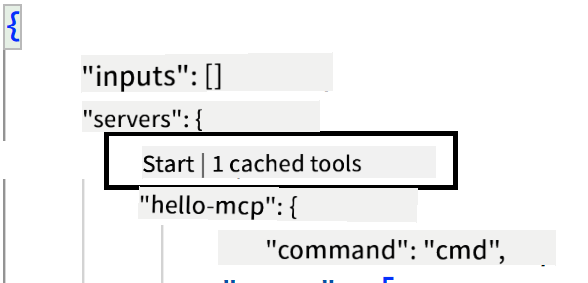
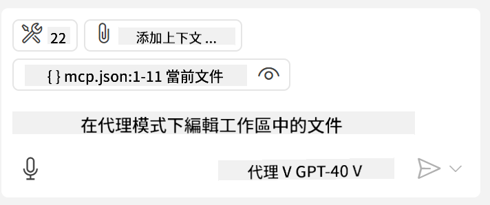
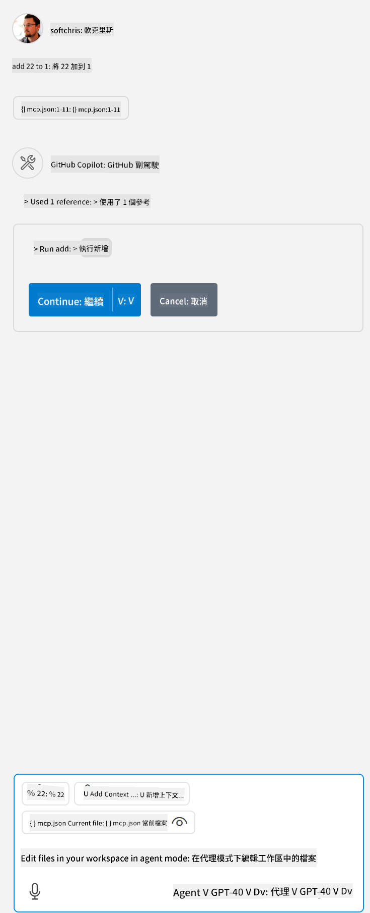

<!--
CO_OP_TRANSLATOR_METADATA:
{
  "original_hash": "0eb9557780cd0a2551cdb8a16c886b51",
  "translation_date": "2025-06-17T15:23:44+00:00",
  "source_file": "03-GettingStarted/04-vscode/README.md",
  "language_code": "tw"
}
-->
讓我們在接下來的章節中深入探討如何使用視覺化介面。

## 方法

我們需要從高層次來看這個流程：

- 配置一個檔案來尋找我們的 MCP Server。
- 啟動或連接該伺服器，讓它列出其功能。
- 透過 GitHub Copilot Chat 介面使用這些功能。

很好，現在我們了解了整個流程，接下來透過一個練習，嘗試使用 Visual Studio Code 來連接 MCP Server。

## 練習：使用伺服器

在這個練習中，我們將配置 Visual Studio Code 以找到你的 MCP Server，讓它可以從 GitHub Copilot Chat 介面使用。

### -0- 預備步驟，啟用 MCP Server 探測

你可能需要啟用 MCP Server 的探測功能。

1. 進入 `File -> Preferences -> Settings`，在 settings.json 檔案中找到 `` in Visual Studio Code.

1. Search for "MCP" and enable `chat.mcp.discovery.enabled`。

### -1- 建立配置檔案

首先在你的專案根目錄下建立配置檔案，你需要在名為 .vscode 的資料夾中放置一個 MCP.json 檔案，內容應該長這樣：

```text
.vscode
|-- mcp.json
```

接著，我們來看看如何新增伺服器條目。

### -2- 配置伺服器

將以下內容加入 *mcp.json*：

```json
{
    "inputs": [],
    "servers": {
       "hello-mcp": {
           "command": "node",
           "args": [
               "build/index.js"
           ]
       }
    }
}
```

上面是一個用 Node.js 寫的伺服器啟動範例，對於其他執行環境，請使用 `command` and `args` 指定正確的啟動指令。

### -3- 啟動伺服器

新增條目後，讓我們啟動伺服器：

1. 在 *mcp.json* 中找到你的條目，確認可以看到「播放」圖示：

    

1. 點擊「播放」圖示，GitHub Copilot Chat 的工具圖示應該會顯示更多可用工具。點擊該工具圖示會看到已註冊工具清單。你可以勾選或取消勾選工具，決定是否讓 GitHub Copilot 將它們作為上下文使用：

  

1. 執行工具時，輸入你知道符合某個工具描述的提示語，例如「add 22 to 1」：

  

  你應該會看到回覆結果為 23。

## 作業

試著在你的 *mcp.json* 檔案中新增一個伺服器條目，並確保你可以啟動與停止伺服器。也要確認能透過 GitHub Copilot Chat 介面與伺服器上的工具溝通。

## 解答

[解答](./solution/README.md)

## 重要重點

本章節的重點如下：

- Visual Studio Code 是一個很棒的客戶端，可以讓你使用多個 MCP Server 及其工具。
- 與伺服器互動的方式是透過 GitHub Copilot Chat 介面。
- 你可以向使用者提示輸入像是 API 金鑰等資訊，並在 *mcp.json* 配置檔中將其傳遞給 MCP Server。

## 範例

- [Java 計算機](../samples/java/calculator/README.md)
- [.Net 計算機](../../../../03-GettingStarted/samples/csharp)
- [JavaScript 計算機](../samples/javascript/README.md)
- [TypeScript 計算機](../samples/typescript/README.md)
- [Python 計算機](../../../../03-GettingStarted/samples/python)

## 其他資源

- [Visual Studio 文件](https://code.visualstudio.com/docs/copilot/chat/mcp-servers)

## 下一步

- 下一章：[建立 SSE 伺服器](/03-GettingStarted/05-sse-server/README.md)

**免責聲明**：  
本文件係使用 AI 翻譯服務 [Co-op Translator](https://github.com/Azure/co-op-translator) 進行翻譯。雖然我們致力於確保準確性，但請注意，自動翻譯可能包含錯誤或不準確之處。原始文件的母語版本應視為權威來源。對於重要資訊，建議採用專業人工翻譯。我們不對因使用本翻譯而產生的任何誤解或誤譯承擔責任。