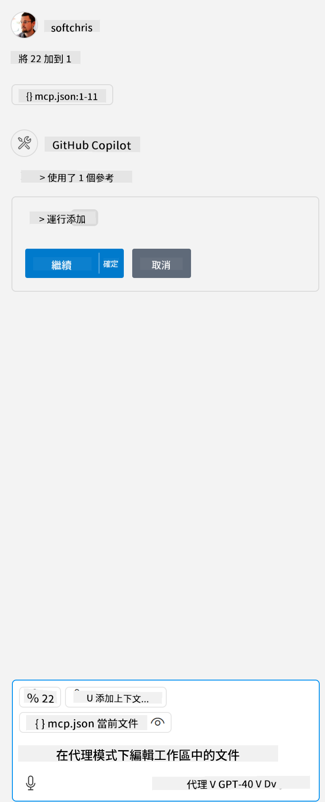

<!--
CO_OP_TRANSLATOR_METADATA:
{
  "original_hash": "96e08a8c1049dab757deb64cce4ea1e8",
  "translation_date": "2025-05-17T11:19:08+00:00",
  "source_file": "03-GettingStarted/04-vscode/solution/README.md",
  "language_code": "tw"
}
-->
# 執行範例

在這裡，我們假設你已經有一個可運行的伺服器代碼。請從前面的章節中找到一個伺服器。

## 設定 mcp.json

這是你用來參考的檔案，[mcp.json](../../../../../03-GettingStarted/04-vscode/solution/mcp.json)。

根據需要更改伺服器條目，以指出伺服器的絕對路徑，包括運行所需的完整命令。

在上述範例檔案中，伺服器條目看起來像這樣：

```json
"hello-mcp": {
    "command": "cmd",
    "args": [
        "/c", "node", "<absolute path>\\build\\index.js"
    ]
}
```

這相當於運行類似這樣的命令：`cmd /c node <absolute path>\\build\index.js`. 

- Change this server entry to fit where your server file is located or to what's needed to startup your server depending on your chosen runtime and server location.

## Consume the features in the server

- Click the `play` icon, once you've added *mcp.json* to *./vscode* folder, 

    Observe the tooling icon change to increase the number of available tools. Tooling icon is located right above the chat field in GitHub Copilot.

## Run a tool

- Type a prompt in your chat window that matches the description of your tool. For example to trigger the tool `add` 類似輸入 "add 3 to 20"。

你應該會看到一個工具顯示在聊天文字框上方，提示你選擇運行工具，如下圖所示：



選擇該工具應該會產生一個數字結果，顯示為 "23"，如果你的提示如我們之前提到的那樣。

**免責聲明**：

本文件是使用AI翻譯服務[Co-op Translator](https://github.com/Azure/co-op-translator)翻譯的。我們努力確保準確性，但請注意，自動翻譯可能包含錯誤或不準確之處。應將原始語言的文件視為權威來源。對於關鍵信息，建議尋求專業人工翻譯。我們對使用此翻譯引起的任何誤解或誤讀不承擔責任。