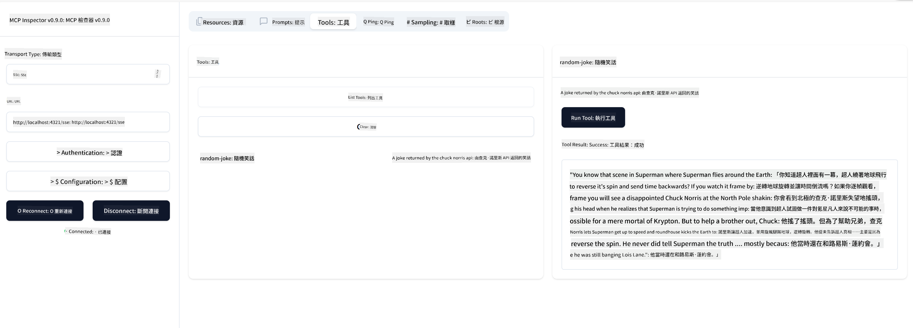

<!--
CO_OP_TRANSLATOR_METADATA:
{
  "original_hash": "1681ca3633aeb49ee03766abdbb94a93",
  "translation_date": "2025-06-17T21:59:39+00:00",
  "source_file": "03-GettingStarted/05-sse-server/README.md",
  "language_code": "tw"
}
-->
現在我們對 SSE 有了更多了解，接下來來建立一個 SSE 伺服器。

## 練習：建立 SSE 伺服器

建立伺服器時，我們需要記住兩件事：

- 我們需要使用網頁伺服器來公開連線和訊息的端點。
- 以我們過去使用 stdio 時建立伺服器的方式來建構，包含工具、資源和提示。

### -1- 建立伺服器實例

建立伺服器時，我們使用與 stdio 相同的類型，但傳輸方式需選擇 SSE。  

接下來讓我們新增必要的路由。

### -2- 新增路由

新增處理連線和接收訊息的路由：  

接著，我們來為伺服器新增功能。

### -3- 新增伺服器功能

既然 SSE 相關部分都設定好了，接下來加上工具、提示和資源等伺服器功能。  

你的完整程式碼應該長這樣：  

太好了，我們已經有一個使用 SSE 的伺服器，接著來試試看。

## 練習：使用 Inspector 除錯 SSE 伺服器

Inspector 是個很棒的工具，我們在先前的課程[建立你的第一個伺服器](/03-GettingStarted/01-first-server/README.md)中見過。現在來看看能不能在這裡也使用 Inspector：

### -1- 啟動 Inspector

要執行 Inspector，首先必須先有一個 SSE 伺服器在運行，所以先來啟動伺服器：

1. 執行伺服器  

1. 執行 Inspector

    > ![NOTE]
    > 請在與伺服器不同的終端機視窗執行此命令。並且請調整下面指令中的 URL，對應你的伺服器運行位置。

    ```sh
    npx @modelcontextprotocol/inspector --cli http://localhost:8000/sse --method tools/list
    ```

    在所有執行環境中，執行 Inspector 的方式都相同。注意，我們不是傳入伺服器的啟動指令或路徑，而是傳入伺服器正在運行的 URL，並且指定 `/sse` 路由。

### -2- 試用工具

在下拉選單選擇 SSE，並填入伺服器運行的 URL，例如 http://localhost:4321/sse，然後點擊「Connect」按鈕。接著像之前一樣，選擇列出工具、選擇工具並輸入參數。你會看到類似下方的結果：



太棒了，你已經可以使用 Inspector，接下來看看如何用 Visual Studio Code 操作。

## 作業

試著擴充你的伺服器功能。可以參考[這個頁面](https://api.chucknorris.io/)，例如新增一個呼叫 API 的工具。伺服器長什麼樣子由你決定，玩得開心 :)

## 解答

[解答](./solution/README.md) 這裡有一個可運作的範例解答。

## 重要重點

本章重點如下：

- SSE 是繼 stdio 之後的第二種支援傳輸方式。
- 支援 SSE 需要透過網頁框架管理連線和接收訊息。
- 你可以使用 Inspector 和 Visual Studio Code 來使用 SSE 伺服器，就像 stdio 伺服器一樣。注意 stdio 和 SSE 之間有些差異：SSE 需要先啟動伺服器，再執行 Inspector 工具。Inspector 工具也需要指定 URL。

## 範例

- [Java 計算機](../samples/java/calculator/README.md)
- [.Net 計算機](../../../../03-GettingStarted/samples/csharp)
- [JavaScript 計算機](../samples/javascript/README.md)
- [TypeScript 計算機](../samples/typescript/README.md)
- [Python 計算機](../../../../03-GettingStarted/samples/python) 

## 其他資源

- [SSE](https://developer.mozilla.org/en-US/docs/Web/API/Server-sent_events)

## 接下來

- 下一課：[使用 MCP 的 HTTP 串流 (Streamable HTTP)](/03-GettingStarted/06-http-streaming/README.md)

**免責聲明**：  
本文件係使用 AI 翻譯服務 [Co-op Translator](https://github.com/Azure/co-op-translator) 進行翻譯。雖然我們力求準確，但請注意，自動翻譯可能包含錯誤或不準確之處。原始文件的母語版本應視為權威來源。對於重要資訊，建議採用專業人工翻譯。我們不對因使用本翻譯而產生的任何誤解或誤譯負責。