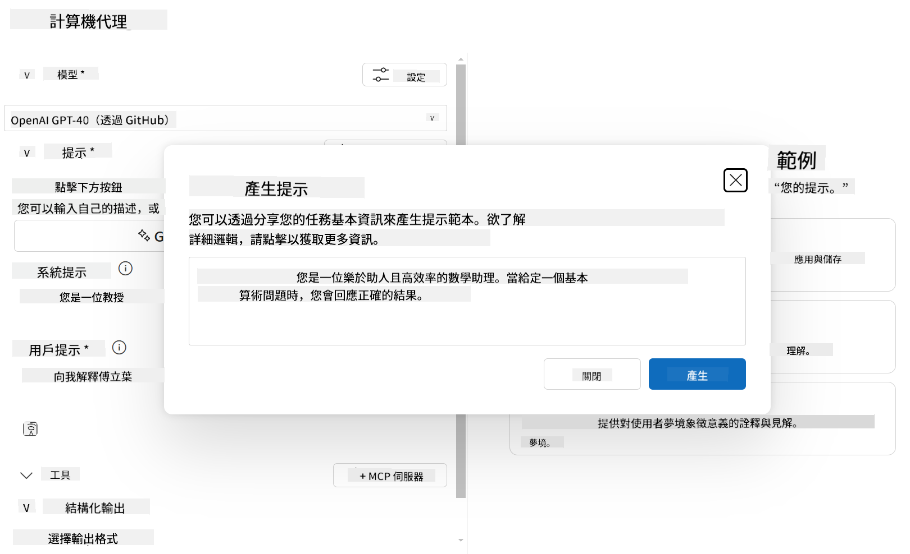

<!--
CO_OP_TRANSLATOR_METADATA:
{
  "original_hash": "af6cee6052e751674c1d9022a4b204e6",
  "translation_date": "2025-06-03T14:28:25+00:00",
  "source_file": "03-GettingStarted/06-aitk/README.md",
  "language_code": "tw"
}
-->
# 從 Visual Studio Code 的 AI Toolkit 擴充功能使用伺服器

當你在建立 AI 代理時，不只是要產生聰明的回應，更要讓你的代理能夠執行動作。這時候就會用到 Model Context Protocol (MCP)。MCP 讓代理能以一致的方式存取外部工具和服務。可以把它想像成幫你的代理接上了一個真正能用的工具箱。

比方說你把代理連接到計算機 MCP 伺服器，這樣代理只要收到「47 乘以 89 是多少？」這樣的提示，就能直接做數學運算，不用硬寫邏輯或自己做 API。

## 概覽

本課程會介紹如何用 Visual Studio Code 裡的 [AI Toolkit](https://aka.ms/AIToolkit) 擴充功能，把計算機 MCP 伺服器連接到代理，讓代理能用自然語言做加減乘除的數學運算。

AI Toolkit 是 Visual Studio Code 的強大擴充功能，可以簡化代理開發。AI 工程師可以輕鬆地本地或雲端開發及測試生成式 AI 模型。這個擴充功能支援目前大多數主流的生成式模型。

*注意*: AI Toolkit 目前支援 Python 和 TypeScript。

## 學習目標

完成本課程後，你將能夠：

- 透過 AI Toolkit 使用 MCP 伺服器。
- 設定代理配置，讓它能發現並使用 MCP 伺服器提供的工具。
- 用自然語言操作 MCP 工具。

## 方法

高階來說，我們的流程是：

- 建立代理並定義它的系統提示。
- 建立一個有計算工具的 MCP 伺服器。
- 把代理建構器連接到 MCP 伺服器。
- 透過自然語言測試代理呼叫工具。

了解流程後，我們就來設定 AI 代理，利用 MCP 使用外部工具，提升它的能力！

## 先決條件

- [Visual Studio Code](https://code.visualstudio.com/)
- [AI Toolkit for Visual Studio Code](https://aka.ms/AIToolkit)

## 練習：使用伺服器

在這個練習中，你會在 Visual Studio Code 裡使用 AI Toolkit 建立、執行並強化一個帶有 MCP 伺服器工具的 AI 代理。

### -0- 前置步驟，將 OpenAI GPT-4o 模型加入 My Models

本練習使用的是 **GPT-4o** 模型。請在建立代理前先把它加入 **My Models**。


1. 從 **活動列** 開啟 **AI Toolkit** 擴充功能。
1. 在 **Catalog** 區段選擇 **Models**，會在新編輯器分頁開啟 **Model Catalog**。
1. 在 **Model Catalog** 搜尋欄輸入 **OpenAI GPT-4o**。
1. 點擊 **+ Add**，把模型加入你的 **My Models** 清單。確定選擇的是 **由 GitHub 托管** 的版本。
1. 在 **活動列** 確認 **OpenAI GPT-4o** 模型已出現在清單中。

### -1- 建立代理

**Agent (Prompt) Builder** 讓你建立並自訂 AI 代理。本節你會建立一個新代理，並指定模型來驅動對話。


1. 從 **活動列** 開啟 **AI Toolkit** 擴充功能。
1. 在 **Tools** 區段選擇 **Agent (Prompt) Builder**，會在新分頁開啟。
1. 點擊 **+ New Agent** 按鈕，擴充功能會透過 **命令面板** 啟動設定嚮導。
1. 輸入名稱 **Calculator Agent**，按下 **Enter**。
1. 在 **Agent (Prompt) Builder** 裡的 **Model** 欄位，選擇 **OpenAI GPT-4o (via GitHub)** 模型。

### -2- 建立代理的系統提示

代理架構完成後，接著定義它的個性和目的。本節你會用 **Generate system prompt** 功能，描述代理行為（本例為計算機代理），並讓模型幫你產生系統提示。



1. 在 **Prompts** 區段，點擊 **Generate system prompt** 按鈕，會開啟提示建構器，利用 AI 產生系統提示。
1. 在 **Generate a prompt** 視窗輸入：`You are a helpful and efficient math assistant. When given a problem involving basic arithmetic, you respond with the correct result.`
1. 點擊 **Generate** 按鈕。右下角會出現通知，表示系統提示正在生成。完成後，提示會出現在 **Agent (Prompt) Builder** 的 **System prompt** 欄位。
1. 檢查系統提示，必要時進行修改。

### -3- 建立 MCP 伺服器

既然已定義代理的系統提示，現在要給代理實際功能。本節你會建立一個帶有加、減、乘、除工具的計算機 MCP 伺服器，讓代理能夠即時回應自然語言的數學運算。


AI Toolkit 有範本方便建立 MCP 伺服器，我們會用 Python 範本來建立計算機 MCP 伺服器。

*注意*: AI Toolkit 目前支援 Python 和 TypeScript。

1. 在 **Agent (Prompt) Builder** 的 **Tools** 區段，點擊 **+ MCP Server** 按鈕，會透過 **命令面板**啟動設定嚮導。
1. 選擇 **+ Add Server**。
1. 選擇 **Create a New MCP Server**。
1. 選擇 **python-weather** 範本。
1. 選擇 **Default folder** 來儲存 MCP 伺服器範本。
1. 輸入伺服器名稱：**Calculator**
1. 會開啟新的 Visual Studio Code 視窗，選擇 **Yes, I trust the authors**。
1. 使用終端機（**Terminal** > **New Terminal**）建立虛擬環境：`python -m venv .venv`
1. 在終端機啟動虛擬環境：
    1. Windows - `.venv\Scripts\activate`
    1. macOS/Linux - `source venv/bin/activate`
1. 安裝相依套件：`pip install -e .[dev]`
1. 在 **活動列** 的 **Explorer** 視圖中展開 **src** 目錄，選擇 **server.py** 開啟編輯。
1. 將 **server.py** 內容替換為以下程式碼並儲存：

    ```python
    """
    Sample MCP Calculator Server implementation in Python.

    
    This module demonstrates how to create a simple MCP server with calculator tools
    that can perform basic arithmetic operations (add, subtract, multiply, divide).
    """
    
    from mcp.server.fastmcp import FastMCP
    
    server = FastMCP("calculator")
    
    @server.tool()
    def add(a: float, b: float) -> float:
        """Add two numbers together and return the result."""
        return a + b
    
    @server.tool()
    def subtract(a: float, b: float) -> float:
        """Subtract b from a and return the result."""
        return a - b
    
    @server.tool()
    def multiply(a: float, b: float) -> float:
        """Multiply two numbers together and return the result."""
        return a * b
    
    @server.tool()
    def divide(a: float, b: float) -> float:
        """
        Divide a by b and return the result.
        
        Raises:
            ValueError: If b is zero
        """
        if b == 0:
            raise ValueError("Cannot divide by zero")
        return a / b
    ```

### -4- 使用計算機 MCP 伺服器執行代理

現在代理有工具了，該來用它們！本節你會送出提示給代理，測試代理是否正確使用計算機 MCP 伺服器的工具。


你會在本機開發機上透過 **Agent Builder** 以 MCP 用戶端身分執行計算機 MCP 伺服器。

1. 按 `F5` to start debugging the MCP server. The **Agent (Prompt) Builder** will open in a new editor tab. The status of the server is visible in the terminal.
1. In the **User prompt** field of the **Agent (Prompt) Builder**, enter the following prompt: `我買了 3 件商品，每件 25 元，然後用了 20 元折扣。請問我付了多少錢？`
1. Click the **Run** button to generate the agent's response.
1. Review the agent output. The model should conclude that you paid **$55**.
1. Here's a breakdown of what should occur:
    - The agent selects the **multiply** and **substract** tools to aid in the calculation.
    - The respective `a` and `b` values are assigned for the **multiply** tool.
    - The respective `a` and `b`，這些值會被指定給 **subtract** 工具。
    - 各工具的回應會顯示在對應的 **Tool Response**。
    - 模型的最終輸出會顯示在 **Model Response**。
1. 你可以提交更多提示來進一步測試代理。點擊 **User prompt** 欄位修改現有提示。
1. 測試完成後，可在終端機輸入 **CTRL/CMD+C** 停止伺服器。

## 作業

試著在你的 **server.py** 新增一個工具（例如：回傳數字平方根）。提交需要代理使用你新工具（或現有工具）的提示。記得重啟伺服器以載入新工具。

## 解答

[Solution](./solution/README.md)

## 重要重點

本章重點如下：

- AI Toolkit 擴充功能是一個很棒的用戶端，可以讓你使用 MCP 伺服器及其工具。
- 你可以新增工具到 MCP 伺服器，擴展代理的功能以因應需求變化。
- AI Toolkit 提供範本（例如 Python MCP 伺服器範本），簡化自訂工具的建立。

## 參考資源

- [AI Toolkit 文件](https://aka.ms/AIToolkit/doc)

## 下一步

下一課：[Lesson 4 Practical Implementation](/04-PracticalImplementation/README.md)

**免責聲明**：  
本文件係使用 AI 翻譯服務 [Co-op Translator](https://github.com/Azure/co-op-translator) 所翻譯。雖然我們致力於確保翻譯的準確性，但請注意，自動翻譯可能包含錯誤或不準確之處。原始文件的母語版本應視為權威資料來源。對於重要資訊，建議採用專業人工翻譯。我們不對因使用此翻譯所引起的任何誤解或誤釋負責。