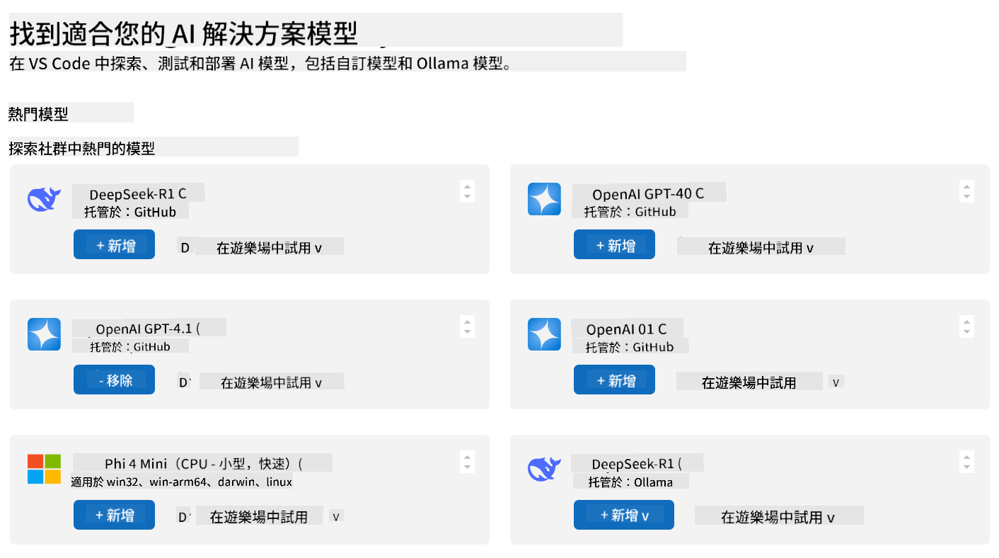
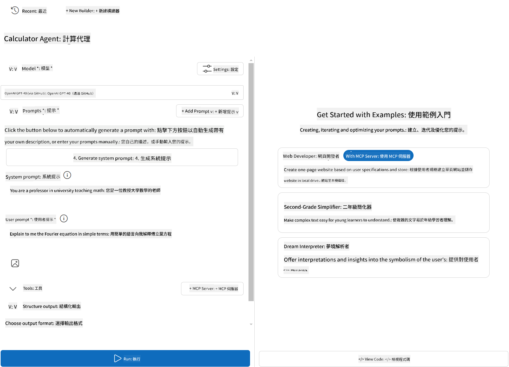
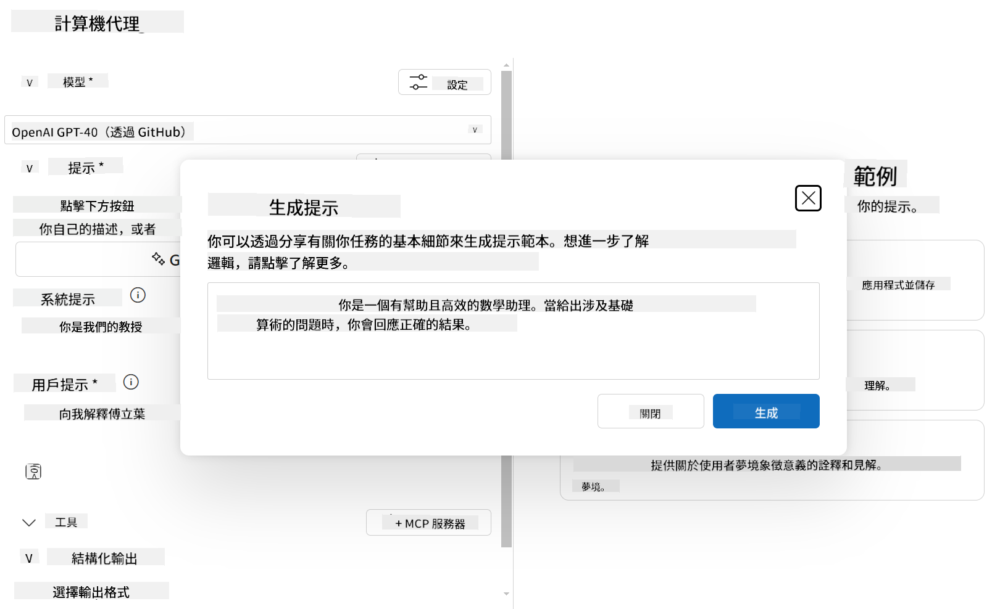

<!--
CO_OP_TRANSLATOR_METADATA:
{
  "original_hash": "d1980763f2a545ca6648363bf5757b5a",
  "translation_date": "2025-06-12T22:25:34+00:00",
  "source_file": "03-GettingStarted/07-aitk/README.md",
  "language_code": "tw"
}
-->
# 從 Visual Studio Code 的 AI Toolkit 擴充套件使用伺服器

當你在打造 AI 代理時，不只是要產生聰明的回應，更要讓代理能夠執行動作。這時候 Model Context Protocol (MCP) 就派上用場了。MCP 讓代理能以一致的方式存取外部工具和服務。你可以把它想像成幫你的代理接上一個它 *真的* 能用的工具箱。

假設你把代理連接到計算機 MCP 伺服器，代理就能只靠收到像「47 乘以 89 是多少？」這樣的提示，就能執行數學運算，不需要硬寫邏輯或自訂 API。

## 概覽

本課程說明如何使用 Visual Studio Code 中的 [AI Toolkit](https://aka.ms/AIToolkit) 擴充套件，將計算機 MCP 伺服器連接到代理，讓代理能透過自然語言執行加法、減法、乘法和除法等數學運算。

AI Toolkit 是 Visual Studio Code 強大的擴充套件，簡化代理開發流程。AI 工程師可以輕鬆地開發並測試生成式 AI 模型，無論是在本地還是雲端。此擴充套件支援目前大部分主流的生成式模型。

*注意*: AI Toolkit 目前支援 Python 和 TypeScript。

## 學習目標

完成本課程後，你將能夠：

- 透過 AI Toolkit 使用 MCP 伺服器。
- 配置代理設定，使其能發現並使用 MCP 伺服器提供的工具。
- 透過自然語言使用 MCP 工具。

## 方法

以下是我們的高階流程：

- 建立代理並定義其系統提示。
- 建立帶有計算工具的 MCP 伺服器。
- 將代理建構器連接到 MCP 伺服器。
- 透過自然語言測試代理的工具調用。

很好，了解流程後，讓我們配置 AI 代理，透過 MCP 利用外部工具，提升其功能！

## 先決條件

- [Visual Studio Code](https://code.visualstudio.com/)
- [Visual Studio Code 的 AI Toolkit](https://aka.ms/AIToolkit)

## 練習：使用伺服器

在這個練習中，你將使用 AI Toolkit 在 Visual Studio Code 中建立、執行並強化一個帶有 MCP 伺服器工具的 AI 代理。

### -0- 前置步驟，將 OpenAI GPT-4o 模型加入我的模型

本練習使用 **GPT-4o** 模型。請先將該模型加入你的 **我的模型**，再建立代理。



1. 從 **活動列** 開啟 **AI Toolkit** 擴充套件。
2. 在 **目錄** 區塊選擇 **模型**，打開 **模型目錄**。選擇後會在新編輯器分頁開啟。
3. 在 **模型目錄** 的搜尋欄輸入 **OpenAI GPT-4o**。
4. 點擊 **+ 新增** 將模型加入你的 **我的模型** 清單。請確認你選的是 **由 GitHub 托管** 的模型。
5. 在 **活動列** 確認 **OpenAI GPT-4o** 模型已出現在列表中。

### -1- 建立代理

**Agent (Prompt) Builder** 讓你建立並自訂自己的 AI 代理。本節將建立一個新代理並指派一個模型來驅動對話。



1. 從 **活動列** 開啟 **AI Toolkit** 擴充套件。
2. 在 **工具** 區塊選擇 **Agent (Prompt) Builder**，會在新分頁開啟。
3. 點擊 **+ 新代理** 按鈕，擴充套件會透過 **命令面板** 啟動設定精靈。
4. 輸入名稱 **Calculator Agent**，按下 **Enter**。
5. 在 **Agent (Prompt) Builder** 的 **Model** 欄位，選擇 **OpenAI GPT-4o (via GitHub)** 模型。

### -2- 為代理建立系統提示

代理架構完成後，接著定義它的個性和目的。本節將使用 **產生系統提示** 功能，描述代理的行為，這裡是計算機代理，讓模型幫你寫系統提示。



1. 在 **Prompts** 區塊，點擊 **產生系統提示** 按鈕。此按鈕會開啟提示建構器，利用 AI 產生系統提示。
2. 在 **產生提示** 視窗輸入：`You are a helpful and efficient math assistant. When given a problem involving basic arithmetic, you respond with the correct result.`
3. 點擊 **產生**。右下角會出現通知，確認系統提示正在產生。完成後，系統提示會出現在 **Agent (Prompt) Builder** 的 **System prompt** 欄位。
4. 檢查系統提示，必要時可修改。

### -3- 建立 MCP 伺服器

既然已定義代理的系統提示來引導行為與回應，接著要給代理實際功能。本節將建立一個計算機 MCP 伺服器，具備加、減、乘、除運算工具。這樣代理就能即時處理自然語言的數學運算請求。


AI Toolkit 內建範本，方便你建立 MCP 伺服器。我們將使用 Python 範本來建立計算機 MCP 伺服器。

*注意*: AI Toolkit 目前支援 Python 和 TypeScript。

1. 在 **Agent (Prompt) Builder** 的 **工具** 區塊，點擊 **+ MCP Server** 按鈕。擴充套件會透過 **命令面板** 啟動設定精靈。
2. 選擇 **+ 新增伺服器**。
3. 選擇 **建立新的 MCP 伺服器**。
4. 選擇 **python-weather** 作為範本。
5. 選擇 **預設資料夾** 來儲存 MCP 伺服器範本。
6. 輸入伺服器名稱：**Calculator**
7. 會開啟一個新的 Visual Studio Code 視窗，選擇 **是，我信任作者**。
8. 使用終端機（**終端機** > **新增終端機**）建立虛擬環境：`python -m venv .venv`
9. 在終端機啟動虛擬環境：
    1. Windows - `.venv\Scripts\activate`
    2. macOS/Linux - `source venv/bin/activate`
10. 在終端機安裝相依套件：`pip install -e .[dev]`
11. 在 **活動列** 的 **檔案總管** 檢視中，展開 **src** 目錄，選擇 **server.py** 開啟編輯器。
12. 將 **server.py** 檔案內容替換為以下程式碼並儲存：

    ```python
    """
    Sample MCP Calculator Server implementation in Python.

    
    This module demonstrates how to create a simple MCP server with calculator tools
    that can perform basic arithmetic operations (add, subtract, multiply, divide).
    """
    
    from mcp.server.fastmcp import FastMCP
    
    server = FastMCP("calculator")
    
    @server.tool()
    def add(a: float, b: float) -> float:
        """Add two numbers together and return the result."""
        return a + b
    
    @server.tool()
    def subtract(a: float, b: float) -> float:
        """Subtract b from a and return the result."""
        return a - b
    
    @server.tool()
    def multiply(a: float, b: float) -> float:
        """Multiply two numbers together and return the result."""
        return a * b
    
    @server.tool()
    def divide(a: float, b: float) -> float:
        """
        Divide a by b and return the result.
        
        Raises:
            ValueError: If b is zero
        """
        if b == 0:
            raise ValueError("Cannot divide by zero")
        return a / b
    ```

### -4- 執行搭配計算機 MCP 伺服器的代理

現在代理有了工具，是時候使用它們！本節將向代理送出提示，測試並驗證代理是否正確使用計算機 MCP 伺服器的工具。


你將在本機開發機上，透過 **Agent Builder** 作為 MCP 用戶端執行計算機 MCP 伺服器。

1. 按下 `F5` to start debugging the MCP server. The **Agent (Prompt) Builder** will open in a new editor tab. The status of the server is visible in the terminal.
1. In the **User prompt** field of the **Agent (Prompt) Builder**, enter the following prompt: `我買了3件商品，每件25元，然後用了20元折扣。我付了多少錢？`
1. Click the **Run** button to generate the agent's response.
1. Review the agent output. The model should conclude that you paid **$55**.
1. Here's a breakdown of what should occur:
    - The agent selects the **multiply** and **substract** tools to aid in the calculation.
    - The respective `a` and `b` values are assigned for the **multiply** tool.
    - The respective `a` and `b` 這些值會被指派給 **subtract** 工具。
    - 每個工具的回應會顯示在相應的 **工具回應**。
    - 模型的最終輸出會顯示在最終的 **模型回應**。
2. 提交更多提示以進一步測試代理。你可以點擊 **User prompt** 欄位，修改現有提示內容。
3. 測試完成後，可在 **終端機** 輸入 **CTRL/CMD+C** 停止伺服器。

## 作業

嘗試在你的 **server.py** 檔案中新增一個工具（例如：回傳數字的平方根）。提交需要代理使用你新工具（或現有工具）的額外提示。記得重啟伺服器以載入新增的工具。

## 解答

[解答](./solution/README.md)

## 重要重點

本章節重點如下：

- AI Toolkit 擴充套件是一個很棒的用戶端，讓你能使用 MCP 伺服器及其工具。
- 你可以為 MCP 伺服器新增工具，擴充代理功能以符合不斷變化的需求。
- AI Toolkit 包含範本（例如 Python MCP 伺服器範本），簡化自訂工具的建立。

## 額外資源

- [AI Toolkit 文件](https://aka.ms/AIToolkit/doc)

## 下一步
- 下一步：[測試與除錯](/03-GettingStarted/08-testing/README.md)

**免責聲明**：  
本文件係使用 AI 翻譯服務 [Co-op Translator](https://github.com/Azure/co-op-translator) 所翻譯。雖然我們致力於確保準確性，但請注意，自動翻譯可能包含錯誤或不準確之處。原始文件之母語版本應視為權威來源。對於重要資訊，建議採用專業人工翻譯。我們不對因使用本翻譯所產生之任何誤解或誤譯負責。