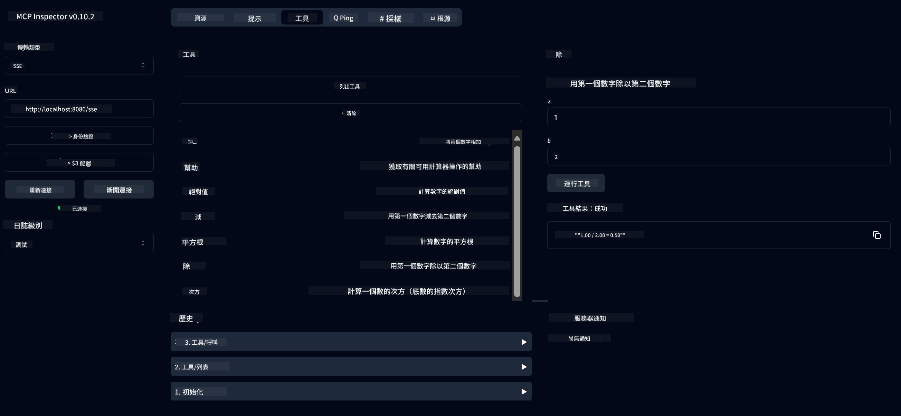

<!--
CO_OP_TRANSLATOR_METADATA:
{
  "original_hash": "13231e9951b68efd9df8c56bd5cdb27e",
  "translation_date": "2025-05-17T13:07:15+00:00",
  "source_file": "03-GettingStarted/samples/java/calculator/README.md",
  "language_code": "tw"
}
-->
# 基本計算器MCP服務

此服務透過Spring Boot和WebFlux傳輸提供基本計算器操作，使用模型上下文協議（MCP）。它被設計為初學者學習MCP實現的簡單示例。

欲了解更多信息，請參閱[MCP Server Boot Starter](https://docs.spring.io/spring-ai/reference/api/mcp/mcp-server-boot-starter-docs.html)參考文件。

## 概述

該服務展示了：
- 支援SSE（伺服器發送事件）
- 使用Spring AI的`@Tool`註釋自動工具註冊
- 基本計算器功能：
  - 加法、減法、乘法、除法
  - 指數計算和平方根
  - 取模（餘數）和絕對值
  - 操作描述的幫助功能

## 功能

這個計算器服務提供以下功能：

1. **基本算術運算**：
   - 兩個數字相加
   - 一個數字減去另一個數字
   - 兩個數字相乘
   - 一個數字除以另一個數字（檢查零除）

2. **高級運算**：
   - 指數計算（將基數提高到指數）
   - 平方根計算（檢查負數）
   - 取模（餘數）計算
   - 絕對值計算

3. **幫助系統**：
   - 內置幫助功能，解釋所有可用操作

## 使用服務

該服務通過MCP協議提供以下API端點：

- `add(a, b)`：將兩個數字相加
- `subtract(a, b)`：從第一個數字中減去第二個數字
- `multiply(a, b)`：將兩個數字相乘
- `divide(a, b)`：將第一個數字除以第二個數字（檢查零）
- `power(base, exponent)`：計算數字的指數
- `squareRoot(number)`：計算平方根（檢查負數）
- `modulus(a, b)`：計算除法時的餘數
- `absolute(number)`：計算絕對值
- `help()`：獲取可用操作的信息

## 測試客戶端

一個簡單的測試客戶端包含在`com.microsoft.mcp.sample.client`包中。`SampleCalculatorClient`類演示了計算器服務的可用操作。

## 使用LangChain4j客戶端

項目包括一個LangChain4j示例客戶端在`com.microsoft.mcp.sample.client.LangChain4jClient`中，演示如何將計算器服務與LangChain4j和GitHub模型集成：

### 先決條件

1. **GitHub Token設置**：
   
   要使用GitHub的AI模型（如phi-4），您需要GitHub個人訪問令牌：

   a. 前往您的GitHub帳戶設置：https://github.com/settings/tokens
   
   b. 點擊“生成新令牌”→“生成新令牌（經典）”
   
   c. 給您的令牌一個描述性名稱
   
   d. 選擇以下範圍：
      - `repo`（完全控制私有存儲庫）
      - `read:org`（讀取組織和團隊成員資格，讀取組織項目）
      - `gist`（創建gists）
      - `user:email`（訪問用戶電子郵件地址（只讀））
   
   e. 點擊“生成令牌”並複製您的新令牌
   
   f. 將其設置為環境變量：
      
      在Windows上：
      ```
      set GITHUB_TOKEN=your-github-token
      ```
      
      在macOS/Linux上：
      ```bash
      export GITHUB_TOKEN=your-github-token
      ```

   g. 為持久設置，通過系統設置添加到您的環境變量中

2. 添加LangChain4j GitHub依賴到您的項目（已包含在pom.xml中）：
   ```xml
   <dependency>
       <groupId>dev.langchain4j</groupId>
       <artifactId>langchain4j-github</artifactId>
       <version>${langchain4j.version}</version>
   </dependency>
   ```

3. 確保計算器伺服器在`localhost:8080`上運行

### 運行LangChain4j客戶端

此示例演示：
- 通過SSE傳輸連接到計算器MCP伺服器
- 使用LangChain4j創建一個利用計算器操作的聊天機器人
- 與GitHub AI模型集成（現在使用phi-4模型）

客戶端發送以下示例查詢以演示功能：
1. 計算兩個數字的和
2. 找到數字的平方根
3. 獲取有關可用計算器操作的幫助信息

運行示例並檢查控制台輸出，以查看AI模型如何使用計算器工具響應查詢。

### GitHub模型配置

LangChain4j客戶端配置為使用GitHub的phi-4模型，具有以下設置：

```java
ChatLanguageModel model = GitHubChatModel.builder()
    .apiKey(System.getenv("GITHUB_TOKEN"))
    .timeout(Duration.ofSeconds(60))
    .modelName("phi-4")
    .logRequests(true)
    .logResponses(true)
    .build();
```

要使用不同的GitHub模型，只需將`modelName`參數更改為另一個支持的模型（例如，“claude-3-haiku-20240307”，“llama-3-70b-8192”等）。

## 依賴項

項目需要以下關鍵依賴項：

```xml
<!-- For MCP Server -->
<dependency>
    <groupId>org.springframework.ai</groupId>
    <artifactId>spring-ai-starter-mcp-server-webflux</artifactId>
</dependency>

<!-- For LangChain4j integration -->
<dependency>
    <groupId>dev.langchain4j</groupId>
    <artifactId>langchain4j-mcp</artifactId>
    <version>${langchain4j.version}</version>
</dependency>

<!-- For GitHub models support -->
<dependency>
    <groupId>dev.langchain4j</groupId>
    <artifactId>langchain4j-github</artifactId>
    <version>${langchain4j.version}</version>
</dependency>
```

## 構建項目

使用Maven構建項目：
```bash
./mvnw clean install -DskipTests
```

## 運行伺服器

### 使用Java

```bash
java -jar target/calculator-server-0.0.1-SNAPSHOT.jar
```

### 使用MCP Inspector

MCP Inspector是一個有助於與MCP服務交互的工具。要與此計算器服務一起使用它：

1. **安裝並運行MCP Inspector**在新的終端窗口中：
   ```bash
   npx @modelcontextprotocol/inspector
   ```

2. **訪問Web UI**通過點擊應用顯示的URL（通常是http://localhost:6274）

3. **配置連接**：
   - 將傳輸類型設置為“SSE”
   - 將URL設置為您運行的伺服器的SSE端點：`http://localhost:8080/sse`
   - 點擊“連接”

4. **使用工具**：
   - 點擊“列出工具”查看可用的計算器操作
   - 選擇一個工具並點擊“運行工具”執行操作



### 使用Docker

項目包含一個Dockerfile，用於容器化部署：

1. **構建Docker映像**：
   ```bash
   docker build -t calculator-mcp-service .
   ```

2. **運行Docker容器**：
   ```bash
   docker run -p 8080:8080 calculator-mcp-service
   ```

這將：
- 使用Maven 3.9.9和Eclipse Temurin 24 JDK構建多階段Docker映像
- 創建優化的容器映像
- 在端口8080上公開服務
- 在容器內啟動MCP計算器服務

容器運行後，您可以在`http://localhost:8080`訪問服務。

## 疑難排解

### GitHub Token常見問題

1. **令牌權限問題**：如果您收到403 Forbidden錯誤，請檢查您的令牌是否具有先決條件中列出的正確權限。

2. **找不到令牌**：如果您收到“No API key found”錯誤，請確保正確設置了GITHUB_TOKEN環境變量。

3. **速率限制**：GitHub API有速率限制。如果您遇到速率限制錯誤（狀態碼429），請等待幾分鐘再重試。

4. **令牌過期**：GitHub令牌可能會過期。如果一段時間後收到身份驗證錯誤，請生成新令牌並更新您的環境變量。

如果需要進一步協助，請查看[LangChain4j文檔](https://github.com/langchain4j/langchain4j)或[GitHub API文檔](https://docs.github.com/en/rest)。

**免責聲明**：
本文檔使用AI翻譯服務[Co-op Translator](https://github.com/Azure/co-op-translator)進行翻譯。我們努力確保翻譯準確，但請注意，自動翻譯可能包含錯誤或不準確之處。原始語言的文檔應被視為權威來源。對於重要信息，建議使用專業人工翻譯。我們不對使用此翻譯所產生的任何誤解或誤讀承擔責任。