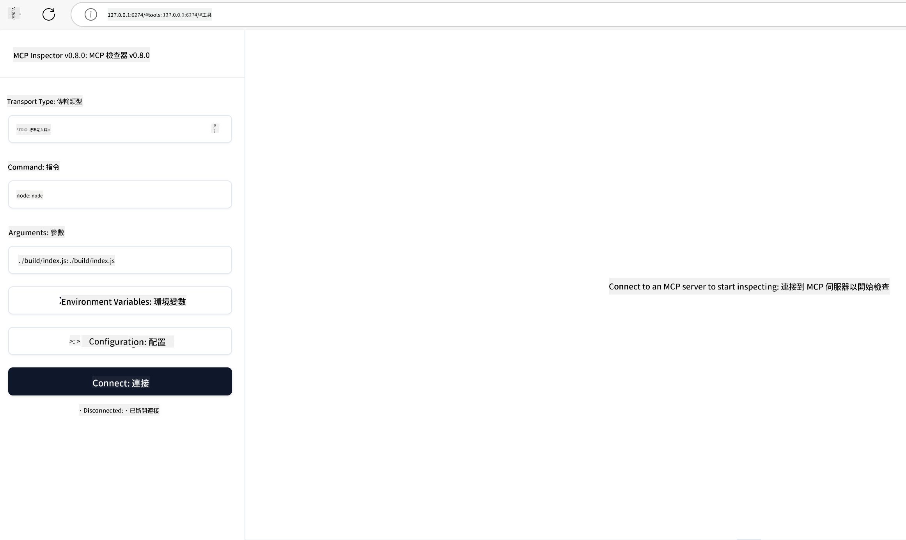

<!--
CO_OP_TRANSLATOR_METADATA:
{
  "original_hash": "d88dbf928fa0f159b82312e9a6757ba0",
  "translation_date": "2025-06-18T08:45:10+00:00",
  "source_file": "04-PracticalImplementation/README.md",
  "language_code": "tw"
}
-->
# 實務應用

實務應用是 Model Context Protocol (MCP) 實力展現的關鍵。理解 MCP 的理論與架構固然重要，但真正的價值在於將這些概念應用於建構、測試與部署解決方案，解決現實世界的問題。本章將連結概念知識與實際開發，帶領你一步步實現基於 MCP 的應用。

無論你是在開發智慧助理、整合 AI 至企業工作流程，或是打造客製化資料處理工具，MCP 都提供了靈活的基礎。其語言無關設計與針對主流程式語言的官方 SDK，使廣大開發者都能輕鬆上手。藉由這些 SDK，你能快速建立原型、反覆優化，並在不同平台與環境中擴展解決方案。

接下來的章節中，你會看到實務範例、示範程式碼與部署策略，展示如何在 C#、Java、TypeScript、JavaScript 與 Python 中實作 MCP。你也將學習如何除錯與測試 MCP 伺服器、管理 API，以及利用 Azure 部署解決方案。這些實作資源將加速你的學習，幫助你自信地打造穩健且具備生產力的 MCP 應用。

## 概覽

本課程聚焦於 MCP 在多種程式語言中的實務應用。我們將探討如何使用 C#、Java、TypeScript、JavaScript 與 Python 的 MCP SDK，建構穩健的應用程式，除錯與測試 MCP 伺服器，以及建立可重複使用的資源、提示與工具。

## 學習目標

完成本課程後，你將能夠：
- 使用官方 SDK 在多種程式語言中實作 MCP 解決方案
- 系統化地除錯與測試 MCP 伺服器
- 創建並使用伺服器功能（資源、提示與工具）
- 設計有效的 MCP 工作流程以處理複雜任務
- 優化 MCP 實作以提升效能與可靠度

## 官方 SDK 資源

Model Context Protocol 提供多種語言的官方 SDK：

- [C# SDK](https://github.com/modelcontextprotocol/csharp-sdk)
- [Java SDK](https://github.com/modelcontextprotocol/java-sdk) 
- [TypeScript SDK](https://github.com/modelcontextprotocol/typescript-sdk)
- [Python SDK](https://github.com/modelcontextprotocol/python-sdk)
- [Kotlin SDK](https://github.com/modelcontextprotocol/kotlin-sdk)

## 使用 MCP SDK

本節提供多種程式語言中實作 MCP 的實務範例。你可以在 `samples` 目錄中找到依語言分類的示範程式碼。

### 可用範例

此倉庫包含以下語言的[示範實作](../../../04-PracticalImplementation/samples)：

- [C#](./samples/csharp/README.md)
- [Java](./samples/java/containerapp/README.md)
- [TypeScript](./samples/typescript/README.md)
- [JavaScript](./samples/javascript/README.md)
- [Python](./samples/python/README.md)

每個範例展示該語言及生態系中 MCP 的核心概念與實作模式。

## 核心伺服器功能

MCP 伺服器可以實作以下功能的任意組合：

### 資源
資源提供使用者或 AI 模型所需的上下文與資料：
- 文件庫
- 知識庫
- 結構化資料來源
- 檔案系統

### 提示
提示是為使用者設計的模板訊息與工作流程：
- 預先定義的對話模板
- 指引式互動模式
- 專門設計的對話結構

### 工具
工具是供 AI 模型執行的函式：
- 資料處理工具
- 外部 API 整合
- 計算功能
- 搜尋功能

## 範例實作：C#

官方 C# SDK 倉庫包含多個示範實作，展示 MCP 的不同面向：

- **基礎 MCP 客戶端**：簡單範例展示如何建立 MCP 客戶端並呼叫工具
- **基礎 MCP 伺服器**：最小化伺服器實作，包含基本工具註冊
- **進階 MCP 伺服器**：完整功能伺服器，包含工具註冊、身份驗證與錯誤處理
- **ASP.NET 整合**：展示與 ASP.NET Core 整合的範例
- **工具實作模式**：多種不同複雜度的工具實作範例

C# MCP SDK 尚在預覽階段，API 可能會變動。我們會隨著 SDK 進展持續更新此部落格。

### 主要功能
- [C# MCP Nuget ModelContextProtocol](https://www.nuget.org/packages/ModelContextProtocol)

- 建立你的[第一個 MCP 伺服器](https://devblogs.microsoft.com/dotnet/build-a-model-context-protocol-mcp-server-in-csharp/)。

欲取得完整 C# 實作範例，請參考[官方 C# SDK 範例倉庫](https://github.com/modelcontextprotocol/csharp-sdk)

## 範例實作：Java 實作

Java SDK 提供企業級功能的強大 MCP 實作方案。

### 主要功能

- Spring Framework 整合
- 強型別安全
- 反應式程式設計支援
- 全面錯誤處理

完整 Java 實作範例請參見 samples 目錄下的 [MCPSample.java](../../../04-PracticalImplementation/samples/java/MCPSample.java)。

## 範例實作：JavaScript 實作

JavaScript SDK 提供輕量且彈性的 MCP 實作方式。

### 主要功能

- 支援 Node.js 與瀏覽器
- 基於 Promise 的 API
- 易於與 Express 及其他框架整合
- 支援 WebSocket 串流

完整 JavaScript 實作範例請參見 samples 目錄下的 [mcp_sample.js](../../../04-PracticalImplementation/samples/javascript/mcp_sample.js)。

## 範例實作：Python 實作

Python SDK 以 Pythonic 風格實作 MCP，並與主流機器學習框架良好整合。

### 主要功能

- 支援 asyncio 的 async/await
- Flask 與 FastAPI 整合
- 簡易工具註冊
- 原生整合熱門機器學習函式庫

完整 Python 實作範例請參見 samples 目錄下的 [mcp_sample.py](../../../04-PracticalImplementation/samples/python/mcp_sample.py)。

## API 管理

Azure API Management 是保護 MCP 伺服器的絕佳方案。概念是將 Azure API Management 實例置於 MCP 伺服器前端，讓它負責你可能需要的功能，如：

- 流量限制
- 令牌管理
- 監控
- 負載平衡
- 安全性

### Azure 範例

以下是一個 Azure 範例，展示如何[建立 MCP 伺服器並使用 Azure API Management 保護它](https://github.com/Azure-Samples/remote-mcp-apim-functions-python)。

下圖展示授權流程：

 

圖中流程說明：

- 使用 Microsoft Entra 進行身份驗證/授權。
- Azure API Management 作為閘道，利用策略管理與導向流量。
- Azure Monitor 紀錄所有請求以供後續分析。

#### 授權流程

更詳細的授權流程如下：


#### MCP 授權規範

深入了解 [MCP 授權規範](https://modelcontextprotocol.io/specification/2025-03-26/basic/authorization#2-10-third-party-authorization-flow)

## 將遠端 MCP 伺服器部署至 Azure

讓我們試著部署前面提到的範例：

1. 複製倉庫

    ```bash
    git clone https://github.com/Azure-Samples/remote-mcp-apim-functions-python.git
    cd remote-mcp-apim-functions-python
    ```

2. 註冊 `Microsoft.App` 提供者

    ` resource provider.
    * If you are using Azure CLI, run `az provider register --namespace Microsoft.App --wait`.
    * If you are using Azure PowerShell, run `

    或使用 PowerShell：

    Register-AzResourceProvider -ProviderNamespace Microsoft.App`. Then run `

    等待一段時間後，可用以下指令確認註冊狀態：

    (Get-AzResourceProvider -ProviderNamespace Microsoft.App).RegistrationState

3. 執行此 [azd](https://aka.ms/azd) 指令，來佈署 API 管理服務、函式應用（含程式碼）及其他所需 Azure 資源：

    ```shell
    azd up
    ```

    此指令會在 Azure 上部署所有雲端資源。

### 使用 MCP Inspector 測試你的伺服器

1. 在**新終端視窗**安裝並執行 MCP Inspector

    ```shell
    npx @modelcontextprotocol/inspector
    ```

    你會看到類似以下的介面：

     

2. 按住 CTRL 點擊，從應用顯示的 URL（例如 http://127.0.0.1:6274/#resources）載入 MCP Inspector 網頁應用
3. 設定傳輸類型為 `SSE`
1. Set the URL to your running API Management SSE endpoint displayed after `azd up` 並點擊**連接**：

    ```shell
    https://<apim-servicename-from-azd-output>.azure-api.net/mcp/sse
    ```

5. **列出工具**。點擊一個工具並**執行工具**。

若上述步驟皆成功，你現在應該已連線至 MCP 伺服器，並成功呼叫了一個工具。

## Azure 的 MCP 伺服器

[Remote-mcp-functions](https://github.com/Azure-Samples/remote-mcp-functions-dotnet)：這組倉庫提供快速啟動範本，使用 Azure Functions 搭配 Python、C# .NET 或 Node/TypeScript，建置並部署自訂的遠端 MCP（Model Context Protocol）伺服器。

此範例提供完整解決方案，讓開發者能：

- 本地建置與執行：在本機開發與除錯 MCP 伺服器
- 部署至 Azure：透過簡單的 azd up 指令輕鬆部署至雲端
- 客戶端連接：從各種客戶端連接 MCP 伺服器，包括 VS Code 的 Copilot 代理模式與 MCP Inspector 工具

### 主要特色：

- 內建安全性設計：MCP 伺服器透過金鑰與 HTTPS 保護
- 身份驗證選項：支援使用內建認證及/或 API 管理的 OAuth
- 網路隔離：允許使用 Azure 虛擬網路（VNET）實現網路隔離
- 無伺服器架構：利用 Azure Functions 提供可擴展且事件驅動的執行環境
- 本地開發支援：完善的本地開發與除錯功能
- 簡化部署流程：簡化的 Azure 部署過程

倉庫包含所有必要的設定檔、原始碼與基礎架構定義，讓你能快速啟動生產級 MCP 伺服器實作。

- [Azure Remote MCP Functions Python](https://github.com/Azure-Samples/remote-mcp-functions-python) - 使用 Azure Functions 與 Python 實作 MCP 的範例
- [Azure Remote MCP Functions .NET](https://github.com/Azure-Samples/remote-mcp-functions-dotnet) - 使用 Azure Functions 與 C# .NET 實作 MCP 的範例
- [Azure Remote MCP Functions Node/Typescript](https://github.com/Azure-Samples/remote-mcp-functions-typescript) - 使用 Azure Functions 與 Node/TypeScript 實作 MCP 的範例

## 重要重點

- MCP SDK 提供針對各語言的工具，便於實作強健的 MCP 解決方案
- 除錯與測試流程對於可靠的 MCP 應用至關重要
- 可重複使用的提示模板可確保 AI 互動一致性
- 精心設計的工作流程能協調多工具完成複雜任務
- 實作 MCP 解決方案時須考慮安全性、效能與錯誤處理

## 練習

設計一個實用的 MCP 工作流程，解決你領域中的真實問題：

1. 確認 3-4 個有助於解決該問題的工具
2. 繪製一張工作流程圖，展示這些工具如何互動
3. 使用你偏好的程式語言實作其中一個工具的基本版本
4. 建立一個提示模板，協助模型有效使用你的工具

## 其他資源


---

下一章節：[進階主題](../05-AdvancedTopics/README.md)

**免責聲明**：  
本文件使用 AI 翻譯服務 [Co-op Translator](https://github.com/Azure/co-op-translator) 進行翻譯。雖然我們力求準確，但請注意自動翻譯可能包含錯誤或不準確之處。原始文件的母語版本應視為權威來源。對於重要資訊，建議採用專業人工翻譯。我們不對因使用本翻譯而產生的任何誤解或誤譯承擔責任。