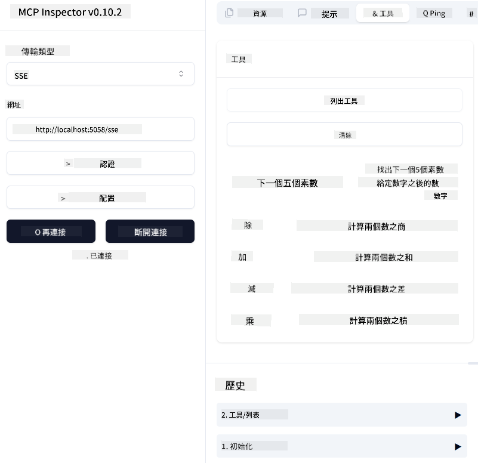
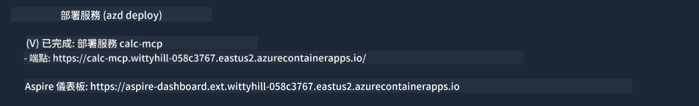

<!--
CO_OP_TRANSLATOR_METADATA:
{
  "original_hash": "5020a3e1a1c7f30c00f9e37f1fa208e3",
  "translation_date": "2025-05-17T14:06:17+00:00",
  "source_file": "04-PracticalImplementation/samples/csharp/README.md",
  "language_code": "tw"
}
-->
# 範例

前面的例子展示了如何使用本地 .NET 項目與 `sdio` 類型，以及如何在容器中本地運行服務器。這在很多情況下都是不錯的解決方案。然而，有時候讓服務器在雲端環境中遠程運行會更有用。這就是 `http` 類型的用途所在。

查看 `04-PracticalImplementation` 文件夾中的解決方案時，可能看起來比之前的例子更複雜。但實際上並非如此。如果仔細看 `src/mcpserver/mcpserver.csproj` 項目，你會發現它大部分代碼與之前的例子相同。唯一的不同是我們使用了不同的庫 `ModelContextProtocol.AspNetCore` 來處理 HTTP 請求。我們還將方法 `IsPrime` 改為私有，以展示你可以在代碼中擁有私有方法。其餘代碼和之前一樣。

其他項目來自 [.NET Aspire](https://learn.microsoft.com/dotnet/aspire/get-started/aspire-overview)。在解決方案中加入 .NET Aspire 能提升開發者在開發和測試時的體驗，並有助於可觀測性。雖然運行服務器時不是必需的，但在解決方案中加入它是一個好的做法。

## 本地啟動服務器

1. 從 VS Code（帶有 C# DevKit 擴展），打開解決方案 `04-PracticalImplementation\samples\csharp\src\Calculator-chap4.sln`。
2. 按 `F5` 啟動服務器。它應該會啟動一個帶有 .NET Aspire 儀表板的網頁瀏覽器。

或者

1. 從終端導航到文件夾 `04-PracticalImplementation\samples\csharp\src`
2. 執行以下命令啟動服務器：
   ```bash
    dotnet run --project .\AppHost
   ```

3. 從儀表板中，注意 `http` URL。它應該類似 `http://localhost:5058/`.

## Test `SSE` 並帶有 ModelContext Protocol Inspector。

如果你有 Node.js 22.7.5 及更高版本，可以使用 ModelContext Protocol Inspector 測試你的服務器。

啟動服務器並在終端運行以下命令：

```bash
npx @modelcontextprotocol/inspector@latest
```



- 選擇 `SSE` as the Transport type. SSE stand for Server-Sent Events. 
- In the Url field, enter the URL of the server noted earlier,and append `/sse`。它應該是 `http`（而不是 `https`) something like `http://localhost:5058/sse`.
- select the Connect button.

A nice thing about the Inspector is that it provide a nice visibility on what is happening.

- Try listing the availables tools
- Try some of them, it should works just like before.


## Test `SSE` with Github Copilot Chat in VS Code

To use the `SSE` transport with Github Copilot Chat, change the configuration of the `mcp-calc` 服務器創建的）看起來像這樣：

```json
"mcp-calc": {
    "type": "sse",
    "url": "http://localhost:5058/sse"
}
```

進行一些測試：
- 要求找出 6780 之後的 3 個質數。注意 Copilot 將使用新工具 `NextFivePrimeNumbers` 並只返回前 3 個質數。
- 要求找出 111 之後的 7 個質數，看看會發生什麼。

# 部署服務器到 Azure

讓我們將服務器部署到 Azure，以便更多人使用。

從終端導航到文件夾 `04-PracticalImplementation\samples\csharp\src` 並運行以下命令：

```bash
azd init
```

這將在本地創建一些文件以保存 Azure 資源的配置，以及你的基礎設施即代碼（IaC）。

然後，運行以下命令將服務器部署到 Azure：

```bash
azd up
```

部署完成後，你應該會看到類似這樣的消息：



導航到 Aspire 儀表板並注意 `HTTP` URL，以便在 MCP Inspector 和 Github Copilot Chat 中使用。

## 接下來呢？

我們嘗試了不同的傳輸類型和測試工具，並將 MCP 服務器部署到 Azure。但如果我們的服務器需要訪問私有資源怎麼辦？例如，數據庫或私有 API？在下一章中，我們將探討如何提高服務器的安全性。

**免責聲明**：
本文檔使用 AI 翻譯服務 [Co-op Translator](https://github.com/Azure/co-op-translator) 進行翻譯。雖然我們努力確保翻譯的準確性，但請注意自動翻譯可能包含錯誤或不準確之處。原始語言的文檔應被視為權威來源。對於重要信息，建議使用專業人工翻譯。對於因使用此翻譯而產生的任何誤解或誤釋，我們不承擔責任。