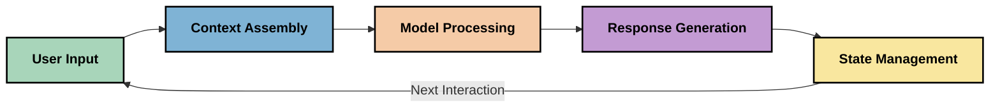
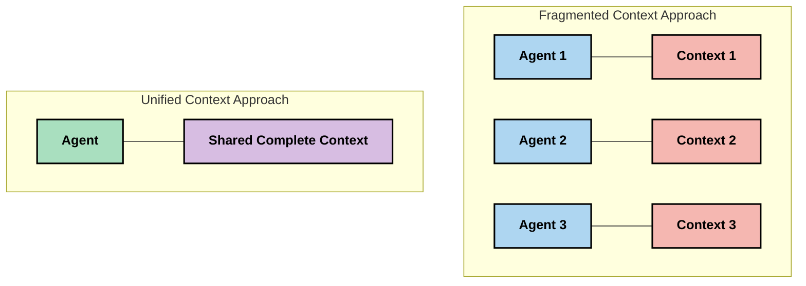
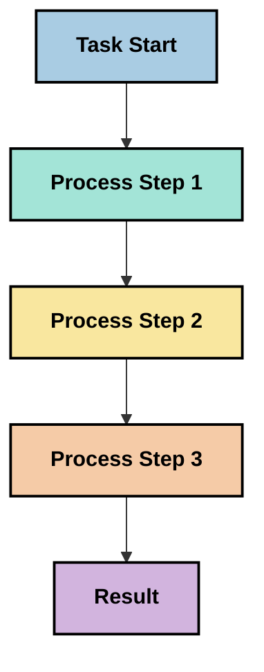
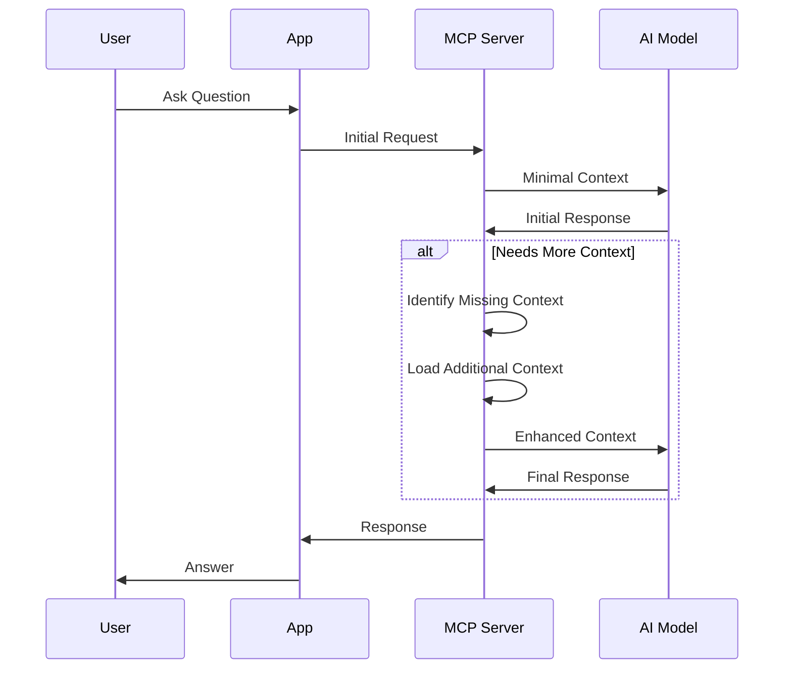
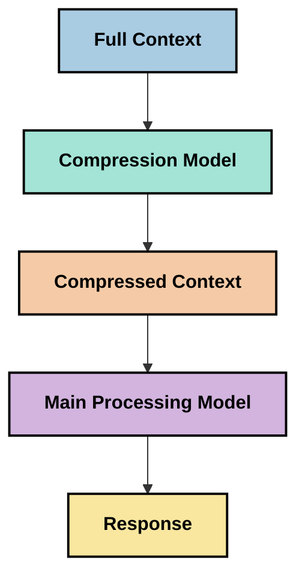
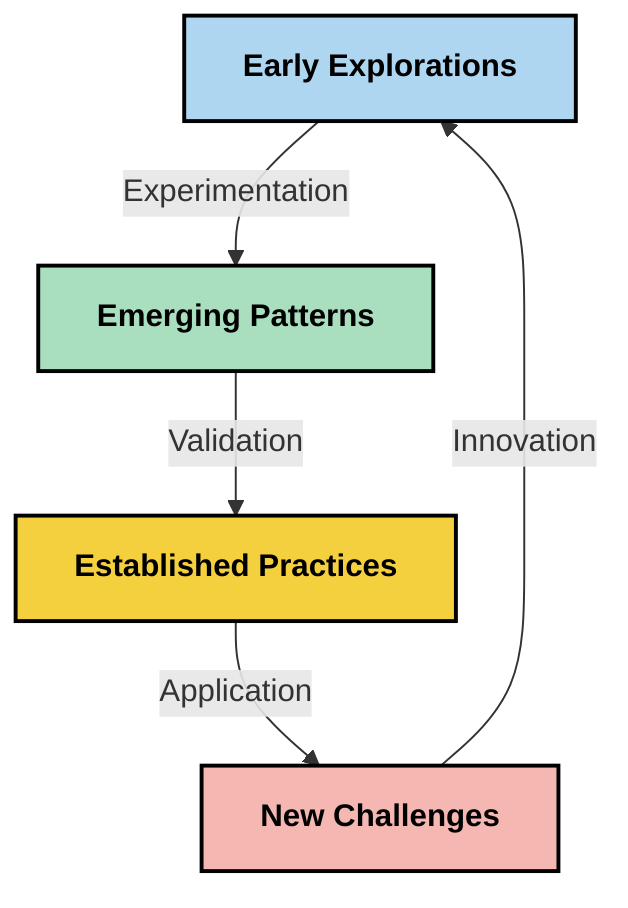

<!--
CO_OP_TRANSLATOR_METADATA:
{
  "original_hash": "fd169ca3071b81b5ee282e194bc823df",
  "translation_date": "2025-09-15T19:56:44+00:00",
  "source_file": "05-AdvancedTopics/mcp-contextengineering/README.md",
  "language_code": "tw"
}
-->
# 上下文工程：MCP 生態系統中的新興概念

## 概述

上下文工程是一個在人工智慧領域中逐漸興起的概念，探討如何在客戶端與 AI 服務之間的互動中結構化、傳遞和維護資訊。隨著模型上下文協議（MCP）生態系統的發展，如何有效管理上下文變得越來越重要。本模組將介紹上下文工程的概念，並探討其在 MCP 實現中的潛在應用。

## 學習目標

完成本模組後，您將能夠：

- 理解上下文工程這一新興概念及其在 MCP 應用中的潛在角色
- 識別 MCP 協議設計所解決的上下文管理中的主要挑戰
- 探索通過更好的上下文處理來提升模型性能的技術
- 考慮衡量和評估上下文有效性的方式
- 將這些新興概念應用於 MCP 框架中以改善 AI 體驗

## 上下文工程簡介

上下文工程是一個新興的概念，專注於用戶、應用程式和 AI 模型之間資訊流的有意設計與管理。與提示工程等已建立的領域不同，上下文工程仍在實踐者的努力下逐步定義，他們致力於解決為 AI 模型在正確的時間提供正確資訊的獨特挑戰。

隨著大型語言模型（LLMs）的發展，上下文的重要性變得越來越明顯。我們提供的上下文的質量、相關性和結構直接影響模型的輸出。上下文工程探索這種關係，並致力於制定有效上下文管理的原則。

> 「到了 2025 年，現有的模型將變得極為智能。但即使是最聰明的人，如果沒有清楚的上下文來了解他們被要求做什麼，也無法有效地完成工作……‘上下文工程’是提示工程的下一個層次。它關注於如何在動態系統中自動完成這一過程。」— Walden Yan, Cognition AI

上下文工程可能涵蓋以下幾個方面：

1. **上下文選擇**：確定對於特定任務來說哪些資訊是相關的
2. **上下文結構化**：組織資訊以最大化模型的理解能力
3. **上下文傳遞**：優化資訊傳遞的方式和時機
4. **上下文維護**：管理上下文的狀態及其隨時間的演變
5. **上下文評估**：衡量和改進上下文的有效性

這些重點特別適用於 MCP 生態系統，該系統為應用程式向 LLM 提供上下文提供了一種標準化的方法。

## 上下文旅程視角

一種可視化上下文工程的方法是追蹤資訊在 MCP 系統中的旅程：



### 上下文旅程中的關鍵階段：

1. **用戶輸入**：來自用戶的原始資訊（文本、圖像、文件）
2. **上下文組裝**：將用戶輸入與系統上下文、對話歷史及其他檢索到的資訊結合
3. **模型處理**：AI 模型處理組裝好的上下文
4. **回應生成**：模型根據提供的上下文生成輸出
5. **狀態管理**：系統根據互動更新其內部狀態

這種視角突出了 AI 系統中上下文的動態特性，並引發了關於如何在每個階段最佳管理資訊的重要問題。

## 上下文工程中的新興原則

隨著上下文工程領域的逐步成形，一些早期的原則正在從實踐者中浮現出來。這些原則可能有助於指導 MCP 實現的選擇：

### 原則 1：完整共享上下文

上下文應在系統的所有組件之間完全共享，而不是分散在多個代理或流程中。當上下文被分散時，系統中某一部分做出的決策可能會與其他部分的決策相衝突。



在 MCP 應用中，這意味著應設計系統，使上下文能夠在整個管道中無縫流動，而不是被分隔開來。

### 原則 2：認識到行動隱含決策

模型執行的每個行動都包含了對上下文的隱含解讀決策。當多個組件基於不同的上下文執行操作時，這些隱含決策可能會衝突，導致結果不一致。

這一原則對 MCP 應用有重要意義：
- 優先考慮對複雜任務的線性處理，而非基於分散上下文的並行執行
- 確保所有決策點都能訪問相同的上下文資訊
- 設計系統，使後續步驟能夠看到前期決策的完整上下文

### 原則 3：平衡上下文深度與窗口限制

隨著對話和流程的延續，上下文窗口最終會超出限制。有效的上下文工程探索如何在全面上下文與技術限制之間取得平衡。

正在探索的潛在方法包括：
- 上下文壓縮，保留關鍵資訊的同時減少 token 使用
- 根據當前需求的相關性逐步加載上下文
- 對先前互動進行摘要，同時保留關鍵決策和事實

## 上下文挑戰與 MCP 協議設計

模型上下文協議（MCP）的設計考慮到了上下文管理的獨特挑戰。理解這些挑戰有助於解釋 MCP 協議設計的關鍵方面：

### 挑戰 1：上下文窗口限制
大多數 AI 模型具有固定的上下文窗口大小，限制了它們一次能處理的資訊量。

**MCP 設計應對：**
- 協議支持結構化的、基於資源的上下文，可高效引用
- 資源可以分頁並逐步加載

### 挑戰 2：相關性判定
判定哪些資訊最為相關以納入上下文是一項難題。

**MCP 設計應對：**
- 靈活的工具允許根據需求動態檢索資訊
- 結構化提示使上下文組織保持一致

### 挑戰 3：上下文持久性
跨互動管理狀態需要仔細跟蹤上下文。

**MCP 設計應對：**
- 標準化的會話管理
- 明確定義的互動模式以支持上下文演變

### 挑戰 4：多模態上下文
不同類型的數據（文本、圖像、結構化數據）需要不同的處理方式。

**MCP 設計應對：**
- 協議設計支持多種內容類型
- 標準化的多模態資訊表示

### 挑戰 5：安全性與隱私
上下文通常包含需要保護的敏感資訊。

**MCP 設計應對：**
- 明確劃分客戶端與服務端的責任
- 本地處理選項以最小化數據暴露

理解這些挑戰以及 MCP 如何應對它們，為探索更高級的上下文工程技術奠定了基礎。

## 新興的上下文工程方法

隨著上下文工程領域的發展，一些有前景的方法正在浮現。這些方法代表了當前的思考，而非既定的最佳實踐，並可能隨著我們對 MCP 實現的經驗積累而演變。

### 1. 單線程線性處理

與分散上下文的多代理架構相比，一些實踐者發現單線程線性處理能產生更一致的結果。這與保持統一上下文的原則一致。



雖然這種方法可能看起來不如並行處理高效，但它通常能產生更連貫且可靠的結果，因為每一步都建立在對前期決策的完整理解之上。

### 2. 上下文分塊與優先排序

將大型上下文分解為可管理的部分，並優先處理最重要的部分。

```python
# Conceptual Example: Context Chunking and Prioritization
def process_with_chunked_context(documents, query):
    # 1. Break documents into smaller chunks
    chunks = chunk_documents(documents)
    
    # 2. Calculate relevance scores for each chunk
    scored_chunks = [(chunk, calculate_relevance(chunk, query)) for chunk in chunks]
    
    # 3. Sort chunks by relevance score
    sorted_chunks = sorted(scored_chunks, key=lambda x: x[1], reverse=True)
    
    # 4. Use the most relevant chunks as context
    context = create_context_from_chunks([chunk for chunk, score in sorted_chunks[:5]])
    
    # 5. Process with the prioritized context
    return generate_response(context, query)
```

上述概念展示了如何將大型文檔分解為可管理的部分，並僅選擇最相關的部分作為上下文。這種方法有助於在上下文窗口限制內工作，同時利用大型知識庫。

### 3. 漸進式上下文加載

根據需要逐步加載上下文，而非一次性加載全部。



漸進式上下文加載從最小上下文開始，僅在必要時擴展。這可以顯著減少簡單查詢的 token 使用，同時保留處理複雜問題的能力。

### 4. 上下文壓縮與摘要

在保留關鍵資訊的同時減少上下文大小。



上下文壓縮的重點包括：
- 移除冗餘資訊
- 摘要冗長內容
- 提取關鍵事實與細節
- 保留關鍵上下文元素
- 優化 token 使用效率

這種方法對於在上下文窗口內維持長對話或高效處理大型文檔特別有價值。一些實踐者正在使用專門的模型來進行上下文壓縮和對話歷史摘要。

## 探索性上下文工程考量

在探索上下文工程這一新興領域時，針對 MCP 實現的一些考量值得注意。這些並非規範性的最佳實踐，而是可能在您的特定用例中帶來改進的探索領域。

### 明確上下文目標

在實施複雜的上下文管理解決方案之前，明確說明您希望實現的目標：
- 模型需要哪些具體資訊才能成功？
- 哪些資訊是必需的，哪些是輔助的？
- 您的性能約束是什麼（延遲、token 限制、成本）？

### 探索分層上下文方法

一些實踐者發現，按概念層次排列的上下文方法效果良好：
- **核心層**：模型始終需要的基本資訊
- **情境層**：當前互動特定的上下文
- **支持層**：可能有幫助的附加資訊
- **回退層**：僅在需要時訪問的資訊

### 調查檢索策略

上下文的有效性通常取決於您如何檢索資訊：
- 使用語義搜索和嵌入來查找概念相關的資訊
- 使用基於關鍵字的搜索來檢索具體的事實細節
- 結合多種檢索方法的混合方法
- 使用元數據篩選來根據類別、日期或來源縮小範圍

### 實驗上下文連貫性

上下文的結構和流動可能影響模型的理解：
- 將相關資訊分組
- 使用一致的格式和組織方式
- 在適當情況下保持邏輯或時間順序
- 避免矛盾的資訊

### 權衡多代理架構的利弊

雖然多代理架構在許多 AI 框架中很受歡迎，但它們在上下文管理方面存在顯著挑戰：
- 上下文分散可能導致代理之間的決策不一致
- 並行處理可能引入難以調和的衝突
- 代理之間的通信開銷可能抵消性能增益
- 維持連貫性的複雜狀態管理

在許多情況下，單代理方法結合全面的上下文管理可能比多個專門代理具有更可靠的結果。

### 開發評估方法

為了隨時間改進上下文工程，考慮如何衡量成功：
- 對不同上下文結構進行 A/B 測試
- 監控 token 使用和響應時間
- 跟蹤用戶滿意度和任務完成率
- 分析上下文策略失敗的原因

這些考量代表了上下文工程領域的活躍探索方向。隨著該領域的成熟，可能會出現更明確的模式和實踐。

## 衡量上下文有效性：一個演變中的框架

隨著上下文工程作為一個概念的興起，實踐者開始探索如何衡量其有效性。目前尚無既定框架，但一些潛在的衡量維度可能有助於指導未來的工作。

### 潛在衡量維度

#### 1. 輸入效率考量

- **上下文與回應比率**：相對於回應大小需要多少上下文？
- **Token 利用率**：提供的上下文 token 中有多少對回應產生影響？
- **上下文縮減**：我們能多有效地壓縮原始資訊？

#### 2. 性能考量

- **延遲影響**：上下文管理如何影響響應時間？
- **Token 經濟性**：我們是否有效地優化了 token 使用？
- **檢索精確度**：檢索到的資訊有多相關？
- **資源利用率**：需要多少計算資源？

#### 3. 質量考量

- **回應相關性**：回應與查詢的相關性如何？
- **事實準確性**：上下文管理是否提高了事實正確性？
- **一致性**：對於類似查詢，回應是否一致？
- **幻覺率**：更好的上下文是否減少了模型的幻覺？

#### 4. 用戶體驗考量

- **後續查詢率**：用戶需要澄清的頻率如何？
- **任務完成率**：用戶是否成功完成了目標？
- **滿意度指標**：用戶如何評價他們的體驗？

### 探索性衡量方法

在 MCP 實現中實驗上下文工程時，考慮以下探索性方法：

1. **基線比較**：在測試更複雜的方法之前，建立簡單上下文方法的基線
2. **漸進式變更**：一次改變上下文管理的一個方面，以隔離其影響
3. **以用戶為中心的評估**：結合定量指標與用戶的質性反饋
4. **失敗分析**：檢查上下文策略失敗的案例以了解潛在改進
5. **多維度評估**：考慮效率、質量和用戶體驗之間的權衡

這種實驗性、多方面的衡量方法與上下文工程的新興特性相一致。

## 結語

上下文工程是一個新興的探索領域，可能對 MCP 應用的有效性至關重要。通過深思熟慮地考慮資訊如何在系統中流動，您可以潛在地創造更高效、準確且對用戶更有價值的 AI 體驗。

本模組中概述的技術和方法代表了該領域的早期思考，而非既定的實踐。隨著 AI 能力的發展和我們理解的加深，上下文工程可能會發展成為一個更為明確的學科。目前，結合謹慎的測量進行實驗似乎是最具成效的方法。

## 潛在未來方向

上下文工程領域仍處於早期階段，但一些有前景的方向正在浮現：

- 上下文工程原則可能對模型性能、效率、用戶體驗和可靠性產生重大影響
- 單線程方法結合全面的上下文管理可能在許多用例中優於多代理架構
- 專門的上下文壓縮模型可能成為 AI 管道中的標準組件
- 上下文完整性與 token 限制之間的張力可能推動上下文處理的創新
- 隨著模型在人類般高效溝通方面的能力增強，真正的多代理協作可能變得更為可行
- MCP 實現可能會隨著當前實驗中浮現的上下文管理模式而演變



## 資源

### 官方 MCP 資源
- [模型上下文協議網站](https://modelcontextprotocol.io/)
- [模型上下文協議規範](https://github.com/modelcontextprotocol/modelcontextprotocol)
- [MCP 文件](https://modelcontextprotocol.io/docs)
- [MCP C# SDK](https://github.com/modelcontextprotocol/csharp-sdk)
- [MCP Python SDK](https://github.com/modelcontextprotocol/python-sdk)
- [MCP TypeScript SDK](https://github.com/modelcontextprotocol/typescript-sdk)
- [MCP Inspector](https://github.com/modelcontextprotocol/inspector) - MCP 伺服器的視覺化測試工具

### 上下文工程文章
- [不要構建多代理：上下文工程原則](https://cognition.ai/blog/dont-build-multi-agents) - Walden Yan 關於上下文工程原則的見解
- [構建代理的實用指南](https://cdn.openai.com/business-guides-and-resources/a-practical-guide-to-building-agents.pdf) - OpenAI 關於有效代理設計的指南
- [構建有效代理](https://www.anthropic.com/engineering/building-effective-agents) - Anthropic 的代理開發方法

### 相關研究
- [大型語言模型的動態檢索增強](https://arxiv.org/abs/2310.01487) - 關於動態檢索方法的研究
- [迷失在中間：語言模型如何使用長上下文](https://arxiv.org/abs/2307.03172) - 關於上下文處理模式的重要研究
- [使用 CLIP 潛變量進行分層文本條件的圖像生成](https://arxiv.org/abs/2204.06125) - DALL-E 2 論文，提供上下文結構化的見解
- [探索上下文在大型語言模型架構中的角色](https://aclanthology.org/2023.findings-emnlp.124/) - 最近關於上下文處理的研究
- [多代理協作：調查](https://arxiv.org/abs/2304.03442) - 關於多代理系統及其挑戰的研究

### 其他資源
- [上下文窗口優化技術](https://learn.microsoft.com/en-us/azure/ai-services/openai/concepts/context-window)
- [高級 RAG 技術](https://www.microsoft.com/en-us/research/blog/retrieval-augmented-generation-rag-and-frontier-models/)
- [語義內核文件](https://github.com/microsoft/semantic-kernel)
- [上下文管理的 AI 工具包](https://github.com/microsoft/aitoolkit)

## 接下來的內容

- [5.15 MCP 自定義傳輸](../mcp-transport/README.md)

---

**免責聲明**：  
本文件已使用 AI 翻譯服務 [Co-op Translator](https://github.com/Azure/co-op-translator) 進行翻譯。儘管我們努力確保翻譯的準確性，但請注意，自動翻譯可能包含錯誤或不準確之處。原始文件的母語版本應被視為權威來源。對於重要資訊，建議尋求專業人工翻譯。我們對因使用此翻譯而引起的任何誤解或錯誤解釋概不負責。