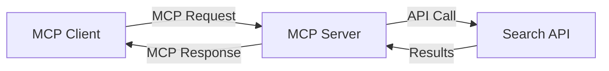
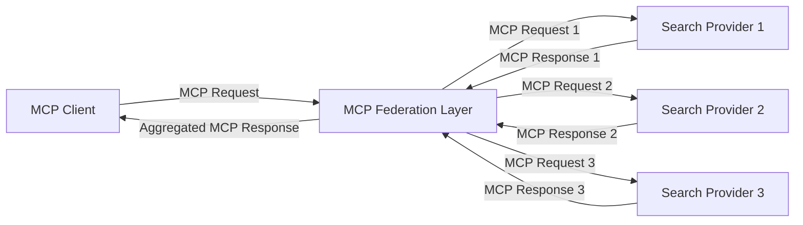
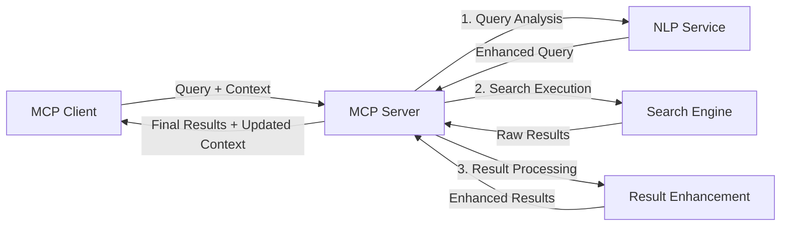

<!--
CO_OP_TRANSLATOR_METADATA:
{
  "original_hash": "333a03e51f90bdf3e6f1ba1694c73f36",
  "translation_date": "2025-07-16T21:06:06+00:00",
  "source_file": "05-AdvancedTopics/mcp-realtimesearch/README.md",
  "language_code": "tw"
}
-->
## 程式碼範例免責聲明

> **重要說明**：以下程式碼範例展示了 Model Context Protocol (MCP) 與網路搜尋功能的整合。雖然它們遵循官方 MCP SDK 的模式與結構，但為了教學目的已做簡化。
> 
> 這些範例展示了：
> 
> 1. **Python 實作**：一個 FastMCP 伺服器實作，提供網路搜尋工具並連接外部搜尋 API。此範例示範了正確的生命週期管理、上下文處理及工具實作，遵循[官方 MCP Python SDK](https://github.com/modelcontextprotocol/python-sdk)的模式。伺服器使用建議的 Streamable HTTP 傳輸方式，已取代舊有的 SSE 傳輸，適合生產環境部署。
> 
> 2. **JavaScript 實作**：使用 FastMCP 模式的 TypeScript/JavaScript 實作，來自[官方 MCP TypeScript SDK](https://github.com/modelcontextprotocol/typescript-sdk)，建立具備正確工具定義與客戶端連線的搜尋伺服器。此範例遵循最新建議的會話管理與上下文保存模式。
> 
> 這些範例在生產環境中仍需額外的錯誤處理、認證及特定 API 整合程式碼。示範中的搜尋 API 端點（`https://api.search-service.example/search`）為佔位符，需替換為實際的搜尋服務端點。
> 
> 欲取得完整實作細節及最新方法，請參考[官方 MCP 規範](https://spec.modelcontextprotocol.io/)及 SDK 文件。

## 核心概念

### Model Context Protocol (MCP) 框架

MCP 的基礎是為 AI 模型、應用程式與服務之間交換上下文提供標準化方式。在即時網路搜尋中，此框架對於建立連貫的多輪搜尋體驗至關重要。主要組件包括：

1. **客戶端-伺服器架構**：MCP 建立搜尋客戶端（請求方）與搜尋伺服器（提供方）之間的明確分工，支援彈性部署模式。

2. **JSON-RPC 通訊**：協議使用 JSON-RPC 進行訊息交換，與網路技術相容，且易於跨平台實作。

3. **上下文管理**：MCP 定義結構化方法來維護、更新及利用多次互動中的搜尋上下文。

4. **工具定義**：搜尋功能以標準化工具形式暴露，具備明確的參數與回傳值。

5. **串流支援**：協議支援串流結果，對於結果可能逐步到達的即時搜尋至關重要。

### 網路搜尋整合模式

整合 MCP 與網路搜尋時，會出現幾種模式：

#### 1. 直接搜尋提供者整合

此模式中，MCP 伺服器直接介接一個或多個搜尋 API，將 MCP 請求轉換為特定 API 呼叫，並將結果格式化為 MCP 回應。

#### 2. 保持上下文的聯合搜尋

此模式將搜尋查詢分散到多個 MCP 相容的搜尋提供者，每個可能專注於不同內容或搜尋能力，同時維持統一的上下文。

#### 3. 強化上下文的搜尋鏈

此模式將搜尋流程分為多個階段，每個步驟都豐富上下文，產生逐步更相關的結果。

### 搜尋上下文組件

在基於 MCP 的網路搜尋中，上下文通常包含：

- **查詢歷史**：會話中的先前搜尋查詢
- **使用者偏好**：語言、地區、安全搜尋設定
- **互動歷史**：點擊過的結果、在結果上花費的時間
- **搜尋參數**：篩選條件、排序方式及其他搜尋修飾
- **領域知識**：與搜尋相關的主題特定上下文
- **時間上下文**：基於時間的相關性因素
- **來源偏好**：信任或偏好的資訊來源

## 使用案例與應用

### 研究與資訊蒐集

MCP 強化研究工作流程，透過：

- 保留跨搜尋會話的研究上下文
- 支援更複雜且具上下文相關性的查詢
- 支援多來源搜尋聯合
- 促進從搜尋結果中萃取知識

### 即時新聞與趨勢監控

MCP 驅動的搜尋在新聞監控方面具備優勢：

- 幾乎即時發現新興新聞事件
- 依上下文過濾相關資訊
- 跨多個來源追蹤主題與實體
- 根據使用者上下文提供個人化新聞提醒

### AI 輔助瀏覽與研究

MCP 為 AI 輔助瀏覽創造新可能：

- 根據當前瀏覽活動提供上下文搜尋建議
- 無縫整合網路搜尋與大型語言模型助理
- 維持上下文的多輪搜尋精煉
- 強化事實查核與資訊驗證

## 未來趨勢與創新

### MCP 在網路搜尋的演進

展望未來，我們預期 MCP 將發展以因應：

- **多模態搜尋**：整合文字、影像、音訊與影片搜尋並保留上下文
- **去中心化搜尋**：支援分散式與聯合搜尋生態系統
- **搜尋隱私**：具備情境感知的隱私保護搜尋機制  
- **查詢理解**：對自然語言搜尋查詢進行深度語意解析  

### 技術潛在發展

將塑造 MCP 搜尋未來的新興技術：

1. **神經搜尋架構**：針對 MCP 優化的嵌入式搜尋系統  
2. **個人化搜尋情境**：隨時間學習個別使用者的搜尋模式  
3. **知識圖譜整合**：以領域專屬知識圖譜強化情境搜尋  
4. **跨模態情境**：維持不同搜尋模式間的情境連貫性  

## 實作練習

### 練習 1：建立基本的 MCP 搜尋流程

在此練習中，你將學習如何：  
- 設定基本的 MCP 搜尋環境  
- 實作網路搜尋的情境處理器  
- 測試並驗證搜尋迭代間的情境保存  

### 練習 2：使用 MCP 搜尋打造研究助理

建立一個完整應用，能夠：  
- 處理自然語言的研究問題  
- 執行情境感知的網路搜尋  
- 從多個來源綜合資訊  
- 呈現有條理的研究結果  

### 練習 3：實作 MCP 的多來源搜尋聯合

進階練習涵蓋：  
- 具情境感知的查詢分派至多個搜尋引擎  
- 結果排序與彙整  
- 搜尋結果的情境去重  
- 處理來源特定的元資料  

## 其他資源

- [Model Context Protocol Specification](https://spec.modelcontextprotocol.io/) - MCP 官方規範與詳細協定文件  
- [Model Context Protocol Documentation](https://modelcontextprotocol.io/) - 詳細教學與實作指南  
- [MCP Python SDK](https://github.com/modelcontextprotocol/python-sdk) - MCP 協定的官方 Python 實作  
- [MCP TypeScript SDK](https://github.com/modelcontextprotocol/typescript-sdk) - MCP 協定的官方 TypeScript 實作  
- [MCP Reference Servers](https://github.com/modelcontextprotocol/servers) - MCP 伺服器參考實作  
- [Bing Web Search API Documentation](https://learn.microsoft.com/en-us/bing/search-apis/bing-web-search/overview) - 微軟的網路搜尋 API  
- [Google Custom Search JSON API](https://developers.google.com/custom-search/v1/overview) - Google 可程式化搜尋引擎  
- [SerpAPI Documentation](https://serpapi.com/search-api) - 搜尋引擎結果頁 API  
- [Meilisearch Documentation](https://www.meilisearch.com/docs) - 開源搜尋引擎  
- [Elasticsearch Documentation](https://www.elastic.co/guide/index.html) - 分散式搜尋與分析引擎  
- [LangChain Documentation](https://python.langchain.com/docs/get_started/introduction) - 使用大型語言模型構建應用  

## 學習成果

完成本模組後，你將能夠：

- 理解即時網路搜尋的基本原理與挑戰  
- 解釋 Model Context Protocol (MCP) 如何強化即時網路搜尋能力  
- 使用主流框架與 API 實作基於 MCP 的搜尋解決方案  
- 設計並部署可擴展且高效能的 MCP 搜尋架構  
- 將 MCP 概念應用於語意搜尋、研究助理及 AI 輔助瀏覽等多種場景  
- 評估 MCP 搜尋技術的新興趨勢與未來創新  

### 信任與安全考量

在實作基於 MCP 的網路搜尋解決方案時，請遵守 MCP 規範中的重要原則：

1. **使用者同意與控制**：使用者必須明確同意並了解所有資料存取與操作。這對於可能存取外部資料來源的網路搜尋實作尤其重要。  

2. **資料隱私**：妥善處理搜尋查詢與結果，特別是可能包含敏感資訊時。實施適當的存取控制以保護使用者資料。  

3. **工具安全**：對搜尋工具實施適當的授權與驗證，因為它們可能透過任意程式碼執行帶來安全風險。工具行為描述除非來自可信伺服器，否則應視為不可信。  

4. **清晰文件**：依照 MCP 規範的實作指引，提供清楚的文件說明 MCP 搜尋實作的功能、限制與安全考量。  

5. **健全的同意流程**：建立健全的同意與授權流程，明確說明每個工具的功能，尤其是與外部網路資源互動的工具，方可授權使用。  

有關 MCP 安全與信任考量的完整細節，請參考[官方文件](https://modelcontextprotocol.io/specification/2025-03-26#security-and-trust-%26-safety)。  

## 接下來的步驟

- [5.12 Entra ID Authentication for Model Context Protocol Servers](../mcp-security-entra/README.md)

**免責聲明**：  
本文件係使用 AI 翻譯服務 [Co-op Translator](https://github.com/Azure/co-op-translator) 進行翻譯。雖然我們力求準確，但請注意自動翻譯可能包含錯誤或不準確之處。原始文件的母語版本應視為權威來源。對於重要資訊，建議採用專業人工翻譯。我們不對因使用本翻譯而產生的任何誤解或誤譯負責。