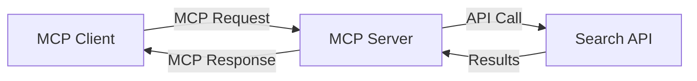
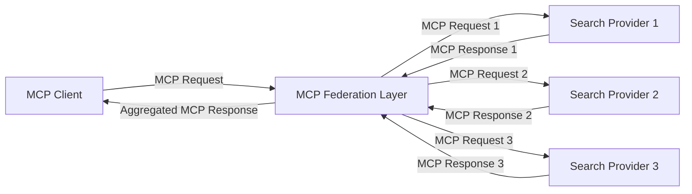
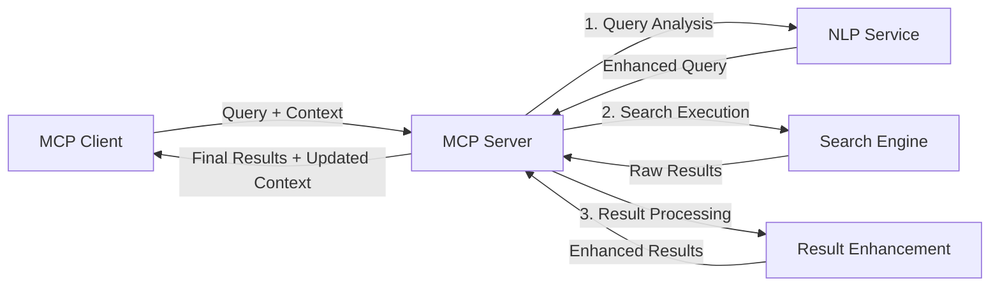

<!--
CO_OP_TRANSLATOR_METADATA:
{
  "original_hash": "16bef2c93c6a86d4ca6a8ce9e120e384",
  "translation_date": "2025-06-12T22:33:19+00:00",
  "source_file": "05-AdvancedTopics/mcp-realtimesearch/README.md",
  "language_code": "tw"
}
-->
## 程式碼範例免責聲明

> **重要提醒**：以下程式碼範例示範如何將 Model Context Protocol (MCP) 整合進網路搜尋功能。雖然它們遵循官方 MCP SDK 的結構與模式，但為了教學目的已做簡化。
> 
> 這些範例展示了：
> 
> 1. **Python 實作**：一個 FastMCP 伺服器實作，提供網路搜尋工具並連接外部搜尋 API。此範例示範了適當的生命週期管理、上下文處理以及工具實作，遵循 [官方 MCP Python SDK](https://github.com/modelcontextprotocol/python-sdk) 的設計模式。伺服器使用推薦的 Streamable HTTP 傳輸，已取代舊有的 SSE 傳輸，適用於生產環境部署。
> 
> 2. **JavaScript 實作**：使用 FastMCP 模式的 TypeScript/JavaScript 實作，來自 [官方 MCP TypeScript SDK](https://github.com/modelcontextprotocol/typescript-sdk)，用以建立具有完善工具定義與客戶端連線的搜尋伺服器。遵循最新推薦的會話管理與上下文保存模式。
> 
> 這些範例在生產環境中還需加入額外的錯誤處理、認證與特定 API 整合程式碼。範例中的搜尋 API 端點（`https://api.search-service.example/search`）為示意用，需替換成實際的搜尋服務端點。
> 
> 有關完整實作細節與最新方法，請參考 [官方 MCP 規範](https://spec.modelcontextprotocol.io/) 與 SDK 文件。

## 核心概念

### Model Context Protocol (MCP) 框架

Model Context Protocol 是一套標準化的架構，讓 AI 模型、應用程式和服務能交換上下文。在即時網路搜尋中，此框架對打造連貫且多回合的搜尋體驗至關重要。關鍵組件包括：

1. **客戶端-伺服器架構**：MCP 建立搜尋客戶端（請求端）與搜尋伺服器（提供端）間明確分工，方便彈性部署。

2. **JSON-RPC 通訊**：協定採用 JSON-RPC 交換訊息，兼容網路技術且易於跨平台實作。

3. **上下文管理**：MCP 定義結構化方法，維護、更新並利用多次互動中的搜尋上下文。

4. **工具定義**：將搜尋功能以標準化工具形式呈現，具備明確的參數與回傳值。

5. **串流支援**：協定支援串流結果，適合即時搜尋中逐步回傳結果的需求。

### 網路搜尋整合模式

將 MCP 與網路搜尋整合時，可見幾種典型模式：

#### 1. 直接搜尋提供者整合

此模式中，MCP 伺服器直接與一個或多個搜尋 API 介接，將 MCP 請求轉換為特定 API 呼叫，並將結果格式化為 MCP 回應。

#### 2. 聯邦搜尋與上下文保存

此模式將搜尋請求分散給多個 MCP 相容的搜尋提供者，每個可能專注於不同內容類型或搜尋能力，同時維持統一上下文。

#### 3. 上下文強化搜尋鏈

此模式將搜尋過程分為多階段，於每個步驟豐富上下文，逐步產生更具相關性的結果。

### 搜尋上下文組成

在 MCP 基礎的網路搜尋中，上下文通常包含：

- **查詢歷史**：會話中的先前搜尋請求
- **使用者偏好**：語言、區域、安全搜尋設定
- **互動紀錄**：點擊過的結果、在結果頁花費的時間
- **搜尋參數**：篩選條件、排序方式及其他搜尋修飾
- **領域知識**：與搜尋相關的專業背景資訊
- **時間上下文**：依時間調整的相關性因素
- **來源偏好**：可信任或偏好的資訊來源

## 使用案例與應用

### 研究與資訊蒐集

MCP 強化研究流程，具體表現為：

- 保存研究上下文跨會話
- 支援更複雜且具上下文關聯的查詢
- 支援多來源搜尋聯邦
- 促進從搜尋結果中萃取知識

### 即時新聞與趨勢監控

MCP 驅動的搜尋在新聞監控上具優勢：

- 近即時發現新興新聞事件
- 依上下文過濾相關資訊
- 跨多來源追蹤主題與實體
- 根據使用者上下文推送個人化新聞提醒

### AI 強化瀏覽與研究

MCP 為 AI 強化瀏覽帶來新可能：

- 根據當前瀏覽活動提供上下文搜尋建議
- 無縫整合網路搜尋與大型語言模型助理
- 多回合搜尋優化並保存上下文
- 強化事實查證與資訊驗證

## 未來趨勢與創新

### MCP 在網路搜尋的演進

展望未來，MCP 將朝向：

- **多模態搜尋**：整合文字、影像、音訊與影片搜尋並保存上下文
- **去中心化搜尋**：支援分散式與聯邦搜尋生態系
- **搜尋隱私**：上下文感知的隱私保護搜尋機制
- **查詢理解**：深入語意解析自然語言搜尋請求

### 潛在技術進展

將影響 MCP 搜尋未來的技術包括：

1. **神經搜尋架構**：基於嵌入向量優化的 MCP 搜尋系統
2. **個人化搜尋上下文**：隨時間學習個別使用者搜尋模式
3. **知識圖譜整合**：透過領域知識圖譜強化上下文搜尋
4. **跨模態上下文**：跨越不同搜尋模態維持上下文一致性

## 實作練習

### 練習 1：建立基本 MCP 搜尋管線

在此練習中，你將學習：

- 配置基本 MCP 搜尋環境
- 實作網路搜尋的上下文處理器
- 測試並驗證搜尋迭代中的上下文保存

### 練習 2：打造 MCP 搜尋的研究助理

建立一個完整應用，能：

- 處理自然語言研究問題
- 執行具上下文感知的網路搜尋
- 從多來源綜合資訊
- 呈現有組織的研究結果

### 練習 3：實作 MCP 的多來源搜尋聯邦

進階練習涵蓋：

- 具上下文感知的查詢分派至多個搜尋引擎
- 結果排序與彙整
- 搜尋結果的上下文去重
- 處理來源特定的元資料

## 額外資源

- [Model Context Protocol 規範](https://spec.modelcontextprotocol.io/) - 官方 MCP 規範與詳細協定文件
- [Model Context Protocol 文件](https://modelcontextprotocol.io/) - 詳細教學與實作指南
- [MCP Python SDK](https://github.com/modelcontextprotocol/python-sdk) - 官方 Python MCP 協定實作
- [MCP TypeScript SDK](https://github.com/modelcontextprotocol/typescript-sdk) - 官方 TypeScript MCP 協定實作
- [MCP 參考伺服器](https://github.com/modelcontextprotocol/servers) - MCP 伺服器參考實作
- [Bing Web Search API 文件](https://learn.microsoft.com/en-us/bing/search-apis/bing-web-search/overview) - 微軟網路搜尋 API
- [Google Custom Search JSON API](https://developers.google.com/custom-search/v1/overview) - Google 可程式化搜尋引擎
- [SerpAPI 文件](https://serpapi.com/search-api) - 搜尋引擎結果頁 API
- [Meilisearch 文件](https://www.meilisearch.com/docs) - 開源搜尋引擎
- [Elasticsearch 文件](https://www.elastic.co/guide/index.html) - 分散式搜尋與分析引擎
- [LangChain 文件](https://python.langchain.com/docs/get_started/introduction) - 建立大型語言模型應用

## 學習成果

完成本模組後，你將能：

- 理解即時網路搜尋的基礎與挑戰
- 解釋 Model Context Protocol (MCP) 如何提升即時網路搜尋能力
- 使用熱門框架與 API 實作 MCP 基礎的搜尋解決方案
- 設計並部署具擴充性、高效能的 MCP 搜尋架構
- 將 MCP 概念應用於語意搜尋、研究助理與 AI 強化瀏覽等多種使用案例
- 評估 MCP 搜尋技術的新興趨勢與未來創新

### 信任與安全考量

在實作 MCP 基礎的網路搜尋解決方案時，請遵守 MCP 規範中的重要原則：

1. **使用者同意與控制**：必須取得使用者明確同意並讓其理解所有資料存取與操作。這對可能存取外部資料來源的網路搜尋實作尤其重要。

2. **資料隱私**：妥善處理搜尋查詢與結果，尤其當包含敏感資訊時。實施適當的存取控制以保護使用者資料。

3. **工具安全**：對搜尋工具實施嚴格授權與驗證，避免任意程式碼執行帶來安全風險。工具行為描述除非來自可信伺服器，否則應視為不可信。

4. **清楚文件說明**：提供明確文件，說明 MCP 搜尋實作的功能、限制與安全考量，並依 MCP 規範的實作指南進行。

5. **完善同意流程**：建立健全的同意與授權流程，明確說明每個工具的用途，尤其是與外部網路資源互動的工具。

有關 MCP 安全與信任的完整細節，請參考 [官方文件](https://modelcontextprotocol.io/specification/2025-03-26#security-and-trust-%26-safety)。

## 下一步

- [6. 社群貢獻](../../06-CommunityContributions/README.md)

**免責聲明**：  
本文件係使用 AI 翻譯服務 [Co-op Translator](https://github.com/Azure/co-op-translator) 進行翻譯。雖然我們力求準確，但請注意自動翻譯可能包含錯誤或不精確之處。原始文件之母語版本應視為權威來源。對於重要資訊，建議採用專業人工翻譯。本公司對於因使用本翻譯而產生之任何誤解或誤釋概不負責。