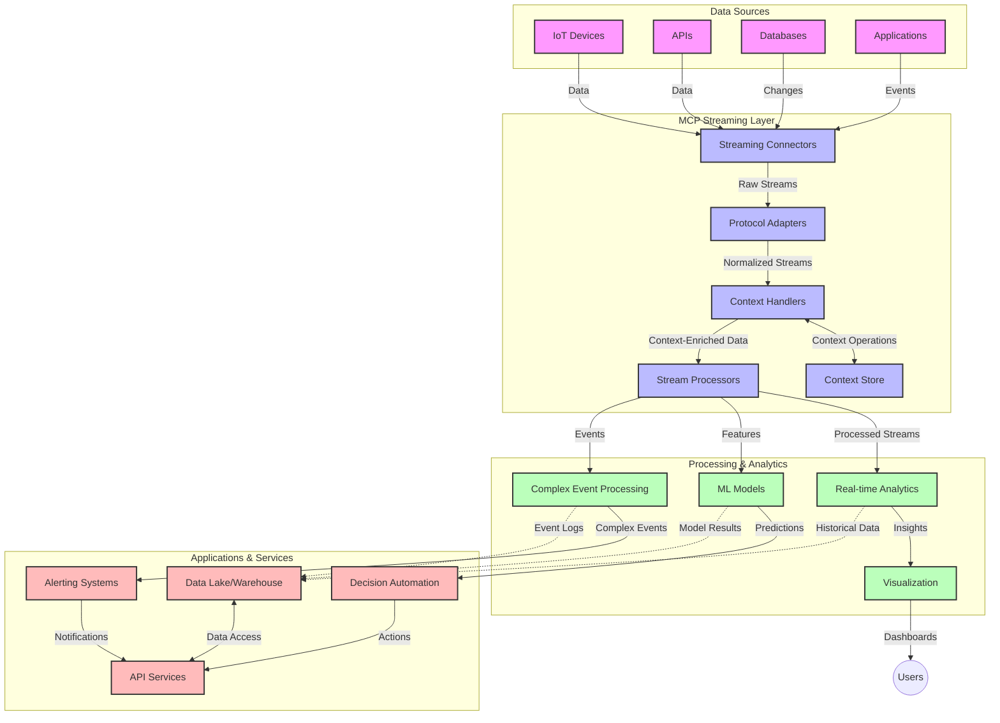

<!--
CO_OP_TRANSLATOR_METADATA:
{
  "original_hash": "68c518dbff8a3b127ed2aa934054c56c",
  "translation_date": "2025-06-11T17:02:17+00:00",
  "source_file": "05-AdvancedTopics/mcp-realtimestreaming/README.md",
  "language_code": "tw"
}
-->
# 即時資料串流的模型上下文協定

## 概覽

在現今以資料為驅動的世界裡，即時資料串流已成為不可或缺的技術，企業和應用程式需要即時取得資訊以做出快速決策。模型上下文協定（MCP）代表了優化即時串流流程的重要突破，提升資料處理效率、維持上下文完整性，並改善整體系統效能。

本單元探討 MCP 如何透過提供跨 AI 模型、串流平台及應用的標準化上下文管理，改變即時資料串流的運作方式。

## 即時資料串流介紹

即時資料串流是一種技術模式，允許資料在產生的同時持續傳輸、處理與分析，使系統能立即對新資訊做出反應。與傳統批次處理只針對靜態資料集操作不同，串流是在資料流動中處理，提供低延遲的洞察與行動。

### 即時資料串流的核心概念：

- **連續資料流**：資料以不斷延續的事件或紀錄串流方式處理。
- **低延遲處理**：系統設計以縮短資料產生到處理的時間。
- **可擴展性**：串流架構需能應對資料量與速度的變化。
- **容錯性**：系統必須具備抗故障能力，確保資料流不中斷。
- **有狀態處理**：跨事件維持上下文對有意義的分析至關重要。

### 模型上下文協定與即時串流

模型上下文協定（MCP）解決了即時串流環境中的多項關鍵挑戰：

1. **上下文連續性**：MCP 標準化分散式串流元件間的上下文維護，確保 AI 模型和處理節點能取得相關的歷史與環境上下文。

2. **高效狀態管理**：透過結構化的上下文傳輸機制，MCP 降低串流管線中狀態管理的負擔。

3. **互通性**：MCP 建立了串流技術與 AI 模型間共享上下文的通用語言，促進更靈活且可擴充的架構。

4. **針對串流優化的上下文**：MCP 實作能優先考量對即時決策最關鍵的上下文元素，兼顧效能與準確性。

5. **適應性處理**：有了 MCP 的上下文管理，串流系統可根據資料中不斷變化的條件和模式動態調整處理流程。

從物聯網感測網路到金融交易平台，MCP 與串流技術的結合，促使更智慧且具上下文感知的處理，能即時回應複雜且持續演變的情境。

## 學習目標

完成本課程後，你將能：

- 了解即時資料串流的基本原理與挑戰
- 解釋模型上下文協定（MCP）如何強化即時資料串流
- 使用 Kafka 與 Pulsar 等熱門框架實作基於 MCP 的串流解決方案
- 設計並部署具容錯性與高效能的 MCP 串流架構
- 將 MCP 概念應用於物聯網、金融交易及 AI 分析案例
- 評估 MCP 串流技術的未來趨勢與創新

### 定義與重要性

即時資料串流涉及資料的持續產生、處理與傳遞，且延遲極低。與批次處理將資料收集後分批處理不同，串流資料隨到隨處理，實現即時洞察與行動。

即時資料串流的關鍵特性包括：

- **低延遲**：在毫秒到秒的時間內完成資料處理與分析
- **連續流動**：來自多種來源的不間斷資料串流
- **即時處理**：資料一到即分析，而非批次方式
- **事件驅動架構**：根據事件發生即時回應

### 傳統資料串流的挑戰

傳統串流方式面臨多項限制：

1. **上下文遺失**：難以在分散式系統間維持上下文
2. **擴展性問題**：難以應付高量且高速的資料
3. **整合複雜**：系統間互通性不足
4. **延遲管理**：需在吞吐量與處理時間間取得平衡
5. **資料一致性**：確保串流中資料的準確與完整

## 了解模型上下文協定（MCP）

### 什麼是 MCP？

模型上下文協定（MCP）是一套標準化的通訊協定，旨在促進 AI 模型與應用間的高效互動。在即時資料串流領域，MCP 提供了：

- 保留資料管線中的上下文
- 標準化資料交換格式
- 優化大量資料傳輸
- 強化模型間及模型與應用間的溝通

### 核心元件與架構

即時串流的 MCP 架構包含以下主要元件：

1. **上下文處理器**：管理並維護串流管線中的上下文資訊
2. **串流處理器**：使用上下文感知技術處理進入的資料串流
3. **協定轉換器**：在不同串流協定間轉換並保留上下文
4. **上下文存儲**：高效存取上下文資訊
5. **串流連接器**：連接多種串流平台（Kafka、Pulsar、Kinesis 等）



### MCP 如何提升即時資料處理

MCP 透過以下方式解決傳統串流挑戰：

- **上下文完整性**：維持整個管線中資料點間的關聯
- **優化傳輸**：透過智慧的上下文管理減少資料交換冗餘
- **標準化介面**：為串流元件提供一致的 API
- **降低延遲**：有效的上下文處理減少處理負擔
- **強化擴展性**：支援橫向擴展同時保留上下文

## 整合與實作

即時資料串流系統需謹慎設計架構與實作，以兼顧效能與上下文完整性。模型上下文協定提供標準化方案，整合 AI 模型與串流技術，打造更先進且具上下文感知的處理管線。

### MCP 在串流架構的整合概覽

在即時串流環境中實作 MCP 時需考慮：

1. **上下文序列化與傳輸**：MCP 提供高效機制，將上下文編碼於串流資料封包中，確保重要上下文隨資料在處理管線中傳遞。包含為串流傳輸優化的標準序列化格式。

2. **有狀態串流處理**：MCP 透過維持一致的上下文表示，促進更智慧的有狀態處理，特別是在分散式串流架構中，狀態管理向來不易。

3. **事件時間與處理時間**：MCP 實作須解決事件發生時間與處理時間的區分，協定可納入保存事件時間語意的時間上下文。

4. **背壓管理**：標準化上下文處理助於管理串流系統背壓，使元件能溝通處理能力並調整資料流。

5. **上下文窗口與彙整**：MCP 提供結構化時間與關聯上下文表示，促進更有意義的事件串流彙整與窗口操作。

6. **精確一次處理**：對需要精確一次語意的串流系統，MCP 可納入處理元資料，協助追蹤並驗證分散式元件的處理狀態。

MCP 在多種串流技術的實作，建立了統一的上下文管理方法，減少客製化整合程式碼需求，同時提升系統在資料流動中維持有意義上下文的能力。

### MCP 在各種資料串流框架的應用

MCP 可整合於多種熱門串流框架，包括：

#### Apache Kafka 整合

```python
from mcp_streaming import MCPKafkaConnector

# Initialize MCP Kafka connector
connector = MCPKafkaConnector(
    bootstrap_servers='localhost:9092',
    context_preservation=True
)

# Create a context-aware consumer
consumer = connector.create_consumer('input-topic')

# Process streaming data with context
for message in consumer:
    context = message.get_context()
    data = message.get_value()
    
    # Process with context awareness
    result = process_with_context(data, context)
    
    # Produce output with preserved context
    connector.produce('output-topic', result, context=context)
```

#### Apache Pulsar 實作

```python
from mcp_streaming import MCPPulsarClient

# Initialize MCP Pulsar client
client = MCPPulsarClient('pulsar://localhost:6650')

# Subscribe with context awareness
consumer = client.subscribe('input-topic', 'subscription-name', 
                           context_enabled=True)

# Process messages with context preservation
while True:
    message = consumer.receive()
    context = message.get_context()
    
    # Process with context
    result = process_with_context(message.data(), context)
    
    # Acknowledge the message
    consumer.acknowledge(message)
    
    # Send result with preserved context
    producer = client.create_producer('output-topic')
    producer.send(result, context=context)
```

### 部署最佳實踐

實作 MCP 於即時串流時，建議：

1. **設計容錯機制**：
   - 適當錯誤處理
   - 失敗訊息使用死信佇列
   - 設計冪等處理器

2. **效能優化**：
   - 配置合適的緩衝區大小
   - 適當使用批次處理
   - 實作背壓機制

3. **監控與觀察**：
   - 追蹤串流處理指標
   - 監控上下文傳播
   - 設定異常警示

4. **保障串流安全**：
   - 對敏感資料加密
   - 使用身份驗證與授權
   - 實施適當存取控制

### MCP 在物聯網與邊緣運算的應用

MCP 強化物聯網串流：

- 保留設備上下文於處理管線中
- 支援高效的邊緣到雲端資料串流
- 支援物聯網資料的即時分析
- 促進設備間具上下文的通訊

範例：智慧城市感測網路  
```
Sensors → Edge Gateways → MCP Stream Processors → Real-time Analytics → Automated Responses
```

### 在金融交易與高頻交易中的角色

MCP 對金融資料串流帶來重要優勢：

- 超低延遲的交易決策處理
- 維持交易上下文貫穿整個處理流程
- 支援具上下文感知的複雜事件處理
- 確保分散式交易系統資料一致性

### 強化 AI 驅動的資料分析

MCP 為串流分析開啟新可能：

- 即時模型訓練與推論
- 從串流資料持續學習
- 上下文感知的特徵擷取
- 保留上下文的多模型推論管線

## 未來趨勢與創新

### MCP 在即時環境的演進

展望未來，預期 MCP 將朝向：

- **量子運算整合**：為量子基礎串流系統做準備
- **邊緣原生處理**：將更多上下文感知處理移至邊緣裝置
- **自動化串流管理**：自我優化的串流管線
- **聯邦串流**：在保護隱私的前提下分散式處理

### 潛在技術進展

將塑造 MCP 串流未來的新興技術：

1. **AI 優化串流協定**：專為 AI 工作負載設計的客製協定
2. **神經形態運算整合**：腦啟發運算用於串流處理
3. **無伺服器串流**：事件驅動、可擴展且無基礎設施管理的串流
4. **分散式上下文存儲**：全球分散且高度一致的上下文管理

## 實作練習

### 練習 1：建立基本 MCP 串流管線

本練習將教你如何：

- 配置基本 MCP 串流環境
- 實作串流處理的上下文處理器
- 測試並驗證上下文保存

### 練習 2：打造即時分析儀表板

建立完整應用：

- 使用 MCP 攝取串流資料
- 維持上下文進行串流處理
- 即時視覺化結果

### 練習 3：使用 MCP 實作複雜事件處理

進階練習涵蓋：

- 串流中模式偵測
- 多串流間的上下文關聯
- 產生保留上下文的複雜事件

## 其他資源

- [Model Context Protocol Specification](https://github.com/microsoft/model-context-protocol) - 官方 MCP 規範與文件
- [Apache Kafka Documentation](https://kafka.apache.org/documentation/) - Kafka 串流處理相關資源
- [Apache Pulsar](https://pulsar.apache.org/) - 統一訊息與串流平台
- [Streaming Systems: The What, Where, When, and How of Large-Scale Data Processing](https://www.oreilly.com/library/view/streaming-systems/9781491983867/) - 串流架構綜合書籍
- [Microsoft Azure Event Hubs](https://learn.microsoft.com/en-us/azure/event-hubs/event-hubs-about) - 託管式事件串流服務
- [MLflow Documentation](https://mlflow.org/docs/latest/index.html) - 機器學習模型追蹤與部署
- [Real-Time Analytics with Apache Storm](https://storm.apache.org/releases/current/index.html) - 即時計算處理框架
- [Flink ML](https://nightlies.apache.org/flink/flink-ml-docs-master/) - Apache Flink 的機器學習函式庫
- [LangChain Documentation](https://python.langchain.com/docs/get_started/introduction) - 建立大型語言模型應用

## 學習成果

完成本單元後，你將能：

- 了解即時資料串流的基礎與挑戰
- 說明模型上下文協定（MCP）如何增強即時串流
- 使用 Kafka 與 Pulsar 等框架實作 MCP 串流解決方案
- 設計並部署具容錯性與高效能的 MCP 串流架構
- 將 MCP 概念應用於物聯網、金融交易及 AI 分析場景
- 評估 MCP 串流技術的未來趨勢與創新

## 下一步

- [6. Community Contributions](../../06-CommunityContributions/README.md)

**免責聲明**：  
本文件係使用 AI 翻譯服務 [Co-op Translator](https://github.com/Azure/co-op-translator) 所翻譯。雖然我們致力於翻譯的準確性，但請注意，自動翻譯可能包含錯誤或不準確之處。原始文件的母語版本應視為權威來源。對於重要資訊，建議採用專業人工翻譯。我們不對因使用本翻譯而產生的任何誤解或誤譯負責。