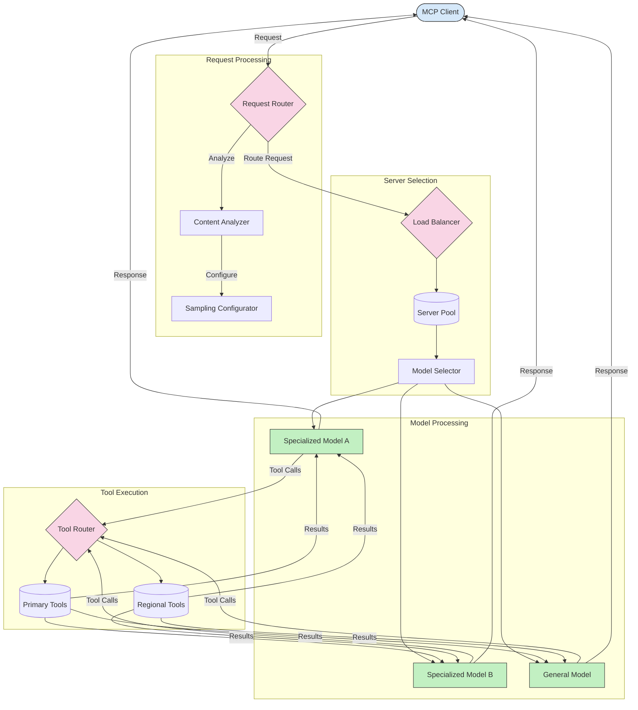

<!--
CO_OP_TRANSLATOR_METADATA:
{
  "original_hash": "af40eab7bd6ebf7e607f982a5506a5b5",
  "translation_date": "2025-06-12T21:25:36+00:00",
  "source_file": "05-AdvancedTopics/mcp-routing/README.md",
  "language_code": "tw"
}
-->
## MCP中的抽樣與路由架構

抽樣是Model Context Protocol (MCP)中的關鍵組件，它允許有效率地處理與路由請求。透過分析進來的請求，根據內容類型、使用者情境和系統負載等各種條件，判斷最適合處理的模型或服務。

抽樣與路由可以結合，打造出一個強健的架構，優化資源使用並確保高可用性。抽樣過程用來分類請求，而路由則將請求導向適當的模型或服務。

以下圖示說明抽樣與路由如何在完整的MCP架構中協同運作：

## 接下來的內容

- [5.6 抽樣](../mcp-sampling/README.md)

**免責聲明**：  
本文件係使用 AI 翻譯服務 [Co-op Translator](https://github.com/Azure/co-op-translator) 所翻譯。雖然我們致力於準確性，但請注意自動翻譯可能會包含錯誤或不準確之處。原始文件之母語版本應視為權威來源。對於重要資訊，建議採用專業人工翻譯。我們不對因使用本翻譯而產生之任何誤解或誤釋負責。