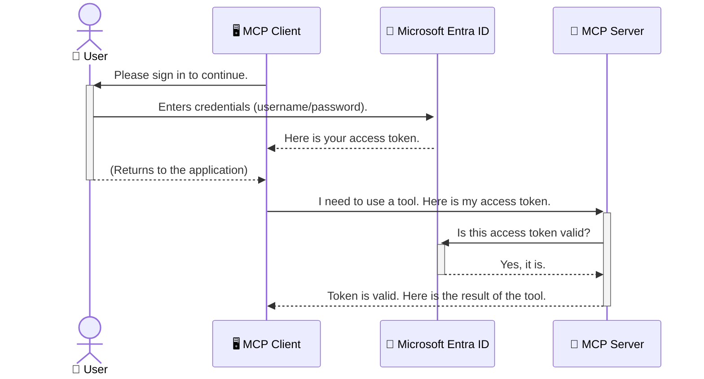

<!--
CO_OP_TRANSLATOR_METADATA:
{
  "original_hash": "6e562d7e5a77c8982da4aa8f762ad1d8",
  "translation_date": "2025-07-14T02:52:56+00:00",
  "source_file": "05-AdvancedTopics/mcp-security-entra/README.md",
  "language_code": "tw"
}
-->
# 保護 AI 工作流程：Model Context Protocol 伺服器的 Entra ID 認證

## 介紹  
保護您的 Model Context Protocol (MCP) 伺服器就像鎖好家門一樣重要。若讓 MCP 伺服器開放，您的工具和資料可能會遭到未經授權的存取，導致安全漏洞。Microsoft Entra ID 提供強大的雲端身分識別與存取管理解決方案，確保只有授權的使用者和應用程式能與您的 MCP 伺服器互動。在本節中，您將學習如何使用 Entra ID 認證來保護您的 AI 工作流程。

## 學習目標  
完成本節後，您將能夠：

- 了解保護 MCP 伺服器的重要性。  
- 解釋 Microsoft Entra ID 與 OAuth 2.0 認證的基本概念。  
- 辨識公開用戶端與機密用戶端的差異。  
- 在本地（公開用戶端）與遠端（機密用戶端）MCP 伺服器場景中實作 Entra ID 認證。  
- 在開發 AI 工作流程時應用安全最佳實務。

## 安全性與 MCP  

就像您不會讓家門沒鎖一樣，也不應該讓 MCP 伺服器任人存取。保護 AI 工作流程是打造穩健、可信且安全應用程式的關鍵。本章將介紹如何使用 Microsoft Entra ID 來保護 MCP 伺服器，確保只有授權的使用者和應用程式能存取您的工具和資料。

## 為什麼 MCP 伺服器的安全性很重要  

想像您的 MCP 伺服器有一個能發送電子郵件或存取客戶資料庫的工具。若伺服器未受保護，任何人都可能使用該工具，導致未經授權的資料存取、垃圾郵件或其他惡意行為。

透過實作認證，您能確保每個對伺服器的請求都經過驗證，確認發出請求的使用者或應用程式身份。這是保護 AI 工作流程的第一且最重要的步驟。

## Microsoft Entra ID 簡介  

[**Microsoft Entra ID**](https://adoption.microsoft.com/microsoft-security/entra/) 是一項雲端身分識別與存取管理服務。您可以把它想像成應用程式的通用保全守衛。它負責複雜的使用者身份驗證（authentication）與權限授予（authorization）流程。

使用 Entra ID，您可以：

- 啟用安全的使用者登入。  
- 保護 API 和服務。  
- 從中央位置管理存取政策。

對 MCP 伺服器而言，Entra ID 提供一個強大且廣受信賴的解決方案，管理誰能存取伺服器功能。

---

## 了解原理：Entra ID 認證如何運作  

Entra ID 採用像是 **OAuth 2.0** 這類開放標準來處理認證。雖然細節可能複雜，但核心概念很簡單，可以用比喻來理解。

### OAuth 2.0 簡介：代客鑰匙  

把 OAuth 2.0 想像成您的車子代客泊車服務。當您抵達餐廳時，不會把車子的主鑰匙交給代客，而是給他一把 **代客鑰匙**，這把鑰匙有有限權限——可以啟動車子和鎖門，但無法打開後車廂或手套箱。

在這個比喻中：

- **您** 是 **使用者**。  
- **您的車子** 是擁有寶貴工具和資料的 **MCP 伺服器**。  
- **代客** 是 **Microsoft Entra ID**。  
- **停車場服務員** 是嘗試存取伺服器的 **MCP 用戶端**（應用程式）。  
- **代客鑰匙** 是 **存取權杖（Access Token）**。

存取權杖是一串安全的文字，MCP 用戶端在您登入後從 Entra ID 取得。用戶端每次發出請求時都會帶上這個權杖，伺服器可驗證權杖以確保請求合法且用戶端擁有必要權限，且不需處理您的實際憑證（例如密碼）。

### 認證流程  

實際流程如下：



### 介紹 Microsoft Authentication Library (MSAL)  

在深入程式碼前，先介紹範例中會用到的重要元件：**Microsoft Authentication Library (MSAL)**。

MSAL 是微軟開發的函式庫，讓開發者更輕鬆處理認證。您不必自己撰寫複雜的安全權杖管理、登入流程和會話續期程式碼，MSAL 會幫您完成這些繁重工作。

使用 MSAL 的好處包括：

- **安全性高**：實作業界標準協定與安全最佳實務，降低程式碼漏洞風險。  
- **簡化開發**：抽象化 OAuth 2.0 和 OpenID Connect 的複雜性，只需少量程式碼即可加入強健認證。  
- **持續維護**：微軟積極維護並更新 MSAL，以應對新興安全威脅和平台變化。

MSAL 支援多種語言與應用框架，包括 .NET、JavaScript/TypeScript、Python、Java、Go，以及 iOS 和 Android 等行動平台。這讓您能在整個技術棧中使用一致的認證模式。

欲了解更多 MSAL 資訊，請參考官方 [MSAL 概覽文件](https://learn.microsoft.com/entra/identity-platform/msal-overview)。

---

## 使用 Entra ID 保護 MCP 伺服器：逐步教學  

接下來，我們示範如何使用 Entra ID 來保護本地 MCP 伺服器（透過 `stdio` 通訊）。此範例使用 **公開用戶端**，適合在使用者機器上執行的應用程式，如桌面應用或本地開發伺服器。

### 情境一：保護本地 MCP 伺服器（公開用戶端）  

本情境中，我們有一個本地執行、透過 `stdio` 通訊的 MCP 伺服器，使用 Entra ID 來認證使用者，才允許存取工具。伺服器提供一個工具，從 Microsoft Graph API 取得使用者個人資料。

#### 1. 在 Entra ID 中設定應用程式  

撰寫程式碼前，需先在 Microsoft Entra ID 註冊應用程式，告訴 Entra ID 您的應用程式並授權使用認證服務。

1. 前往 **[Microsoft Entra 入口網站](https://entra.microsoft.com/)**。  
2. 進入 **App registrations**，點選 **New registration**。  
3. 為應用程式命名（例如「My Local MCP Server」）。  
4. 在 **Supported account types** 選擇 **Accounts in this organizational directory only**。  
5. 本範例可將 **Redirect URI** 留空。  
6. 點選 **Register**。

註冊完成後，記下 **Application (client) ID** 和 **Directory (tenant) ID**，稍後程式碼中會用到。

#### 2. 程式碼解析  

以下是處理認證的關鍵程式碼。完整範例可在 [mcp-auth-servers GitHub 倉庫](https://github.com/Azure-Samples/mcp-auth-servers) 的 [Entra ID - Local - WAM](https://github.com/Azure-Samples/mcp-auth-servers/tree/main/src/entra-id-local-wam) 資料夾找到。

**`AuthenticationService.cs`**

此類別負責與 Entra ID 互動。

- **`CreateAsync`**：初始化 MSAL 的 `PublicClientApplication`，並設定您的應用程式 `clientId` 和 `tenantId`。  
- **`WithBroker`**：啟用 broker（如 Windows Web Account Manager），提供更安全且無縫的單一登入體驗。  
- **`AcquireTokenAsync`**：核心方法。先嘗試靜默取得權杖（若已有有效會話，使用者無需再次登入）。若無法靜默取得，則會提示使用者互動式登入。

```csharp
// Simplified for clarity
public static async Task<AuthenticationService> CreateAsync(ILogger<AuthenticationService> logger)
{
    var msalClient = PublicClientApplicationBuilder
        .Create(_clientId) // Your Application (client) ID
        .WithAuthority(AadAuthorityAudience.AzureAdMyOrg)
        .WithTenantId(_tenantId) // Your Directory (tenant) ID
        .WithBroker(new BrokerOptions(BrokerOptions.OperatingSystems.Windows))
        .Build();

    // ... cache registration ...

    return new AuthenticationService(logger, msalClient);
}

public async Task<string> AcquireTokenAsync()
{
    try
    {
        // Try silent authentication first
        var accounts = await _msalClient.GetAccountsAsync();
        var account = accounts.FirstOrDefault();

        AuthenticationResult? result = null;

        if (account != null)
        {
            result = await _msalClient.AcquireTokenSilent(_scopes, account).ExecuteAsync();
        }
        else
        {
            // If no account, or silent fails, go interactive
            result = await _msalClient.AcquireTokenInteractive(_scopes).ExecuteAsync();
        }

        return result.AccessToken;
    }
    catch (Exception ex)
    {
        _logger.LogError(ex, "An error occurred while acquiring the token.");
        throw; // Optionally rethrow the exception for higher-level handling
    }
}
```

**`Program.cs`**

此處設定 MCP 伺服器並整合認證服務。

- **`AddSingleton<AuthenticationService>`**：將 `AuthenticationService` 註冊到依賴注入容器，供應用程式其他部分（如工具）使用。  
- **`GetUserDetailsFromGraph` 工具**：此工具需要 `AuthenticationService` 實例。執行前會呼叫 `authService.AcquireTokenAsync()` 取得有效存取權杖。認證成功後，使用該權杖呼叫 Microsoft Graph API，取得使用者資料。

```csharp
// Simplified for clarity
[McpServerTool(Name = "GetUserDetailsFromGraph")]
public static async Task<string> GetUserDetailsFromGraph(
    AuthenticationService authService)
{
    try
    {
        // This will trigger the authentication flow
        var accessToken = await authService.AcquireTokenAsync();

        // Use the token to create a GraphServiceClient
        var graphClient = new GraphServiceClient(
            new BaseBearerTokenAuthenticationProvider(new TokenProvider(authService)));

        var user = await graphClient.Me.GetAsync();

        return System.Text.Json.JsonSerializer.Serialize(user);
    }
    catch (Exception ex)
    {
        return $"Error: {ex.Message}";
    }
}
```

#### 3. 整體運作流程  

1. MCP 用戶端嘗試使用 `GetUserDetailsFromGraph` 工具時，工具先呼叫 `AcquireTokenAsync`。  
2. `AcquireTokenAsync` 透過 MSAL 檢查是否有有效權杖。  
3. 若無權杖，MSAL 透過 broker 提示使用者以 Entra ID 帳號登入。  
4. 使用者登入後，Entra ID 發出存取權杖。  
5. 工具取得權杖，使用它安全呼叫 Microsoft Graph API。  
6. 使用者資料回傳給 MCP 用戶端。

此流程確保只有經過認證的使用者能使用工具，有效保護本地 MCP 伺服器。

### 情境二：保護遠端 MCP 伺服器（機密用戶端）  

當 MCP 伺服器運行於遠端機器（如雲端伺服器），並透過 HTTP Streaming 等協定通訊時，安全需求不同。此時應使用 **機密用戶端** 和 **授權碼流程（Authorization Code Flow）**。此方法更安全，因為應用程式的機密資訊不會暴露給瀏覽器。

本範例使用基於 TypeScript 的 MCP 伺服器，並以 Express.js 處理 HTTP 請求。

#### 1. 在 Entra ID 中設定應用程式  

設定與公開用戶端類似，但需新增一個 **client secret**。

1. 前往 **[Microsoft Entra 入口網站](https://entra.microsoft.com/)**。  
2. 在您的應用程式註冊中，切換到 **Certificates & secrets** 頁籤。  
3. 點選 **New client secret**，輸入描述後點 **Add**。  
4. **重要：** 請立即複製此密鑰值，之後無法再次查看。  
5. 您還需設定 **Redirect URI**。前往 **Authentication** 頁籤，點選 **Add a platform**，選擇 **Web**，並輸入應用程式的重導向 URI（例如 `http://localhost:3001/auth/callback`）。

> **⚠️ 重要安全提醒：** 對於生產環境應用程式，微軟強烈建議使用 **無密鑰認證** 方法，如 **Managed Identity** 或 **Workload Identity Federation**，取代 client secret。client secret 可能被暴露或外洩，存在安全風險。Managed Identity 提供更安全的方式，避免在程式碼或設定中儲存憑證。  
>  
> 欲了解 Managed Identity 及其實作方式，請參考 [Azure 資源的 Managed identities 概覽](https://learn.microsoft.com/entra/identity/managed-identities-azure-resources/overview)。

#### 2. 程式碼解析  

本範例採用基於 session 的方式。使用者認證後，伺服器將存取權杖和更新權杖存入 session，並發給使用者一個 session token。後續請求會使用此 session token。完整範例可在 [mcp-auth-servers GitHub 倉庫](https://github.com/Azure-Samples/mcp-auth-servers) 的 [Entra ID - Confidential client](https://github.com/Azure-Samples/mcp-auth-servers/tree/main/src/entra-id-cca-session) 資料夾找到。

**`Server.ts`**

此檔案設定 Express 伺服器與 MCP 傳輸層。

- **`requireBearerAuth`**：中介軟體，保護 `/sse` 和 `/message` 端點。檢查請求的 `Authorization` 標頭中是否有有效的 bearer token。  
- **`EntraIdServerAuthProvider`**：自訂類別，實作 `McpServerAuthorizationProvider` 介面，負責處理 OAuth 2.0 流程。  
- **`/auth/callback`**：此端點處理使用者認證後，Entra ID 的重導向。它會用授權碼交換存取權杖和更新權杖。

```typescript
// Simplified for clarity
const app = express();
const { server } = createServer();
const provider = new EntraIdServerAuthProvider();

// Protect the SSE endpoint
app.get("/sse", requireBearerAuth({
  provider,
  requiredScopes: ["User.Read"]
}), async (req, res) => {
  // ... connect to the transport ...
});

// Protect the message endpoint
app.post("/message", requireBearerAuth({
  provider,
  requiredScopes: ["User.Read"]
}), async (req, res) => {
  // ... handle the message ...
});

// Handle the OAuth 2.0 callback
app.get("/auth/callback", (req, res) => {
  provider.handleCallback(req.query.code, req.query.state)
    .then(result => {
      // ... handle success or failure ...
    });
});
```

**`Tools.ts`**

此檔案定義 MCP 伺服器提供的工具。`getUserDetails` 工具與前例類似，但從 session 取得存取權杖。

```typescript
// Simplified for clarity
server.setRequestHandler(CallToolRequestSchema, async (request) => {
  const { name } = request.params;
  const context = request.params?.context as { token?: string } | undefined;
  const sessionToken = context?.token;

  if (name === ToolName.GET_USER_DETAILS) {
    if (!sessionToken) {
      throw new AuthenticationError("Authentication token is missing or invalid. Ensure the token is provided in the request context.");
    }

    // Get the Entra ID token from the session store
    const tokenData = tokenStore.getToken(sessionToken);
    const entraIdToken = tokenData.accessToken;

    const graphClient = Client.init({
      authProvider: (done) => {
        done(null, entraIdToken);
      }
    });

    const user = await graphClient.api('/me').get();

    // ... return user details ...
  }
});
```

**`auth/EntraIdServerAuthProvider.ts`**

此類別負責：

- 將使用者導向 Entra ID 登入頁面。  
- 用授權碼交換存取權杖。  
- 將權杖存入 `tokenStore`。  
- 在存取權杖過期時執行續期。

#### 3. 整體運作流程  

1. 使用者首次嘗試連線 MCP 伺服器時，`requireBearerAuth` 中介軟體發現無有效 session，會將使用者導向 Entra ID 登入頁面。  
2. 使用者以 Entra ID 帳號登入。  
3. Entra ID 將使用者重導向 `/auth/callback` 端點，並帶回授權碼。
4. 伺服器會將授權碼兌換成存取權杖和更新權杖，並將它們儲存起來，接著建立一個會話權杖並傳送給用戶端。  
5. 用戶端現在可以在所有未來對 MCP 伺服器的請求中，於 `Authorization` 標頭使用此會話權杖。  
6. 當呼叫 `getUserDetails` 工具時，它會使用會話權杖查詢 Entra ID 存取權杖，然後利用該權杖呼叫 Microsoft Graph API。  

此流程比公開用戶端流程更複雜，但對於面向網際網路的端點是必要的。由於遠端 MCP 伺服器可透過公共網際網路存取，因此需要更強的安全措施來防止未經授權的存取和潛在攻擊。  


## Security Best Practices

- **Always use HTTPS**：加密用戶端與伺服器之間的通訊，保護權杖不被攔截。  
- **Implement Role-Based Access Control (RBAC)**：不僅要檢查使用者是否已驗證，還要檢查他們被授權執行的操作。您可以在 Entra ID 中定義角色，並在 MCP 伺服器中進行角色檢查。  
- **Monitor and audit**：記錄所有驗證事件，以便偵測並回應可疑活動。  
- **Handle rate limiting and throttling**：Microsoft Graph 及其他 API 實施速率限制以防止濫用。請在 MCP 伺服器中實作指數退避和重試機制，以優雅地處理 HTTP 429（請求過多）回應。考慮快取常用資料以減少 API 呼叫。  
- **Secure token storage**：安全地儲存存取權杖和更新權杖。對於本機應用程式，請使用系統的安全儲存機制；對於伺服器應用程式，建議使用加密儲存或安全金鑰管理服務，如 Azure Key Vault。  
- **Token expiration handling**：存取權杖有有效期限。請實作自動使用更新權杖刷新權杖的機制，以維持無縫的使用者體驗，避免重新驗證。  
- **Consider using Azure API Management**：雖然直接在 MCP 伺服器中實作安全性可提供細緻的控制，但像 Azure API Management 這類 API 閘道可自動處理許多安全議題，包括驗證、授權、速率限制和監控。它們提供一個集中式的安全層，位於用戶端與 MCP 伺服器之間。欲了解更多關於 MCP 使用 API 閘道的細節，請參閱我們的 [Azure API Management Your Auth Gateway For MCP Servers](https://techcommunity.microsoft.com/blog/integrationsonazureblog/azure-api-management-your-auth-gateway-for-mcp-servers/4402690)。  


##  Key Takeaways

- 保護您的 MCP 伺服器對於保障資料和工具安全至關重要。  
- Microsoft Entra ID 提供強大且可擴充的驗證與授權解決方案。  
- 本機應用程式使用 **public client**，遠端伺服器使用 **confidential client**。  
- **Authorization Code Flow** 是網頁應用程式最安全的選擇。  


## Exercise

1. 想想您可能會建立的 MCP 伺服器，是本機伺服器還是遠端伺服器？  
2. 根據您的答案，您會使用 public client 還是 confidential client？  
3. 您的 MCP 伺服器會請求哪些權限來對 Microsoft Graph 執行操作？  


## Hands-on Exercises

### Exercise 1: Register an Application in Entra ID  
前往 Microsoft Entra 入口網站。  
為您的 MCP 伺服器註冊一個新應用程式。  
記錄應用程式（client）ID 和目錄（tenant）ID。  

### Exercise 2: Secure a Local MCP Server (Public Client)  
- 依照程式碼範例整合 MSAL（Microsoft Authentication Library）以進行使用者驗證。  
- 透過呼叫從 Microsoft Graph 取得使用者詳細資料的 MCP 工具，測試驗證流程。  

### Exercise 3: Secure a Remote MCP Server (Confidential Client)  
- 在 Entra ID 中註冊一個 confidential client 並建立用戶端密碼。  
- 配置您的 Express.js MCP 伺服器以使用 Authorization Code Flow。  
- 測試受保護的端點並確認基於權杖的存取。  

### Exercise 4: Apply Security Best Practices  
- 為您的本機或遠端伺服器啟用 HTTPS。  
- 在伺服器邏輯中實作角色基礎存取控制（RBAC）。  
- 新增權杖過期處理和安全的權杖儲存。  


## Resources

1. **MSAL Overview Documentation**  
   了解 Microsoft Authentication Library (MSAL) 如何跨平台安全取得權杖：  
   [MSAL Overview on Microsoft Learn](https://learn.microsoft.com/en-gb/entra/msal/overview)  

2. **Azure-Samples/mcp-auth-servers GitHub Repository**  
   MCP 伺服器驗證流程的參考實作：  
   [Azure-Samples/mcp-auth-servers on GitHub](https://github.com/Azure-Samples/mcp-auth-servers)  

3. **Managed Identities for Azure Resources Overview**  
   了解如何透過系統指派或使用者指派的管理身分消除密碼：  
   [Managed Identities Overview on Microsoft Learn](https://learn.microsoft.com/en-us/entra/identity/managed-identities-azure-resources/)  

4. **Azure API Management: Your Auth Gateway for MCP Servers**  
   深入探討如何使用 APIM 作為 MCP 伺服器的安全 OAuth2 閘道：  
   [Azure API Management Your Auth Gateway For MCP Servers](https://techcommunity.microsoft.com/blog/integrationsonazureblog/azure-api-management-your-auth-gateway-for-mcp-servers/4402690)  

5. **Microsoft Graph Permissions Reference**  
   Microsoft Graph 的委派權限與應用程式權限完整列表：  
   [Microsoft Graph Permissions Reference](https://learn.microsoft.com/zh-tw/graph/permissions-reference)  


## Learning Outcomes  
完成本節後，您將能夠：

- 清楚說明為何驗證對 MCP 伺服器和 AI 工作流程至關重要。  
- 設定並配置 Entra ID 驗證，適用於本機及遠端 MCP 伺服器場景。  
- 根據伺服器部署選擇合適的用戶端類型（public 或 confidential）。  
- 實作安全的程式設計實務，包括權杖儲存與角色基礎授權。  
- 有信心保護您的 MCP 伺服器及其工具，防止未經授權的存取。  


## What's next  

- [5.13 Model Context Protocol (MCP) Integration with Azure AI Foundry](../mcp-foundry-agent-integration/README.md)

**免責聲明**：  
本文件係使用 AI 翻譯服務 [Co-op Translator](https://github.com/Azure/co-op-translator) 進行翻譯。雖然我們致力於確保翻譯的準確性，但請注意，自動翻譯可能包含錯誤或不準確之處。原始文件的母語版本應視為權威來源。對於重要資訊，建議採用專業人工翻譯。我們不對因使用本翻譯而產生的任何誤解或誤釋負責。