<!--
CO_OP_TRANSLATOR_METADATA:
{
  "original_hash": "9abe1d303ab126f9a8b87f03cebe5213",
  "translation_date": "2025-06-26T14:38:07+00:00",
  "source_file": "05-AdvancedTopics/mcp-security-entra/README.md",
  "language_code": "tw"
}
-->
# 保護 AI 工作流程：Model Context Protocol 伺服器的 Entra ID 認證

## 介紹  
保護您的 Model Context Protocol (MCP) 伺服器就像鎖好家門一樣重要。若讓 MCP 伺服器無防護地開放，您的工具和資料就可能遭到未經授權的存取，導致安全漏洞。Microsoft Entra ID 提供強大的雲端身份和存取管理解決方案，確保只有授權的使用者和應用程式能與您的 MCP 伺服器互動。在本節中，您將學習如何使用 Entra ID 認證來保護您的 AI 工作流程。

## 學習目標  
完成本節後，您將能夠：

- 了解保護 MCP 伺服器的重要性。  
- 說明 Microsoft Entra ID 及 OAuth 2.0 認證的基本概念。  
- 分辨公開用戶端與機密用戶端的差異。  
- 在本地（公開用戶端）和遠端（機密用戶端） MCP 伺服器情境中實作 Entra ID 認證。  
- 在開發 AI 工作流程時應用安全最佳實踐。

# 保護 AI 工作流程：Model Context Protocol 伺服器的 Entra ID 認證

就像您不會讓家門大開一樣，也不應該讓 MCP 伺服器任意開放給所有人存取。保護您的 AI 工作流程是建立穩健、值得信賴且安全應用程式的關鍵。本章將介紹如何使用 Microsoft Entra ID 來保護您的 MCP 伺服器，確保只有授權的使用者和應用程式能存取您的工具和資料。

## 為什麼 MCP 伺服器的安全性很重要

想像您的 MCP 伺服器內有一個能發送電子郵件或存取客戶資料庫的工具。若伺服器未受保護，任何人都有可能使用該工具，導致未經授權的資料存取、垃圾郵件或其他惡意行為。

透過實作認證，您可確保每個對伺服器的請求都經過驗證，確認發出請求的使用者或應用程式身份。這是保護 AI 工作流程的第一且最關鍵的步驟。

## Microsoft Entra ID 簡介

**Microsoft Entra ID** 是一個基於雲端的身份和存取管理服務。可將它想像成應用程式的萬用保全。它負責複雜的使用者身份驗證流程（Authentication）及權限判斷（Authorization）。

使用 Entra ID，您可以：

- 啟用安全的使用者登入。  
- 保護 API 和服務。  
- 從中央位置管理存取政策。

對於 MCP 伺服器而言，Entra ID 提供強大且廣受信賴的解決方案，管理誰能使用伺服器的功能。

---

## 理解運作原理：Entra ID 認證如何運作

Entra ID 採用開放標準如 **OAuth 2.0** 來處理認證。雖然細節可能複雜，但核心概念很簡單，可以用比喻來理解。

### OAuth 2.0 簡易介紹：代客鑰匙

把 OAuth 2.0 想像成您的車輛代客泊車服務。當您抵達餐廳時，不會把車子的主鑰匙交給代客，而是給他一把**代客鑰匙**，這把鑰匙有有限權限——可以啟動車子並鎖車門，但無法打開後車廂或手套箱。

在這個比喻中：

- **您** 是 **使用者**。  
- **您的車** 是擁有珍貴工具和資料的 **MCP 伺服器**。  
- **代客** 是 **Microsoft Entra ID**。  
- **泊車服務人員** 是 **MCP 用戶端**（嘗試存取伺服器的應用程式）。  
- **代客鑰匙** 是 **存取權杖（Access Token）**。

存取權杖是由 MCP 用戶端在您登入後從 Entra ID 取得的安全字串。用戶端在每次請求時都會帶著此權杖給 MCP 伺服器，伺服器可驗證該權杖，確認請求合法且用戶端具備必要權限，且不必直接處理您的實際憑證（例如密碼）。

### 認證流程

實際流程如下：

```mermaid
sequenceDiagram
    actor User as 👤 User
    participant Client as 🖥️ MCP Client
    participant Entra as 🔐 Microsoft Entra ID
    participant Server as 🔧 MCP Server

    Client->>+User: Please sign in to continue.
    User->>+Entra: Enters credentials (username/password).
    Entra-->>Client: Here is your access token.
    User-->>-Client: (Returns to the application)

    Client->>+Server: I need to use a tool. Here is my access token.
    Server->>+Entra: Is this access token valid?
    Entra-->>-Server: Yes, it is.
    Server-->>-Client: Token is valid. Here is the result of the tool.
```



### 介紹 Microsoft Authentication Library (MSAL)

在深入程式碼之前，先介紹一個您會在範例中看到的重要元件：**Microsoft Authentication Library (MSAL)**。

MSAL 是微軟開發的函式庫，讓開發者更輕鬆地處理認證。您不必自行撰寫複雜的安全權杖管理、登入及會話更新程式碼，MSAL 會幫您完成這些繁重工作。

推薦使用 MSAL 的理由包括：

- **安全性高**：採用業界標準協議與安全最佳實踐，降低程式碼漏洞風險。  
- **簡化開發**：抽象化 OAuth 2.0 和 OpenID Connect 協議的複雜性，只需幾行程式碼即可加入強健的認證功能。  
- **持續維護**：微軟持續更新 MSAL，以應對新安全威脅和平台變化。

MSAL 支援多種語言和應用程式框架，包括 .NET、JavaScript/TypeScript、Python、Java、Go，以及 iOS 和 Android 等行動平台。這意味著您可以在整個技術堆疊中使用一致的認證模式。

欲了解更多 MSAL 資訊，請參考官方 [MSAL 概述文件](https://learn.microsoft.com/entra/identity-platform/msal-overview)。

---

## 使用 Entra ID 保護您的 MCP 伺服器：逐步指南

現在，讓我們來看看如何保護本地 MCP 伺服器（使用 `stdio` 通訊）`) using Entra ID. This example uses a **public client**, which is suitable for applications running on a user's machine, like a desktop app or a local development server.

### Scenario 1: Securing a Local MCP Server (with a Public Client)

In this scenario, we'll look at an MCP server that runs locally, communicates over `stdio`, and uses Entra ID to authenticate the user before allowing access to its tools. The server will have a single tool that fetches the user's profile information from the Microsoft Graph API.

#### 1. Setting Up the Application in Entra ID

Before writing any code, you need to register your application in Microsoft Entra ID. This tells Entra ID about your application and grants it permission to use the authentication service.

1. Navigate to the **[Microsoft Entra portal](https://entra.microsoft.com/)**.
2. Go to **App registrations** and click **New registration**.
3. Give your application a name (e.g., "My Local MCP Server").
4. For **Supported account types**, select **Accounts in this organizational directory only**.
5. You can leave the **Redirect URI** blank for this example.
6. Click **Register**.

Once registered, take note of the **Application (client) ID** and **Directory (tenant) ID**. You'll need these in your code.

#### 2. The Code: A Breakdown

Let's look at the key parts of the code that handle authentication. The full code for this example is available in the [Entra ID - Local - WAM](https://github.com/Azure-Samples/mcp-auth-servers/tree/main/src/entra-id-local-wam) folder of the [mcp-auth-servers GitHub repository](https://github.com/Azure-Samples/mcp-auth-servers).

**`AuthenticationService.cs`**

This class is responsible for handling the interaction with Entra ID.

- **`CreateAsync`**: This method initializes the `PublicClientApplication` from the MSAL (Microsoft Authentication Library). It's configured with your application's `clientId` and `tenantId`.
- **`WithBroker`**: This enables the use of a broker (like the Windows Web Account Manager), which provides a more secure and seamless single sign-on experience.
- **`AcquireTokenAsync`**：這是核心方法。它會先嘗試靜默取得權杖（如果用戶已有有效會話，就不需再次登入）。若無法靜默取得，則會提示使用者互動式登入。

```csharp
// Simplified for clarity
public static async Task<AuthenticationService> CreateAsync(ILogger<AuthenticationService> logger)
{
    var msalClient = PublicClientApplicationBuilder
        .Create(_clientId) // Your Application (client) ID
        .WithAuthority(AadAuthorityAudience.AzureAdMyOrg)
        .WithTenantId(_tenantId) // Your Directory (tenant) ID
        .WithBroker(new BrokerOptions(BrokerOptions.OperatingSystems.Windows))
        .Build();

    // ... cache registration ...

    return new AuthenticationService(logger, msalClient);
}

public async Task<string> AcquireTokenAsync()
{
    try
    {
        // Try silent authentication first
        var accounts = await _msalClient.GetAccountsAsync();
        var account = accounts.FirstOrDefault();

        AuthenticationResult? result = null;

        if (account != null)
        {
            result = await _msalClient.AcquireTokenSilent(_scopes, account).ExecuteAsync();
        }
        else
        {
            // If no account, or silent fails, go interactive
            result = await _msalClient.AcquireTokenInteractive(_scopes).ExecuteAsync();
        }

        return result.AccessToken;
    }
    catch (Exception ex)
    {
        _logger.LogError(ex, "An error occurred while acquiring the token.");
        throw; // Optionally rethrow the exception for higher-level handling
    }
}
```

**`Program.cs`**

This is where the MCP server is set up and the authentication service is integrated.

- **`AddSingleton<AuthenticationService>`**: This registers the `AuthenticationService` with the dependency injection container, so it can be used by other parts of the application (like our tool).
- **`GetUserDetailsFromGraph` tool**: This tool requires an instance of `AuthenticationService`. Before it does anything, it calls `authService.AcquireTokenAsync()` 取得有效存取權杖。認證成功後，使用該權杖呼叫 Microsoft Graph API，取得使用者詳細資料。

```csharp
// Simplified for clarity
[McpServerTool(Name = "GetUserDetailsFromGraph")]
public static async Task<string> GetUserDetailsFromGraph(
    AuthenticationService authService)
{
    try
    {
        // This will trigger the authentication flow
        var accessToken = await authService.AcquireTokenAsync();

        // Use the token to create a GraphServiceClient
        var graphClient = new GraphServiceClient(
            new BaseBearerTokenAuthenticationProvider(new TokenProvider(authService)));

        var user = await graphClient.Me.GetAsync();

        return System.Text.Json.JsonSerializer.Serialize(user);
    }
    catch (Exception ex)
    {
        return $"Error: {ex.Message}";
    }
}
```

#### 3. 整體運作說明

1. 當 MCP 用戶端嘗試使用 `GetUserDetailsFromGraph` tool, the tool first calls `AcquireTokenAsync`.
2. `AcquireTokenAsync` triggers the MSAL library to check for a valid token.
3. If no token is found, MSAL, through the broker, will prompt the user to sign in with their Entra ID account.
4. Once the user signs in, Entra ID issues an access token.
5. The tool receives the token and uses it to make a secure call to the Microsoft Graph API.
6. The user's details are returned to the MCP client.

This process ensures that only authenticated users can use the tool, effectively securing your local MCP server.

### Scenario 2: Securing a Remote MCP Server (with a Confidential Client)

When your MCP server is running on a remote machine (like a cloud server) and communicates over a protocol like HTTP Streaming, the security requirements are different. In this case, you should use a **confidential client** and the **Authorization Code Flow**. This is a more secure method because the application's secrets are never exposed to the browser.

This example uses a TypeScript-based MCP server that uses Express.js to handle HTTP requests.

#### 1. Setting Up the Application in Entra ID

The setup in Entra ID is similar to the public client, but with one key difference: you need to create a **client secret**.

1. Navigate to the **[Microsoft Entra portal](https://entra.microsoft.com/)**.
2. In your app registration, go to the **Certificates & secrets** tab.
3. Click **New client secret**, give it a description, and click **Add**.
4. **Important:** Copy the secret value immediately. You will not be able to see it again.
5. You also need to configure a **Redirect URI**. Go to the **Authentication** tab, click **Add a platform**, select **Web**, and enter the redirect URI for your application (e.g., `http://localhost:3001/auth/callback`).

> **⚠️ Important Security Note:** For production applications, Microsoft strongly recommends using **secretless authentication** methods such as **Managed Identity** or **Workload Identity Federation** instead of client secrets. Client secrets pose security risks as they can be exposed or compromised. Managed identities provide a more secure approach by eliminating the need to store credentials in your code or configuration.
>
> For more information about managed identities and how to implement them, see the [Managed identities for Azure resources overview](https://learn.microsoft.com/entra/identity/managed-identities-azure-resources/overview).

#### 2. The Code: A Breakdown

This example uses a session-based approach. When the user authenticates, the server stores the access token and refresh token in a session and gives the user a session token. This session token is then used for subsequent requests. The full code for this example is available in the [Entra ID - Confidential client](https://github.com/Azure-Samples/mcp-auth-servers/tree/main/src/entra-id-cca-session) folder of the [mcp-auth-servers GitHub repository](https://github.com/Azure-Samples/mcp-auth-servers).

**`Server.ts`**

This file sets up the Express server and the MCP transport layer.

- **`requireBearerAuth`**: This is middleware that protects the `/sse` and `/message` endpoints. It checks for a valid bearer token in the `Authorization` header of the request.
- **`EntraIdServerAuthProvider`**: This is a custom class that implements the `McpServerAuthorizationProvider` interface. It's responsible for handling the OAuth 2.0 flow.
- **`/auth/callback`**：此端點處理使用者完成認證後，Entra ID 的重定向。它會將授權碼交換成存取權杖和更新權杖。

```typescript
// Simplified for clarity
const app = express();
const { server } = createServer();
const provider = new EntraIdServerAuthProvider();

// Protect the SSE endpoint
app.get("/sse", requireBearerAuth({
  provider,
  requiredScopes: ["User.Read"]
}), async (req, res) => {
  // ... connect to the transport ...
});

// Protect the message endpoint
app.post("/message", requireBearerAuth({
  provider,
  requiredScopes: ["User.Read"]
}), async (req, res) => {
  // ... handle the message ...
});

// Handle the OAuth 2.0 callback
app.get("/auth/callback", (req, res) => {
  provider.handleCallback(req.query.code, req.query.state)
    .then(result => {
      // ... handle success or failure ...
    });
});
```

**`Tools.ts`**

This file defines the tools that the MCP server provides. The `getUserDetails` 工具與前例相似，但它從會話中取得存取權杖。

```typescript
// Simplified for clarity
server.setRequestHandler(CallToolRequestSchema, async (request) => {
  const { name } = request.params;
  const context = request.params?.context as { token?: string } | undefined;
  const sessionToken = context?.token;

  if (name === ToolName.GET_USER_DETAILS) {
    if (!sessionToken) {
      throw new AuthenticationError("Authentication token is missing or invalid. Ensure the token is provided in the request context.");
    }

    // Get the Entra ID token from the session store
    const tokenData = tokenStore.getToken(sessionToken);
    const entraIdToken = tokenData.accessToken;

    const graphClient = Client.init({
      authProvider: (done) => {
        done(null, entraIdToken);
      }
    });

    const user = await graphClient.api('/me').get();

    // ... return user details ...
  }
});
```

**`auth/EntraIdServerAuthProvider.ts`**

This class handles the logic for:

- Redirecting the user to the Entra ID sign-in page.
- Exchanging the authorization code for an access token.
- Storing the tokens in the `tokenStore`.
- Refreshing the access token when it expires.

#### 3. How It All Works Together

1. When a user first tries to connect to the MCP server, the `requireBearerAuth` middleware will see that they don't have a valid session and will redirect them to the Entra ID sign-in page.
2. The user signs in with their Entra ID account.
3. Entra ID redirects the user back to the `/auth/callback` endpoint with an authorization code.
4. The server exchanges the code for an access token and a refresh token, stores them, and creates a session token which is sent to the client.
5. The client can now use this session token in the `Authorization` header for all future requests to the MCP server.
6. When the `getUserDetails` 工具被呼叫時，會使用會話中的權杖查詢 Entra ID 存取權杖，接著利用該權杖呼叫 Microsoft Graph API。

此流程比公開用戶端流程更複雜，但對於面向網際網路的端點是必要的。遠端 MCP 伺服器透過公開網路提供服務，因此需要更嚴格的安全措施，以防止未授權存取和潛在攻擊。

## 安全最佳實踐

- **始終使用 HTTPS**：加密用戶端與伺服器間的通訊，防止權杖被攔截。  
- **實作基於角色的存取控制（RBAC）**：不僅檢查使用者是否認證成功，也要檢查其被授予的權限。您可以在 Entra ID 中定義角色，並在 MCP 伺服器中驗證這些角色。  
- **監控與稽核**：記錄所有認證事件，以便偵測並回應可疑行為。  
- **處理速率限制與節流**：Microsoft Graph 及其他 API 實施速率限制以防止濫用。請在 MCP 伺服器中實作指數退避和重試機制，以優雅處理 HTTP 429（請求過多）回應。建議快取常用資料以減少 API 呼叫。  
- **安全儲存權杖**：妥善保存存取權杖和更新權杖。對本地應用程式，使用系統安全儲存機制；對伺服器應用程式，考慮使用加密儲存或安全金鑰管理服務，如 Azure Key Vault。  
- **權杖過期處理**：存取權杖有有效期限。實作使用更新權杖自動續期，維持無縫使用者體驗，避免重複認證。  
- **考慮使用 Azure API Management**：雖然直接在 MCP 伺服器中實作安全性可獲得細緻控制，但 API 閘道如 Azure API Management 可自動處理認證、授權、速率限制和監控等安全問題，提供位於用戶端與 MCP 伺服器間的集中安全層。欲了解更多 MCP 與 API 閘道的整合，請參考我們的 [Azure API Management Your Auth Gateway For MCP Servers](https://techcommunity.microsoft.com/blog/integrationsonazureblog/azure-api-management-your-auth-gateway-for-mcp-servers/4402690)。

## 主要重點

- 保護 MCP 伺服器對於守護您的資料和工具至關重要。  
- Microsoft Entra ID 提供強大且可擴展的認證與授權解決方案。  
- 本地應用程式使用 **公開用戶端**，遠端伺服器則使用 **機密用戶端**。  
- **授權碼流程（Authorization Code Flow）** 是網頁應用程式最安全的選擇。

## 練習題

1. 想想您可能會建立的 MCP 伺服器，是本地伺服器還是遠端伺服器？  
2. 根據您的答案，您會選擇公開用戶端還是機密用戶端？  
3. 您的 MCP 伺服器在對 Microsoft Graph 執行操作時，會需要什麼權限？

## 實作練習

### 練習 1：在 Entra ID 註冊應用程式  
前往 Microsoft Entra 入口網站。  
為您的 MCP 伺服器註冊一個新應用程式。  
記錄應用程式（用戶端）ID 和目錄（租戶）ID。

### 練習 2：保護本地 MCP 伺服器（公開用戶端）  
依照程式碼範例整合 MSAL（Microsoft Authentication Library）以進行使用者認證。  
測試認證流程，呼叫 MCP 工具以從 Microsoft Graph 擷取使用者詳細資料。

### 練習 3：保護遠端 MCP 伺服器（機密用戶端）  
在 Entra ID 註冊機密用戶端並建立用戶端密鑰。  
設定您的 Express.js MCP 伺服器使用授權碼流程。  
測試受保護的端點，確認基於權杖的存取。

### 練習 4：應用安全最佳實踐  
為本地或遠端伺服器啟用 HTTPS。  
在伺服器邏輯中實作基於角色的存取控制（RBAC）。  
加入權杖過期處理及安全權杖儲存。

## 資源

1. **MSAL 概述文件**  
   了解 Microsoft Authentication Library (MSAL) 如何跨平台安全取得權杖：  
   [MSAL Overview on Microsoft Learn](https://learn.microsoft.com/en-gb/entra/msal/overview)

2. **Azure-Samples/mcp-auth-servers GitHub 倉庫**  
   MCP 伺服器認證流程的參考實作：  
   [Azure-Samples/mcp-auth-servers on GitHub](https://github.com/Azure-Samples/mcp-auth-servers)

3. **Azure 資源管理的受控身分概述**  
   瞭解如何透過系統或使用者指派的受控身分消除祕密管理：  
   [Managed Identities Overview on Microsoft Learn](https://learn.microsoft.com/en-us/entra/identity/managed-identities-azure-resources/)

4. **Azure API Management：MCP 伺服器的認證閘道**  
   深入探討如何使用 APIM 作為 MCP 伺服器的安全 OAuth2 閘道：  
   [Azure API Management Your Auth Gateway For MCP Servers](https://techcommunity.microsoft.com/blog/integrationsonazureblog/azure-api-management-your-auth-gateway-for-mcp-servers/4402690)

5. **Microsoft Graph 權限參考**  
   Microsoft Graph 的委派權限與應用程式權限完整清單：  
   [Microsoft Graph Permissions Reference](https://learn.microsoft.com/zh-tw/graph/permissions-reference)

## 學習成果  
完成本節後，您將能夠：

- 清楚說明為何認證對 MCP 伺服器和 AI 工作流程至關重要。  
- 設定並配置 Entra ID 認證，適用於本地和遠端 MCP 伺服器情境。  
- 根據伺服器部署選擇合適的用戶端類型（公開或機密）。  
- 實作安全程式設計實務，包括權杖儲存與基於角色的授權。  
- 自信地保護 MCP 伺服器及其工具免於未經授權的存取。

## 下一步  

- [6. 社群貢獻](../../06-CommunityContributions/README.md)

**免責聲明**：  
本文件係使用 AI 翻譯服務 [Co-op Translator](https://github.com/Azure/co-op-translator) 進行翻譯。雖然我們致力於翻譯的準確性，但請注意，自動翻譯可能包含錯誤或不準確之處。原始文件的母語版本應視為權威來源。對於重要資訊，建議採用專業人工翻譯。我們不對因使用本翻譯所產生的任何誤解或誤譯承擔責任。