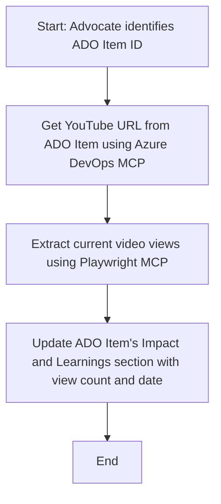

<!--
CO_OP_TRANSLATOR_METADATA:
{
  "original_hash": "14a2dfbea55ef735660a06bd6bdfe5f3",
  "translation_date": "2025-06-13T21:32:21+00:00",
  "source_file": "09-CaseStudy/UpdateADOItemsFromYT.md",
  "language_code": "tw"
}
-->
# Case Study: 使用 MCP 從 YouTube 資料更新 Azure DevOps 項目

> **免責聲明：** 市面上已有許多線上工具和報告，可以自動化從 YouTube 等平台取得資料並更新 Azure DevOps 項目的流程。以下情境僅作為範例，說明如何利用 MCP 工具來實現自動化與整合。

## 概覽

本案例展示如何利用 Model Context Protocol (MCP) 及其工具，自動化從線上平台（如 YouTube）取得資訊並更新 Azure DevOps (ADO) 工作項目的流程。此情境只是這些工具廣泛應用的其中一個範例，能夠依需求調整用於其他類似的自動化場景。

在此範例中，Advocate 透過 ADO 項目追蹤線上課程，每個項目都包含 YouTube 影片網址。藉由 MCP 工具，Advocate 可以定期自動更新 ADO 項目中的影片觀看次數等最新指標。此方法也可套用於需要將線上資料整合進 ADO 或其他系統的其他應用場景。

## 情境說明

Advocate 負責追蹤線上課程及社群互動的影響力。每場課程會以 ADO 工作項目紀錄於 'DevRel' 專案中，且工作項目包含 YouTube 影片網址欄位。為了準確報告課程觸及範圍，Advocate 需要更新 ADO 項目，填入當前的影片觀看次數及取得資料的日期。

## 使用工具

- [Azure DevOps MCP](https://github.com/microsoft/azure-devops-mcp)：透過 MCP 程式化存取並更新 ADO 工作項目。
- [Playwright MCP](https://github.com/microsoft/playwright-mcp)：自動化瀏覽器操作，從網頁抓取即時資料，如 YouTube 影片統計數據。

## 逐步工作流程

1. **辨識 ADO 項目**：從 'DevRel' 專案中取得 ADO 工作項目 ID（例如 1234）。
2. **取得 YouTube 網址**：使用 Azure DevOps MCP 工具從該工作項目抓取 YouTube 網址。
3. **擷取影片觀看數**：用 Playwright MCP 工具前往該 YouTube 網址，擷取目前觀看次數。
4. **更新 ADO 項目**：利用 Azure DevOps MCP 工具，將最新觀看數與資料取得日期寫入 ADO 工作項目的「Impact and Learnings」區塊。

## 範例指令

```bash
- Work with the ADO Item ID: 1234
- The project is '2025-Awesome'
- Get the YouTube URL for the ADO item
- Use Playwright to get the current views from the YouTube video
- Update the ADO item with the current video views and the updated date of the information
```

## Mermaid 流程圖



## 技術實作

- **MCP 編排**：整個流程由 MCP 伺服器協調，結合 Azure DevOps MCP 與 Playwright MCP 工具使用。
- **自動化**：此流程可手動觸發，或排程定時執行，確保 ADO 項目資料保持最新。
- **可擴充性**：同樣模式可擴展為更新其他線上指標（如按讚數、留言數），或從其他平台抓取資料。

## 成效與影響

- **效率提升**：減少 Advocate 手動查詢與更新影片數據的工作量。
- **資料準確**：確保 ADO 項目反映最新的線上數據。
- **流程可重複使用**：提供一套可重複利用的工作流程，適用於其他類似資料來源或指標的情境。

## 參考資料

- [Azure DevOps MCP](https://github.com/microsoft/azure-devops-mcp)
- [Playwright MCP](https://github.com/microsoft/playwright-mcp)
- [Model Context Protocol (MCP)](https://modelcontextprotocol.io/)

**免責聲明**：  
本文件係使用 AI 翻譯服務 [Co-op Translator](https://github.com/Azure/co-op-translator) 進行翻譯。雖然我們努力追求準確性，但請注意，自動翻譯可能包含錯誤或不準確之處。原始文件的母語版本應被視為權威來源。對於重要資訊，建議採用專業人工翻譯。我們不對因使用本翻譯而產生的任何誤解或誤譯負責。