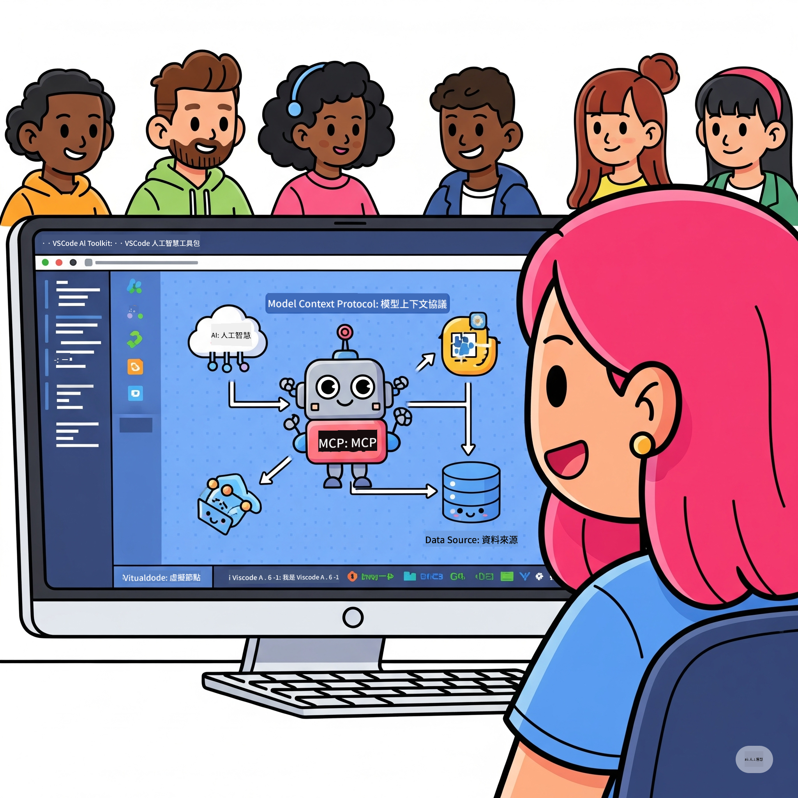

<!--
CO_OP_TRANSLATOR_METADATA:
{
  "original_hash": "1b000fd6e1b04c047578bfc5d07d54eb",
  "translation_date": "2025-07-28T23:37:44+00:00",
  "source_file": "10-StreamliningAIWorkflowsBuildingAnMCPServerWithAIToolkit/README.md",
  "language_code": "tw"
}
-->
# 精簡 AI 工作流程：使用 AI Toolkit 建立 MCP 伺服器

  
  

## 🎯 概述

_（點擊上方圖片觀看本課程影片）_

歡迎來到 **Model Context Protocol (MCP) 工作坊**！這是一個全面的實作課程，結合兩項尖端技術，徹底改變 AI 應用開發方式：

- **🔗 Model Context Protocol (MCP)**：一個開放標準，用於無縫整合 AI 工具  
- **🛠️ Visual Studio Code 的 AI Toolkit (AITK)**：微軟強大的 AI 開發擴展工具  

### 🎓 你將學到什麼

完成本工作坊後，你將掌握構建智慧應用的技巧，能夠將 AI 模型與現實世界的工具和服務相結合。從自動化測試到自訂 API 整合，你將獲得解決複雜業務挑戰的實用技能。

## 🏗️ 技術堆疊

### 🔌 Model Context Protocol (MCP)

MCP 是 AI 領域的 **"USB-C"**——一個連接 AI 模型與外部工具和數據源的通用標準。

**✨ 主要特性：**

- 🔄 **標準化整合**：為 AI 工具連接提供通用介面  
- 🏛️ **靈活架構**：通過 stdio/SSE 傳輸支持本地和遠端伺服器  
- 🧰 **豐富生態系統**：工具、提示和資源集於一體  
- 🔒 **企業級準備**：內建安全性與可靠性  

**🎯 MCP 的重要性：**  
就像 USB-C 消除了線纜混亂，MCP 消除了 AI 整合的複雜性。一個協議，無限可能。

### 🤖 Visual Studio Code 的 AI Toolkit (AITK)

微軟的旗艦 AI 開發擴展工具，將 VS Code 轉變為 AI 開發的強大平台。

**🚀 核心功能：**

- 📦 **模型目錄**：訪問來自 Azure AI、GitHub、Hugging Face、Ollama 的模型  
- ⚡ **本地推理**：基於 ONNX 的 CPU/GPU/NPU 優化執行  
- 🏗️ **代理構建器**：可視化 AI 代理開發，支持 MCP 整合  
- 🎭 **多模態支持**：文本、視覺和結構化輸出  

**💡 開發優勢：**

- 零配置模型部署  
- 可視化提示工程  
- 實時測試操作台  
- 無縫整合 MCP 伺服器  

## 📚 學習旅程

### [🚀 模組 1：AI Toolkit 基礎](./lab1/README.md)

**時長**：15 分鐘  

- 🛠️ 安裝並配置 AI Toolkit for VS Code  
- 🗂️ 探索模型目錄（來自 GitHub、ONNX、OpenAI、Anthropic、Google 的 100+ 模型）  
- 🎮 掌握互動操作台，進行實時模型測試  
- 🤖 使用代理構建器建立你的第一個 AI 代理  
- 📊 使用內建指標（F1、相關性、相似性、一致性）評估模型性能  
- ⚡ 學習批量處理和多模態支持功能  

**🎯 學習成果**：建立一個功能性 AI 代理，全面了解 AITK 的功能  

### [🌐 模組 2：MCP 與 AI Toolkit 基礎](./lab2/README.md)

**時長**：20 分鐘  

- 🧠 掌握 Model Context Protocol (MCP) 的架構與概念  
- 🌐 探索微軟的 MCP 伺服器生態系統  
- 🤖 使用 Playwright MCP 伺服器構建瀏覽器自動化代理  
- 🔧 將 MCP 伺服器整合到 AI Toolkit 代理構建器中  
- 📊 配置並測試代理中的 MCP 工具  
- 🚀 將基於 MCP 的代理導出並部署到生產環境  

**🎯 學習成果**：部署一個通過外部工具增強的 AI 代理  

### [🔧 模組 3：使用 AI Toolkit 進行進階 MCP 開發](./lab3/README.md)

**時長**：20 分鐘  

- 💻 使用 AI Toolkit 創建自訂 MCP 伺服器  
- 🐍 配置並使用最新的 MCP Python SDK (v1.9.3)  
- 🔍 設置並使用 MCP Inspector 進行除錯  
- 🛠️ 使用專業除錯工作流程構建一個天氣 MCP 伺服器  
- 🧪 在代理構建器和 Inspector 環境中除錯 MCP 伺服器  

**🎯 學習成果**：使用現代工具開發並除錯自訂 MCP 伺服器  

### [🐙 模組 4：實用 MCP 開發 - 自訂 GitHub Clone 伺服器](./lab4/README.md)

**時長**：30 分鐘  

- 🏗️ 為開發工作流構建一個實用的 GitHub Clone MCP 伺服器  
- 🔄 實現智能倉庫克隆，包含驗證與錯誤處理  
- 📁 創建智能目錄管理與 VS Code 整合  
- 🤖 使用 GitHub Copilot 代理模式與自訂 MCP 工具  
- 🛡️ 應用生產級可靠性與跨平台兼容性  

**🎯 學習成果**：部署一個生產級 MCP 伺服器，優化實際開發工作流  

## 💡 實際應用與影響

### 🏢 企業應用場景

#### 🔄 DevOps 自動化

透過智能自動化改造你的開發工作流：

- **智能倉庫管理**：AI 驅動的代碼審查與合併決策  
- **智能 CI/CD**：基於代碼變更的自動化管道優化  
- **問題分類**：自動化錯誤分類與分配  

#### 🧪 品質保證革命

透過 AI 驅動的自動化提升測試效率：

- **智能測試生成**：自動創建全面的測試套件  
- **視覺回歸測試**：AI 驅動的 UI 變更檢測  
- **性能監控**：主動識別與解決問題  

#### 📊 數據管道智能化

構建更智能的數據處理工作流：

- **自適應 ETL 流程**：自我優化的數據轉換  
- **異常檢測**：實時數據質量監控  
- **智能路由**：智能化數據流管理  

#### 🎧 客戶體驗提升

創造卓越的客戶互動：

- **情境感知支持**：具備客戶歷史訪問能力的 AI 代理  
- **主動問題解決**：預測性客戶服務  
- **多渠道整合**：跨平台統一的 AI 體驗  

## 🛠️ 先決條件與設置

### 💻 系統需求

| 組件 | 要求 | 備註 |
|------|------|------|
| **作業系統** | Windows 10+、macOS 10.15+、Linux | 任意現代作業系統 |
| **Visual Studio Code** | 最新穩定版本 | 必須安裝 AITK |
| **Node.js** | v18.0+ 和 npm | 用於 MCP 伺服器開發 |
| **Python** | 3.10+ | 選用於 Python MCP 伺服器 |
| **記憶體** | 最低 8GB RAM | 本地模型建議 16GB |

### 🔧 開發環境

#### 推薦的 VS Code 擴展

- **AI Toolkit** (ms-windows-ai-studio.windows-ai-studio)  
- **Python** (ms-python.python)  
- **Python Debugger** (ms-python.debugpy)  
- **GitHub Copilot** (GitHub.copilot) - 選用但有幫助  

#### 選用工具

- **uv**：現代 Python 套件管理器  
- **MCP Inspector**：MCP 伺服器的可視化除錯工具  
- **Playwright**：用於網頁自動化範例  

## 🎖️ 學習成果與認證路徑

### 🏆 技能掌握清單

完成本工作坊後，你將掌握以下技能：

#### 🎯 核心能力

- [ ] **MCP 協議掌握**：深入理解架構與實作模式  
- [ ] **AITK 熟練度**：專家級使用 AI Toolkit 進行快速開發  
- [ ] **自訂伺服器開發**：構建、部署並維護生產級 MCP 伺服器  
- [ ] **工具整合能力**：無縫連接 AI 與現有開發工作流  
- [ ] **問題解決應用**：將所學技能應用於實際業務挑戰  

#### 🔧 技術技能

- [ ] 設置並配置 AI Toolkit in VS Code  
- [ ] 設計並實作自訂 MCP 伺服器  
- [ ] 將 GitHub 模型整合到 MCP 架構中  
- [ ] 使用 Playwright 構建自動化測試工作流  
- [ ] 部署 AI 代理到生產環境  
- [ ] 除錯並優化 MCP 伺服器性能  

#### 🚀 進階能力

- [ ] 架構企業級 AI 整合方案  
- [ ] 實施 AI 應用的安全最佳實踐  
- [ ] 設計可擴展的 MCP 伺服器架構  
- [ ] 為特定領域創建自訂工具鏈  
- [ ] 指導他人進行 AI 原生開發  

## 📖 其他資源

- [MCP 規範](https://modelcontextprotocol.io/docs)  
- [AI Toolkit GitHub 儲存庫](https://github.com/microsoft/vscode-ai-toolkit)  
- [MCP 伺服器範例集合](https://github.com/modelcontextprotocol/servers)  
- [最佳實踐指南](https://modelcontextprotocol.io/docs/best-practices)  

---

**🚀 準備好徹底改變你的 AI 開發工作流程了嗎？**

讓我們一起使用 MCP 和 AI Toolkit 構建智慧應用的未來！

**免責聲明**：  
本文件使用 AI 翻譯服務 [Co-op Translator](https://github.com/Azure/co-op-translator) 進行翻譯。我們致力於提供準確的翻譯，但請注意，自動翻譯可能包含錯誤或不準確之處。應以原始語言的文件作為權威來源。對於關鍵資訊，建議尋求專業人工翻譯。我們對因使用此翻譯而引起的任何誤解或誤讀概不負責。