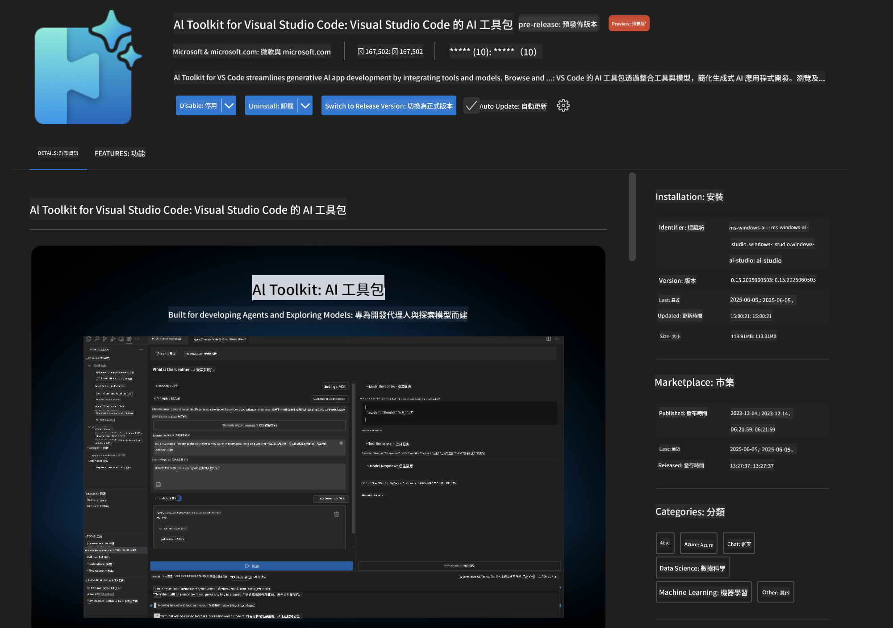
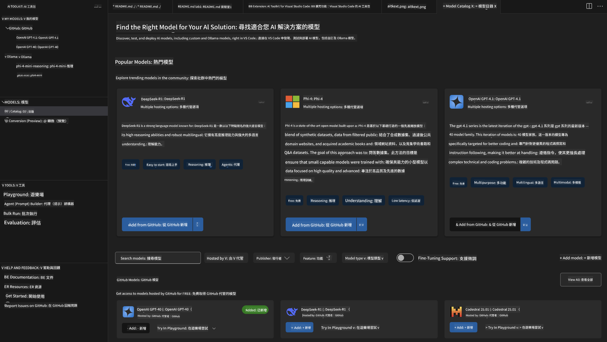
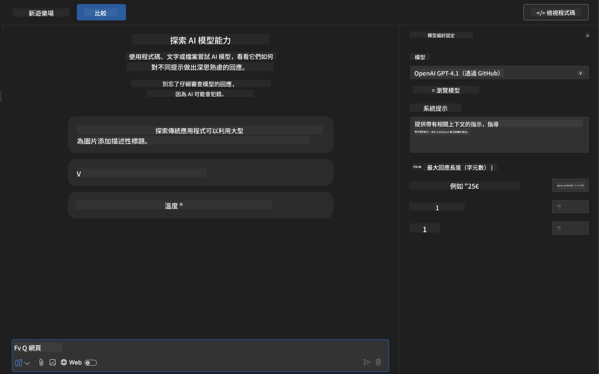
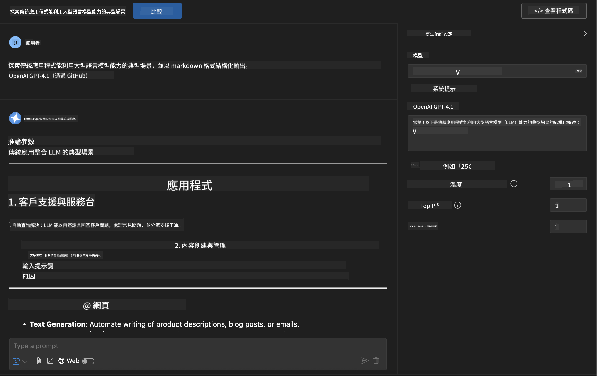
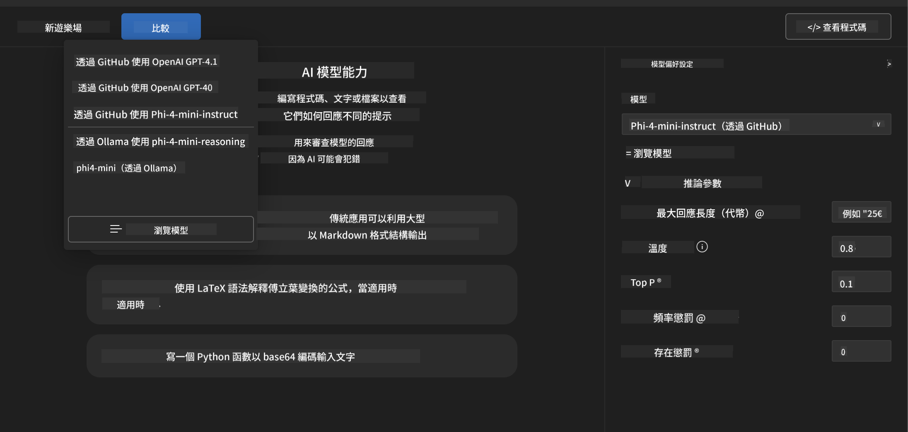
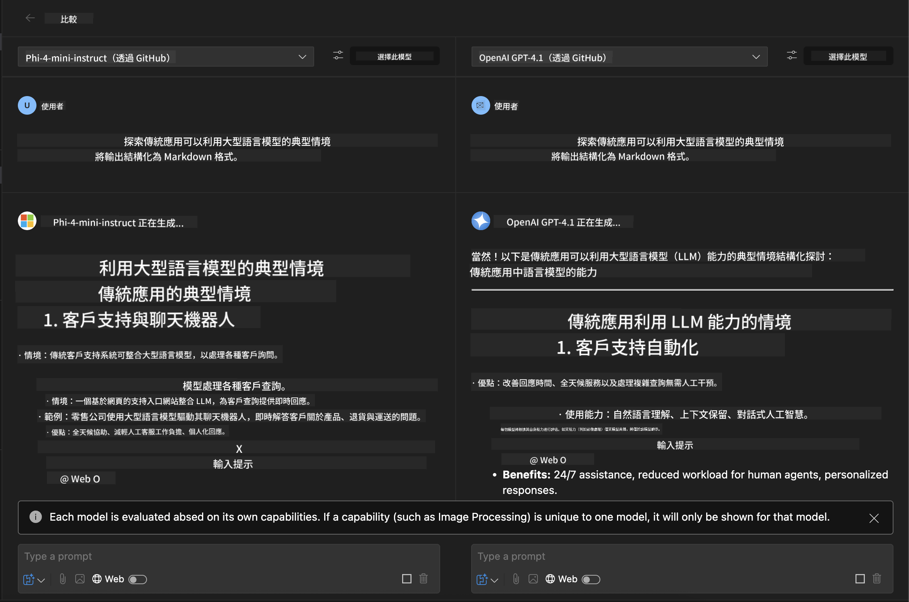
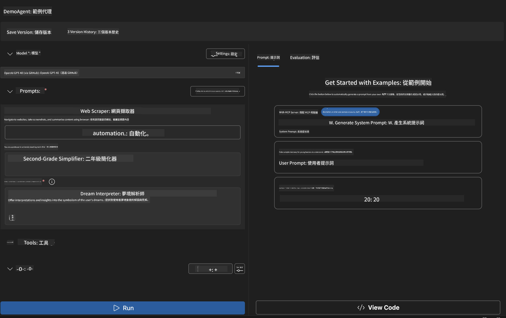
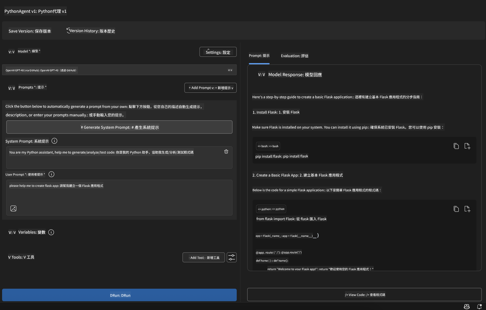

<!--
CO_OP_TRANSLATOR_METADATA:
{
  "original_hash": "2aa9dbc165e104764fa57e8a0d3f1c73",
  "translation_date": "2025-06-10T05:13:01+00:00",
  "source_file": "10-StreamliningAIWorkflowsBuildingAnMCPServerWithAIToolkit/lab1/README.md",
  "language_code": "tw"
}
-->
# 🚀 模組 1：AI Toolkit 基礎知識

[]()
[]()
[]()

## 📋 學習目標

完成本模組後，你將能夠：
- ✅ 安裝並設定 Visual Studio Code 的 AI Toolkit
- ✅ 瀏覽 Model Catalog 並了解不同模型來源
- ✅ 使用 Playground 進行模型測試與實驗
- ✅ 使用 Agent Builder 建立自訂 AI 代理人
- ✅ 比較不同供應商的模型效能
- ✅ 應用最佳提示工程實務

## 🧠 AI Toolkit (AITK) 簡介

**Visual Studio Code 的 AI Toolkit** 是微軟的旗艦擴充套件，將 VS Code 轉變為完整的 AI 開發環境。它串連 AI 研究與實務應用開發，讓各種程度的開發者都能輕鬆使用生成式 AI。

### 🌟 主要功能

| 功能 | 說明 | 使用情境 |
|---------|-------------|----------|
| **🗂️ Model Catalog** | 存取超過 100 款來自 GitHub、ONNX、OpenAI、Anthropic、Google 的模型 | 模型搜尋與選擇 |
| **🔌 BYOM 支援** | 整合你自己的模型（本地或遠端） | 自訂模型部署 |
| **🎮 互動式 Playground** | 即時模型測試與聊天介面 | 快速原型設計與測試 |
| **📎 多模態支援** | 處理文字、圖片與附件 | 複雜 AI 應用 |
| **⚡ 批次處理** | 同時執行多個提示 | 高效測試流程 |
| **📊 模型評估** | 內建指標（F1、相關性、相似度、一致性） | 效能評估 |

### 🎯 為什麼 AI Toolkit 很重要

- **🚀 加速開發**：從想法到原型只需幾分鐘
- **🔄 統一工作流程**：一個介面整合多個 AI 供應商
- **🧪 簡易實驗**：無需複雜設定即可比較模型
- **📈 生產就緒**：無縫從原型轉向部署

## 🛠️ 先決條件與設定

### 📦 安裝 AI Toolkit 擴充套件

**步驟 1：進入擴充套件市集**
1. 開啟 Visual Studio Code
2. 前往擴充套件視圖（`Ctrl+Shift+X` 或 `Cmd+Shift+X`）
3. 搜尋「AI Toolkit」

**步驟 2：選擇版本**
- **🟢 正式版**：建議用於正式環境
- **🔶 預覽版**：搶先體驗最新功能

**步驟 3：安裝並啟用**



### ✅ 驗證清單
- [ ] AI Toolkit 圖示出現在 VS Code 側邊欄
- [ ] 擴充套件已啟用並運作中
- [ ] 輸出面板無安裝錯誤訊息

## 🧪 實作練習 1：探索 GitHub 模型

**🎯 目標**：熟悉 Model Catalog 並測試你的第一個 AI 模型

### 📊 步驟 1：瀏覽 Model Catalog

Model Catalog 是你進入 AI 生態系的入口，整合多家供應商的模型，方便你搜尋與比較。

**🔍 導覽指南：**

點選 AI Toolkit 側邊欄的 **MODELS - Catalog**



**💡 小技巧**：尋找符合你需求的特定能力模型（例如：程式碼生成、創意寫作、分析等）。

**⚠️ 注意**：GitHub 托管的模型（即 GitHub Models）可免費使用，但會有請求與令牌速率限制。若要使用非 GitHub 模型（例如透過 Azure AI 或其他端點的外部模型），需提供相應的 API 金鑰或認證。

### 🚀 步驟 2：新增並設定你的第一個模型

**模型選擇策略：**
- **GPT-4.1**：適合複雜推理與分析
- **Phi-4-mini**：輕量快速，適合簡單任務

**🔧 設定流程：**
1. 從目錄選擇 **OpenAI GPT-4.1**
2. 點選 **Add to My Models**，將模型註冊到你的清單
3. 選擇 **Try in Playground** 開啟測試環境
4. 等待模型初始化（首次設定可能需稍候）



**⚙️ 了解模型參數：**
- **Temperature**：控制創意度（0 = 確定性，1 = 創意）
- **Max Tokens**：回應最大長度
- **Top-p**：用於多樣性回應的核採樣

### 🎯 步驟 3：熟悉 Playground 介面

Playground 是你的 AI 實驗室，以下是發揮最大效益的方法：

**🎨 提示工程最佳實務：**
1. **具體明確**：清楚詳細的指令能得到更好結果
2. **提供背景**：包含相關背景資訊
3. **使用範例**：用範例示範你想要的內容
4. **反覆調整**：根據初步結果優化提示

**🧪 測試情境：**
```markdown
# Example 1: Code Generation
"Write a Python function that calculates the factorial of a number using recursion. Include error handling and docstrings."

# Example 2: Creative Writing
"Write a professional email to a client explaining a project delay, maintaining a positive tone while being transparent about challenges."

# Example 3: Data Analysis
"Analyze this sales data and provide insights: [paste your data]. Focus on trends, anomalies, and actionable recommendations."
```



### 🏆 挑戰練習：模型效能比較

**🎯 目標**：使用相同提示比較不同模型，了解它們的優勢

**📋 操作說明：**
1. 將 **Phi-4-mini** 加入你的工作區
2. 對 GPT-4.1 與 Phi-4-mini 使用相同提示



3. 比較回應品質、速度與準確度
4. 在結果區記錄你的觀察



**💡 重要觀察點：**
- 何時使用大型語言模型（LLM）或小型語言模型（SLM）
- 成本與效能的取捨
- 不同模型的專長能力

## 🤖 實作練習 2：使用 Agent Builder 建立自訂代理人

**🎯 目標**：打造針對特定任務與工作流程的專屬 AI 代理人

### 🏗️ 步驟 1：認識 Agent Builder

Agent Builder 是 AI Toolkit 的核心特色。它讓你創造專用的 AI 助手，結合大型語言模型的強大能力與自訂指令、參數和專業知識。

**🧠 代理人架構元件：**
- **核心模型**：基礎 LLM（GPT-4、Groks、Phi 等）
- **系統提示**：定義代理人個性與行為
- **參數設定**：最佳化效能的微調選項
- **工具整合**：連接外部 API 與 MCP 服務
- **記憶體**：對話上下文與會話持續性



### ⚙️ 步驟 2：深入代理人設定

**🎨 創建有效系統提示：**
```markdown
# Template Structure:
## Role Definition
You are a [specific role] with expertise in [domain].

## Capabilities
- List specific abilities
- Define scope of knowledge
- Clarify limitations

## Behavior Guidelines
- Response style (formal, casual, technical)
- Output format preferences
- Error handling approach

## Examples
Provide 2-3 examples of ideal interactions
```

*當然，你也可以使用 Generate System Prompt 功能，讓 AI 幫助你產生與優化提示*

**🔧 參數優化建議：**
| 參數 | 推薦範圍 | 使用情境 |
|-----------|------------------|----------|
| **Temperature** | 0.1-0.3 | 技術性／事實回應 |
| **Temperature** | 0.7-0.9 | 創意／腦力激盪任務 |
| **Max Tokens** | 500-1000 | 簡潔回應 |
| **Max Tokens** | 2000-4000 | 詳細說明 |

### 🐍 步驟 3：實務練習 - Python 程式代理人

**🎯 任務**：打造專門的 Python 程式輔助助手

**📋 設定步驟：**

1. **模型選擇**：挑選 **Claude 3.5 Sonnet**（擅長程式碼）

2. **系統提示設計**：
```markdown
# Python Programming Expert Agent

## Role
You are a senior Python developer with 10+ years of experience. You excel at writing clean, efficient, and well-documented Python code.

## Capabilities
- Write production-ready Python code
- Debug complex issues
- Explain code concepts clearly
- Suggest best practices and optimizations
- Provide complete working examples

## Response Format
- Always include docstrings
- Add inline comments for complex logic
- Suggest testing approaches
- Mention relevant libraries when applicable

## Code Quality Standards
- Follow PEP 8 style guidelines
- Use type hints where appropriate
- Handle exceptions gracefully
- Write readable, maintainable code
```

3. **參數設定**：
   - Temperature：0.2（保持穩定且可靠的程式碼）
   - Max Tokens：2000（提供詳盡解說）
   - Top-p：0.9（平衡創意）



### 🧪 步驟 4：測試你的 Python 代理人

**測試場景：**
1. **基本功能**：「寫一個函式找出質數」
2. **複雜演算法**：「實作一個包含插入、刪除與搜尋方法的二元搜尋樹」
3. **實務問題**：「打造一個可處理速率限制與重試的網路爬蟲」
4. **除錯**：「修正這段程式碼 [貼上錯誤程式碼]」

**🏆 成功標準：**
- ✅ 程式碼可正常執行
- ✅ 包含適當文件說明
- ✅ 遵守 Python 最佳實務
- ✅ 提供清楚解釋
- ✅ 建議改進方案

## 🎓 模組 1 總結與後續步驟

### 📊 知識檢核

測試你的理解：
- [ ] 能說明目錄中模型的差異嗎？
- [ ] 成功建立並測試過自訂代理人嗎？
- [ ] 瞭解如何為不同使用情境優化參數嗎？
- [ ] 能設計有效的系統提示嗎？

### 📚 延伸資源

- **AI Toolkit 文件**：[Official Microsoft Docs](https://github.com/microsoft/vscode-ai-toolkit)
- **提示工程指南**：[Best Practices](https://platform.openai.com/docs/guides/prompt-engineering)
- **AI Toolkit 中的模型**：[Models in Develpment](https://github.com/microsoft/vscode-ai-toolkit/blob/main/doc/models.md)

**🎉 恭喜！** 你已掌握 AI Toolkit 的基礎，準備好打造更進階的 AI 應用！

### 🔜 繼續下一模組

想學更多進階功能嗎？繼續前往 **[Module 2: MCP with AI Toolkit Fundamentals](../lab2/README.md)**，你將學習如何：
- 使用 Model Context Protocol (MCP) 連接代理人與外部工具
- 建立 Playwright 瀏覽器自動化代理人
- 將 MCP 伺服器整合到 AI Toolkit 代理人中
- 透過外部資料與功能強化你的代理人

**免責聲明**：  
本文件係使用 AI 翻譯服務 [Co-op Translator](https://github.com/Azure/co-op-translator) 所翻譯。雖然我們致力於準確性，但請注意自動翻譯可能包含錯誤或不準確之處。原始文件之母語版本應視為權威來源。對於重要資訊，建議採用專業人工翻譯。我們不對因使用本翻譯而產生之任何誤解或誤譯負責。