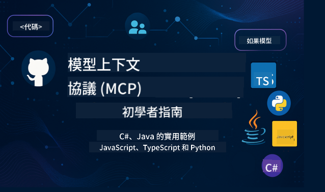

<!--
CO_OP_TRANSLATOR_METADATA:
{
  "original_hash": "2a21391378c12ecfef50f866329dfde0",
  "translation_date": "2025-05-17T05:19:58+00:00",
  "source_file": "README.md",
  "language_code": "tw"
}
-->

遵循以下步驟開始使用這些資源：
1. **分叉這個倉庫**：點擊 
2. **克隆這個倉庫**：`git clone https://github.com/microsoft/mcp-for-beginners.git`
3. [**加入 Microsoft Azure AI Foundry Discord，與專家和其他開發者交流**](https://discord.com/invite/ByRwuEEgH4)

### 🌐 多語言支持

#### 通過 GitHub Action 支持（自動化並始終保持最新）
[法文](../fr/README.md) | [西班牙文](../es/README.md) | [德文](../de/README.md) | [俄文](../ru/README.md) | [阿拉伯文](../ar/README.md) | [波斯文（法西）](../fa/README.md) | [烏爾都文](../ur/README.md) | [中文（簡體）](../zh/README.md) | [中文（繁體，澳門）](../mo/README.md) | [中文（繁體，香港）](../hk/README.md) | [中文（繁體，台灣）](./README.md) | [日文](../ja/README.md) | [韓文](../ko/README.md) | [印地文](../hi/README.md) | [孟加拉文](../bn/README.md) | [馬拉地文](../mr/README.md) | [尼泊爾文](../ne/README.md) | [旁遮普文（古木基）](../pa/README.md) | [葡萄牙文（葡萄牙）](../pt/README.md) | [葡萄牙文（巴西）](../br/README.md) | [義大利文](../it/README.md) | [波蘭文](../pl/README.md) | [土耳其文](../tr/README.md) | [希臘文](../el/README.md) | [泰文](../th/README.md) | [瑞典文](../sv/README.md) | [丹麥文](../da/README.md) | [挪威文](../no/README.md) | [芬蘭文](../fi/README.md) | [荷蘭文](../nl/README.md) | [希伯來文](../he/README.md) | [越南文](../vi/README.md) | [印尼文](../id/README.md) | [馬來文](../ms/README.md) | [塔加洛文（菲律賓）](../tl/README.md) | [斯瓦希里文](../sw/README.md) | [匈牙利文](../hu/README.md) | [捷克文](../cs/README.md) | [斯洛伐克文](../sk/README.md) | [羅馬尼亞文](../ro/README.md) | [保加利亞文](../bg/README.md) | [塞爾維亞文（西里爾字母）](../sr/README.md) | [克羅埃西亞文](../hr/README.md) | [斯洛文尼亞文](../sl/README.md)請從左到右書寫輸出。
# 🚀 新手的模型上下文协议 (MCP) 课程终极指南

## **通过 C#、Java、JavaScript、Python 和 TypeScript 的实战代码示例学习 MCP**

## 🧠 模型上下文协议课程概述

**模型上下文协议 (MCP)** 是一个前沿框架，旨在标准化 AI 模型与客户端应用之间的交互。这个开源课程提供了一个结构化的学习路径，包含实用的编码示例和真实世界的使用案例，涵盖流行的编程语言如 C#、Java、JavaScript、TypeScript 和 Python。

无论您是 AI 开发人员、系统架构师，还是软件工程师，本指南都是您掌握 MCP 基础和实施策略的全面资源。

## 🔗 官方 MCP 资源

- 📘 [MCP 文档](https://modelcontextprotocol.io/) – 详细的教程和用户指南  
- 📜 [MCP 规范](https://spec.modelcontextprotocol.io/) – 协议架构和技术参考  
- 🧑‍💻 [MCP GitHub 仓库](https://github.com/modelcontextprotocol) – 开源 SDK、工具和代码示例  

## 🧭 完整的 MCP 课程结构

### 📌 [MCP 简介](./00-Introduction/README.md)

- 什么是模型上下文协议？
- 为什么标准化在 AI 管道中很重要
- MCP 的实际使用案例和好处

### 🧩 [核心概念解释](./01-CoreConcepts/README.md)

- 理解 MCP 中的客户端-服务器架构
- 关键协议组件：请求、响应和模式
- MCP 消息传递和数据交换模式

### 🔐 [MCP 中的安全性](./02-Security/readme.md)

- 识别基于 MCP 的系统中的安全威胁
- 确保实施的技术和最佳实践

### 🚀 [MCP 入门](./03-GettingStarted/README.md)

- 环境设置和配置
- 创建基本的 MCP 服务器和客户端
- 将 MCP 集成到现有应用程序中

#### 🧮 MCP 计算器示例项目：

  
<strong>按语言探索代码实现</strong>

  - [C# MCP 服务器示例](./03-GettingStarted/samples/csharp/README.md)
  - [Java MCP 计算器](./03-GettingStarted/samples/java/calculator/README.md)
  - [JavaScript MCP 演示](./03-GettingStarted/samples/javascript/README.md)
  - [Python MCP 服务器](../../03-GettingStarted/samples/python/mcp_calculator_server.py)
  - [TypeScript MCP 示例](./03-GettingStarted/samples/typescript/README.md)

### 🛠️ [实用实施](./04-PracticalImplementation/README.md)

- 在不同语言中使用 SDK
- 调试、测试和验证
- 制作可重用的提示模板和工作流

#### 💡 MCP 高级计算器项目：

  
<strong>探索高级示例</strong>

  - [高级 C# 示例](./04-PracticalImplementation/samples/csharp/README.md)
  - [Java 容器应用示例](./04-PracticalImplementation/samples/java/containerapp/README.md)
  - [JavaScript 高级示例](./04-PracticalImplementation/samples/javascript/README.md)
  - [Python 复杂实现](../../04-PracticalImplementation/samples/python/mcp_sample.py)
  - [TypeScript 容器示例](./04-PracticalImplementation/samples/typescript/README.md)

### 🎓 [MCP 高级主题](./05-AdvancedTopics/README.md)

- 多模态 AI 工作流和可扩展性
- 安全的扩展策略
- 企业生态系统中的 MCP

### 🌍 [社区贡献](./06-CommunityContributions/README.md)

- 如何贡献代码和文档
- 通过 GitHub 协作
- 社区驱动的增强和反馈

### 📈 [早期采用的见解](./07-CaseStudies/README.md)

- 真实世界的实施和成功经验
- 构建和部署基于 MCP 的解决方案
- 趋势和未来路线图

### 📏 [MCP 的最佳实践](./08-BestPractices/README.md)

- 性能调优和优化
- 设计容错的 MCP 系统
- 测试和弹性策略

### 📊 [MCP 案例研究](./09-CaseStudy/Readme.md)

- 深入了解 MCP 解决方案架构
- 部署蓝图和集成技巧
- 带注释的图表和项目演练

## 🎯 学习 MCP 的先决条件

为了最大化本课程的收益，您应该具备：

- C#、Java 或 Python 的基础知识
- 理解客户端-服务器模型和 API
- （可选）熟悉机器学习概念

## 🛠️ 如何有效使用本课程

本指南中的每节课包括：

1. 对 MCP 概念的清晰解释  
2. 多种语言的实时代码示例  
3. 构建真实 MCP 应用的练习  
4. 高级学习者的额外资源  

## 📜 许可信息

本内容根据 **MIT 许可证** 授权。有关条款和条件，请参见 [LICENSE](../../LICENSE)。

## 🤝 贡献指南

本项目欢迎贡献和建议。大多数贡献要求您同意贡献者许可协议 (CLA)，声明您有权利并确实授予我们使用您贡献的权利。详情请访问 <https://cla.opensource.microsoft.com>。

当您提交拉取请求时，CLA 机器人会自动确定您是否需要提供 CLA 并适当装饰 PR（例如，状态检查、评论）。只需按照机器人提供的说明进行操作。您只需在使用我们 CLA 的所有仓库中执行一次此操作。

本项目采用了 [Microsoft 开源行为准则](https://opensource.microsoft.com/codeofconduct/)。有关更多信息，请参阅 [行为准则常见问题解答](https://opensource.microsoft.com/codeofconduct/faq/) 或联系 [opencode@microsoft.com](mailto:opencode@microsoft.com) 提出任何其他问题或意见。

## ™️ 商标声明

本项目可能包含项目、产品或服务的商标或徽标。授权使用 Microsoft 商标或徽标必须遵循 [Microsoft 的商标和品牌指南](https://www.microsoft.com/legal/intellectualproperty/trademarks/usage/general)。在本项目的修改版本中使用 Microsoft 商标或徽标不得引起混淆或暗示 Microsoft 的赞助。使用第三方商标或徽标需遵循第三方的政策。

**免責聲明**：  
本文檔已使用AI翻譯服務[Co-op Translator](https://github.com/Azure/co-op-translator)進行翻譯。我們努力確保準確性，但請注意，自動翻譯可能包含錯誤或不準確之處。應以原文檔作為權威來源。對於關鍵信息，建議尋求專業人工翻譯。我們對使用此翻譯而產生的任何誤解或錯誤不承擔責任。