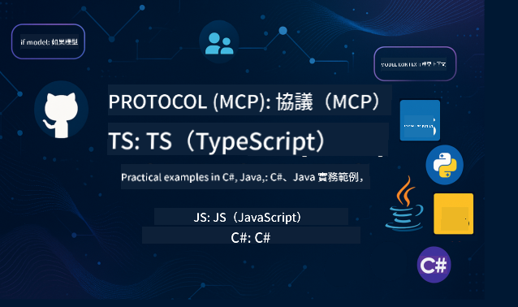

<!--
CO_OP_TRANSLATOR_METADATA:
{
  "original_hash": "35fe22b9167cb7be62fddbcf53a255f4",
  "translation_date": "2025-07-17T09:44:55+00:00",
  "source_file": "README.md",
  "language_code": "tw"
}
-->
 

請依照以下步驟開始使用這些資源：
1. **Fork 此儲存庫**：點擊 
2. **Clone 此儲存庫**：`git clone https://github.com/microsoft/mcp-for-beginners.git`
3. [**加入 Azure AI Foundry Discord，與專家及開發者交流**](https://discord.com/invite/ByRwuEEgH4)

### 🌐 多語言支援

#### 透過 GitHub Action 支援（自動且持續更新）

[法文](../fr/README.md) | [西班牙文](../es/README.md) | [德文](../de/README.md) | [俄文](../ru/README.md) | [阿拉伯文](../ar/README.md) | [波斯文 (Farsi)](../fa/README.md) | [烏爾都文](../ur/README.md) | [中文 (簡體)](../zh/README.md) | [中文 (繁體，澳門)](../mo/README.md) | [中文 (繁體，香港)](../hk/README.md) | [中文 (繁體，台灣)](./README.md) | [日文](../ja/README.md) | [韓文](../ko/README.md) | [印地文](../hi/README.md) | [孟加拉文](../bn/README.md) | [馬拉地文](../mr/README.md) | [尼泊爾文](../ne/README.md) | [旁遮普文 (Gurmukhi)](../pa/README.md) | [葡萄牙文 (葡萄牙)](../pt/README.md) | [葡萄牙文 (巴西)](../br/README.md) | [義大利文](../it/README.md) | [波蘭文](../pl/README.md) | [土耳其文](../tr/README.md) | [希臘文](../el/README.md) | [泰文](../th/README.md) | [瑞典文](../sv/README.md) | [丹麥文](../da/README.md) | [挪威文](../no/README.md) | [芬蘭文](../fi/README.md) | [荷蘭文](../nl/README.md) | [希伯來文](../he/README.md) | [越南文](../vi/README.md) | [印尼文](../id/README.md) | [馬來文](../ms/README.md) | [他加祿文 (菲律賓語)](../tl/README.md) | [斯瓦希里文](../sw/README.md) | [匈牙利文](../hu/README.md) | [捷克文](../cs/README.md) | [斯洛伐克文](../sk/README.md) | [羅馬尼亞文](../ro/README.md) | [保加利亞文](../bg/README.md) | [塞爾維亞文 (西里爾字母)](../sr/README.md) | [克羅埃西亞文](../hr/README.md) | [斯洛維尼亞文](../sl/README.md) | [烏克蘭文](../uk/README.md) | [緬甸文 (Myanmar)](../my/README.md)

# 🚀 Model Context Protocol (MCP) 初學者課程

## **透過 C#、Java、JavaScript、Python 和 TypeScript 的實作範例學習 MCP**

## 🧠 Model Context Protocol 課程概覽

**Model Context Protocol (MCP)** 是一個先進的框架，旨在標準化 AI 模型與客戶端應用程式之間的互動。這套開源課程提供結構化的學習路徑，包含實務程式碼範例與真實案例，涵蓋 C#、Java、JavaScript、TypeScript 及 Python 等熱門程式語言。

無論你是 AI 開發者、系統架構師或軟體工程師，本指南都是你掌握 MCP 基礎與實作策略的完整資源。

## 🔗 官方 MCP 資源

- 📘 [MCP 文件](https://modelcontextprotocol.io/) – 詳細教學與使用指南  
- 📜 [MCP 規範](https://modelcontextprotocol.io/docs/) – 協議架構與技術參考  
- 📜 [原始 MCP 規範](https://spec.modelcontextprotocol.io/) – 傳統技術參考（可能包含更多細節）  
- 🧑‍💻 [MCP GitHub 儲存庫](https://github.com/modelcontextprotocol) – 開源 SDK、工具與程式碼範例
- 🌐 [MCP 社群](https://github.com/orgs/modelcontextprotocol/discussions) – 參與討論並貢獻社群

## 加入我們，參加 2025 年 7 月 29-30 日的 MCP 開發者日

準備好參加為期兩天的深入技術分享、社群交流與實作學習，MCP 開發者日是一場專注於 Model Context Protocol (MCP) 的線上活動 — 這個新興標準連結 AI 模型與其依賴的工具。

➡️ [註冊 MCP 開發者日](https://developer.microsoft.com/en-us/reactor/series/S-1563/)

你可以透過活動頁面 https://aka.ms/mcpdevdays 註冊觀看 MCP 開發者日，屆時可在 YouTube 或 Twitch 觀看直播。所有內容皆會錄製，並於活動後上傳至 Microsoft Developer YouTube 頻道。示範程式碼也會在 GitHub 上提供。

### 活動詳情
- 日期：7 月 29 日（第一天）及 7 月 30 日（第二天）
- 時間：每日太平洋標準時間上午 9:00
- 地點：線上，隨時隨地參加！

#### 第一天：MCP 生產力、開發工具與社群

專注於協助開發者將 MCP 融入開發流程，並慶祝精彩的 MCP 社群。我們將邀請社群成員與合作夥伴如 Arcade、Block、Okta 和 Neon，一同展示他們如何與 Microsoft 合作，打造開放且可擴充的 MCP 生態系。實際示範涵蓋 VS Code、Visual Studio、GitHub Copilot 及熱門社群工具。
- 實務且情境導向的開發流程
- 社群主導的議程與見解
無論你是剛接觸 MCP 或已在使用，第一天都將帶來靈感與可執行的收穫。

#### 第二天：自信打造 MCP 伺服器

專為 MCP 建置者設計，深入探討 MCP 伺服器的實作策略與最佳實務，並將 MCP 整合到你的 AI 工作流程中。

### 主題包括：

- 建立 MCP 伺服器並整合至代理體驗
- 以提示驅動的開發
- 安全最佳實務
- 使用 Functions、ACA 和 API 管理等組件
- 註冊表對齊與工具（第一方與第三方）

如果你是開發者、工具建置者或 AI 產品策略師，這一天將充滿你打造可擴展、安全且未來導向 MCP 解決方案所需的洞見。

## 🧭 MCP 課程總覽

### 📚 完整課程架構

| 模組 | 主題 | 說明 | 連結 |
|--------|-------|-------------|------|
| **模組 1-3：基礎篇** | | | |
| 00 | MCP 簡介 | Model Context Protocol 概述及其在 AI 流程中的重要性 | [閱讀更多](./00-Introduction/README.md) |
| 01 | 核心概念解析 | 深入探討 MCP 的核心概念 | [閱讀更多](./01-CoreConcepts/README.md) |
| 02 | MCP 安全性 | 安全威脅與最佳實務 | [閱讀更多](./02-Security/README.md) |
| 03 | MCP 入門 | 環境設定、基礎伺服器/客戶端、整合 | [閱讀更多](./03-GettingStarted/README.md) |
| **模組 3：打造你的第一個伺服器與客戶端** | | | |
| 3.1 | 第一個伺服器 | 建立你的第一個 MCP 伺服器 | [指南](./03-GettingStarted/01-first-server/README.md) |
| 3.2 | 第一個客戶端 | 開發基礎 MCP 客戶端 | [指南](./03-GettingStarted/02-client/README.md) |
| 3.3 | 搭配大型語言模型的客戶端 | 整合大型語言模型 | [指南](./03-GettingStarted/03-llm-client/README.md) |
| 3.4 | VS Code 整合 | 在 VS Code 中使用 MCP 伺服器 | [指南](./03-GettingStarted/04-vscode/README.md) |
| 3.5 | SSE 伺服器 | 使用 Server-Sent Events 建立伺服器 | [指南](./03-GettingStarted/05-sse-server/README.md) |
| 3.6 | HTTP 串流 | 在 MCP 中實作 HTTP 串流 | [指南](./03-GettingStarted/06-http-streaming/README.md) |
| 3.7 | AI 工具包 | 使用 AI 工具包搭配 MCP | [指南](./03-GettingStarted/07-aitk/README.md) |
| 3.8 | 測試 | 測試你的 MCP 伺服器實作 | [指南](./03-GettingStarted/08-testing/README.md) |
| 3.9 | 部署 | 將 MCP 伺服器部署到生產環境 | [指南](./03-GettingStarted/09-deployment/README.md) |
| **模組 4-5：實務與進階篇** | | | |
| 04 | 實務應用 | SDK、除錯、測試、可重用提示範本 | [閱讀更多](./04-PracticalImplementation/README.md) |
| 05 | MCP 進階主題 | 多模態 AI、擴展性、企業應用 | [閱讀更多](./05-AdvancedTopics/README.md) |
| 5.1 | Azure 整合 | MCP 與 Azure 的整合 | [指南](./05-AdvancedTopics/mcp-integration/README.md) |
| 5.2 | 多模態 | 多種模態的應用 | [指南](./05-AdvancedTopics/mcp-multi-modality/README.md) |
| 5.3 | OAuth2 示範 | 實作 OAuth2 認證 | [指南](./05-AdvancedTopics/mcp-oauth2-demo/README.md) |
| 5.4 | Root Contexts | 理解並實作 root contexts | [指南](./05-AdvancedTopics/mcp-root-contexts/README.md) |
| 5.5 | 路由 | MCP 路由策略 | [指南](./05-AdvancedTopics/mcp-routing/README.md) |
| 5.6 | 取樣 | MCP 中的取樣技術 | [指南](./05-AdvancedTopics/mcp-sampling/README.md) |
| 5.7 | 擴展 | MCP 實作的擴展方法 | [指南](./05-AdvancedTopics/mcp-scaling/README.md) |
| 5.8 | 安全性 | 進階安全考量 | [指南](./05-AdvancedTopics/mcp-security/README.md) |
| 5.9 | 網路搜尋 | 實作網路搜尋功能 | [指南](./05-AdvancedTopics/web-search-mcp/README.md) |
| 5.10 | 即時串流 | 建立即時串流功能 | [指南](./05-AdvancedTopics/mcp-realtimestreaming/README.md) |
| 5.11 | 即時搜尋 | 實作即時搜尋 | [指南](./05-AdvancedTopics/mcp-realtimesearch/README.md) |
| 5.12 | Entra ID 認證 | 使用 Microsoft Entra ID 進行身份驗證 | [指南](./05-AdvancedTopics/mcp-security-entra/README.md) |
| 5.13 | Foundry 整合 | 與 Azure AI Foundry 整合 | [指南](./05-AdvancedTopics/mcp-foundry-agent-integration/README.md) |
| 5.14 | 上下文工程 | 有效上下文工程的技巧 | [指南](./05-AdvancedTopics/mcp-contextengineering/README.md) |
| **模組 6-10：社群與最佳實踐** | | | |
| 06 | 社群貢獻 | 如何為 MCP 生態系統做出貢獻 | [指南](./06-CommunityContributions/README.md) |
| 07 | 早期採用見解 | 實際應用案例分享 | [指南](./07-LessonsFromEarlyAdoption/README.md) |
| 08 | MCP 最佳實踐 | 效能、容錯與韌性 | [指南](./08-BestPractices/README.md) |
| 09 | MCP 案例研究 | 實務實作範例 | [指南](./09-CaseStudy/README.md) |
| 10 | 實作工作坊 | 使用 AI 工具包打造 MCP 伺服器 | [實驗室](./10-StreamliningAIWorkflowsBuildingAnMCPServerWithAIToolkit/README.md) |

### 💻 範例程式專案

#### 基本 MCP 計算器範例

| 語言 | 說明 | 連結 |
|----------|-------------|------|
| C# | MCP 伺服器範例 | [查看程式碼](./03-GettingStarted/samples/csharp/README.md) |
| Java | MCP 計算器 | [查看程式碼](./03-GettingStarted/samples/java/calculator/README.md) |
| JavaScript | MCP 示範 | [查看程式碼](./03-GettingStarted/samples/javascript/README.md) |
| Python | MCP 伺服器 | [查看程式碼](../../03-GettingStarted/samples/python/mcp_calculator_server.py) |
| TypeScript | MCP 範例 | [查看程式碼](./03-GettingStarted/samples/typescript/README.md) |

#### 進階 MCP 實作

| 語言 | 說明 | 連結 |
|----------|-------------|------|
| C# | 進階範例 | [查看程式碼](./04-PracticalImplementation/samples/csharp/README.md) |
| Java | 容器應用範例 | [查看程式碼](./04-PracticalImplementation/samples/java/containerapp/README.md) |
| JavaScript | 進階範例 | [查看程式碼](./04-PracticalImplementation/samples/javascript/README.md) |
| Python | 複雜實作 | [查看程式碼](../../04-PracticalImplementation/samples/python/mcp_sample.py) |
| TypeScript | 容器範例 | [查看程式碼](./04-PracticalImplementation/samples/typescript/README.md) |

## 🎯 學習 MCP 的先決條件

為了充分利用本課程內容，您應該具備：

- 至少熟悉以下其中一種程式語言的基礎知識：C#、Java、JavaScript、Python 或 TypeScript
- 了解客戶端-伺服器模型與 API
- 熟悉 REST 與 HTTP 概念
- （選擇性）具備 AI/ML 相關背景知識

- 參與我們的社群討論以獲得支援

## 📚 學習指南與資源

本儲存庫包含多項資源，協助您有效學習與導覽：

### 學習指南

提供一份完整的[學習指南](./study_guide.md)，幫助您有效掌握本儲存庫內容。指南包含：

- 視覺化課程地圖，展示所有涵蓋主題
- 各儲存庫區塊的詳細說明
- 如何使用範例專案的指引
- 針對不同技能層級的推薦學習路徑
- 補充學習旅程的額外資源

### 變更紀錄

我們維護一份詳細的[變更紀錄](./changelog.md)，追蹤課程材料的所有重要更新，包括：

- 新增內容
- 結構調整
- 功能改進
- 文件更新

## 🛠️ 如何有效使用本課程

本指南中的每堂課包含：

1. 清晰的 MCP 概念說明  
2. 多種語言的即時程式範例  
3. 實作 MCP 應用的練習題  
4. 進階學習者的額外資源

## 🌟 社群感謝

感謝 Microsoft Valued Professional [Shivam Goyal](https://www.linkedin.com/in/shivam2003/) 貢獻重要的程式範例。 

## 📜 授權資訊

本內容採用 **MIT 授權條款**。詳細條款請參閱 [LICENSE](../../LICENSE)。

## 🤝 貢獻指南

本專案歡迎貢獻與建議。大多數貢獻需您同意一份
貢獻者授權協議（CLA），聲明您有權利且確實授權我們
使用您的貢獻。詳情請參閱 
<https://cla.opensource.microsoft.com>。

當您提交 Pull Request 時，CLA 機器人會自動判斷您是否需要提供
CLA，並適當標示 PR（例如狀態檢查、留言）。請依照機器人指示操作。
您只需在所有使用我們 CLA 的儲存庫中完成一次此程序。

本專案已採用 [Microsoft 開源行為準則](https://opensource.microsoft.com/codeofconduct/)。
更多資訊請參閱 [行為準則常見問題](https://opensource.microsoft.com/codeofconduct/faq/) 或
聯絡 [opencode@microsoft.com](mailto:opencode@microsoft.com) 提問。

## 📂 儲存庫結構

本儲存庫結構如下：

- **核心課程 (00-10)**：主要內容，分為十個連續模組
- **images/**：課程中使用的圖表與插圖
- **translations/**：多語言支援與自動翻譯
- **translated_images/**：本地化的圖表與插圖版本
- **study_guide.md**：完整的儲存庫導覽指南
- **changelog.md**：課程材料所有重要變更紀錄
- **mcp.json**：MCP 規格的設定檔
- **CODE_OF_CONDUCT.md, LICENSE, SECURITY.md, SUPPORT.md**：專案治理文件

## 🎒 其他課程
我們團隊還製作了其他課程！歡迎參考：

- [AI Agents For Beginners](https://github.com/microsoft/ai-agents-for-beginners?WT.mc_id=academic-105485-koreyst)
- [Generative AI for Beginners using .NET](https://github.com/microsoft/Generative-AI-for-beginners-dotnet?WT.mc_id=academic-105485-koreyst)
- [Generative AI for Beginners using JavaScript](https://github.com/microsoft/generative-ai-with-javascript?WT.mc_id=academic-105485-koreyst)
- [Generative AI for Beginners](https://github.com/microsoft/generative-ai-for-beginners?WT.mc_id=academic-105485-koreyst)
- [ML for Beginners](https://aka.ms/ml-beginners?WT.mc_id=academic-105485-koreyst)
- [Data Science for Beginners](https://aka.ms/datascience-beginners?WT.mc_id=academic-105485-koreyst)
- [AI for Beginners](https://aka.ms/ai-beginners?WT.mc_id=academic-105485-koreyst)
- [Cybersecurity for Beginners](https://github.com/microsoft/Security-101??WT.mc_id=academic-96948-sayoung)
- [Web Dev for Beginners](https://aka.ms/webdev-beginners?WT.mc_id=academic-105485-koreyst)
- [IoT for Beginners](https://aka.ms/iot-beginners?WT.mc_id=academic-105485-koreyst)
- [XR Development for Beginners](https://github.com/microsoft/xr-development-for-beginners?WT.mc_id=academic-105485-koreyst)
- [Mastering GitHub Copilot for AI Paired Programming](https://aka.ms/GitHubCopilotAI?WT.mc_id=academic-105485-koreyst)
- [Mastering GitHub Copilot for C#/.NET Developers](https://github.com/microsoft/mastering-github-copilot-for-dotnet-csharp-developers?WT.mc_id=academic-105485-koreyst)
- [Choose Your Own Copilot Adventure](https://github.com/microsoft/CopilotAdventures?WT.mc_id=academic-105485-koreyst)

## ™️ 商標聲明

本專案可能包含專案、產品或服務的商標或標誌。授權使用 Microsoft
商標或標誌須遵守並依循
[Microsoft 商標與品牌指南](https://www.microsoft.com/legal/intellectualproperty/trademarks/usage/general)。
在本專案修改版本中使用 Microsoft 商標或標誌，不得造成混淆或暗示 Microsoft 贊助。
任何第三方商標或標誌的使用，須遵守該第三方的相關政策。

**免責聲明**：  
本文件係使用 AI 翻譯服務 [Co-op Translator](https://github.com/Azure/co-op-translator) 進行翻譯。雖然我們致力於確保翻譯的準確性，但請注意，自動翻譯可能包含錯誤或不準確之處。原始文件的母語版本應視為權威來源。對於重要資訊，建議採用專業人工翻譯。我們不對因使用本翻譯而產生的任何誤解或誤釋負責。