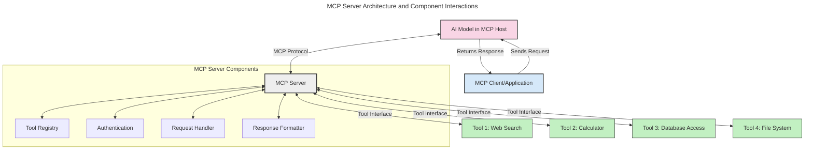
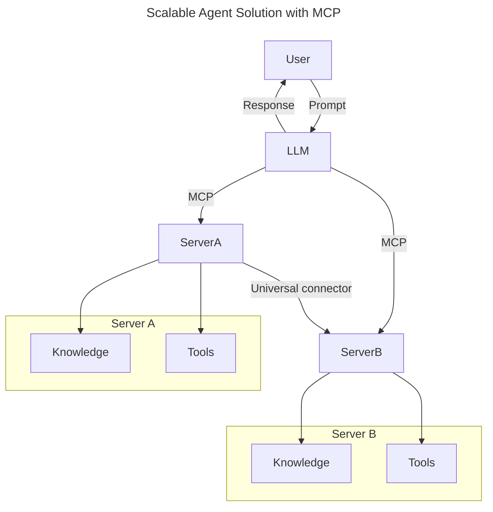
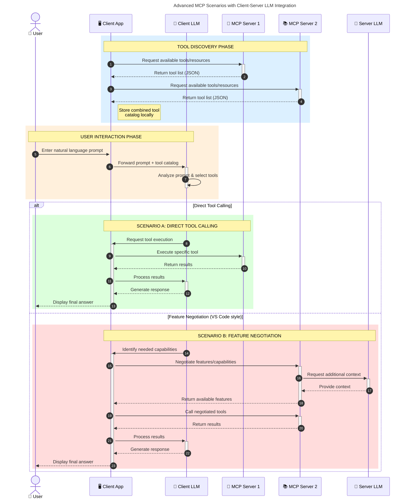

<!--
CO_OP_TRANSLATOR_METADATA:
{
  "original_hash": "105c2ddbb77bc38f7e9df009e1b06e45",
  "translation_date": "2025-07-13T15:41:40+00:00",
  "source_file": "00-Introduction/README.md",
  "language_code": "uk"
}
-->
# Вступ до Протоколу Контексту Моделі (MCP): Чому це важливо для масштабованих AI-додатків

Генеративні AI-додатки — це великий крок уперед, адже вони часто дозволяють користувачам взаємодіяти з додатком за допомогою природних мовних запитів. Проте, коли в такі додатки вкладається більше часу та ресурсів, важливо забезпечити легку інтеграцію функціональностей і ресурсів так, щоб їх було просто розширювати, щоб додаток міг працювати з кількома моделями одночасно та враховував різні особливості моделей. Коротко кажучи, створювати генеративні AI-додатки спочатку просто, але з ростом і ускладненням потрібно починати визначати архітектуру і, ймовірно, покладатися на стандарт, щоб гарантувати послідовність у побудові додатків. Саме тут MCP допомагає організувати процес і встановити стандарт.

---

## **🔍 Що таке Протокол Контексту Моделі (MCP)?**

**Протокол Контексту Моделі (MCP)** — це **відкритий, стандартизований інтерфейс**, який дозволяє великим мовним моделям (LLM) безперешкодно взаємодіяти з зовнішніми інструментами, API та джерелами даних. Він забезпечує послідовну архітектуру для розширення функціональності AI-моделей за межі їх навчальних даних, що робить AI-системи розумнішими, масштабованішими та більш чутливими.

---

## **🎯 Чому стандартизація в AI важлива**

Зі зростанням складності генеративних AI-додатків важливо впроваджувати стандарти, які забезпечують **масштабованість, розширюваність** та **підтримуваність**. MCP вирішує ці завдання шляхом:

- Уніфікації інтеграції моделей з інструментами
- Зменшення крихких, одноразових кастомних рішень
- Дозволу одночасного використання кількох моделей в одній екосистемі

---

## **📚 Цілі навчання**

Після прочитання цієї статті ви зможете:

- Визначити, що таке **Протокол Контексту Моделі (MCP)** та його сфери застосування
- Зрозуміти, як MCP стандартизує комунікацію між моделлю та інструментами
- Визначити основні компоненти архітектури MCP
- Ознайомитися з реальними прикладами застосування MCP у корпоративному та розробницькому середовищах

---

## **💡 Чому Протокол Контексту Моделі (MCP) — це революція**

### **🔗 MCP вирішує проблему фрагментації у взаємодії AI**

До появи MCP інтеграція моделей з інструментами вимагала:

- Індивідуального коду для кожної пари інструмент-модель
- Нестандартних API від кожного постачальника
- Частих збоїв через оновлення
- Поганої масштабованості при збільшенні кількості інструментів

### **✅ Переваги стандартизації MCP**

| **Перевага**             | **Опис**                                                                       |
|--------------------------|--------------------------------------------------------------------------------|
| Взаємодія                | LLM безперешкодно працюють з інструментами різних постачальників              |
| Послідовність            | Однорідна поведінка на різних платформах і інструментах                        |
| Повторне використання    | Інструменти, створені один раз, можна використовувати в різних проєктах       |
| Прискорена розробка      | Скорочення часу розробки завдяки стандартизованим, plug-and-play інтерфейсам  |

---

## **🧱 Огляд архітектури MCP на високому рівні**

MCP базується на **клієнт-серверній моделі**, де:

- **MCP Hosts** запускають AI-моделі
- **MCP Clients** ініціюють запити
- **MCP Servers** надають контекст, інструменти та можливості

### **Ключові компоненти:**

- **Resources** – статичні або динамічні дані для моделей  
- **Prompts** – заздалегідь визначені робочі процеси для керованої генерації  
- **Tools** – виконувані функції, такі як пошук, обчислення  
- **Sampling** – агентна поведінка через рекурсивні взаємодії

---

## Як працюють MCP сервери

MCP сервери працюють таким чином:

- **Потік запитів**:  
    1. MCP Client надсилає запит до AI-моделі, що працює на MCP Host.  
    2. AI-модель визначає, коли їй потрібні зовнішні інструменти або дані.  
    3. Модель спілкується з MCP Server за допомогою стандартизованого протоколу.

- **Функціональність MCP Server**:  
    - Реєстр інструментів: веде каталог доступних інструментів та їх можливостей.  
    - Аутентифікація: перевіряє права доступу до інструментів.  
    - Обробник запитів: опрацьовує вхідні запити інструментів від моделі.  
    - Форматувач відповідей: структурує результати інструментів у формат, зрозумілий моделі.

- **Виконання інструментів**:  
    - Сервер направляє запити до відповідних зовнішніх інструментів  
    - Інструменти виконують свої спеціалізовані функції (пошук, обчислення, запити до баз даних тощо)  
    - Результати повертаються моделі у послідовному форматі.

- **Завершення відповіді**:  
    - AI-модель інтегрує результати інструментів у свою відповідь.  
    - Остаточна відповідь надсилається назад клієнтському додатку.

## 👨‍💻 Як створити MCP сервер (з прикладами)

MCP сервери дозволяють розширити можливості LLM, надаючи дані та функціонал.

Готові спробувати? Ось приклади створення простого MCP сервера різними мовами:

- **Приклад на Python**: https://github.com/modelcontextprotocol/python-sdk

- **Приклад на TypeScript**: https://github.com/modelcontextprotocol/typescript-sdk

- **Приклад на Java**: https://github.com/modelcontextprotocol/java-sdk

- **Приклад на C#/.NET**: https://github.com/modelcontextprotocol/csharp-sdk

## 🌍 Реальні сценарії використання MCP

MCP відкриває широкий спектр застосувань, розширюючи можливості AI:

| **Застосування**           | **Опис**                                                                       |
|----------------------------|--------------------------------------------------------------------------------|
| Інтеграція корпоративних даних | Підключення LLM до баз даних, CRM або внутрішніх інструментів                 |
| Агентні AI-системи         | Надання автономним агентам доступу до інструментів і робочих процесів прийняття рішень |
| Мультимодальні додатки     | Поєднання текстових, зображень та аудіоінструментів в одному AI-додатку        |
| Інтеграція даних у реальному часі | Підключення живих даних для більш точних і актуальних відповідей AI          |

### 🧠 MCP = універсальний стандарт для AI-взаємодій

Протокол Контексту Моделі (MCP) виступає як універсальний стандарт для AI-взаємодій, подібно до того, як USB-C стандартизував фізичні підключення пристроїв. У світі AI MCP забезпечує послідовний інтерфейс, що дозволяє моделям (клієнтам) безперешкодно інтегруватися із зовнішніми інструментами та постачальниками даних (серверами). Це усуває потребу у різноманітних, кастомних протоколах для кожного API чи джерела даних.

За MCP інструмент, сумісний з MCP (називається MCP сервером), дотримується єдиного стандарту. Ці сервери можуть перелічувати інструменти або дії, які вони пропонують, і виконувати їх за запитом AI-агента. Платформи AI-агентів, що підтримують MCP, можуть знаходити доступні інструменти на серверах і викликати їх через цей стандартний протокол.

### 💡 Сприяє доступу до знань

Окрім надання інструментів, MCP також полегшує доступ до знань. Він дозволяє додаткам надавати контекст великим мовним моделям (LLM), пов’язуючи їх з різними джерелами даних. Наприклад, MCP сервер може представляти сховище документів компанії, дозволяючи агентам отримувати релевантну інформацію за запитом. Інший сервер може виконувати конкретні дії, як-от надсилання електронних листів або оновлення записів. З точки зору агента, це просто інструменти — деякі повертають дані (контекст знань), інші виконують дії. MCP ефективно керує обома.

Агент, що підключається до MCP сервера, автоматично дізнається про доступні можливості сервера та доступні дані через стандартний формат. Ця стандартизація дозволяє динамічно додавати інструменти. Наприклад, додавання нового MCP сервера до системи агента робить його функції одразу доступними без додаткової кастомізації інструкцій агента.

Ця спрощена інтеграція відповідає потоку, зображеному на діаграмі mermaid, де сервери надають і інструменти, і знання, забезпечуючи безшовну співпрацю між системами.

### 👉 Приклад: Масштабоване агентське рішення

### 🔄 Розширені сценарії MCP з інтеграцією LLM на стороні клієнта

Окрім базової архітектури MCP, існують розширені сценарії, де і клієнт, і сервер містять LLM, що дозволяє більш складні взаємодії:

## 🔐 Практичні переваги MCP

Ось практичні переваги використання MCP:

- **Актуальність**: Моделі можуть отримувати доступ до оновленої інформації поза межами навчальних даних  
- **Розширення можливостей**: Моделі можуть використовувати спеціалізовані інструменти для завдань, для яких вони не були навчені  
- **Зменшення галюцинацій**: Зовнішні джерела даних забезпечують фактичну основу  
- **Конфіденційність**: Чутливі дані можуть залишатися у безпечному середовищі, а не бути вбудованими у запити

## 📌 Основні висновки

Основні висновки щодо використання MCP:

- **MCP** стандартизує взаємодію AI-моделей з інструментами та даними  
- Сприяє **розширюваності, послідовності та взаємодії**  
- MCP допомагає **скоротити час розробки, підвищити надійність і розширити можливості моделей**  
- Клієнт-серверна архітектура **дозволяє створювати гнучкі, розширювані AI-додатки**

## 🧠 Вправа

Подумайте про AI-додаток, який ви хочете створити.

- Які **зовнішні інструменти або дані** могли б покращити його можливості?  
- Як MCP може зробити інтеграцію **простішою та надійнішою?**

## Додаткові ресурси

- [MCP GitHub Repository](https://github.com/modelcontextprotocol)

## Що далі

Далі: [Розділ 1: Основні поняття](../01-CoreConcepts/README.md)

**Відмова від відповідальності**:  
Цей документ було перекладено за допомогою сервісу автоматичного перекладу [Co-op Translator](https://github.com/Azure/co-op-translator). Хоча ми прагнемо до точності, будь ласка, майте на увазі, що автоматичні переклади можуть містити помилки або неточності. Оригінальний документ рідною мовою слід вважати авторитетним джерелом. Для критично важливої інформації рекомендується звертатися до професійного людського перекладу. Ми не несемо відповідальності за будь-які непорозуміння або неправильні тлумачення, що виникли внаслідок використання цього перекладу.