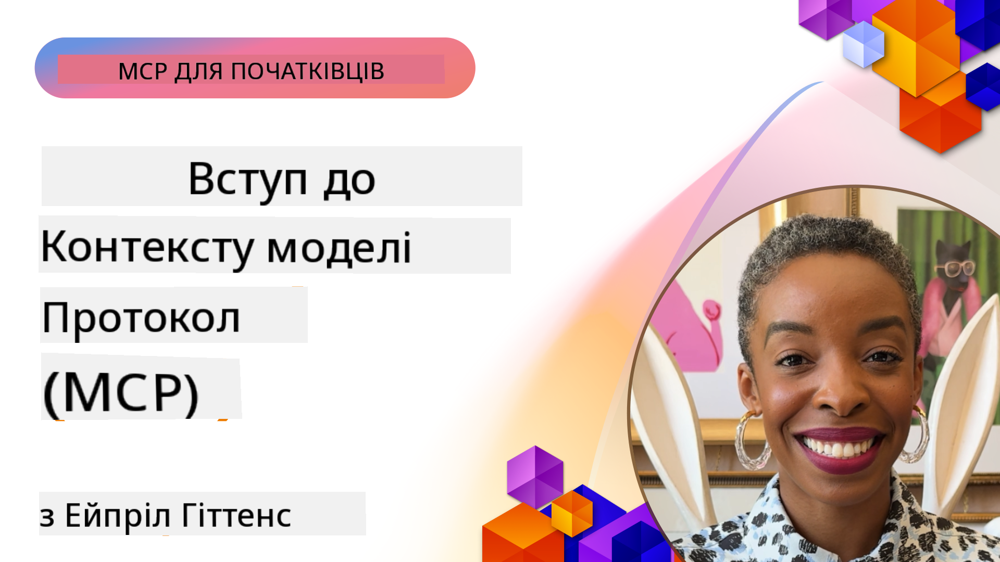
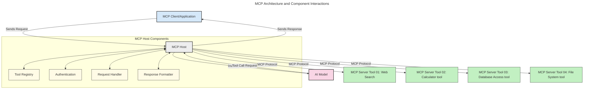
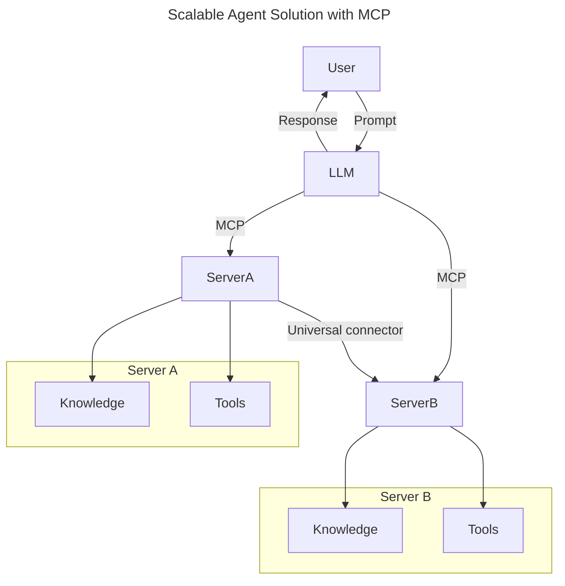
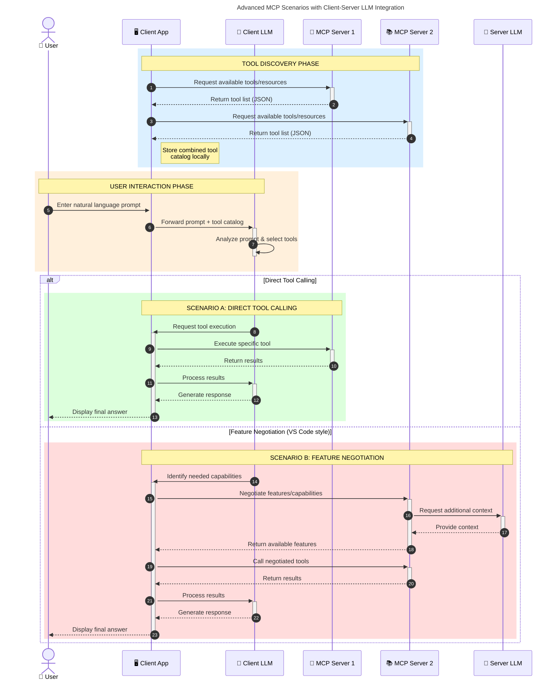

<!--
CO_OP_TRANSLATOR_METADATA:
{
  "original_hash": "0df1ee78a6dd8300f3a040ca5b411c2e",
  "translation_date": "2025-08-18T23:08:21+00:00",
  "source_file": "00-Introduction/README.md",
  "language_code": "uk"
}
-->
# Вступ до Протоколу Контексту Моделі (MCP): Чому це важливо для масштабованих AI-додатків

_(Натисніть на зображення вище, щоб переглянути відео цього уроку)_

Генеративні AI-додатки є великим кроком вперед, оскільки вони часто дозволяють користувачам взаємодіяти з додатком за допомогою природних мовних запитів. Однак, коли більше часу та ресурсів вкладається в такі додатки, важливо забезпечити легку інтеграцію функціональностей і ресурсів таким чином, щоб додаток було легко розширювати, щоб він міг працювати з кількома моделями та враховувати різні особливості моделей. Іншими словами, створення генеративних AI-додатків легко почати, але з їх зростанням і ускладненням необхідно визначити архітектуру і, ймовірно, покладатися на стандарт, щоб забезпечити побудову додатків у послідовний спосіб. Саме тут MCP допомагає організувати процес і забезпечити стандарт.

---

## **🔍 Що таке Протокол Контексту Моделі (MCP)?**

**Протокол Контексту Моделі (MCP)** — це **відкритий, стандартизований інтерфейс**, який дозволяє великим мовним моделям (LLM) безперешкодно взаємодіяти із зовнішніми інструментами, API та джерелами даних. MCP забезпечує послідовну архітектуру для розширення функціональності AI-моделей за межі їх навчальних даних, створюючи розумніші, масштабованіші та більш чутливі AI-системи.

---

## **🎯 Чому стандартизація в AI важлива**

З розвитком генеративних AI-додатків важливо впроваджувати стандарти, які забезпечують **масштабованість, розширюваність, підтримуваність** і **уникнення залежності від одного постачальника**. MCP вирішує ці завдання шляхом:

- Уніфікації інтеграції моделей з інструментами
- Зменшення крихких, одноразових рішень
- Дозволу співіснування кількох моделей від різних постачальників в одній екосистемі

**Примітка:** Хоча MCP позиціонує себе як відкритий стандарт, наразі немає планів стандартизувати MCP через існуючі органи стандартизації, такі як IEEE, IETF, W3C, ISO чи будь-які інші.

---

## **📚 Навчальні цілі**

До кінця цієї статті ви зможете:

- Визначити **Протокол Контексту Моделі (MCP)** та його випадки використання
- Зрозуміти, як MCP стандартизує комунікацію між моделями та інструментами
- Визначити основні компоненти архітектури MCP
- Дослідити реальні приклади використання MCP у корпоративному та розробницькому контекстах

---

## **💡 Чому Протокол Контексту Моделі (MCP) змінює правила гри**

### **🔗 MCP вирішує проблему фрагментації у взаємодії AI**

До MCP інтеграція моделей з інструментами вимагала:

- Кастомного коду для кожної пари інструмент-модель
- Нестандартизованих API для кожного постачальника
- Частих збоїв через оновлення
- Поганої масштабованості з додаванням нових інструментів

### **✅ Переваги стандартизації MCP**

| **Перевага**              | **Опис**                                                                        |
|---------------------------|---------------------------------------------------------------------------------|
| Інтероперабельність       | LLM безперешкодно працюють з інструментами різних постачальників                |
| Послідовність             | Уніфікована поведінка на різних платформах та інструментах                      |
| Повторне використання     | Інструменти, створені один раз, можуть використовуватися в різних проектах      |
| Прискорена розробка       | Зменшення часу розробки завдяки стандартизованим інтерфейсам                    |

---

## **🧱 Огляд архітектури MCP на високому рівні**

MCP використовує **клієнт-серверну модель**, де:

- **MCP Hosts** запускають AI-моделі
- **MCP Clients** ініціюють запити
- **MCP Servers** надають контекст, інструменти та можливості

### **Основні компоненти:**

- **Ресурси** – Статичні або динамічні дані для моделей  
- **Запити** – Попередньо визначені робочі процеси для керованої генерації  
- **Інструменти** – Виконувані функції, такі як пошук, обчислення  
- **Вибірка** – Агентна поведінка через рекурсивні взаємодії

---

## Як працюють MCP-сервери

MCP-сервери функціонують наступним чином:

- **Потік запиту**:
    1. Запит ініціюється кінцевим користувачем або програмним забезпеченням від його імені.
    2. **MCP Client** надсилає запит до **MCP Host**, який керує виконанням AI-моделі.
    3. **AI-модель** отримує запит користувача і може запитувати доступ до зовнішніх інструментів або даних через один або кілька викликів інструментів.
    4. **MCP Host**, а не сама модель, взаємодіє з відповідними **MCP Server(s)** за допомогою стандартизованого протоколу.
- **Функціональність MCP Host**:
    - **Реєстр інструментів**: Підтримує каталог доступних інструментів та їх можливостей.
    - **Аутентифікація**: Перевіряє дозволи на доступ до інструментів.
    - **Обробник запитів**: Обробляє вхідні запити інструментів від моделі.
    - **Форматувальник відповідей**: Структурує вихідні дані інструментів у формат, зрозумілий моделі.
- **Виконання MCP Server**:
    - **MCP Host** маршрутизує виклики інструментів до одного або кількох **MCP Server**, кожен з яких надає спеціалізовані функції (наприклад, пошук, обчислення, запити до баз даних).
    - **MCP Server** виконує свої операції та повертає результати до **MCP Host** у послідовному форматі.
    - **MCP Host** форматує та передає ці результати до **AI-моделі**.
- **Завершення відповіді**:
    - **AI-модель** інтегрує вихідні дані інструментів у фінальну відповідь.
    - **MCP Host** надсилає цю відповідь назад до **MCP Client**, який доставляє її кінцевому користувачеві або викликаючому програмному забезпеченню.

## 👨‍💻 Як створити MCP-сервер (з прикладами)

MCP-сервери дозволяють розширювати можливості LLM, надаючи дані та функціональність.

Готові спробувати? Ось SDK для різних мов і/або стеків з прикладами створення простих MCP-серверів:

- **Python SDK**: https://github.com/modelcontextprotocol/python-sdk

- **TypeScript SDK**: https://github.com/modelcontextprotocol/typescript-sdk

- **Java SDK**: https://github.com/modelcontextprotocol/java-sdk

- **C#/.NET SDK**: https://github.com/modelcontextprotocol/csharp-sdk

## 🌍 Реальні приклади використання MCP

MCP дозволяє широкий спектр додатків, розширюючи можливості AI:

| **Додаток**                | **Опис**                                                                        |
|----------------------------|---------------------------------------------------------------------------------|
| Інтеграція корпоративних даних | Підключення LLM до баз даних, CRM або внутрішніх інструментів                  |
| Агентні AI-системи         | Дозволяє автономним агентам доступ до інструментів і робочих процесів прийняття рішень |
| Мультимодальні додатки     | Об'єднання текстових, графічних і аудіоінструментів в одному AI-додатку         |
| Інтеграція даних у реальному часі | Додавання актуальних даних до AI-взаємодій для більш точних результатів       |

### 🧠 MCP = Універсальний стандарт для AI-взаємодій

Протокол Контексту Моделі (MCP) виступає універсальним стандартом для AI-взаємодій, подібно до того, як USB-C стандартизував фізичні з'єднання для пристроїв. У світі AI MCP забезпечує послідовний інтерфейс, дозволяючи моделям (клієнтам) безперешкодно інтегруватися із зовнішніми інструментами та постачальниками даних (серверами). Це усуває необхідність у різноманітних, кастомних протоколах для кожного API або джерела даних.

Під MCP інструмент, сумісний із MCP (званий MCP-сервером), дотримується уніфікованого стандарту. Ці сервери можуть перераховувати інструменти або дії, які вони пропонують, і виконувати ці дії за запитом AI-агента. Платформи AI-агентів, які підтримують MCP, здатні виявляти доступні інструменти від серверів і викликати їх через цей стандартний протокол.

### 💡 Сприяє доступу до знань

Окрім надання інструментів, MCP також сприяє доступу до знань. Він дозволяє додаткам надавати контекст великим мовним моделям (LLM), підключаючи їх до різних джерел даних. Наприклад, MCP-сервер може представляти репозиторій документів компанії, дозволяючи агентам отримувати відповідну інформацію за запитом. Інший сервер може виконувати конкретні дії, такі як надсилання електронних листів або оновлення записів. З точки зору агента, це просто інструменти, які він може використовувати — деякі інструменти повертають дані (контекст знань), а інші виконують дії. MCP ефективно управляє обома.

Агент, який підключається до MCP-сервера, автоматично дізнається про доступні можливості сервера та доступні дані через стандартний формат. Ця стандартизація дозволяє динамічну доступність інструментів. Наприклад, додавання нового MCP-сервера до системи агента робить його функції негайно доступними без необхідності додаткової кастомізації інструкцій агента.

Ця спрощена інтеграція відповідає потоку, зображеному на наступній діаграмі, де сервери надають як інструменти, так і знання, забезпечуючи безперешкодну співпрацю між системами.

### 👉 Приклад: Масштабоване рішення для агентів

### 🔄 Розширені сценарії MCP з інтеграцією LLM на стороні клієнта

Окрім базової архітектури MCP, існують розширені сценарії, де як клієнт, так і сервер містять LLM, що дозволяє більш складні взаємодії. На наступній діаграмі **Client App** може бути IDE з низкою MCP-інструментів, доступних для використання LLM:

## 🔐 Практичні переваги MCP

Ось практичні переваги використання MCP:

- **Актуальність**: Моделі можуть отримувати актуальну інформацію за межами їх навчальних даних
- **Розширення можливостей**: Моделі можуть використовувати спеціалізовані інструменти для завдань, для яких вони не були навчені
- **Зменшення галюцинацій**: Зовнішні джерела даних забезпечують фактичну основу
- **Конфіденційність**: Чутливі дані можуть залишатися в безпечному середовищі, а не бути вбудованими в запити

## 📌 Основні висновки

Ось основні висновки щодо використання MCP:

- **MCP** стандартизує, як AI-моделі взаємодіють з інструментами та даними
- Сприяє **розширюваності, послідовності та інтероперабельності**
- MCP допомагає **зменшити час розробки, покращити надійність і розширити можливості моделей**
- Клієнт-серверна архітектура **дозволяє створювати гнучкі, розширювані AI-додатки**

## 🧠 Вправа

Подумайте про AI-додаток, який вас цікавить.

- Які **зовнішні інструменти або дані** могли б покращити його можливості?
- Як MCP може зробити інтеграцію **простішою та надійнішою?**

## Додаткові ресурси

- [Репозиторій MCP на GitHub](https://github.com/modelcontextprotocol)

## Що далі

Далі: [Розділ 1: Основні концепції](../01-CoreConcepts/README.md)

**Відмова від відповідальності**:  
Цей документ було перекладено за допомогою сервісу автоматичного перекладу [Co-op Translator](https://github.com/Azure/co-op-translator). Хоча ми прагнемо до точності, зверніть увагу, що автоматичні переклади можуть містити помилки або неточності. Оригінальний документ мовою оригіналу слід вважати авторитетним джерелом. Для критично важливої інформації рекомендується професійний людський переклад. Ми не несемо відповідальності за будь-які непорозуміння або неправильні тлумачення, що виникли внаслідок використання цього перекладу.