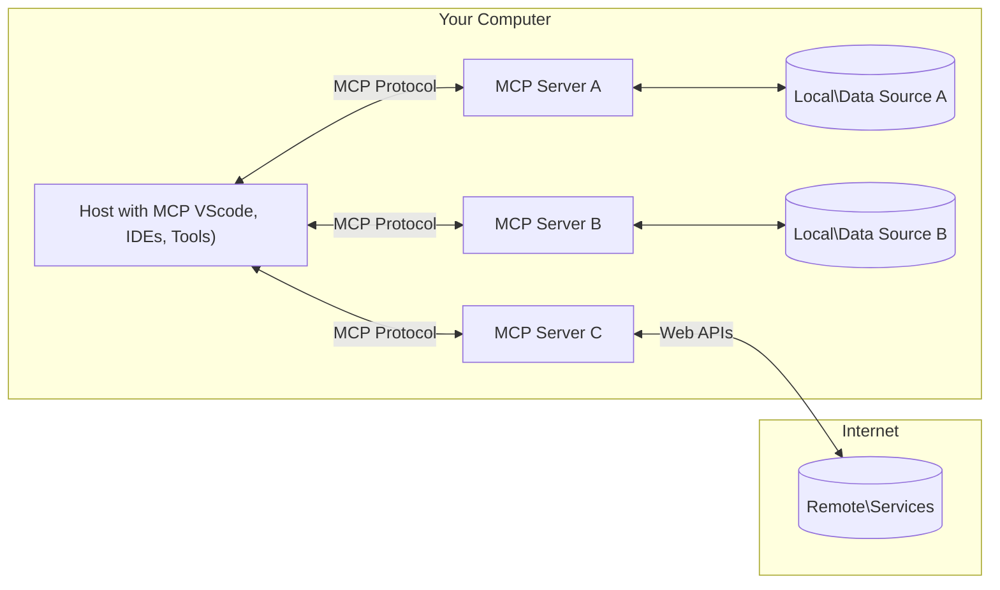

<!--
CO_OP_TRANSLATOR_METADATA:
{
  "original_hash": "b3b4a6ad10c3c0edbf7fa7cfa0ec496b",
  "translation_date": "2025-07-02T07:40:16+00:00",
  "source_file": "01-CoreConcepts/README.md",
  "language_code": "uk"
}
-->
# 📖 Основні поняття MCP: Оволодіння Протоколом Контексту Моделі для інтеграції ШІ

[Model Context Protocol (MCP)](https://github.com/modelcontextprotocol) — це потужний стандартизований фреймворк, який оптимізує комунікацію між великими мовними моделями (LLM) та зовнішніми інструментами, додатками і джерелами даних. Цей SEO-оптимізований посібник проведе вас через основні концепції MCP, допомагаючи зрозуміти його клієнт-серверну архітектуру, ключові компоненти, механіку комунікації та найкращі практики впровадження.

## Огляд

У цьому уроці розглядається фундаментальна архітектура та компоненти, що складають екосистему Протоколу Контексту Моделі (MCP). Ви дізнаєтеся про клієнт-серверну архітектуру, ключові компоненти та механізми комунікації, які забезпечують взаємодію в MCP.

## 👩‍🎓 Основні навчальні цілі

Після завершення цього уроку ви:

- Зрозумієте клієнт-серверну архітектуру MCP.
- Визначите ролі та обов’язки Hosts, Clients і Servers.
- Проаналізуєте основні функції, що роблять MCP гнучким шаром інтеграції.
- Навчитеся, як інформація передається в екосистемі MCP.
- Отримаєте практичні знання через приклади коду на .NET, Java, Python і JavaScript.

## 🔎 Архітектура MCP: детальніше

Екосистема MCP побудована на моделі клієнт-сервер. Ця модульна структура дозволяє AI-додаткам ефективно взаємодіяти з інструментами, базами даних, API та контекстуальними ресурсами. Розглянемо цю архітектуру по її основних компонентах.

В основі MCP лежить клієнт-серверна архітектура, де хост-додаток може підключатися до кількох серверів:



- **MCP Hosts**: Програми, як VSCode, Claude Desktop, IDE або AI-інструменти, які хочуть отримати доступ до даних через MCP
- **MCP Clients**: Клієнти протоколу, що підтримують 1:1 з’єднання з серверами
- **MCP Servers**: Легковагові програми, які надають конкретні можливості через стандартизований Протокол Контексту Моделі
- **Локальні джерела даних**: Файли, бази даних і сервіси вашого комп’ютера, до яких MCP-сервери можуть безпечно отримати доступ
- **Віддалені сервіси**: Зовнішні системи, доступні через інтернет, з якими MCP-сервери можуть з’єднуватися через API.

Протокол MCP — це стандарт, що розвивається, останні оновлення можна побачити у [специфікації протоколу](https://modelcontextprotocol.io/specification/2025-06-18/)

### 1. Hosts

У Протоколі Контексту Моделі (MCP) Hosts відіграють ключову роль як основний інтерфейс, через який користувачі взаємодіють із протоколом. Hosts — це додатки або середовища, які ініціюють з’єднання з MCP-серверами для доступу до даних, інструментів і підказок. Прикладами Hosts є інтегровані середовища розробки (IDE), такі як Visual Studio Code, AI-інструменти на кшталт Claude Desktop або кастомні агенти, створені для конкретних завдань.

**Hosts** — це додатки з LLM, що ініціюють з’єднання. Вони:

- Виконують або взаємодіють з AI-моделями для генерації відповідей.
- Ініціюють з’єднання з MCP-серверами.
- Керують потоком розмови та інтерфейсом користувача.
- Контролюють дозволи та обмеження безпеки.
- Обробляють згоду користувача на обмін даними та виконання інструментів.

### 2. Clients

Clients — це важливі компоненти, що полегшують взаємодію між Hosts і MCP-серверами. Вони виступають посередниками, дозволяючи Hosts отримувати доступ та використовувати функціонал MCP-серверів. Вони відіграють ключову роль у забезпеченні плавної комунікації та ефективного обміну даними в архітектурі MCP.

**Clients** — це конектори в межах хост-додатка. Вони:

- Надсилають запити серверам із підказками/інструкціями.
- Узгоджують можливості з серверами.
- Керують запитами на виконання інструментів від моделей.
- Обробляють та відображають відповіді користувачам.

### 3. Servers

Servers відповідають за обробку запитів від MCP-клієнтів і надання відповідних відповідей. Вони керують різними операціями, такими як отримання даних, виконання інструментів і генерація підказок. Сервери забезпечують ефективну та надійну комунікацію між клієнтами і Hosts, підтримуючи цілісність процесу взаємодії.

**Servers** — це сервіси, які надають контекст і можливості. Вони:

- Реєструють доступні функції (ресурси, підказки, інструменти)
- Приймають і виконують виклики інструментів від клієнта
- Надають контекстну інформацію для покращення відповідей моделей
- Повертають результати клієнту
- Підтримують стан між взаємодіями за потреби

Сервери можуть розроблятися будь-ким для розширення можливостей моделей спеціалізованим функціоналом.

### 4. Особливості серверів

Сервери в Протоколі Контексту Моделі (MCP) надають базові будівельні блоки, що забезпечують багаті взаємодії між клієнтами, hosts і мовними моделями. Ці функції створені для розширення можливостей MCP, пропонуючи структурований контекст, інструменти та підказки.

MCP-сервери можуть надавати будь-які з наступних функцій:

#### 📑 Ресурси

Ресурси в MCP охоплюють різні типи контексту та даних, які можуть використовувати користувачі або AI-моделі. До них належать:

- **Контекстуальні дані**: Інформація та контекст, що допомагають користувачам або моделям приймати рішення та виконувати завдання.
- **Бази знань і сховища документів**: Колекції структурованих і неструктурованих даних, таких як статті, посібники, наукові роботи, що надають цінну інформацію.
- **Локальні файли та бази даних**: Дані, збережені локально на пристроях або в базах даних, доступні для обробки та аналізу.
- **API та веб-сервіси**: Зовнішні інтерфейси та сервіси, що надають додаткові дані і функції, дозволяючи інтегруватися з різними онлайн-ресурсами та інструментами.

Приклад ресурсу може бути схемою бази даних або файлом, до якого можна отримати доступ так:

```text
file://log.txt
database://schema
```

### 🤖 Підказки

Підказки в MCP включають різні заздалегідь визначені шаблони та патерни взаємодії, які спрощують робочі процеси користувачів і покращують комунікацію. До них належать:

- **Шаблонні повідомлення та робочі процеси**: Попередньо структуровані повідомлення та процеси, що направляють користувачів у виконанні конкретних завдань.
- **Заздалегідь визначені патерни взаємодії**: Стандартизовані послідовності дій і відповідей, що забезпечують послідовну та ефективну комунікацію.
- **Спеціалізовані шаблони розмов**: Налаштовувані шаблони для певних типів розмов, що забезпечують релевантність і контекстуальну відповідність.

Шаблон підказки може виглядати так:

```markdown
Generate a product slogan based on the following {{product}} with the following {{keywords}}
```

#### ⛏️ Інструменти

Інструменти в MCP — це функції, які AI-модель може виконувати для реалізації конкретних завдань. Вони розроблені для розширення можливостей моделі, забезпечуючи структуровані та надійні операції. Основні аспекти:

- **Функції для виконання AI-моделлю**: Інструменти — це виконувані функції, які модель може викликати для виконання різних завдань.
- **Унікальна назва та опис**: Кожен інструмент має унікальну назву та детальний опис, що пояснює його призначення і функціональність.
- **Параметри та вихідні дані**: Інструменти приймають конкретні параметри і повертають структуровані результати, забезпечуючи послідовність і передбачуваність.
- **Окремі функції**: Інструменти виконують окремі функції, такі як пошук в інтернеті, обчислення, запити до баз даних.

Приклад інструменту може виглядати так:

```typescript
server.tool(
  "GetProducts",
  {
    pageSize: z.string().optional(),
    pageCount: z.string().optional()
  }, () => {
    // return results from API
  }
)
```

## Особливості клієнта

У MCP клієнти пропонують кілька ключових функцій серверам, покращуючи загальну функціональність і взаємодію в протоколі. Однією з помітних функцій є Sampling.

### 👉 Sampling

- **Ініційовані сервером агентні поведінки**: Клієнти дозволяють серверам автономно ініціювати конкретні дії або поведінку, розширюючи динамічні можливості системи.
- **Рекурсивні взаємодії з LLM**: Ця функція дозволяє рекурсивні взаємодії з великими мовними моделями, забезпечуючи більш складну та ітеративну обробку завдань.
- **Запит додаткових завершень моделі**: Сервери можуть запитувати додаткові відповіді від моделі, щоб забезпечити повноту і контекстну релевантність відповідей.

## Потік інформації в MCP

Протокол Контексту Моделі (MCP) визначає структурований потік інформації між hosts, clients, servers і моделями. Розуміння цього потоку допомагає зрозуміти, як обробляються запити користувачів і як зовнішні інструменти та дані інтегруються у відповіді моделі.

- **Host ініціює з’єднання**  
  Хост-додаток (наприклад, IDE або чат-інтерфейс) встановлює з’єднання з MCP-сервером, зазвичай через STDIO, WebSocket або інший підтримуваний транспорт.

- **Узгодження можливостей**  
  Клієнт (вбудований у host) і сервер обмінюються інформацією про підтримувані функції, інструменти, ресурси та версії протоколу. Це гарантує, що обидві сторони розуміють, які можливості доступні під час сесії.

- **Запит користувача**  
  Користувач взаємодіє з host (наприклад, вводить підказку або команду). Host збирає цей ввід і передає його клієнту для обробки.

- **Використання ресурсу або інструменту**  
  - Клієнт може запитувати додатковий контекст або ресурси від сервера (наприклад, файли, записи бази даних або статті з бази знань) для збагачення розуміння моделі.
  - Якщо модель визначає, що потрібен інструмент (наприклад, для отримання даних, виконання обчислення або виклику API), клієнт надсилає запит на виклик інструменту серверу, вказуючи назву інструменту та параметри.

- **Виконання сервером**  
  Сервер отримує запит на ресурс або інструмент, виконує необхідні операції (наприклад, виконує функцію, робить запит до бази даних або отримує файл) і повертає результати клієнту у структурованому форматі.

- **Генерація відповіді**  
  Клієнт інтегрує відповіді сервера (дані ресурсів, результати інструментів тощо) у поточну взаємодію з моделлю. Модель використовує цю інформацію для створення повної і контекстно релевантної відповіді.

- **Представлення результату**  
  Host отримує фінальний результат від клієнта і відображає його користувачу, часто включаючи як текст, згенерований моделлю, так і результати виконання інструментів або пошуку ресурсів.

Цей потік дозволяє MCP підтримувати просунуті, інтерактивні та контекстно-залежні AI-додатки, безшовно поєднуючи моделі з зовнішніми інструментами та джерелами даних.

## Деталі протоколу

MCP (Model Context Protocol) побудований на основі [JSON-RPC 2.0](https://www.jsonrpc.org/), забезпечуючи стандартизований, незалежний від мови формат повідомлень для комунікації між hosts, clients і servers. Ця база дозволяє надійні, структуровані та розширювані взаємодії між різними платформами і мовами програмування.

### Ключові особливості протоколу

MCP розширює JSON-RPC 2.0 додатковими конвенціями для виклику інструментів, доступу до ресурсів і керування підказками. Він підтримує кілька транспортних шарів (STDIO, WebSocket, SSE) і забезпечує безпечну, розширювану та незалежну від мови комунікацію між компонентами.

#### 🧢 Базовий протокол

- **Формат повідомлень JSON-RPC**: Всі запити і відповіді використовують специфікацію JSON-RPC 2.0, що гарантує послідовну структуру для викликів методів, параметрів, результатів і обробки помилок.
- **Станові з’єднання**: Сесії MCP підтримують стан між кількома запитами, що дозволяє вести тривалі розмови, накопичувати контекст і керувати ресурсами.
- **Узгодження можливостей**: Під час встановлення з’єднання клієнти і сервери обмінюються інформацією про підтримувані функції, версії протоколу, доступні інструменти і ресурси. Це гарантує, що обидві сторони розуміють можливості одна одної і можуть адаптуватися відповідно.

#### ➕ Додаткові утиліти

Нижче наведено деякі додаткові утиліти та розширення протоколу, які MCP надає для покращення досвіду розробників і підтримки складних сценаріїв:

- **Опції конфігурації**: MCP дозволяє динамічно налаштовувати параметри сесії, такі як дозволи інструментів, доступ до ресурсів і налаштування моделей, підлаштовуючись під кожну взаємодію.
- **Відстеження прогресу**: Довготривалі операції можуть надсилати оновлення прогресу, що забезпечує відзивчивий інтерфейс і кращий досвід користувача під час складних завдань.
- **Скасування запитів**: Клієнти можуть скасовувати запити, що виконуються, дозволяючи користувачам переривати операції, які більше не потрібні або займають забагато часу.
- **Звітність про помилки**: Стандартизовані повідомлення про помилки і коди допомагають діагностувати проблеми, коректно обробляти збої і надавати корисний зворотний зв’язок користувачам і розробникам.
- **Логування**: Клієнти і сервери можуть генерувати структуровані логи для аудиту, налагодження і моніторингу взаємодій протоколу.

Завдяки цим можливостям MCP забезпечує надійну, безпечну і гнучку комунікацію між мовними моделями і зовнішніми інструментами чи джерелами даних.

### 🔐 Міркування щодо безпеки

Реалізації MCP повинні дотримуватися кількох ключових принципів безпеки, щоб гарантувати безпечні і на

**Відмова від відповідальності**:  
Цей документ було перекладено за допомогою сервісу автоматичного перекладу [Co-op Translator](https://github.com/Azure/co-op-translator). Хоч ми й прагнемо до точності, будь ласка, майте на увазі, що автоматичні переклади можуть містити помилки або неточності. Оригінальний документ рідною мовою слід вважати авторитетним джерелом. Для критично важливої інформації рекомендується звертатися до професійного людського перекладу. Ми не несемо відповідальності за будь-які непорозуміння або неправильні тлумачення, що виникли внаслідок використання цього перекладу.