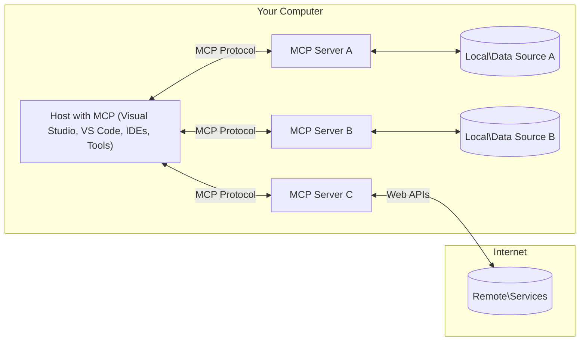

<!--
CO_OP_TRANSLATOR_METADATA:
{
  "original_hash": "904b59de1de9264801242d90a42cdd9d",
  "translation_date": "2025-09-05T11:48:59+00:00",
  "source_file": "01-CoreConcepts/README.md",
  "language_code": "uk"
}
-->
# Основні концепції MCP: Опанування протоколу контексту моделі для інтеграції AI

[](https://youtu.be/earDzWGtE84)

_(Натисніть на зображення вище, щоб переглянути відео уроку)_

[Model Context Protocol (MCP)](https://github.com/modelcontextprotocol) — це потужна стандартизована структура, яка оптимізує взаємодію між великими мовними моделями (LLMs) та зовнішніми інструментами, додатками і джерелами даних. 
Цей посібник проведе вас через основні концепції MCP. Ви дізнаєтеся про його архітектуру клієнт-сервер, ключові компоненти, механіку комунікації та найкращі практики впровадження.

- **Явна згода користувача**: Усі операції доступу до даних вимагають явного схвалення користувача перед виконанням. Користувачі повинні чітко розуміти, які дані будуть доступні та які дії будуть виконані, з детальним контролем дозволів та авторизацій.

- **Захист конфіденційності даних**: Дані користувача розкриваються лише за явною згодою і повинні бути захищені надійними механізмами контролю доступу протягом усього циклу взаємодії. Впровадження має запобігати несанкціонованій передачі даних і підтримувати суворі межі конфіденційності.

- **Безпека виконання інструментів**: Кожен виклик інструменту вимагає явної згоди користувача з чітким розумінням функціональності інструменту, параметрів і потенційного впливу. Надійні межі безпеки повинні запобігати ненавмисному, небезпечному або зловмисному виконанню інструментів.

- **Безпека транспортного рівня**: Усі канали зв’язку повинні використовувати відповідні механізми шифрування та автентифікації. Віддалені з’єднання повинні впроваджувати захищені транспортні протоколи та належне управління обліковими даними.

#### Рекомендації щодо впровадження:

- **Управління дозволами**: Впроваджуйте системи детального управління дозволами, які дозволяють користувачам контролювати доступ до серверів, інструментів і ресурсів
- **Автентифікація та авторизація**: Використовуйте надійні методи автентифікації (OAuth, API-ключі) з належним управлінням токенами та їх терміном дії  
- **Валідація введення**: Перевіряйте всі параметри та введені дані відповідно до визначених схем, щоб запобігти атакам через ін’єкції
- **Журналювання аудиту**: Ведіть детальні журнали всіх операцій для моніторингу безпеки та відповідності вимогам

## Огляд

Цей урок досліджує фундаментальну архітектуру та компоненти, які складають екосистему Model Context Protocol (MCP). Ви дізнаєтеся про архітектуру клієнт-сервер, ключові компоненти та механізми комунікації, які забезпечують взаємодію MCP.

## Основні навчальні цілі

До кінця цього уроку ви:

- Зрозумієте архітектуру клієнт-сервер MCP.
- Визначите ролі та обов’язки хостів, клієнтів і серверів.
- Проаналізуєте основні функції, які роблять MCP гнучким шаром інтеграції.
- Дізнаєтеся, як інформація циркулює в екосистемі MCP.
- Отримаєте практичні знання через приклади коду в .NET, Java, Python і JavaScript.

## Архітектура MCP: детальний огляд

Екосистема MCP побудована на моделі клієнт-сервер. Ця модульна структура дозволяє AI-додаткам ефективно взаємодіяти з інструментами, базами даних, API та контекстними ресурсами. Давайте розглянемо цю архітектуру за її основними компонентами.

У своїй основі MCP дотримується архітектури клієнт-сервер, де хост-додаток може підключатися до кількох серверів:



- **Хости MCP**: Програми, такі як VSCode, Claude Desktop, IDE або AI-інструменти, які хочуть отримати доступ до даних через MCP
- **Клієнти MCP**: Протокольні клієнти, які підтримують 1:1 з’єднання із серверами
- **Сервери MCP**: Легкі програми, кожна з яких надає певні можливості через стандартизований Model Context Protocol
- **Локальні джерела даних**: Файли, бази даних і сервіси вашого комп’ютера, до яких сервери MCP можуть безпечно отримати доступ
- **Віддалені сервіси**: Зовнішні системи, доступні через інтернет, до яких сервери MCP можуть підключатися через API.

Протокол MCP є еволюційним стандартом, який використовує версії на основі дати (формат YYYY-MM-DD). Поточна версія протоколу — **2025-06-18**. Ви можете переглянути останні оновлення [специфікації протоколу](https://modelcontextprotocol.io/specification/2025-06-18/)

### 1. Хости

У Model Context Protocol (MCP) **хости** — це AI-додатки, які виступають основним інтерфейсом, через який користувачі взаємодіють із протоколом. Хости координують і керують з’єднаннями з кількома серверами MCP, створюючи спеціалізованих клієнтів MCP для кожного з’єднання з сервером. Приклади хостів включають:

- **AI-додатки**: Claude Desktop, Visual Studio Code, Claude Code
- **Середовища розробки**: IDE та редактори коду з інтеграцією MCP  
- **Кастомні додатки**: Спеціалізовані AI-агенти та інструменти

**Хости** — це додатки, які координують взаємодію з AI-моделями. Вони:

- **Організовують AI-моделі**: Виконують або взаємодіють із LLM для генерації відповідей і координації AI-робочих процесів
- **Керують з’єднаннями клієнтів**: Створюють і підтримують одного клієнта MCP для кожного з’єднання з сервером MCP
- **Контролюють інтерфейс користувача**: Обробляють потік розмов, взаємодію з користувачем і представлення відповідей  
- **Забезпечують безпеку**: Контролюють дозволи, обмеження безпеки та автентифікацію
- **Керують згодою користувача**: Організовують схвалення користувача для обміну даними та виконання інструментів

### 2. Клієнти

**Клієнти** — це ключові компоненти, які підтримують спеціалізовані одноосібні з’єднання між хостами та серверами MCP. Кожен клієнт MCP створюється хостом для підключення до конкретного сервера MCP, забезпечуючи організовані та безпечні канали зв’язку. Кілька клієнтів дозволяють хостам одночасно підключатися до кількох серверів.

**Клієнти** — це компоненти-з’єднувачі в хост-додатку. Вони:

- **Комунікація протоколу**: Надсилають запити JSON-RPC 2.0 до серверів із підказками та інструкціями
- **Переговори можливостей**: Узгоджують підтримувані функції та версії протоколу із серверами під час ініціалізації
- **Виконання інструментів**: Керують запитами на виконання інструментів від моделей і обробляють відповіді
- **Оновлення в реальному часі**: Обробляють сповіщення та оновлення в реальному часі від серверів
- **Обробка відповідей**: Форматують відповіді серверів для відображення користувачам

### 3. Сервери

**Сервери** — це програми, які надають контекст, інструменти та можливості клієнтам MCP. Вони можуть виконуватися локально (на тому ж пристрої, що й хост) або віддалено (на зовнішніх платформах) і відповідають за обробку запитів клієнтів та надання структурованих відповідей. Сервери надають певну функціональність через стандартизований Model Context Protocol.

**Сервери** — це сервіси, які забезпечують контекст і можливості. Вони:

- **Реєстрація функцій**: Реєструють і надають доступні примітиви (ресурси, підказки, інструменти) клієнтам
- **Обробка запитів**: Приймають і виконують виклики інструментів, запити ресурсів і підказок від клієнтів
- **Надання контексту**: Забезпечують контекстну інформацію та дані для покращення відповідей моделі
- **Управління станом**: Підтримують стан сесії та обробляють взаємодії зі станом, коли це необхідно
- **Сповіщення в реальному часі**: Надсилають сповіщення про зміни можливостей та оновлення підключеним клієнтам

Сервери можуть бути розроблені будь-ким для розширення можливостей моделі за допомогою спеціалізованої функціональності, і вони підтримують як локальні, так і віддалені сценарії розгортання.

### 4. Примітиви серверів

Сервери в Model Context Protocol (MCP) надають три основні **примітиви**, які визначають фундаментальні будівельні блоки для багатих взаємодій між клієнтами, хостами та мовними моделями. Ці примітиви визначають типи контекстної інформації та дій, доступних через протокол.

Сервери MCP можуть надавати будь-яку комбінацію наступних трьох основних примітивів:

#### Ресурси 

**Ресурси** — це джерела даних, які забезпечують контекстну інформацію для AI-додатків. Вони представляють статичний або динамічний контент, який може покращити розуміння моделі та прийняття рішень:

- **Контекстні дані**: Структурована інформація та контекст для споживання AI-моделлю
- **Бази знань**: Репозиторії документів, статті, посібники та наукові роботи
- **Локальні джерела даних**: Файли, бази даних та інформація локальної системи  
- **Зовнішні дані**: Відповіді API, веб-сервіси та дані віддалених систем
- **Динамічний контент**: Дані в реальному часі, які оновлюються залежно від зовнішніх умов

Ресурси ідентифікуються за URI та підтримують пошук через методи `resources/list` і отримання через `resources/read`:

```text
file://documents/project-spec.md
database://production/users/schema
api://weather/current
```

#### Підказки

**Підказки** — це багаторазові шаблони, які допомагають структурувати взаємодії з мовними моделями. Вони забезпечують стандартизовані шаблони взаємодії та робочі процеси:

- **Шаблонні взаємодії**: Попередньо структуровані повідомлення та початки розмов
- **Шаблони робочих процесів**: Стандартизовані послідовності для поширених завдань і взаємодій
- **Приклади Few-shot**: Шаблони на основі прикладів для інструкцій моделі
- **Системні підказки**: Основні підказки, які визначають поведінку моделі та контекст
- **Динамічні шаблони**: Параметризовані підказки, які адаптуються до конкретних контекстів

Підказки підтримують підстановку змінних і можуть бути знайдені через `prompts/list` та отримані за допомогою `prompts/get`:

```markdown
Generate a {{task_type}} for {{product}} targeting {{audience}} with the following requirements: {{requirements}}
```

#### Інструменти

**Інструменти** — це виконувані функції, які мовні моделі можуть викликати для виконання конкретних дій. Вони представляють "дієслова" екосистеми MCP, дозволяючи моделям взаємодіяти із зовнішніми системами:

- **Виконувані функції**: Окремі операції, які моделі можуть викликати з конкретними параметрами
- **Інтеграція зовнішніх систем**: Виклики API, запити до баз даних, операції з файлами, обчислення
- **Унікальна ідентичність**: Кожен інструмент має унікальне ім’я, опис і схему параметрів
- **Структурований ввід/вивід**: Інструменти приймають перевірені параметри та повертають структуровані, типізовані відповіді
- **Можливості дій**: Дозволяють моделям виконувати реальні дії та отримувати актуальні дані

Інструменти визначаються за допомогою JSON Schema для перевірки параметрів і знаходяться через `tools/list`, а виконуються через `tools/call`:

```typescript
server.tool(
  "search_products", 
  {
    query: z.string().describe("Search query for products"),
    category: z.string().optional().describe("Product category filter"),
    max_results: z.number().default(10).describe("Maximum results to return")
  }, 
  async (params) => {
    // Execute search and return structured results
    return await productService.search(params);
  }
);
```

## Примітиви клієнтів

У Model Context Protocol (MCP) **клієнти** можуть надавати примітиви, які дозволяють серверам запитувати додаткові можливості від хост-додатку. Ці примітиви на стороні клієнта дозволяють створювати багатші, інтерактивніші серверні реалізації, які можуть отримувати доступ до можливостей AI-моделі та взаємодії з користувачем.

### Семплінг

**Семплінг** дозволяє серверам запитувати завершення мовної моделі від AI-додатку клієнта. Цей примітив дозволяє серверам отримувати доступ до можливостей LLM без вбудовування власних залежностей моделі:

- **Доступ без залежності від моделі**: Сервери можуть запитувати завершення без включення SDK LLM або управління доступом до моделі
- **AI, ініційований сервером**: Дозволяє серверам автономно генерувати контент за допомогою AI-моделі клієнта
- **Рекурсивні взаємодії LLM**: Підтримує складні сценарії, де серверам потрібна допомога AI для обробки
- **Генерація динамічного контенту**: Дозволяє серверам створювати контекстуальні відповіді за допомогою моделі хоста

Семплінг ініціюється через метод `sampling/complete`, де сервери надсилають запити на завершення клієнтам.

### Збір інформації  

**Збір інформації** дозволяє серверам запитувати додаткову інформацію або підтвердження від користувачів через інтерфейс клієнта:

- **Запити вводу користувача**: Сервери можуть запитувати додаткову інформацію, необхідну для виконання інструментів
- **Діалоги підтвердження**: Запитують схвалення користувача для чутливих або значущих операцій
- **Інтерактивні робочі процеси**: Дозволяють серверам створювати покрокові взаємодії з користувачем
- **Динамічний збір параметрів**: Збирають відсутні або необов’язкові параметри під час виконання інструментів

Запити на збір інформації здійснюються за допомогою методу `elicitation/request` для збору вводу користувача через інтерфейс клієнта.

### Журналювання

**Журналювання** дозволяє серверам надсилати структуровані повідомлення журналу клієнтам для налагодження, моніторингу та оперативної видимості:

- **Підтримка налагодження**: Дозволяє серверам надавати детальні журнали виконання для усунення несправностей
- **Оперативний моніторинг**: Надсилає оновлення статусу та показники продуктивності клієнтам
- **Звітування про помилки**: Надає детальний контекст пом
- **Протокол JSON-RPC 2.0**: Уся комунікація використовує стандартизований формат повідомлень JSON-RPC 2.0 для викликів методів, відповідей і сповіщень.
- **Управління життєвим циклом**: Забезпечує ініціалізацію з'єднання, узгодження можливостей і завершення сесії між клієнтами та серверами.
- **Серверні примітиви**: Дозволяє серверам надавати основну функціональність через інструменти, ресурси та шаблони.
- **Клієнтські примітиви**: Дозволяє серверам запитувати вибірки з LLM, отримувати введення від користувача та надсилати журнальні повідомлення.
- **Сповіщення в реальному часі**: Підтримує асинхронні сповіщення для динамічних оновлень без необхідності опитування.

#### Основні функції:

- **Узгодження версії протоколу**: Використовує версії на основі дати (YYYY-MM-DD) для забезпечення сумісності.
- **Виявлення можливостей**: Клієнти та сервери обмінюються інформацією про підтримувані функції під час ініціалізації.
- **Сесії зі збереженням стану**: Підтримує стан з'єднання протягом кількох взаємодій для забезпечення контексту.

### Транспортний рівень

**Транспортний рівень** управляє каналами комунікації, формуванням повідомлень і автентифікацією між учасниками MCP:

#### Підтримувані механізми транспорту:

1. **Транспорт STDIO**:
   - Використовує стандартні потоки вводу/виводу для прямої комунікації між процесами.
   - Оптимальний для локальних процесів на одній машині без мережевих витрат.
   - Зазвичай використовується для локальних реалізацій серверів MCP.

2. **Стримінговий HTTP-транспорт**:
   - Використовує HTTP POST для повідомлень від клієнта до сервера.
   - Опціональні події, що надсилаються сервером (SSE), для стримінгу від сервера до клієнта.
   - Дозволяє віддалену комунікацію серверів через мережі.
   - Підтримує стандартну автентифікацію HTTP (токени доступу, API-ключі, користувацькі заголовки).
   - MCP рекомендує OAuth для безпечної автентифікації на основі токенів.

#### Абстракція транспорту:

Транспортний рівень абстрагує деталі комунікації від рівня даних, дозволяючи використовувати однаковий формат повідомлень JSON-RPC 2.0 для всіх механізмів транспорту. Ця абстракція дозволяє додаткам легко перемикатися між локальними та віддаленими серверами.

### Міркування щодо безпеки

Реалізації MCP повинні дотримуватися кількох критичних принципів безпеки для забезпечення безпечної, надійної та захищеної взаємодії в усіх операціях протоколу:

- **Згода та контроль користувача**: Користувачі повинні надавати явну згоду перед доступом до будь-яких даних або виконанням операцій. Вони повинні мати чіткий контроль над тим, які дані передаються і які дії дозволені, підтримуваний інтуїтивно зрозумілими інтерфейсами для перегляду та затвердження активностей.

- **Конфіденційність даних**: Дані користувача повинні бути доступні лише за явною згодою і захищені відповідними засобами контролю доступу. Реалізації MCP повинні запобігати несанкціонованій передачі даних і забезпечувати збереження конфіденційності протягом усіх взаємодій.

- **Безпека інструментів**: Перед викликом будь-якого інструменту потрібна явна згода користувача. Користувачі повинні чітко розуміти функціональність кожного інструменту, а також повинні бути встановлені надійні межі безпеки для запобігання ненавмисному або небезпечному виконанню інструментів.

Дотримуючись цих принципів безпеки, MCP забезпечує довіру користувачів, конфіденційність і безпеку в усіх взаємодіях протоколу, одночасно дозволяючи потужні інтеграції AI.

## Приклади коду: ключові компоненти

Нижче наведено приклади коду на кількох популярних мовах програмування, які демонструють, як реалізувати ключові компоненти серверів MCP та інструментів.

### Приклад .NET: створення простого сервера MCP з інструментами

Ось практичний приклад коду на .NET, який демонструє, як реалізувати простий сервер MCP із користувацькими інструментами. Цей приклад показує, як визначати та реєструвати інструменти, обробляти запити та підключати сервер за допомогою протоколу Model Context Protocol.

```csharp
using System;
using System.Threading.Tasks;
using ModelContextProtocol.Server;
using ModelContextProtocol.Server.Transport;
using ModelContextProtocol.Server.Tools;

public class WeatherServer
{
    public static async Task Main(string[] args)
    {
        // Create an MCP server
        var server = new McpServer(
            name: "Weather MCP Server",
            version: "1.0.0"
        );
        
        // Register our custom weather tool
        server.AddTool<string, WeatherData>("weatherTool", 
            description: "Gets current weather for a location",
            execute: async (location) => {
                // Call weather API (simplified)
                var weatherData = await GetWeatherDataAsync(location);
                return weatherData;
            });
        
        // Connect the server using stdio transport
        var transport = new StdioServerTransport();
        await server.ConnectAsync(transport);
        
        Console.WriteLine("Weather MCP Server started");
        
        // Keep the server running until process is terminated
        await Task.Delay(-1);
    }
    
    private static async Task<WeatherData> GetWeatherDataAsync(string location)
    {
        // This would normally call a weather API
        // Simplified for demonstration
        await Task.Delay(100); // Simulate API call
        return new WeatherData { 
            Temperature = 72.5,
            Conditions = "Sunny",
            Location = location
        };
    }
}

public class WeatherData
{
    public double Temperature { get; set; }
    public string Conditions { get; set; }
    public string Location { get; set; }
}
```

### Приклад Java: компоненти сервера MCP

Цей приклад демонструє той самий сервер MCP і реєстрацію інструментів, що й у прикладі .NET, але реалізований на Java.

```java
import io.modelcontextprotocol.server.McpServer;
import io.modelcontextprotocol.server.McpToolDefinition;
import io.modelcontextprotocol.server.transport.StdioServerTransport;
import io.modelcontextprotocol.server.tool.ToolExecutionContext;
import io.modelcontextprotocol.server.tool.ToolResponse;

public class WeatherMcpServer {
    public static void main(String[] args) throws Exception {
        // Create an MCP server
        McpServer server = McpServer.builder()
            .name("Weather MCP Server")
            .version("1.0.0")
            .build();
            
        // Register a weather tool
        server.registerTool(McpToolDefinition.builder("weatherTool")
            .description("Gets current weather for a location")
            .parameter("location", String.class)
            .execute((ToolExecutionContext ctx) -> {
                String location = ctx.getParameter("location", String.class);
                
                // Get weather data (simplified)
                WeatherData data = getWeatherData(location);
                
                // Return formatted response
                return ToolResponse.content(
                    String.format("Temperature: %.1f°F, Conditions: %s, Location: %s", 
                    data.getTemperature(), 
                    data.getConditions(), 
                    data.getLocation())
                );
            })
            .build());
        
        // Connect the server using stdio transport
        try (StdioServerTransport transport = new StdioServerTransport()) {
            server.connect(transport);
            System.out.println("Weather MCP Server started");
            // Keep server running until process is terminated
            Thread.currentThread().join();
        }
    }
    
    private static WeatherData getWeatherData(String location) {
        // Implementation would call a weather API
        // Simplified for example purposes
        return new WeatherData(72.5, "Sunny", location);
    }
}

class WeatherData {
    private double temperature;
    private String conditions;
    private String location;
    
    public WeatherData(double temperature, String conditions, String location) {
        this.temperature = temperature;
        this.conditions = conditions;
        this.location = location;
    }
    
    public double getTemperature() {
        return temperature;
    }
    
    public String getConditions() {
        return conditions;
    }
    
    public String getLocation() {
        return location;
    }
}
```

### Приклад Python: створення сервера MCP

Цей приклад використовує fastmcp, тому спочатку переконайтеся, що ви його встановили:

```python
pip install fastmcp
```  
Приклад коду:

```python
#!/usr/bin/env python3
import asyncio
from fastmcp import FastMCP
from fastmcp.transports.stdio import serve_stdio

# Create a FastMCP server
mcp = FastMCP(
    name="Weather MCP Server",
    version="1.0.0"
)

@mcp.tool()
def get_weather(location: str) -> dict:
    """Gets current weather for a location."""
    return {
        "temperature": 72.5,
        "conditions": "Sunny",
        "location": location
    }

# Alternative approach using a class
class WeatherTools:
    @mcp.tool()
    def forecast(self, location: str, days: int = 1) -> dict:
        """Gets weather forecast for a location for the specified number of days."""
        return {
            "location": location,
            "forecast": [
                {"day": i+1, "temperature": 70 + i, "conditions": "Partly Cloudy"}
                for i in range(days)
            ]
        }

# Register class tools
weather_tools = WeatherTools()

# Start the server
if __name__ == "__main__":
    asyncio.run(serve_stdio(mcp))
```

### Приклад JavaScript: створення сервера MCP

Цей приклад показує створення сервера MCP на JavaScript і реєстрацію двох інструментів, пов’язаних із погодою.

```javascript
// Using the official Model Context Protocol SDK
import { McpServer } from "@modelcontextprotocol/sdk/server/mcp.js";
import { StdioServerTransport } from "@modelcontextprotocol/sdk/server/stdio.js";
import { z } from "zod"; // For parameter validation

// Create an MCP server
const server = new McpServer({
  name: "Weather MCP Server",
  version: "1.0.0"
});

// Define a weather tool
server.tool(
  "weatherTool",
  {
    location: z.string().describe("The location to get weather for")
  },
  async ({ location }) => {
    // This would normally call a weather API
    // Simplified for demonstration
    const weatherData = await getWeatherData(location);
    
    return {
      content: [
        { 
          type: "text", 
          text: `Temperature: ${weatherData.temperature}°F, Conditions: ${weatherData.conditions}, Location: ${weatherData.location}` 
        }
      ]
    };
  }
);

// Define a forecast tool
server.tool(
  "forecastTool",
  {
    location: z.string(),
    days: z.number().default(3).describe("Number of days for forecast")
  },
  async ({ location, days }) => {
    // This would normally call a weather API
    // Simplified for demonstration
    const forecast = await getForecastData(location, days);
    
    return {
      content: [
        { 
          type: "text", 
          text: `${days}-day forecast for ${location}: ${JSON.stringify(forecast)}` 
        }
      ]
    };
  }
);

// Helper functions
async function getWeatherData(location) {
  // Simulate API call
  return {
    temperature: 72.5,
    conditions: "Sunny",
    location: location
  };
}

async function getForecastData(location, days) {
  // Simulate API call
  return Array.from({ length: days }, (_, i) => ({
    day: i + 1,
    temperature: 70 + Math.floor(Math.random() * 10),
    conditions: i % 2 === 0 ? "Sunny" : "Partly Cloudy"
  }));
}

// Connect the server using stdio transport
const transport = new StdioServerTransport();
server.connect(transport).catch(console.error);

console.log("Weather MCP Server started");
```

Цей приклад JavaScript демонструє, як створити клієнт MCP, який підключається до сервера, надсилає запит і обробляє відповідь, включаючи будь-які виклики інструментів.

## Безпека та авторизація

MCP включає кілька вбудованих концепцій і механізмів для управління безпекою та авторизацією протягом усього протоколу:

1. **Контроль дозволів інструментів**:  
   Клієнти можуть вказувати, які інструменти дозволено використовувати моделі під час сесії. Це гарантує, що доступні лише явно дозволені інструменти, знижуючи ризик ненавмисних або небезпечних операцій. Дозволи можуть налаштовуватися динамічно залежно від уподобань користувача, політик організації або контексту взаємодії.

2. **Автентифікація**:  
   Сервери можуть вимагати автентифікацію перед наданням доступу до інструментів, ресурсів або чутливих операцій. Це може включати API-ключі, токени OAuth або інші схеми автентифікації. Належна автентифікація гарантує, що лише довірені клієнти та користувачі можуть викликати можливості сервера.

3. **Валідація**:  
   Валідація параметрів забезпечується для всіх викликів інструментів. Кожен інструмент визначає очікувані типи, формати та обмеження для своїх параметрів, а сервер перевіряє вхідні запити відповідно. Це запобігає надходженню некоректного або шкідливого введення до реалізацій інструментів і допомагає підтримувати цілісність операцій.

4. **Обмеження швидкості**:  
   Щоб запобігти зловживанням і забезпечити справедливе використання ресурсів сервера, сервери MCP можуть реалізовувати обмеження швидкості для викликів інструментів і доступу до ресурсів. Обмеження швидкості можуть застосовуватися для кожного користувача, кожної сесії або глобально, і допомагають захистити від атак типу "відмова в обслуговуванні" або надмірного споживання ресурсів.

Поєднуючи ці механізми, MCP забезпечує надійну основу для інтеграції мовних моделей із зовнішніми інструментами та джерелами даних, надаючи користувачам і розробникам детальний контроль над доступом і використанням.

## Повідомлення протоколу та потік комунікації

Комунікація MCP використовує структуровані **JSON-RPC 2.0** повідомлення для забезпечення чіткої та надійної взаємодії між хостами, клієнтами та серверами. Протокол визначає конкретні шаблони повідомлень для різних типів операцій:

### Основні типи повідомлень:

#### **Повідомлення ініціалізації**
- **Запит `initialize`**: Встановлює з'єднання та узгоджує версію протоколу та можливості.
- **Відповідь `initialize`**: Підтверджує підтримувані функції та інформацію про сервер.  
- **`notifications/initialized`**: Сигналізує, що ініціалізація завершена і сесія готова.

#### **Повідомлення виявлення**
- **Запит `tools/list`**: Виявляє доступні інструменти на сервері.
- **Запит `resources/list`**: Перелічує доступні ресурси (джерела даних).
- **Запит `prompts/list`**: Отримує доступні шаблони запитів.

#### **Повідомлення виконання**  
- **Запит `tools/call`**: Виконує конкретний інструмент із наданими параметрами.
- **Запит `resources/read`**: Отримує вміст із конкретного ресурсу.
- **Запит `prompts/get`**: Отримує шаблон запиту з опціональними параметрами.

#### **Повідомлення з боку клієнта**
- **Запит `sampling/complete`**: Сервер запитує завершення LLM від клієнта.
- **`elicitation/request`**: Сервер запитує введення користувача через інтерфейс клієнта.
- **Журнальні повідомлення**: Сервер надсилає структуровані журнальні повідомлення клієнту.

#### **Повідомлення сповіщень**
- **`notifications/tools/list_changed`**: Сервер повідомляє клієнта про зміни інструментів.
- **`notifications/resources/list_changed`**: Сервер повідомляє клієнта про зміни ресурсів.  
- **`notifications/prompts/list_changed`**: Сервер повідомляє клієнта про зміни шаблонів запитів.

### Структура повідомлень:

Усі повідомлення MCP відповідають формату JSON-RPC 2.0 із:
- **Запитами**: Включають `id`, `method` і опціональні `params`.
- **Відповідями**: Включають `id` і або `result`, або `error`.  
- **Сповіщеннями**: Включають `method` і опціональні `params` (без `id` або очікуваної відповіді).

Ця структурована комунікація забезпечує надійні, відстежувані та розширювані взаємодії, підтримуючи складні сценарії, такі як оновлення в реальному часі, ланцюжки інструментів і надійне оброблення помилок.

## Основні висновки

- **Архітектура**: MCP використовує архітектуру клієнт-сервер, де хости управляють кількома клієнтськими з'єднаннями із серверами.
- **Учасники**: Екосистема включає хости (AI-додатки), клієнти (конектори протоколу) і сервери (постачальники можливостей).
- **Механізми транспорту**: Комунікація підтримує STDIO (локально) і Streamable HTTP із опціональним SSE (віддалено).
- **Основні примітиви**: Сервери надають інструменти (виконувані функції), ресурси (джерела даних) і шаблони (запити).
- **Клієнтські примітиви**: Сервери можуть запитувати вибірки (завершення LLM), введення (введення користувача) і журнальні повідомлення від клієнтів.
- **Основи протоколу**: Побудований на JSON-RPC 2.0 із версіями на основі дати (поточна: 2025-06-18).
- **Можливості в реальному часі**: Підтримує сповіщення для динамічних оновлень і синхронізації в реальному часі.
- **Безпека перш за все**: Явна згода користувача, захист конфіденційності даних і безпечний транспорт є основними вимогами.

## Вправа

Розробіть простий інструмент MCP, який був би корисним у вашій галузі. Визначте:
1. Як називатиметься інструмент.
2. Які параметри він прийматиме.
3. Який результат він повертатиме.
4. Як модель може використовувати цей інструмент для вирішення проблем користувача.

---

## Що далі

Далі: [Розділ 2: Безпека](../02-Security/README.md)

---

**Відмова від відповідальності**:  
Цей документ було перекладено за допомогою сервісу автоматичного перекладу [Co-op Translator](https://github.com/Azure/co-op-translator). Хоча ми прагнемо до точності, зверніть увагу, що автоматичні переклади можуть містити помилки або неточності. Оригінальний документ мовою оригіналу слід вважати авторитетним джерелом. Для критично важливої інформації рекомендується професійний людський переклад. Ми не несемо відповідальності за будь-які непорозуміння або неправильні тлумачення, що виникли внаслідок використання цього перекладу.