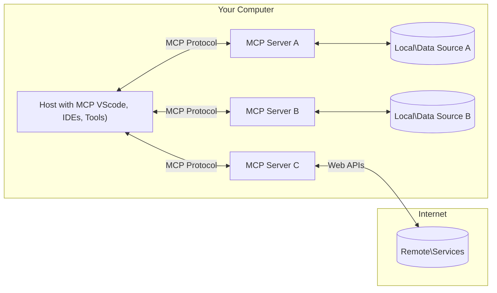

<!--
CO_OP_TRANSLATOR_METADATA:
{
  "original_hash": "355b12a5970c5c9e6db0bee970c751ba",
  "translation_date": "2025-07-13T16:30:33+00:00",
  "source_file": "01-CoreConcepts/README.md",
  "language_code": "uk"
}
-->
# 📖 Основні концепції MCP: Оволодіння протоколом Model Context для інтеграції ШІ

[Model Context Protocol (MCP)](https://github.com/modelcontextprotocol) — це потужний стандартизований фреймворк, який оптимізує взаємодію між великими мовними моделями (LLM) та зовнішніми інструментами, додатками й джерелами даних. Цей SEO-оптимізований посібник проведе вас через основні концепції MCP, допомагаючи зрозуміти його клієнт-серверну архітектуру, ключові компоненти, механізми комунікації та найкращі практики впровадження.

## Огляд

У цьому уроці розглядається базова архітектура та компоненти, що складають екосистему Model Context Protocol (MCP). Ви дізнаєтеся про клієнт-серверну архітектуру, основні компоненти та механізми комунікації, які забезпечують взаємодію в MCP.

## 👩‍🎓 Основні цілі навчання

Після проходження цього уроку ви:

- Зрозумієте клієнт-серверну архітектуру MCP.
- Визначите ролі та обов’язки Hosts, Clients і Servers.
- Проаналізуєте ключові особливості, що роблять MCP гнучким шаром інтеграції.
- Дізнаєтеся, як інформація циркулює в екосистемі MCP.
- Отримаєте практичні знання через приклади коду на .NET, Java, Python і JavaScript.

## 🔎 Архітектура MCP: детальніше

Екосистема MCP побудована на моделі клієнт-сервер. Ця модульна структура дозволяє AI-додаткам ефективно взаємодіяти з інструментами, базами даних, API та контекстними ресурсами. Розглянемо цю архітектуру за основними компонентами.

В основі MCP лежить клієнт-серверна архітектура, де хост-додаток може підключатися до кількох серверів:



- **MCP Hosts**: Програми, такі як VSCode, Claude Desktop, IDE або AI-інструменти, які хочуть отримати доступ до даних через MCP
- **MCP Clients**: Клієнти протоколу, які підтримують 1:1 з’єднання з серверами
- **MCP Servers**: Легковагові програми, що надають конкретні можливості через стандартизований Model Context Protocol
- **Локальні джерела даних**: Файли, бази даних і сервіси вашого комп’ютера, до яких MCP-сервери можуть безпечно отримувати доступ
- **Віддалені сервіси**: Зовнішні системи, доступні через інтернет, до яких MCP-сервери можуть підключатися через API.

Протокол MCP — це стандарт, що розвивається, останні оновлення можна переглянути у [специфікації протоколу](https://modelcontextprotocol.io/specification/2025-06-18/)

### 1. Hosts

У Model Context Protocol (MCP) Hosts відіграють ключову роль як основний інтерфейс, через який користувачі взаємодіють із протоколом. Hosts — це додатки або середовища, які ініціюють з’єднання з MCP-серверами для доступу до даних, інструментів і підказок. Прикладами Hosts є інтегровані середовища розробки (IDE) на кшталт Visual Studio Code, AI-інструменти, як Claude Desktop, або спеціально створені агенти для конкретних завдань.

**Hosts** — це LLM-додатки, які ініціюють з’єднання. Вони:

- Виконують або взаємодіють з AI-моделями для генерації відповідей.
- Ініціюють з’єднання з MCP-серверами.
- Керують потоком розмови та інтерфейсом користувача.
- Контролюють дозволи та обмеження безпеки.
- Обробляють згоду користувача на обмін даними та виконання інструментів.

### 2. Clients

Clients — це важливі компоненти, які полегшують взаємодію між Hosts і MCP-серверами. Вони виступають посередниками, дозволяючи Hosts отримувати та використовувати функціонал MCP-серверів. Clients забезпечують плавну комунікацію та ефективний обмін даними в архітектурі MCP.

**Clients** — це конектори всередині хост-додатку. Вони:

- Надсилають запити серверам із підказками/інструкціями.
- Узгоджують можливості з серверами.
- Керують запитами на виконання інструментів від моделей.
- Обробляють і відображають відповіді користувачам.

### 3. Servers

Servers відповідають за обробку запитів від MCP-клієнтів і надання відповідних відповідей. Вони керують різними операціями, такими як отримання даних, виконання інструментів і генерація підказок. Servers забезпечують ефективну та надійну комунікацію між клієнтами та Hosts, підтримуючи цілісність процесу взаємодії.

**Servers** — це сервіси, що надають контекст і можливості. Вони:

- Реєструють доступні функції (ресурси, підказки, інструменти)
- Приймають і виконують виклики інструментів від клієнта
- Надають контекстну інформацію для покращення відповідей моделі
- Повертають результати клієнту
- Підтримують стан під час взаємодій за потреби

Servers можуть розробляти будь-хто для розширення можливостей моделей спеціалізованим функціоналом.

### 4. Особливості серверів

Сервери в Model Context Protocol (MCP) надають базові будівельні блоки, які забезпечують багаті взаємодії між клієнтами, хостами та мовними моделями. Ці функції покликані розширити можливості MCP, пропонуючи структурований контекст, інструменти та підказки.

MCP-сервери можуть пропонувати будь-які з наступних функцій:

#### 📑 Ресурси

Ресурси в Model Context Protocol (MCP) охоплюють різні типи контексту та даних, які можуть використовувати користувачі або AI-моделі. До них належать:

- **Контекстні дані**: Інформація та контекст, які користувачі або AI-моделі можуть використовувати для прийняття рішень і виконання завдань.
- **Бази знань і сховища документів**: Колекції структурованих і неструктурованих даних, таких як статті, посібники та наукові роботи, що надають цінні знання.
- **Локальні файли та бази даних**: Дані, збережені локально на пристроях або в базах даних, доступні для обробки та аналізу.
- **API та веб-сервіси**: Зовнішні інтерфейси та сервіси, що пропонують додаткові дані та функціонал, дозволяючи інтегруватися з різними онлайн-ресурсами та інструментами.

Приклад ресурсу — це схема бази даних або файл, до якого можна отримати доступ так:

```text
file://log.txt
database://schema
```

### 🤖 Підказки

Підказки в Model Context Protocol (MCP) включають різні заздалегідь визначені шаблони та патерни взаємодії, створені для оптимізації робочих процесів користувачів і покращення комунікації. До них належать:

- **Шаблонізовані повідомлення та робочі процеси**: Попередньо структуровані повідомлення та процеси, які допомагають користувачам виконувати конкретні завдання та взаємодії.
- **Заздалегідь визначені патерни взаємодії**: Стандартизовані послідовності дій і відповідей, що забезпечують послідовну та ефективну комунікацію.
- **Спеціалізовані шаблони розмов**: Налаштовувані шаблони, орієнтовані на певні типи розмов, що гарантують релевантність і контекстну доречність.

Шаблон підказки може виглядати так:

```markdown
Generate a product slogan based on the following {{product}} with the following {{keywords}}
```

#### ⛏️ Інструменти

Інструменти в Model Context Protocol (MCP) — це функції, які AI-модель може виконувати для реалізації конкретних завдань. Ці інструменти покликані розширити можливості AI-моделі, надаючи структуровані та надійні операції. Основні характеристики:

- **Функції для виконання AI-моделлю**: Інструменти — це виконувані функції, які модель може викликати для виконання різних завдань.
- **Унікальна назва та опис**: Кожен інструмент має унікальну назву та детальний опис, що пояснює його призначення та функціонал.
- **Параметри та результати**: Інструменти приймають конкретні параметри і повертають структуровані результати, забезпечуючи послідовність і передбачуваність.
- **Дискретні функції**: Інструменти виконують окремі функції, такі як веб-пошук, обчислення або запити до бази даних.

Приклад інструменту може виглядати так:

```typescript
server.tool(
  "GetProducts",
  {
    pageSize: z.string().optional(),
    pageCount: z.string().optional()
  }, () => {
    // return results from API
  }
)
```

## Особливості клієнтів

У Model Context Protocol (MCP) клієнти пропонують кілька ключових функцій серверам, розширюючи загальну функціональність і взаємодію в протоколі. Однією з помітних функцій є Sampling.

### 👉 Sampling

- **Ініційовані сервером агентні дії**: Клієнти дозволяють серверам автономно ініціювати певні дії або поведінку, розширюючи динамічні можливості системи.
- **Рекурсивні взаємодії з LLM**: Ця функція дозволяє рекурсивно взаємодіяти з великими мовними моделями (LLM), забезпечуючи більш складну та ітеративну обробку завдань.
- **Запит додаткових завершень моделі**: Сервери можуть запитувати додаткові відповіді від моделі, гарантуючи повноту та контекстну релевантність відповідей.

## Потік інформації в MCP

Model Context Protocol (MCP) визначає структурований потік інформації між Hosts, Clients, Servers і моделями. Розуміння цього потоку допомагає зрозуміти, як обробляються запити користувачів і як зовнішні інструменти та дані інтегруються у відповіді моделей.

- **Host ініціює з’єднання**  
  Хост-додаток (наприклад, IDE або чат-інтерфейс) встановлює з’єднання з MCP-сервером, зазвичай через STDIO, WebSocket або інший підтримуваний транспорт.

- **Узгодження можливостей**  
  Клієнт (вбудований у хост) і сервер обмінюються інформацією про підтримувані функції, інструменти, ресурси та версії протоколу. Це гарантує, що обидві сторони розуміють доступні можливості для сесії.

- **Запит користувача**  
  Користувач взаємодіє з хостом (наприклад, вводить підказку або команду). Хост збирає цей ввід і передає його клієнту для обробки.

- **Використання ресурсу або інструменту**  
  - Клієнт може запросити додатковий контекст або ресурси у сервера (наприклад, файли, записи бази даних або статті з бази знань) для збагачення розуміння моделі.
  - Якщо модель визначає, що потрібен інструмент (наприклад, для отримання даних, виконання обчислень або виклику API), клієнт надсилає серверу запит на виклик інструменту з вказанням назви інструменту та параметрів.

- **Виконання сервером**  
  Сервер отримує запит на ресурс або інструмент, виконує необхідні операції (наприклад, запуск функції, запит до бази даних або отримання файлу) і повертає результати клієнту у структурованому форматі.

- **Генерація відповіді**  
  Клієнт інтегрує відповіді сервера (дані ресурсів, результати інструментів тощо) у поточну взаємодію з моделлю. Модель використовує цю інформацію для створення повної та контекстно релевантної відповіді.

- **Представлення результату**  
  Хост отримує фінальний результат від клієнта і відображає його користувачу, часто включаючи як текст, згенерований моделлю, так і результати виконання інструментів або пошуку ресурсів.

Цей потік дозволяє MCP підтримувати просунуті, інтерактивні та контекстно-залежні AI-додатки, безшовно поєднуючи моделі з зовнішніми інструментами та джерелами даних.

## Деталі протоколу

MCP (Model Context Protocol) побудований на основі [JSON-RPC 2.0](https://www.jsonrpc.org/), забезпечуючи стандартизований, незалежний від мови формат повідомлень для комунікації між Hosts, Clients і Servers. Ця основа дозволяє надійні, структуровані та розширювані взаємодії на різних платформах і мовах програмування.

### Ключові особливості протоколу

MCP розширює JSON-RPC 2.0 додатковими конвенціями для виклику інструментів, доступу до ресурсів і керування підказками. Підтримує кілька транспортних шарів (STDIO, WebSocket, SSE) і забезпечує безпечну, розширювану та незалежну від мови комунікацію між компонентами.

#### 🧢 Базовий протокол

- **Формат повідомлень JSON-RPC**: Всі запити та відповіді використовують специфікацію JSON-RPC 2.0, що гарантує послідовну структуру для викликів методів, параметрів, результатів і обробки помилок.
- **Станові з’єднання**: Сесії MCP підтримують стан між кількома запитами, забезпечуючи безперервність розмов, накопичення контексту та керування ресурсами.
- **Узгодження можливостей**: Під час встановлення з’єднання клієнти і сервери обмінюються інформацією про підтримувані функції, версії протоколу, доступні інструменти та ресурси. Це гарантує взаєморозуміння і адаптацію обох сторін.

#### ➕ Додаткові утиліти

Нижче наведено деякі додаткові утиліти та розширення протоколу, які MCP надає для покращення досвіду розробників і підтримки складних сценаріїв:

- **Опції конфігурації**: MCP дозволяє динамічно налаштовувати параметри сесії, такі як дозволи на інструменти, доступ до ресурсів і налаштування моделей, адаптовані до кожної взаємодії.
- **Відстеження прогресу**: Операції з тривалим виконанням можуть повідомляти про стан прогресу, що забезпечує чуйний інтерфейс користувача і кращий досвід під час складних завдань.
- **Скасування запитів**: Клієнти можуть скасовувати запити, що виконуються, дозволяючи користувачам переривати операції, які більше не потрібні або займають забагато часу.
- **Звітність про помилки**: Стандартизовані повідомлення про помилки і коди допомагають діагностувати проблеми, коректно обробляти збої і надавати корисний зворотний зв’язок користувачам і розробникам.
- **Логування**: Клієнти і сервери можуть генерувати структуровані логи для аудиту, налагодження і моніторингу взаємодій протоколу.

Завдяки цим функціям MCP забезпечує надійну, безпечну і гнучку комунікацію між мовними моделями та зовнішніми інструментами або джерелами даних.

### 🔐 Питання безпеки

Реалізації MCP повинні дотримуватися кількох ключових принципів безпеки для забезпечення безпечної та надійної взаємодії:

- **Згода та контроль користувача**: Користува
MCP включає кілька вбудованих концепцій і механізмів для управління безпекою та авторизацією в межах протоколу:

1. **Контроль дозволів інструментів**:  
  Клієнти можуть вказувати, якими інструментами модель може користуватися під час сесії. Це гарантує, що доступні лише явно дозволені інструменти, зменшуючи ризик небажаних або небезпечних операцій. Дозволи можна налаштовувати динамічно залежно від уподобань користувача, політик організації або контексту взаємодії.

2. **Аутентифікація**:  
  Сервери можуть вимагати аутентифікацію перед наданням доступу до інструментів, ресурсів або чутливих операцій. Це може включати API-ключі, OAuth-токени або інші схеми аутентифікації. Коректна аутентифікація забезпечує, що лише довірені клієнти та користувачі можуть викликати можливості на стороні сервера.

3. **Валідація**:  
  Валідація параметрів застосовується для всіх викликів інструментів. Кожен інструмент визначає очікувані типи, формати та обмеження для своїх параметрів, а сервер перевіряє вхідні запити відповідно. Це запобігає надходженню некоректних або шкідливих даних до реалізацій інструментів і допомагає підтримувати цілісність операцій.

4. **Обмеження частоти викликів**:  
  Щоб запобігти зловживанням і забезпечити справедливе використання ресурсів сервера, MCP-сервери можуть впроваджувати обмеження частоти викликів інструментів і доступу до ресурсів. Ліміти можуть застосовуватися на користувача, сесію або глобально, що допомагає захиститися від атак типу відмова в обслуговуванні або надмірного споживання ресурсів.

Поєднуючи ці механізми, MCP забезпечує надійну основу для інтеграції мовних моделей з зовнішніми інструментами та джерелами даних, одночасно надаючи користувачам і розробникам тонкий контроль над доступом і використанням.

## Повідомлення протоколу

Комунікація MCP використовує структуровані JSON-повідомлення для забезпечення чіткої та надійної взаємодії між клієнтами, серверами та моделями. Основні типи повідомлень включають:

- **Запит клієнта**  
  Надсилається від клієнта до сервера, зазвичай містить:
  - Запит або команду користувача
  - Історію розмови для контексту
  - Конфігурацію інструментів і дозволи
  - Будь-які додаткові метадані або інформацію про сесію

- **Відповідь моделі**  
  Повертається моделлю (через клієнта), містить:
  - Згенерований текст або завершення на основі запиту та контексту
  - Опціональні інструкції щодо виклику інструменту, якщо модель визначає необхідність його використання
  - Посилання на ресурси або додатковий контекст за потреби

- **Запит інструменту**  
  Надсилається від клієнта до сервера, коли потрібно виконати інструмент. Повідомлення містить:
  - Назву інструменту для виклику
  - Параметри, необхідні інструменту (перевірені за схемою інструменту)
  - Контекстну інформацію або ідентифікатори для відстеження запиту

- **Відповідь інструменту**  
  Повертається сервером після виконання інструменту. Повідомлення надає:
  - Результати виконання інструменту (структуровані дані або контент)
  - Будь-які помилки або статусні повідомлення у разі невдачі виклику
  - За бажанням, додаткові метадані або логи, пов’язані з виконанням

Ці структуровані повідомлення гарантують, що кожен крок у робочому процесі MCP є явним, відстежуваним і розширюваним, підтримуючи складні сценарії, такі як багатокрокові розмови, ланцюжки інструментів і надійне оброблення помилок.

## Основні висновки

- MCP використовує архітектуру клієнт-сервер для підключення моделей до зовнішніх можливостей
- Екосистема складається з клієнтів, хостів, серверів, інструментів і джерел даних
- Комунікація може відбуватися через STDIO, SSE або WebSockets
- Інструменти — це базові одиниці функціональності, доступні моделям
- Структуровані протоколи комунікації забезпечують послідовну взаємодію

## Завдання

Спроєктуйте простий інструмент MCP, який був би корисним у вашій сфері. Визначте:
1. Як називатиметься інструмент
2. Які параметри він прийматиме
3. Який результат він повертатиме
4. Як модель могла б використовувати цей інструмент для розв’язання проблем користувачів


---

## Що далі

Далі: [Chapter 2: Security](../02-Security/README.md)

**Відмова від відповідальності**:  
Цей документ було перекладено за допомогою сервісу автоматичного перекладу [Co-op Translator](https://github.com/Azure/co-op-translator). Хоча ми прагнемо до точності, будь ласка, майте на увазі, що автоматичні переклади можуть містити помилки або неточності. Оригінальний документ рідною мовою слід вважати авторитетним джерелом. Для критично важливої інформації рекомендується звертатися до професійного людського перекладу. Ми не несемо відповідальності за будь-які непорозуміння або неправильні тлумачення, що виникли внаслідок використання цього перекладу.