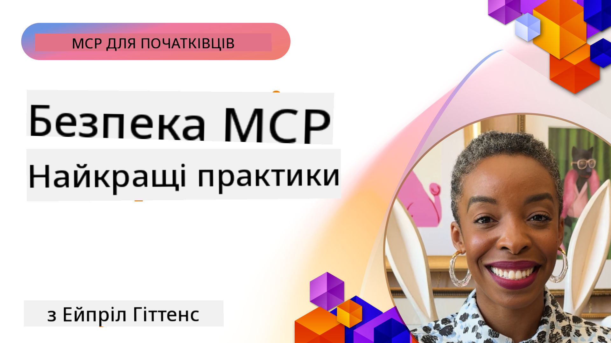

<!--
CO_OP_TRANSLATOR_METADATA:
{
  "original_hash": "1c767a35642f753127dc08545c25a290",
  "translation_date": "2025-08-19T19:18:02+00:00",
  "source_file": "02-Security/README.md",
  "language_code": "uk"
}
-->
# MCP Безпека: Комплексний Захист для AI Систем

_(Натисніть на зображення вище, щоб переглянути відео цього уроку)_

Безпека є основою для проєктування AI-систем, тому ми приділяємо їй увагу у другому розділі. Це відповідає принципу Microsoft **Безпека за Дизайном** із [Ініціативи Безпечного Майбутнього](https://www.microsoft.com/security/blog/2025/04/17/microsofts-secure-by-design-journey-one-year-of-success/).

Протокол Model Context Protocol (MCP) надає потужні нові можливості для застосунків на основі AI, але водночас створює унікальні виклики безпеки, які виходять за межі традиційних ризиків програмного забезпечення. MCP-системи стикаються як із загальновідомими проблемами безпеки (безпечне кодування, мінімізація привілеїв, безпека ланцюга постачання), так і з новими загрозами, специфічними для AI, такими як ін'єкція підказок, отруєння інструментів, викрадення сесій, атаки "заплутаний заступник", вразливості передачі токенів і динамічна модифікація можливостей.

Цей урок розглядає найважливіші ризики безпеки в реалізації MCP—включаючи автентифікацію, авторизацію, надмірні дозволи, непряму ін'єкцію підказок, безпеку сесій, проблеми "заплутаного заступника", управління токенами та вразливості ланцюга постачання. Ви дізнаєтеся про практичні заходи контролю та найкращі практики для зменшення цих ризиків, використовуючи рішення Microsoft, такі як Prompt Shields, Azure Content Safety і GitHub Advanced Security для посилення вашого розгортання MCP.

## Навчальні Цілі

До кінця цього уроку ви зможете:

- **Визначати Загрози, Специфічні для MCP**: Розпізнавати унікальні ризики безпеки в MCP-системах, включаючи ін'єкцію підказок, отруєння інструментів, надмірні дозволи, викрадення сесій, проблеми "заплутаного заступника", вразливості передачі токенів і ризики ланцюга постачання
- **Застосовувати Заходи Безпеки**: Реалізовувати ефективні заходи, включаючи надійну автентифікацію, доступ із мінімальними привілеями, безпечне управління токенами, контроль безпеки сесій і перевірку ланцюга постачання
- **Використовувати Рішення Microsoft для Безпеки**: Розуміти та впроваджувати Microsoft Prompt Shields, Azure Content Safety і GitHub Advanced Security для захисту робочих навантажень MCP
- **Перевіряти Безпеку Інструментів**: Усвідомлювати важливість перевірки метаданих інструментів, моніторингу динамічних змін і захисту від непрямих атак ін'єкції підказок
- **Інтегрувати Найкращі Практики**: Поєднувати загальноприйняті основи безпеки (безпечне кодування, зміцнення серверів, нульова довіра) із заходами, специфічними для MCP, для комплексного захисту

# Архітектура та Контроль Безпеки MCP

Сучасні реалізації MCP вимагають багатошарових підходів до безпеки, які враховують як традиційні загрози програмного забезпечення, так і специфічні для AI ризики. Швидко розвиваючись, специфікація MCP продовжує вдосконалювати свої заходи безпеки, забезпечуючи кращу інтеграцію з корпоративними архітектурами безпеки та усталеними найкращими практиками.

Дослідження з [Звіту Microsoft про Цифрову Оборону](https://aka.ms/mddr) демонструють, що **98% зареєстрованих порушень можна було б запобігти за допомогою надійної гігієни безпеки**. Найефективніша стратегія захисту поєднує базові заходи безпеки з контролем, специфічним для MCP—доведені базові заходи залишаються найбільш впливовими у зменшенні загального ризику безпеки.

## Поточний Ландшафт Безпеки

> **Примітка:** Ця інформація відображає стандарти безпеки MCP станом на **18 серпня 2025 року**. Протокол MCP швидко розвивається, і майбутні реалізації можуть включати нові шаблони автентифікації та вдосконалені заходи контролю. Завжди звертайтеся до актуальної [Специфікації MCP](https://spec.modelcontextprotocol.io/), [репозиторію MCP на GitHub](https://github.com/modelcontextprotocol) і [документації з найкращих практик безпеки](https://modelcontextprotocol.io/specification/2025-06-18/basic/security_best_practices) для отримання останніх рекомендацій.

### Еволюція Автентифікації MCP

Специфікація MCP значно еволюціонувала у своєму підході до автентифікації та авторизації:

- **Початковий Підхід**: Ранні специфікації вимагали від розробників реалізації власних серверів автентифікації, причому сервери MCP діяли як OAuth 2.0 Authorization Servers, які безпосередньо керували автентифікацією користувачів
- **Поточний Стандарт (2025-06-18)**: Оновлена специфікація дозволяє серверам MCP делегувати автентифікацію зовнішнім постачальникам ідентифікації (таким як Microsoft Entra ID), покращуючи безпеку та зменшуючи складність реалізації
- **Безпека Транспортного Рівня**: Розширена підтримка безпечних транспортних механізмів із належними шаблонами автентифікації як для локальних (STDIO), так і для віддалених (Streamable HTTP) з'єднань

## Безпека Автентифікації та Авторизації

### Поточні Виклики Безпеки

Сучасні реалізації MCP стикаються з кількома викликами автентифікації та авторизації:

### Ризики та Вектори Загроз

- **Неправильно Налаштована Логіка Авторизації**: Помилки в реалізації авторизації на серверах MCP можуть призвести до витоку конфіденційних даних і неправильного застосування контролю доступу
- **Компрометація OAuth Токенів**: Викрадення локальних токенів серверів MCP дозволяє зловмисникам видавати себе за сервери та отримувати доступ до підключених сервісів
- **Вразливості Передачі Токенів**: Неправильне управління токенами створює можливості для обходу заходів безпеки та прогалин у відповідальності
- **Надмірні Дозволи**: Надмірно привілейовані сервери MCP порушують принцип мінімальних привілеїв і розширюють поверхню атаки

#### Передача Токенів: Критичний Антипатерн

**Передача токенів категорично заборонена** в поточній специфікації авторизації MCP через серйозні наслідки для безпеки:

##### Обхід Контролю Безпеки
- Сервери MCP та API нижчого рівня реалізують критичні заходи безпеки (обмеження швидкості, перевірка запитів, моніторинг трафіку), які залежать від належної перевірки токенів
- Пряме використання токенів клієнтами для доступу до API обходить ці важливі заходи, підриваючи архітектуру безпеки

##### Проблеми Відповідальності та Аудиту  
- Сервери MCP не можуть розрізнити клієнтів, які використовують токени, видані іншими сервісами, що порушує аудиторські сліди
- Логи серверів ресурсів нижчого рівня показують хибні джерела запитів замість реальних посередників серверів MCP
- Розслідування інцидентів і аудит відповідності стають значно складнішими

##### Ризики Витоку Даних
- Неперевірені твердження токенів дозволяють зловмисникам із викраденими токенами використовувати сервери MCP як проксі для витоку даних
- Порушення меж довіри дозволяють несанкціоновані шаблони доступу, які обходять передбачені заходи безпеки

##### Вектори Атак на Багатосервісні Системи
- Компрометовані токени, прийняті кількома сервісами, дозволяють зловмисникам переміщатися між підключеними системами
- Припущення довіри між сервісами можуть бути порушені, коли джерела токенів не можуть бути перевірені

### Заходи Контролю та Зменшення Ризиків

**Критичні Вимоги Безпеки:**

> **ОБОВ'ЯЗКОВО**: Сервери MCP **НЕ ПОВИННІ** приймати жодні токени, які не були явно видані для сервера MCP

#### Контроль Автентифікації та Авторизації

- **Ретельний Огляд Авторизації**: Проводьте всебічні аудити логіки авторизації серверів MCP, щоб гарантувати, що лише передбачені користувачі та клієнти можуть отримати доступ до конфіденційних ресурсів
  - **Посібник із Реалізації**: [Azure API Management як Шлюз Автентифікації для Серверів MCP](https://techcommunity.microsoft.com/blog/integrationsonazureblog/azure-api-management-your-auth-gateway-for-mcp-servers/4402690)
  - **Інтеграція Ідентифікації**: [Використання Microsoft Entra ID для Автентифікації Серверів MCP](https://den.dev/blog/mcp-server-auth-entra-id-session/)

- **Безпечне Управління Токенами**: Реалізуйте [найкращі практики Microsoft щодо перевірки токенів і їх життєвого циклу](https://learn.microsoft.com/en-us/entra/identity-platform/access-tokens)
  - Перевіряйте, чи відповідають твердження аудиторії токенів ідентичності сервера MCP
  - Реалізуйте належну ротацію токенів і політики їх закінчення терміну дії
  - Запобігайте атакам повторного використання токенів і несанкціонованому використанню

- **Захищене Зберігання Токенів**: Забезпечте шифрування токенів як у стані спокою, так і під час передачі
  - **Найкращі Практики**: [Посібник із Захищеного Зберігання Токенів та Шифрування](https://youtu.be/uRdX37EcCwg?si=6fSChs1G4glwXRy2)

#### Реалізація Контролю Доступу

- **Принцип Мінімальних Привілеїв**: Надавайте серверам MCP лише мінімальні дозволи, необхідні для виконання їхніх функцій
  - Регулярно переглядайте та оновлюйте дозволи, щоб запобігти накопиченню привілеїв
  - **Документація Microsoft**: [Забезпечення Доступу з Мінімальними Привілеями](https://learn.microsoft.com/entra/identity-platform/secure-least-privileged-access)

- **Контроль Доступу на Основі Ролей (RBAC)**: Реалізуйте детальні призначення ролей
  - Обмежуйте ролі конкретними ресурсами та діями
  - Уникайте широких або непотрібних дозволів, які розширюють поверхню атаки

- **Безперервний Моніторинг Дозволів**: Реалізуйте постійний аудит і моніторинг доступу
  - Відстежуйте шаблони використання дозволів для виявлення аномалій
  - Швидко усувайте надмірні або невикористані привілеї

## Загрози Безпеки, Специфічні для AI

### Атаки Ін'єкції Підказок та Маніпуляції Інструментами

Сучасні реалізації MCP стикаються зі складними векторами атак, специфічними для AI, які традиційні заходи безпеки не можуть повністю вирішити:

#### **Непряма Ін'єкція Підказок (Крос-Доменна Ін'єкція Підказок)**

**Непряма Ін'єкція Підказок** є однією з найкритичніших вразливостей у системах AI, що підтримують MCP. Зловмисники вбудовують шкідливі інструкції в зовнішній контент—документи, вебсторінки, електронні листи або джерела даних, які AI-системи згодом обробляють як легітимні команди.

**Сценарії Атак:**
- **Ін'єкція через Документи**: Шкідливі інструкції, приховані в оброблюваних документах, які викликають небажані дії AI
- **Експлуатація Вебконтенту**: Скомпрометовані вебсторінки з вбудованими підказками, які маніпулюють поведінкою AI під час скрапінгу
- **Атаки через Електронну Пошту**: Шкідливі підказки в електронних листах, які змушують AI-асистентів розкривати інформацію або виконувати несанкціоновані дії
- **Забруднення Джерел Даних**: Скомпрометовані бази даних або API, які надають заражений контент AI-системам

**Реальний Вплив**: Ці атаки можуть призвести до витоку даних, порушення конфіденційності, генерації шкідливого контенту та маніпуляції взаємодіями з користувачами. Для детального аналізу див. [Ін'єкція Підказок у MCP (Саймон Віллісон)](https://simonwillison.net/2025/Apr/9/mcp-prompt-injection/).

#### **Атаки Отруєння Інструментів**

**Отруєння Інструментів** націлене на метадані, які визначають інструменти MCP, використовуючи те, як LLM інтерпретують описи інструментів і параметри для прийняття рішень про виконання.

**Механізми Атак:**
- **Маніпуляція Метаданими**: Зловмисники вбудовують шкідливі інструкції в описи інструментів, визначення параметрів або приклади використання
- **Невидимі Інструкції**: Приховані підказки в метаданих інструментів, які обробляються AI-моделями, але невидимі для користувачів
- **Динамічна Модифікація Інструментів ("Раптові Зміни")**: Інструменти, схвалені користувачами, згодом змінюються для виконання шкідливих дій без відома користувачів
- **Ін'єкція Параметрів**: Шкідливий контент, вбудований у схеми параметрів інструментів, який впливає на поведінку моделі

**Ризики Хостованих Серверів**: Віддалені сервери MCP представляють підвищені ризики, оскільки визначення інструментів можуть бути оновлені після початкового схвалення користувачем, створюючи сценарії, коли раніше безпечні інструменти стають шкідливими. Для всебічного аналізу див. [Атаки Отруєння Інструментів (Invariant Labs)](https://invariantlabs.ai/blog/mcp-security-notification-tool-poisoning-attacks).

![Діаграма Атаки Ін'єкції Інструментів](../images/02-S
- **Безпечне створення сесій**: Використовуйте криптографічно захищені, недетерміновані ідентифікатори сесій, згенеровані за допомогою надійних генераторів випадкових чисел  
- **Прив’язка до користувача**: Прив’язуйте ідентифікатори сесій до інформації, специфічної для користувача, використовуючи формати на кшталт `<user_id>:<session_id>`, щоб запобігти зловживанню сесіями між користувачами  
- **Управління життєвим циклом сесій**: Реалізуйте правильне завершення, ротацію та анулювання сесій для обмеження вікон вразливості  
- **Безпека транспорту**: Використовуйте HTTPS для всіх комунікацій, щоб запобігти перехопленню ідентифікаторів сесій  

### Проблема "заплутаного заступника"

**Проблема заплутаного заступника** виникає, коли сервери MCP виступають як проксі-аутентифікації між клієнтами та сторонніми сервісами, створюючи можливості для обходу авторизації через експлуатацію статичних ідентифікаторів клієнтів.

#### **Механіка атак та ризики**

- **Обхід згоди через cookie**: Попередня автентифікація користувача створює cookie-файли згоди, які зловмисники використовують через шкідливі запити авторизації з підробленими URI перенаправлення  
- **Крадіжка коду авторизації**: Існуючі cookie-файли згоди можуть змусити сервери авторизації пропустити екрани згоди, перенаправляючи коди на контрольовані зловмисниками кінцеві точки  
- **Несанкціонований доступ до API**: Викрадені коди авторизації дозволяють обмінювати їх на токени та імітувати користувача без явного схвалення  

#### **Стратегії пом’якшення**

**Обов’язкові заходи:**
- **Вимога явної згоди**: Проксі-сервери MCP, які використовують статичні ідентифікатори клієнтів, **ПОВИННІ** отримувати згоду користувача для кожного динамічно зареєстрованого клієнта  
- **Реалізація безпеки OAuth 2.1**: Дотримуйтесь актуальних найкращих практик безпеки OAuth, включаючи PKCE (Proof Key for Code Exchange) для всіх запитів авторизації  
- **Сувала перевірка клієнтів**: Реалізуйте ретельну перевірку URI перенаправлення та ідентифікаторів клієнтів, щоб запобігти експлуатації  

### Уразливості передачі токенів  

**Передача токенів** є явним антипатерном, коли сервери MCP приймають токени клієнтів без належної перевірки та передають їх до API, порушуючи специфікації авторизації MCP.

#### **Імплікації для безпеки**

- **Обхід контролю**: Пряме використання токенів клієнта для API обходить важливі обмеження швидкості, перевірки та моніторингу  
- **Порушення аудиторського сліду**: Токени, видані на верхньому рівні, унеможливлюють ідентифікацію клієнта, що ускладнює розслідування інцидентів  
- **Експлуатація через проксі**: Неперевірені токени дозволяють зловмисникам використовувати сервери як проксі для несанкціонованого доступу до даних  
- **Порушення меж довіри**: Припущення про довіру до джерела токенів можуть бути порушені, якщо їх походження не можна перевірити  
- **Розширення атак між сервісами**: Скомпрометовані токени, прийняті кількома сервісами, дозволяють здійснювати латеральний рух  

#### **Необхідні заходи безпеки**

**Обов’язкові вимоги:**
- **Перевірка токенів**: Сервери MCP **НЕ ПОВИННІ** приймати токени, які не були явно видані для сервера MCP  
- **Перевірка аудиторії**: Завжди перевіряйте, чи відповідають заяви про аудиторію токенів ідентичності сервера MCP  
- **Правильний життєвий цикл токенів**: Реалізуйте короткоживучі токени доступу з безпечними практиками ротації  

## Безпека ланцюга постачання для AI-систем

Безпека ланцюга постачання вийшла за межі традиційних програмних залежностей і охоплює весь AI-екосистему. Сучасні реалізації MCP повинні ретельно перевіряти та моніторити всі AI-компоненти, оскільки кожен з них може стати джерелом вразливостей, що загрожують цілісності системи.

### Розширені компоненти ланцюга постачання AI

**Традиційні програмні залежності:**
- Бібліотеки з відкритим кодом і фреймворки  
- Образи контейнерів і базові системи  
- Інструменти розробки та конвеєри збірки  
- Інфраструктурні компоненти та сервіси  

**AI-специфічні елементи ланцюга постачання:**
- **Базові моделі**: Попередньо навчені моделі від різних постачальників, які потребують перевірки походження  
- **Сервіси векторизації**: Зовнішні сервіси для семантичного пошуку та векторизації  
- **Постачальники контексту**: Джерела даних, бази знань і репозиторії документів  
- **Сторонні API**: Зовнішні AI-сервіси, ML-конвеєри та кінцеві точки обробки даних  
- **Артефакти моделей**: Ваги, конфігурації та варіанти моделей, налаштовані для конкретних завдань  
- **Джерела навчальних даних**: Набори даних, використані для навчання та доопрацювання моделей  

### Комплексна стратегія безпеки ланцюга постачання

#### **Перевірка компонентів та довіра**
- **Перевірка походження**: Перевіряйте походження, ліцензування та цілісність усіх AI-компонентів перед інтеграцією  
- **Оцінка безпеки**: Проводьте сканування на вразливості та огляди безпеки для моделей, джерел даних і AI-сервісів  
- **Аналіз репутації**: Оцінюйте репутацію та практики безпеки постачальників AI-сервісів  
- **Перевірка відповідності**: Переконайтеся, що всі компоненти відповідають вимогам безпеки та регуляторним нормам організації  

#### **Безпечні конвеєри розгортання**  
- **Автоматизована безпека CI/CD**: Інтегруйте сканування безпеки в автоматизовані конвеєри розгортання  
- **Цілісність артефактів**: Реалізуйте криптографічну перевірку для всіх розгорнутих артефактів (коду, моделей, конфігурацій)  
- **Поступове розгортання**: Використовуйте прогресивні стратегії розгортання з перевіркою безпеки на кожному етапі  
- **Довірені репозиторії артефактів**: Розгортайте лише з перевірених, захищених репозиторіїв  

#### **Безперервний моніторинг та реагування**
- **Сканування залежностей**: Постійний моніторинг вразливостей для всіх програмних і AI-компонентів  
- **Моніторинг моделей**: Безперервна оцінка поведінки моделей, дрейфу продуктивності та аномалій безпеки  
- **Відстеження стану сервісів**: Моніторинг зовнішніх AI-сервісів на предмет доступності, інцидентів безпеки та змін політик  
- **Інтеграція загроз**: Включення джерел загроз, специфічних для AI та ML  

#### **Контроль доступу та принцип мінімальних привілеїв**
- **Дозволи на рівні компонентів**: Обмежуйте доступ до моделей, даних і сервісів відповідно до бізнес-необхідності  
- **Управління обліковими записами сервісів**: Використовуйте спеціалізовані облікові записи з мінімально необхідними дозволами  
- **Сегментація мережі**: Ізолюйте AI-компоненти та обмежуйте мережевий доступ між сервісами  
- **Контроль API-шлюзів**: Використовуйте централізовані шлюзи API для контролю та моніторингу доступу до зовнішніх AI-сервісів  

#### **Реагування на інциденти та відновлення**
- **Швидкі процедури реагування**: Встановлені процеси для виправлення або заміни скомпрометованих AI-компонентів  
- **Ротація облікових даних**: Автоматизовані системи для ротації секретів, ключів API та облікових даних сервісів  
- **Можливості відкату**: Здатність швидко повернутися до попередніх перевірених версій AI-компонентів  
- **Відновлення після порушення ланцюга постачання**: Специфічні процедури для реагування на компрометацію сторонніх AI-сервісів  

...
### **Рішення з безпеки Microsoft**
- [Документація Microsoft Prompt Shields](https://learn.microsoft.com/azure/ai-services/content-safety/concepts/jailbreak-detection)
- [Сервіс Azure Content Safety](https://learn.microsoft.com/azure/ai-services/content-safety/)
- [Безпека Microsoft Entra ID](https://learn.microsoft.com/entra/identity-platform/secure-least-privileged-access)
- [Найкращі практики управління токенами Azure](https://learn.microsoft.com/entra/identity-platform/access-tokens)
- [Розширена безпека GitHub](https://github.com/security/advanced-security)

### **Посібники з впровадження та навчальні матеріали**
- [Azure API Management як шлюз автентифікації MCP](https://techcommunity.microsoft.com/blog/integrationsonazureblog/azure-api-management-your-auth-gateway-for-mcp-servers/4402690)
- [Автентифікація Microsoft Entra ID з серверами MCP](https://den.dev/blog/mcp-server-auth-entra-id-session/)
- [Безпечне зберігання токенів та шифрування (відео)](https://youtu.be/uRdX37EcCwg?si=6fSChs1G4glwXRy2)

### **DevOps та безпека ланцюга постачання**
- [Безпека Azure DevOps](https://azure.microsoft.com/products/devops)
- [Безпека Azure Repos](https://azure.microsoft.com/products/devops/repos/)
- [Подорож Microsoft до забезпечення безпеки ланцюга постачання](https://devblogs.microsoft.com/engineering-at-microsoft/the-journey-to-secure-the-software-supply-chain-at-microsoft/)

## **Додаткова документація з безпеки**

Для отримання повного керівництва з безпеки ознайомтеся з цими спеціалізованими документами в цьому розділі:

- **[Найкращі практики безпеки MCP 2025](./mcp-security-best-practices-2025.md)** - Повний набір найкращих практик безпеки для впровадження MCP
- **[Впровадження Azure Content Safety](./azure-content-safety-implementation.md)** - Практичні приклади інтеграції Azure Content Safety  
- **[Контролі безпеки MCP 2025](./mcp-security-controls-2025.md)** - Останні методи та контролі безпеки для розгортання MCP
- **[Швидкий довідник з найкращих практик MCP](./mcp-best-practices.md)** - Короткий довідник з основних практик безпеки MCP

---

## Що далі

Далі: [Розділ 3: Початок роботи](../03-GettingStarted/README.md)

**Відмова від відповідальності**:  
Цей документ був перекладений за допомогою сервісу автоматичного перекладу [Co-op Translator](https://github.com/Azure/co-op-translator). Хоча ми прагнемо до точності, будь ласка, майте на увазі, що автоматичні переклади можуть містити помилки або неточності. Оригінальний документ на його рідній мові слід вважати авторитетним джерелом. Для критичної інформації рекомендується професійний людський переклад. Ми не несемо відповідальності за будь-які непорозуміння або неправильні тлумачення, що виникають внаслідок використання цього перекладу.