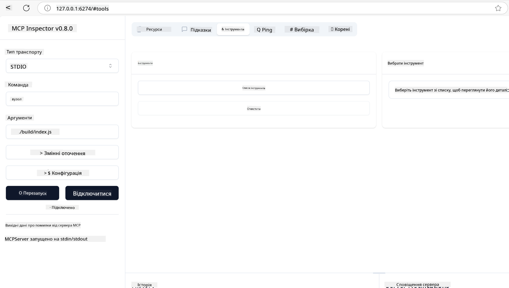
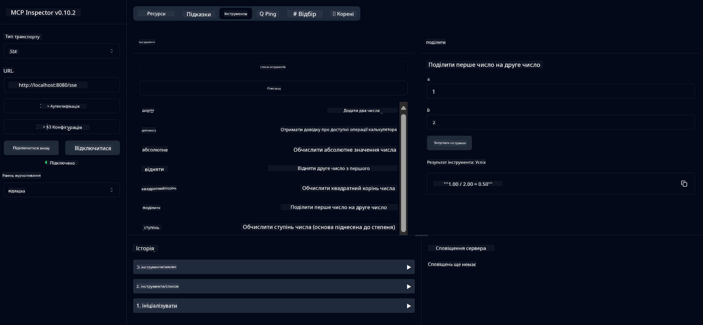
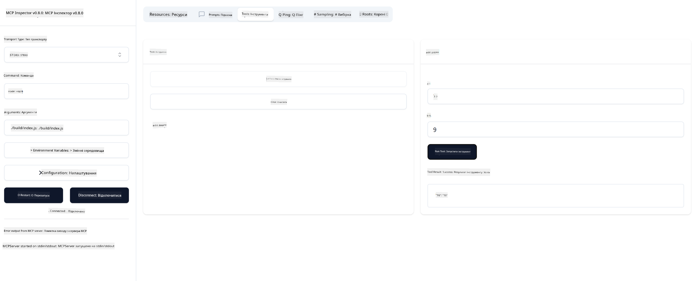

<!--
CO_OP_TRANSLATOR_METADATA:
{
  "original_hash": "ec11ee93f31fdadd94facd3e3d22f9e6",
  "translation_date": "2025-09-09T22:23:03+00:00",
  "source_file": "03-GettingStarted/01-first-server/README.md",
  "language_code": "uk"
}
-->
# Початок роботи з MCP

Ласкаво просимо до ваших перших кроків із Model Context Protocol (MCP)! Незалежно від того, чи ви новачок у MCP, чи прагнете поглибити свої знання, цей посібник проведе вас через основні етапи налаштування та розробки. Ви дізнаєтеся, як MCP забезпечує безперебійну інтеграцію між AI-моделями та додатками, а також навчитеся швидко налаштовувати середовище для створення та тестування рішень на основі MCP.

> Коротко: Якщо ви створюєте AI-додатки, ви знаєте, що можете додати інструменти та інші ресурси до вашої LLM (великої мовної моделі), щоб зробити її більш обізнаною. Однак, якщо ви розмістите ці інструменти та ресурси на сервері, можливості додатка та сервера можуть бути використані будь-яким клієнтом з/без LLM.

## Огляд

Цей урок надає практичні рекомендації щодо налаштування середовищ MCP та створення ваших перших додатків MCP. Ви навчитеся налаштовувати необхідні інструменти та фреймворки, створювати базові MCP-сервери, створювати хост-додатки та тестувати ваші реалізації.

Model Context Protocol (MCP) — це відкритий протокол, який стандартизує спосіб, яким додатки надають контекст LLM. Уявіть MCP як порт USB-C для AI-додатків — він забезпечує стандартизований спосіб підключення AI-моделей до різних джерел даних та інструментів.

## Цілі навчання

До кінця цього уроку ви зможете:

- Налаштувати середовища розробки для MCP у C#, Java, Python, TypeScript та Rust
- Створювати та розгортати базові MCP-сервери з кастомними функціями (ресурси, підказки та інструменти)
- Створювати хост-додатки, які підключаються до MCP-серверів
- Тестувати та налагоджувати реалізації MCP

## Налаштування середовища MCP

Перед тим як почати працювати з MCP, важливо підготувати середовище розробки та зрозуміти основний робочий процес. У цьому розділі ви знайдете початкові кроки налаштування для забезпечення плавного старту з MCP.

### Попередні вимоги

Перед початком розробки MCP переконайтеся, що у вас є:

- **Середовище розробки**: Для обраної вами мови (C#, Java, Python, TypeScript або Rust)
- **IDE/Редактор**: Visual Studio, Visual Studio Code, IntelliJ, Eclipse, PyCharm або будь-який сучасний редактор коду
- **Менеджери пакетів**: NuGet, Maven/Gradle, pip, npm/yarn або Cargo
- **API-ключі**: Для будь-яких AI-сервісів, які ви плануєте використовувати у ваших хост-додатках

## Базова структура MCP-сервера

Типовий MCP-сервер включає:

- **Конфігурацію сервера**: Налаштування порту, аутентифікації та інших параметрів
- **Ресурси**: Дані та контекст, доступні для LLM
- **Інструменти**: Функціональність, яку моделі можуть викликати
- **Підказки**: Шаблони для генерації або структурування тексту

Ось спрощений приклад на TypeScript:

```typescript
import { McpServer, ResourceTemplate } from "@modelcontextprotocol/sdk/server/mcp.js";
import { StdioServerTransport } from "@modelcontextprotocol/sdk/server/stdio.js";
import { z } from "zod";

// Create an MCP server
const server = new McpServer({
  name: "Demo",
  version: "1.0.0"
});

// Add an addition tool
server.tool("add",
  { a: z.number(), b: z.number() },
  async ({ a, b }) => ({
    content: [{ type: "text", text: String(a + b) }]
  })
);

// Add a dynamic greeting resource
server.resource(
  "file",
  // The 'list' parameter controls how the resource lists available files. Setting it to undefined disables listing for this resource.
  new ResourceTemplate("file://{path}", { list: undefined }),
  async (uri, { path }) => ({
    contents: [{
      uri: uri.href,
      text: `File, ${path}!`
    }]
  })
);

// Add a file resource that reads the file contents
server.resource(
  "file",
  new ResourceTemplate("file://{path}", { list: undefined }),
  async (uri, { path }) => {
    let text;
    try {
      text = await fs.readFile(path, "utf8");
    } catch (err) {
      text = `Error reading file: ${err.message}`;
    }
    return {
      contents: [{
        uri: uri.href,
        text
      }]
    };
  }
);

server.prompt(
  "review-code",
  { code: z.string() },
  ({ code }) => ({
    messages: [{
      role: "user",
      content: {
        type: "text",
        text: `Please review this code:\n\n${code}`
      }
    }]
  })
);

// Start receiving messages on stdin and sending messages on stdout
const transport = new StdioServerTransport();
await server.connect(transport);
```

У наведеному коді ми:

- Імпортуємо необхідні класи з MCP SDK для TypeScript.
- Створюємо та налаштовуємо новий екземпляр MCP-сервера.
- Реєструємо кастомний інструмент (`calculator`) з функцією-обробником.
- Запускаємо сервер для прослуховування вхідних запитів MCP.

## Тестування та налагодження

Перед тим як почати тестування вашого MCP-сервера, важливо зрозуміти доступні інструменти та найкращі практики для налагодження. Ефективне тестування забезпечує очікувану поведінку сервера та допомагає швидко виявляти й вирішувати проблеми. У наступному розділі описані рекомендовані підходи до перевірки вашої реалізації MCP.

MCP надає інструменти для тестування та налагодження серверів:

- **Інструмент Inspector**: Графічний інтерфейс, який дозволяє підключатися до вашого сервера та тестувати інструменти, підказки та ресурси.
- **curl**: Ви також можете підключатися до вашого сервера за допомогою командного рядка, використовуючи curl або інші клієнти, які можуть створювати та виконувати HTTP-команди.

### Використання MCP Inspector

[MCP Inspector](https://github.com/modelcontextprotocol/inspector) — це візуальний інструмент тестування, який допомагає:

1. **Виявляти можливості сервера**: Автоматично визначати доступні ресурси, інструменти та підказки
2. **Тестувати виконання інструментів**: Пробувати різні параметри та бачити відповіді в реальному часі
3. **Переглядати метадані сервера**: Аналізувати інформацію про сервер, схеми та конфігурації

```bash
# ex TypeScript, installing and running MCP Inspector
npx @modelcontextprotocol/inspector node build/index.js
```

Після виконання наведених команд MCP Inspector запустить локальний веб-інтерфейс у вашому браузері. Ви побачите панель, яка відображає зареєстровані MCP-сервери, їх доступні інструменти, ресурси та підказки. Інтерфейс дозволяє інтерактивно тестувати виконання інструментів, переглядати метадані сервера та бачити відповіді в реальному часі, що спрощує перевірку та налагодження реалізацій MCP-сервера.

Ось приклад того, як це може виглядати:



## Поширені проблеми налаштування та їх вирішення

| Проблема | Можливе рішення |
|----------|-----------------|
| Відмова у підключенні | Перевірте, чи сервер запущений і чи правильний порт |
| Помилки виконання інструментів | Перевірте валідацію параметрів та обробку помилок |
| Помилки аутентифікації | Перевірте API-ключі та дозволи |
| Помилки валідації схеми | Переконайтеся, що параметри відповідають визначеній схемі |
| Сервер не запускається | Перевірте конфлікти портів або відсутні залежності |
| Помилки CORS | Налаштуйте правильні заголовки CORS для запитів між доменами |
| Проблеми аутентифікації | Перевірте дійсність токенів та дозволи |

## Локальна розробка

Для локальної розробки та тестування ви можете запускати MCP-сервери безпосередньо на вашому комп'ютері:

1. **Запустіть процес сервера**: Запустіть ваш додаток MCP-сервера
2. **Налаштуйте мережу**: Переконайтеся, що сервер доступний на очікуваному порту
3. **Підключіть клієнтів**: Використовуйте локальні URL-адреси, наприклад `http://localhost:3000`

```bash
# Example: Running a TypeScript MCP server locally
npm run start
# Server running at http://localhost:3000
```

## Створення вашого першого MCP-сервера

Ми розглянули [Основні концепції](/01-CoreConcepts/README.md) у попередньому уроці, тепер настав час застосувати ці знання на практиці.

### Що може робити сервер

Перед тим як почати писати код, давайте нагадаємо собі, що може робити сервер:

MCP-сервер може, наприклад:

- Доступ до локальних файлів та баз даних
- Підключення до віддалених API
- Виконання обчислень
- Інтеграція з іншими інструментами та сервісами
- Надання інтерфейсу для взаємодії

Чудово, тепер, коли ми знаємо, що він може робити, давайте почнемо писати код.

## Вправа: Створення сервера

Щоб створити сервер, вам потрібно виконати наступні кроки:

- Встановити MCP SDK.
- Створити проект і налаштувати структуру проекту.
- Написати код сервера.
- Протестувати сервер.

### -1- Створення проекту

#### TypeScript

```sh
# Create project directory and initialize npm project
mkdir calculator-server
cd calculator-server
npm init -y
```

#### Python

```sh
# Create project dir
mkdir calculator-server
cd calculator-server
# Open the folder in Visual Studio Code - Skip this if you are using a different IDE
code .
```

#### .NET

```sh
dotnet new console -n McpCalculatorServer
cd McpCalculatorServer
```

#### Java

Для Java створіть проект Spring Boot:

```bash
curl https://start.spring.io/starter.zip \
  -d dependencies=web \
  -d javaVersion=21 \
  -d type=maven-project \
  -d groupId=com.example \
  -d artifactId=calculator-server \
  -d name=McpServer \
  -d packageName=com.microsoft.mcp.sample.server \
  -o calculator-server.zip
```

Розпакуйте zip-файл:

```bash
unzip calculator-server.zip -d calculator-server
cd calculator-server
# optional remove the unused test
rm -rf src/test/java
```

Додайте наступну повну конфігурацію до вашого *pom.xml*:

```xml
<?xml version="1.0" encoding="UTF-8"?>
<project xmlns="http://maven.apache.org/POM/4.0.0"
    xmlns:xsi="http://www.w3.org/2001/XMLSchema-instance"
    xsi:schemaLocation="http://maven.apache.org/POM/4.0.0 http://maven.apache.org/xsd/maven-4.0.0.xsd">
    <modelVersion>4.0.0</modelVersion>
    
    <!-- Spring Boot parent for dependency management -->
    <parent>
        <groupId>org.springframework.boot</groupId>
        <artifactId>spring-boot-starter-parent</artifactId>
        <version>3.5.0</version>
        <relativePath />
    </parent>

    <!-- Project coordinates -->
    <groupId>com.example</groupId>
    <artifactId>calculator-server</artifactId>
    <version>0.0.1-SNAPSHOT</version>
    <name>Calculator Server</name>
    <description>Basic calculator MCP service for beginners</description>

    <!-- Properties -->
    <properties>
        <java.version>21</java.version>
        <maven.compiler.source>21</maven.compiler.source>
        <maven.compiler.target>21</maven.compiler.target>
    </properties>

    <!-- Spring AI BOM for version management -->
    <dependencyManagement>
        <dependencies>
            <dependency>
                <groupId>org.springframework.ai</groupId>
                <artifactId>spring-ai-bom</artifactId>
                <version>1.0.0-SNAPSHOT</version>
                <type>pom</type>
                <scope>import</scope>
            </dependency>
        </dependencies>
    </dependencyManagement>

    <!-- Dependencies -->
    <dependencies>
        <dependency>
            <groupId>org.springframework.ai</groupId>
            <artifactId>spring-ai-starter-mcp-server-webflux</artifactId>
        </dependency>
        <dependency>
            <groupId>org.springframework.boot</groupId>
            <artifactId>spring-boot-starter-actuator</artifactId>
        </dependency>
        <dependency>
         <groupId>org.springframework.boot</groupId>
         <artifactId>spring-boot-starter-test</artifactId>
         <scope>test</scope>
      </dependency>
    </dependencies>

    <!-- Build configuration -->
    <build>
        <plugins>
            <plugin>
                <groupId>org.springframework.boot</groupId>
                <artifactId>spring-boot-maven-plugin</artifactId>
            </plugin>
            <plugin>
                <groupId>org.apache.maven.plugins</groupId>
                <artifactId>maven-compiler-plugin</artifactId>
                <configuration>
                    <release>21</release>
                </configuration>
            </plugin>
        </plugins>
    </build>

    <!-- Repositories for Spring AI snapshots -->
    <repositories>
        <repository>
            <id>spring-milestones</id>
            <name>Spring Milestones</name>
            <url>https://repo.spring.io/milestone</url>
            <snapshots>
                <enabled>false</enabled>
            </snapshots>
        </repository>
        <repository>
            <id>spring-snapshots</id>
            <name>Spring Snapshots</name>
            <url>https://repo.spring.io/snapshot</url>
            <releases>
                <enabled>false</enabled>
            </releases>
        </repository>
    </repositories>
</project>
```

#### Rust

```sh
mkdir calculator-server
cd calculator-server
cargo init
```

### -2- Додавання залежностей

Тепер, коли ваш проект створено, давайте додамо залежності:

#### TypeScript

```sh
# If not already installed, install TypeScript globally
npm install typescript -g

# Install the MCP SDK and Zod for schema validation
npm install @modelcontextprotocol/sdk zod
npm install -D @types/node typescript
```

#### Python

```sh
# Create a virtual env and install dependencies
python -m venv venv
venv\Scripts\activate
pip install "mcp[cli]"
```

#### Java

```bash
cd calculator-server
./mvnw clean install -DskipTests
```

#### Rust

```sh
cargo add rmcp --features server,transport-io
cargo add serde
cargo add tokio --features rt-multi-thread
```

### -3- Створення файлів проекту

#### TypeScript

Відкрийте файл *package.json* і замініть його вміст наступним, щоб забезпечити можливість збирати та запускати сервер:

```json
{
  "name": "calculator-server",
  "version": "1.0.0",
  "main": "index.js",
  "type": "module",
  "scripts": {
    "start": "tsc && node ./build/index.js",
    "build": "tsc && node ./build/index.js"
  },
  "keywords": [],
  "author": "",
  "license": "ISC",
  "description": "A simple calculator server using Model Context Protocol",
  "dependencies": {
    "@modelcontextprotocol/sdk": "^1.16.0",
    "zod": "^3.25.76"
  },
  "devDependencies": {
    "@types/node": "^24.0.14",
    "typescript": "^5.8.3"
  }
}
```

Створіть файл *tsconfig.json* з наступним вмістом:

```json
{
  "compilerOptions": {
    "target": "ES2022",
    "module": "Node16",
    "moduleResolution": "Node16",
    "outDir": "./build",
    "rootDir": "./src",
    "strict": true,
    "esModuleInterop": true,
    "skipLibCheck": true,
    "forceConsistentCasingInFileNames": true
  },
  "include": ["src/**/*"],
  "exclude": ["node_modules"]
}
```

Створіть каталог для вашого вихідного коду:

```sh
mkdir src
touch src/index.ts
```

#### Python

Створіть файл *server.py*

```sh
touch server.py
```

#### .NET

Встановіть необхідні пакети NuGet:

```sh
dotnet add package ModelContextProtocol --prerelease
dotnet add package Microsoft.Extensions.Hosting
```

#### Java

Для проектів Java Spring Boot структура проекту створюється автоматично.

#### Rust

Для Rust файл *src/main.rs* створюється за замовчуванням при виконанні `cargo init`. Відкрийте файл і видаліть стандартний код.

### -4- Написання коду сервера

#### TypeScript

Створіть файл *index.ts* і додайте наступний код:

```typescript
import { McpServer, ResourceTemplate } from "@modelcontextprotocol/sdk/server/mcp.js";
import { StdioServerTransport } from "@modelcontextprotocol/sdk/server/stdio.js";
import { z } from "zod";
 
// Create an MCP server
const server = new McpServer({
  name: "Calculator MCP Server",
  version: "1.0.0"
});
```

Тепер у вас є сервер, але він поки що мало що робить. Давайте це виправимо.

#### Python

```python
# server.py
from mcp.server.fastmcp import FastMCP

# Create an MCP server
mcp = FastMCP("Demo")
```

#### .NET

```csharp
using Microsoft.Extensions.DependencyInjection;
using Microsoft.Extensions.Hosting;
using Microsoft.Extensions.Logging;
using ModelContextProtocol.Server;
using System.ComponentModel;

var builder = Host.CreateApplicationBuilder(args);
builder.Logging.AddConsole(consoleLogOptions =>
{
    // Configure all logs to go to stderr
    consoleLogOptions.LogToStandardErrorThreshold = LogLevel.Trace;
});

builder.Services
    .AddMcpServer()
    .WithStdioServerTransport()
    .WithToolsFromAssembly();
await builder.Build().RunAsync();

// add features
```

#### Java

Для Java створіть основні компоненти сервера. Спочатку змініть головний клас додатка:

*src/main/java/com/microsoft/mcp/sample/server/McpServerApplication.java*:

```java
package com.microsoft.mcp.sample.server;

import org.springframework.ai.tool.ToolCallbackProvider;
import org.springframework.ai.tool.method.MethodToolCallbackProvider;
import org.springframework.boot.SpringApplication;
import org.springframework.boot.autoconfigure.SpringBootApplication;
import org.springframework.context.annotation.Bean;
import com.microsoft.mcp.sample.server.service.CalculatorService;

@SpringBootApplication
public class McpServerApplication {

    public static void main(String[] args) {
        SpringApplication.run(McpServerApplication.class, args);
    }
    
    @Bean
    public ToolCallbackProvider calculatorTools(CalculatorService calculator) {
        return MethodToolCallbackProvider.builder().toolObjects(calculator).build();
    }
}
```

Створіть сервіс калькулятора *src/main/java/com/microsoft/mcp/sample/server/service/CalculatorService.java*:

```java
package com.microsoft.mcp.sample.server.service;

import org.springframework.ai.tool.annotation.Tool;
import org.springframework.stereotype.Service;

/**
 * Service for basic calculator operations.
 * This service provides simple calculator functionality through MCP.
 */
@Service
public class CalculatorService {

    /**
     * Add two numbers
     * @param a The first number
     * @param b The second number
     * @return The sum of the two numbers
     */
    @Tool(description = "Add two numbers together")
    public String add(double a, double b) {
        double result = a + b;
        return formatResult(a, "+", b, result);
    }

    /**
     * Subtract one number from another
     * @param a The number to subtract from
     * @param b The number to subtract
     * @return The result of the subtraction
     */
    @Tool(description = "Subtract the second number from the first number")
    public String subtract(double a, double b) {
        double result = a - b;
        return formatResult(a, "-", b, result);
    }

    /**
     * Multiply two numbers
     * @param a The first number
     * @param b The second number
     * @return The product of the two numbers
     */
    @Tool(description = "Multiply two numbers together")
    public String multiply(double a, double b) {
        double result = a * b;
        return formatResult(a, "*", b, result);
    }

    /**
     * Divide one number by another
     * @param a The numerator
     * @param b The denominator
     * @return The result of the division
     */
    @Tool(description = "Divide the first number by the second number")
    public String divide(double a, double b) {
        if (b == 0) {
            return "Error: Cannot divide by zero";
        }
        double result = a / b;
        return formatResult(a, "/", b, result);
    }

    /**
     * Calculate the power of a number
     * @param base The base number
     * @param exponent The exponent
     * @return The result of raising the base to the exponent
     */
    @Tool(description = "Calculate the power of a number (base raised to an exponent)")
    public String power(double base, double exponent) {
        double result = Math.pow(base, exponent);
        return formatResult(base, "^", exponent, result);
    }

    /**
     * Calculate the square root of a number
     * @param number The number to find the square root of
     * @return The square root of the number
     */
    @Tool(description = "Calculate the square root of a number")
    public String squareRoot(double number) {
        if (number < 0) {
            return "Error: Cannot calculate square root of a negative number";
        }
        double result = Math.sqrt(number);
        return String.format("√%.2f = %.2f", number, result);
    }

    /**
     * Calculate the modulus (remainder) of division
     * @param a The dividend
     * @param b The divisor
     * @return The remainder of the division
     */
    @Tool(description = "Calculate the remainder when one number is divided by another")
    public String modulus(double a, double b) {
        if (b == 0) {
            return "Error: Cannot divide by zero";
        }
        double result = a % b;
        return formatResult(a, "%", b, result);
    }

    /**
     * Calculate the absolute value of a number
     * @param number The number to find the absolute value of
     * @return The absolute value of the number
     */
    @Tool(description = "Calculate the absolute value of a number")
    public String absolute(double number) {
        double result = Math.abs(number);
        return String.format("|%.2f| = %.2f", number, result);
    }

    /**
     * Get help about available calculator operations
     * @return Information about available operations
     */
    @Tool(description = "Get help about available calculator operations")
    public String help() {
        return "Basic Calculator MCP Service\n\n" +
               "Available operations:\n" +
               "1. add(a, b) - Adds two numbers\n" +
               "2. subtract(a, b) - Subtracts the second number from the first\n" +
               "3. multiply(a, b) - Multiplies two numbers\n" +
               "4. divide(a, b) - Divides the first number by the second\n" +
               "5. power(base, exponent) - Raises a number to a power\n" +
               "6. squareRoot(number) - Calculates the square root\n" + 
               "7. modulus(a, b) - Calculates the remainder of division\n" +
               "8. absolute(number) - Calculates the absolute value\n\n" +
               "Example usage: add(5, 3) will return 5 + 3 = 8";
    }

    /**
     * Format the result of a calculation
     */
    private String formatResult(double a, String operator, double b, double result) {
        return String.format("%.2f %s %.2f = %.2f", a, operator, b, result);
    }
}
```

**Додаткові компоненти для готового до продакшну сервісу:**

Створіть конфігурацію запуску *src/main/java/com/microsoft/mcp/sample/server/config/StartupConfig.java*:

```java
package com.microsoft.mcp.sample.server.config;

import org.springframework.boot.CommandLineRunner;
import org.springframework.context.annotation.Bean;
import org.springframework.context.annotation.Configuration;

@Configuration
public class StartupConfig {
    
    @Bean
    public CommandLineRunner startupInfo() {
        return args -> {
            System.out.println("\n" + "=".repeat(60));
            System.out.println("Calculator MCP Server is starting...");
            System.out.println("SSE endpoint: http://localhost:8080/sse");
            System.out.println("Health check: http://localhost:8080/actuator/health");
            System.out.println("=".repeat(60) + "\n");
        };
    }
}
```

Створіть контролер стану *src/main/java/com/microsoft/mcp/sample/server/controller/HealthController.java*:

```java
package com.microsoft.mcp.sample.server.controller;

import org.springframework.http.ResponseEntity;
import org.springframework.web.bind.annotation.GetMapping;
import org.springframework.web.bind.annotation.RestController;
import java.time.LocalDateTime;
import java.util.HashMap;
import java.util.Map;

@RestController
public class HealthController {
    
    @GetMapping("/health")
    public ResponseEntity<Map<String, Object>> healthCheck() {
        Map<String, Object> response = new HashMap<>();
        response.put("status", "UP");
        response.put("timestamp", LocalDateTime.now().toString());
        response.put("service", "Calculator MCP Server");
        return ResponseEntity.ok(response);
    }
}
```

Створіть обробник виключень *src/main/java/com/microsoft/mcp/sample/server/exception/GlobalExceptionHandler.java*:

```java
package com.microsoft.mcp.sample.server.exception;

import org.springframework.http.HttpStatus;
import org.springframework.http.ResponseEntity;
import org.springframework.web.bind.annotation.ExceptionHandler;
import org.springframework.web.bind.annotation.RestControllerAdvice;

@RestControllerAdvice
public class GlobalExceptionHandler {

    @ExceptionHandler(IllegalArgumentException.class)
    public ResponseEntity<ErrorResponse> handleIllegalArgumentException(IllegalArgumentException ex) {
        ErrorResponse error = new ErrorResponse(
            "Invalid_Input", 
            "Invalid input parameter: " + ex.getMessage());
        return new ResponseEntity<>(error, HttpStatus.BAD_REQUEST);
    }

    public static class ErrorResponse {
        private String code;
        private String message;

        public ErrorResponse(String code, String message) {
            this.code = code;
            this.message = message;
        }

        // Getters
        public String getCode() { return code; }
        public String getMessage() { return message; }
    }
}
```

Створіть кастомний банер *src/main/resources/banner.txt*:

```text
_____      _            _       _             
 / ____|    | |          | |     | |            
| |     __ _| | ___ _   _| | __ _| |_ ___  _ __ 
| |    / _` | |/ __| | | | |/ _` | __/ _ \| '__|
| |___| (_| | | (__| |_| | | (_| | || (_) | |   
 \_____\__,_|_|\___|\__,_|_|\__,_|\__\___/|_|   
                                                
Calculator MCP Server v1.0
Spring Boot MCP Application
```

#### Rust

Додайте наступний код на початок файлу *src/main.rs*. Це імпортує необхідні бібліотеки та модулі для вашого MCP-сервера.

```rust
use rmcp::{
    handler::server::{router::tool::ToolRouter, tool::Parameters},
    model::{ServerCapabilities, ServerInfo},
    schemars, tool, tool_handler, tool_router,
    transport::stdio,
    ServerHandler, ServiceExt,
};
use std::error::Error;
```

Сервер калькулятора буде простим і зможе додавати два числа. Давайте створимо структуру для представлення запиту калькулятора.

```rust
#[derive(Debug, serde::Deserialize, schemars::JsonSchema)]
pub struct CalculatorRequest {
    pub a: f64,
    pub b: f64,
}
```

Далі створіть структуру для представлення сервера калькулятора. Ця структура буде містити маршрутизатор інструментів, який використовується для реєстрації інструментів.

```rust
#[derive(Debug, Clone)]
pub struct Calculator {
    tool_router: ToolRouter<Self>,
}
```

Тепер ми можемо реалізувати структуру `Calculator`, щоб створити новий екземпляр сервера та реалізувати обробник сервера для надання інформації про сервер.

```rust
#[tool_router]
impl Calculator {
    pub fn new() -> Self {
        Self {
            tool_router: Self::tool_router(),
        }
    }
}

#[tool_handler]
impl ServerHandler for Calculator {
    fn get_info(&self) -> ServerInfo {
        ServerInfo {
            instructions: Some("A simple calculator tool".into()),
            capabilities: ServerCapabilities::builder().enable_tools().build(),
            ..Default::default()
        }
    }
}
```

Нарешті, нам потрібно реалізувати основну функцію для запуску сервера. Ця функція створить екземпляр структури `Calculator` і запустить його через стандартний ввід/вивід.

```rust
#[tokio::main]
async fn main() -> Result<(), Box<dyn Error>> {
    let service = Calculator::new().serve(stdio()).await?;
    service.waiting().await?;
    Ok(())
}
```

Сервер тепер налаштований для надання базової інформації про себе. Далі ми додамо інструмент для виконання додавання.

### -5- Додавання інструменту та ресурсу

Додайте інструмент та ресурс, додавши наступний код:

#### TypeScript

```typescript
server.tool(
  "add",
  { a: z.number(), b: z.number() },
  async ({ a, b }) => ({
    content: [{ type: "text", text: String(a + b) }]
  })
);

server.resource(
  "greeting",
  new ResourceTemplate("greeting://{name}", { list: undefined }),
  async (uri, { name }) => ({
    contents: [{
      uri: uri.href,
      text: `Hello, ${name}!`
    }]
  })
);
```

Ваш інструмент приймає параметри `a` та `b` і виконує функцію, яка створює відповідь у формі:

```typescript
{
  contents: [{
    type: "text", content: "some content"
  }]
}
```

Ваш ресурс доступний через рядок "greeting" і приймає параметр `name`, створюючи схожу відповідь до інструменту:

```typescript
{
  uri: "<href>",
  text: "a text"
}
```

#### Python

```python
# Add an addition tool
@mcp.tool()
def add(a: int, b: int) -> int:
    """Add two numbers"""
    return a + b


# Add a dynamic greeting resource
@mcp.resource("greeting://{name}")
def get_greeting(name: str) -> str:
    """Get a personalized greeting"""
    return f"Hello, {name}!"
```

У наведеному коді ми:

- Визначили інструмент `add`, який приймає параметри `a` та `p`, обидва цілі числа.
- Створили ресурс під назвою `greeting`, який приймає параметр `name`.

#### .NET

Додайте це до вашого файлу Program.cs:

```csharp
[McpServerToolType]
public static class CalculatorTool
{
    [McpServerTool, Description("Adds two numbers")]
    public static string Add(int a, int b) => $"Sum {a + b}";
}
```

#### Java

Інструменти вже були створені на попередньому кроці.

#### Rust

Додайте новий інструмент всередині блоку `impl Calculator`:

```rust
#[tool(description = "Adds a and b")]
async fn add(
    &self,
    Parameters(CalculatorRequest { a, b }): Parameters<CalculatorRequest>,
) -> String {
    (a + b).to_string()
}
```

### -6- Завершальний код

Додамо останній код, необхідний для запуску сервера:

#### TypeScript

```typescript
// Start receiving messages on stdin and sending messages on stdout
const transport = new StdioServerTransport();
await server.connect(transport);
```

Ось повний код:

```typescript
// index.ts
import { McpServer, ResourceTemplate } from "@modelcontextprotocol/sdk/server/mcp.js";
import { StdioServerTransport } from "@modelcontextprotocol/sdk/server/stdio.js";
import { z } from "zod";

// Create an MCP server
const server = new McpServer({
  name: "Calculator MCP Server",
  version: "1.0.0"
});

// Add an addition tool
server.tool(
  "add",
  { a: z.number(), b: z.number() },
  async ({ a, b }) => ({
    content: [{ type: "text", text: String(a + b) }]
  })
);

// Add a dynamic greeting resource
server.resource(
  "greeting",
  new ResourceTemplate("greeting://{name}", { list: undefined }),
  async (uri, { name }) => ({
    contents: [{
      uri: uri.href,
      text: `Hello, ${name}!`
    }]
  })
);

// Start receiving messages on stdin and sending messages on stdout
const transport = new StdioServerTransport();
server.connect(transport);
```

#### Python

```python
# server.py
from mcp.server.fastmcp import FastMCP

# Create an MCP server
mcp = FastMCP("Demo")


# Add an addition tool
@mcp.tool()
def add(a: int, b: int) -> int:
    """Add two numbers"""
    return a + b


# Add a dynamic greeting resource
@mcp.resource("greeting://{name}")
def get_greeting(name: str) -> str:
    """Get a personalized greeting"""
    return f"Hello, {name}!"

# Main execution block - this is required to run the server
if __name__ == "__main__":
    mcp.run()
```

#### .NET

Створіть файл Program.cs з наступним вмістом:

```csharp
using Microsoft.Extensions.DependencyInjection;
using Microsoft.Extensions.Hosting;
using Microsoft.Extensions.Logging;
using ModelContextProtocol.Server;
using System.ComponentModel;

var builder = Host.CreateApplicationBuilder(args);
builder.Logging.AddConsole(consoleLogOptions =>
{
    // Configure all logs to go to stderr
    consoleLogOptions.LogToStandardErrorThreshold = LogLevel.Trace;
});

builder.Services
    .AddMcpServer()
    .WithStdioServerTransport()
    .WithToolsFromAssembly();
await builder.Build().RunAsync();

[McpServerToolType]
public static class CalculatorTool
{
    [McpServerTool, Description("Adds two numbers")]
    public static string Add(int a, int b) => $"Sum {a + b}";
}
```

#### Java

Ваш повний головний клас додатка має виглядати так:

```java
// McpServerApplication.java
package com.microsoft.mcp.sample.server;

import org.springframework.ai.tool.ToolCallbackProvider;
import org.springframework.ai.tool.method.MethodToolCallbackProvider;
import org.springframework.boot.SpringApplication;
import org.springframework.boot.autoconfigure.SpringBootApplication;
import org.springframework.context.annotation.Bean;
import com.microsoft.mcp.sample.server.service.CalculatorService;

@SpringBootApplication
public class McpServerApplication {

    public static void main(String[] args) {
        SpringApplication.run(McpServerApplication.class, args);
    }
    
    @Bean
    public ToolCallbackProvider calculatorTools(CalculatorService calculator) {
        return MethodToolCallbackProvider.builder().toolObjects(calculator).build();
    }
}
```

#### Rust

Остаточний код для сервера на Rust має виглядати так:

```rust
use rmcp::{
    ServerHandler, ServiceExt,
    handler::server::{router::tool::ToolRouter, tool::Parameters},
    model::{ServerCapabilities, ServerInfo},
    schemars, tool, tool_handler, tool_router,
    transport::stdio,
};
use std::error::Error;

#[derive(Debug, serde::Deserialize, schemars::JsonSchema)]
pub struct CalculatorRequest {
    pub a: f64,
    pub b: f64,
}

#[derive(Debug, Clone)]
pub struct Calculator {
    tool_router: ToolRouter<Self>,
}

#[tool_router]
impl Calculator {
    pub fn new() -> Self {
        Self {
            tool_router: Self::tool_router(),
        }
    }
    
    #[tool(description = "Adds a and b")]
    async fn add(
        &self,
        Parameters(CalculatorRequest { a, b }): Parameters<CalculatorRequest>,
    ) -> String {
        (a + b).to_string()
    }
}

#[tool_handler]
impl ServerHandler for Calculator {
    fn get_info(&self) -> ServerInfo {
        ServerInfo {
            instructions: Some("A simple calculator tool".into()),
            capabilities: ServerCapabilities::builder().enable_tools().build(),
            ..Default::default()
        }
    }
}

#[tokio::main]
async fn main() -> Result<(), Box<dyn Error>> {
    let service = Calculator::new().serve(stdio()).await?;
    service.waiting().await?;
    Ok(())
}
```

### -7- Тестування сервера

Запустіть сервер за допомогою наступної команди:

#### TypeScript

```sh
npm run build
```

#### Python

```sh
mcp run server.py
```

> Для використання MCP Inspector використовуйте `mcp dev server.py`, який автоматично запускає Inspector і надає необхідний токен сеансу проксі. Якщо використовувати `mcp run server.py`, вам потрібно буде вручну запустити Inspector і налаштувати підключення.

#### .NET

Переконайтеся, що ви знаходитеся в каталозі вашого проекту:

```sh
cd McpCalculatorServer
dotnet run
```

#### Java

```bash
./mvnw clean install -DskipTests
java -jar target/calculator-server-0.0.1-SNAPSHOT.jar
```

#### Rust

Виконайте наступні команди для форматування та запуску сервера:

```sh
cargo fmt
cargo run
```

### -8- Запуск за допомогою Inspector

Inspector — це чудовий інструмент, який може запускати ваш сервер і дозволяє взаємодіяти з ним, щоб перевірити його роботу. Давайте запустимо його:

> [!NOTE]
> У полі "command" може виглядати інакше, оскільки воно містить команду для запуску сервера з вашим конкретним середовищем виконання.

#### TypeScript

```sh
npx @modelcontextprotocol/inspector node build/index.js
```

або додайте це до вашого *package.json* як `"inspector": "npx @modelcontextprotocol/inspector node build/index.js"` і потім запустіть `npm run inspector`.

Python обгортає інструмент Node.js під назвою inspector. Можна викликати цей інструмент так:

```sh
mcp dev server.py
```

Однак він не реалізує всі методи, доступні в інструменті, тому рекомендується запускати інструмент Node.js безпосередньо, як показано нижче:

```sh
npx @modelcontextprotocol/inspector mcp run server.py
```

Якщо ви використовуєте інструмент або IDE, який дозволяє налаштовувати команди та аргументи для запуску скриптів, 
переконайтеся, що в полі `Command` встановлено `python`, а в полі `Arguments` — `server.py`. Це забезпечить правильний запуск скрипту.

#### .NET

Переконайтеся, що ви знаходитеся в каталозі вашого проекту:

```sh
cd McpCalculatorServer
npx @modelcontextprotocol/inspector dotnet run
```

#### Java

Переконайтеся, що сервер калькулятора запущений. Потім запустіть Inspector:

```cmd
npx @modelcontextprotocol/inspector
```

У веб-інтерфейсі Inspector:

1. Виберіть "SSE" як тип транспорту
2. Встановіть URL-адресу: `http://localhost:8080/sse`
3. Натисніть "Connect"


**Ви тепер підключені до сервера**  
**Розділ тестування Java-сервера завершено**

Наступний розділ присвячений взаємодії з сервером.

Ви повинні побачити наступний інтерфейс користувача:


1. Підключіться до сервера, натиснувши кнопку "Connect".  
   Після підключення до сервера ви повинні побачити наступне:

   

2. Виберіть "Tools" і "listTools", ви повинні побачити "Add". Виберіть "Add" і заповніть значення параметрів.

   Ви повинні побачити наступну відповідь, тобто результат роботи інструменту "add":

   

Вітаємо, ви успішно створили та запустили свій перший сервер!

#### Rust

Щоб запустити сервер Rust за допомогою MCP Inspector CLI, використовуйте наступну команду:

```sh
npx @modelcontextprotocol/inspector cargo run --cli --method tools/call --tool-name add --tool-arg a=1 b=2
```

### Офіційні SDK

MCP надає офіційні SDK для кількох мов:

- [C# SDK](https://github.com/modelcontextprotocol/csharp-sdk) - Підтримується у співпраці з Microsoft
- [Java SDK](https://github.com/modelcontextprotocol/java-sdk) - Підтримується у співпраці з Spring AI
- [TypeScript SDK](https://github.com/modelcontextprotocol/typescript-sdk) - Офіційна реалізація TypeScript
- [Python SDK](https://github.com/modelcontextprotocol/python-sdk) - Офіційна реалізація Python
- [Kotlin SDK](https://github.com/modelcontextprotocol/kotlin-sdk) - Офіційна реалізація Kotlin
- [Swift SDK](https://github.com/modelcontextprotocol/swift-sdk) - Підтримується у співпраці з Loopwork AI
- [Rust SDK](https://github.com/modelcontextprotocol/rust-sdk) - Офіційна реалізація Rust

## Основні висновки

- Налаштування середовища розробки MCP є простим завдяки SDK для конкретних мов.
- Створення серверів MCP включає створення та реєстрацію інструментів із чіткими схемами.
- Тестування та налагодження є важливими для надійної реалізації MCP.

## Приклади

- [Java Calculator](../samples/java/calculator/README.md)  
- [.Net Calculator](../../../../03-GettingStarted/samples/csharp)  
- [JavaScript Calculator](../samples/javascript/README.md)  
- [TypeScript Calculator](../samples/typescript/README.md)  
- [Python Calculator](../../../../03-GettingStarted/samples/python)  
- [Rust Calculator](../../../../03-GettingStarted/samples/rust)  

## Завдання

Створіть простий сервер MCP з інструментом на ваш вибір:

1. Реалізуйте інструмент на вашій улюбленій мові (.NET, Java, Python, TypeScript або Rust).  
2. Визначте вхідні параметри та значення, що повертаються.  
3. Запустіть інструмент інспектора, щоб переконатися, що сервер працює належним чином.  
4. Протестуйте реалізацію з різними вхідними даними.

## Рішення

[Рішення](./solution/README.md)

## Додаткові ресурси

- [Створення агентів за допомогою Model Context Protocol на Azure](https://learn.microsoft.com/azure/developer/ai/intro-agents-mcp)  
- [Віддалений MCP з Azure Container Apps (Node.js/TypeScript/JavaScript)](https://learn.microsoft.com/samples/azure-samples/mcp-container-ts/mcp-container-ts/)  
- [.NET OpenAI MCP Agent](https://learn.microsoft.com/samples/azure-samples/openai-mcp-agent-dotnet/openai-mcp-agent-dotnet/)  

## Що далі

Далі: [Початок роботи з клієнтами MCP](../02-client/README.md)  

---

**Відмова від відповідальності**:  
Цей документ був перекладений за допомогою сервісу автоматичного перекладу [Co-op Translator](https://github.com/Azure/co-op-translator). Хоча ми прагнемо до точності, будь ласка, майте на увазі, що автоматичні переклади можуть містити помилки або неточності. Оригінальний документ на його рідній мові слід вважати авторитетним джерелом. Для критичної інформації рекомендується професійний людський переклад. Ми не несемо відповідальності за будь-які непорозуміння або неправильні тлумачення, що виникають внаслідок використання цього перекладу.