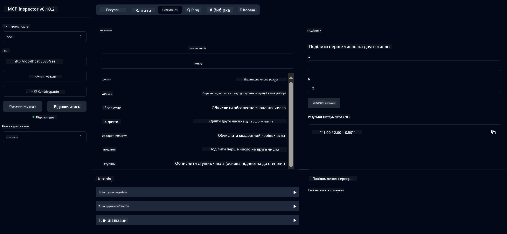

<!--
CO_OP_TRANSLATOR_METADATA:
{
  "original_hash": "ed9cab32cc67c12d8969b407aa47100a",
  "translation_date": "2025-07-13T17:57:22+00:00",
  "source_file": "03-GettingStarted/01-first-server/solution/java/README.md",
  "language_code": "uk"
}
-->
# Сервіс базового калькулятора MCP

Цей сервіс надає базові операції калькулятора через Model Context Protocol (MCP) з використанням Spring Boot та WebFlux як транспортного шару. Він створений як простий приклад для початківців, які вивчають реалізації MCP.

Для детальнішої інформації дивіться довідкову документацію [MCP Server Boot Starter](https://docs.spring.io/spring-ai/reference/api/mcp/mcp-server-boot-starter-docs.html).


## Використання сервісу

Сервіс надає наступні API-ендпоінти через протокол MCP:

- `add(a, b)`: Додати два числа
- `subtract(a, b)`: Відняти друге число від першого
- `multiply(a, b)`: Помножити два числа
- `divide(a, b)`: Поділити перше число на друге (з перевіркою на нуль)
- `power(base, exponent)`: Обчислити ступінь числа
- `squareRoot(number)`: Обчислити квадратний корінь (з перевіркою на від’ємне число)
- `modulus(a, b)`: Обчислити остачу від ділення
- `absolute(number)`: Обчислити абсолютне значення

## Залежності

Проєкт потребує наступних ключових залежностей:

```xml
<dependency>
    <groupId>org.springframework.ai</groupId>
    <artifactId>spring-ai-starter-mcp-server-webflux</artifactId>
</dependency>
```

## Збірка проєкту

Зберіть проєкт за допомогою Maven:
```bash
./mvnw clean install -DskipTests
```

## Запуск сервера

### Використання Java

```bash
java -jar target/calculator-server-0.0.1-SNAPSHOT.jar
```

### Використання MCP Inspector

MCP Inspector — корисний інструмент для взаємодії з MCP сервісами. Щоб використати його з цим калькулятором:

1. **Встановіть і запустіть MCP Inspector** у новому вікні терміналу:
   ```bash
   npx @modelcontextprotocol/inspector
   ```

2. **Відкрийте веб-інтерфейс**, перейшовши за URL, який відобразить додаток (зазвичай http://localhost:6274)

3. **Налаштуйте підключення**:
   - Встановіть тип транспорту "SSE"
   - Вкажіть URL SSE-ендпоінта вашого сервера: `http://localhost:8080/sse`
   - Натисніть "Connect"

4. **Використовуйте інструменти**:
   - Натисніть "List Tools", щоб побачити доступні операції калькулятора
   - Виберіть інструмент і натисніть "Run Tool" для виконання операції



**Відмова від відповідальності**:  
Цей документ було перекладено за допомогою сервісу автоматичного перекладу [Co-op Translator](https://github.com/Azure/co-op-translator). Хоча ми прагнемо до точності, будь ласка, майте на увазі, що автоматичні переклади можуть містити помилки або неточності. Оригінальний документ рідною мовою слід вважати авторитетним джерелом. Для критично важливої інформації рекомендується звертатися до професійного людського перекладу. Ми не несемо відповідальності за будь-які непорозуміння або неправильні тлумачення, що виникли внаслідок використання цього перекладу.