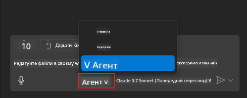
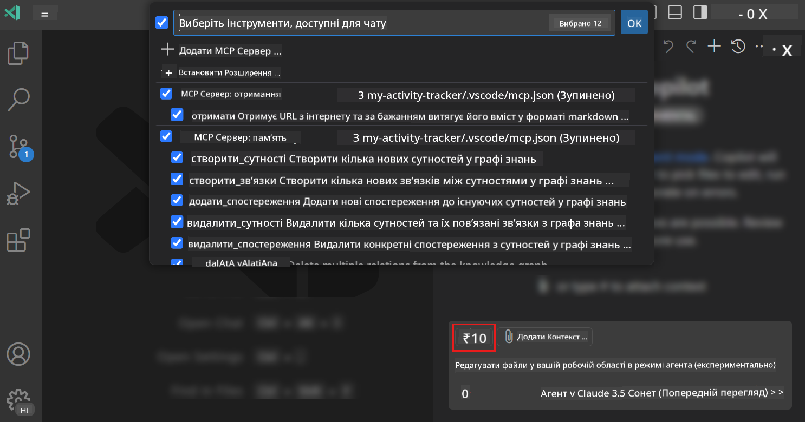
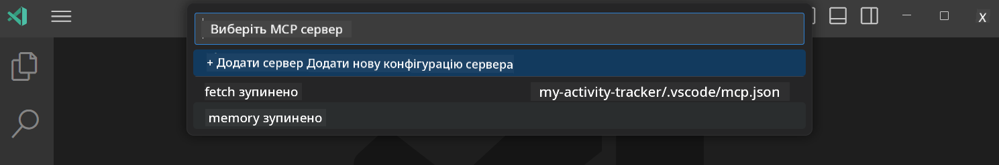
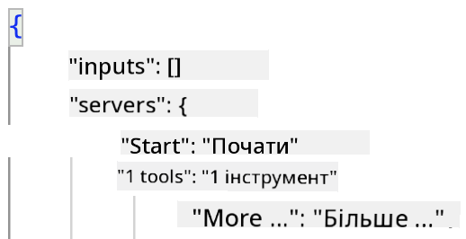
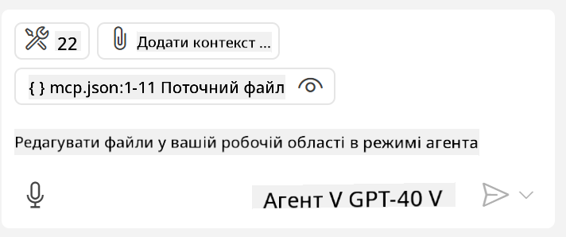
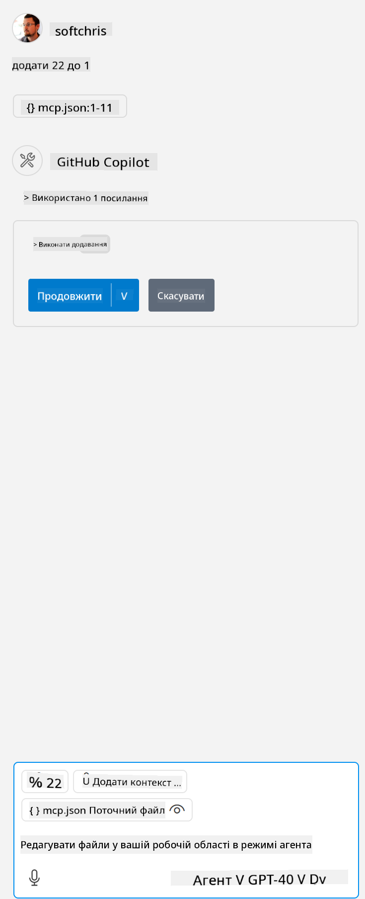

<!--
CO_OP_TRANSLATOR_METADATA:
{
  "original_hash": "d940b5e0af75e3a3a4d1c3179120d1d9",
  "translation_date": "2025-08-26T18:30:18+00:00",
  "source_file": "03-GettingStarted/04-vscode/README.md",
  "language_code": "uk"
}
-->
# Використання сервера в режимі агента GitHub Copilot

Visual Studio Code та GitHub Copilot можуть працювати як клієнт і використовувати MCP Server. Чому це може бути корисно? Це означає, що всі функції MCP Server тепер доступні безпосередньо у вашому IDE. Уявіть, що ви додаєте, наприклад, MCP сервер GitHub — це дозволить керувати GitHub за допомогою підказок замість введення конкретних команд у терміналі. Або уявіть будь-що, що може покращити ваш досвід розробки, кероване природною мовою. Тепер ви бачите переваги, чи не так?

## Огляд

У цьому уроці розглядається, як використовувати Visual Studio Code та режим агента GitHub Copilot як клієнт для вашого MCP Server.

## Навчальні цілі

До кінця цього уроку ви зможете:

- Використовувати MCP Server через Visual Studio Code.
- Запускати функції, такі як інструменти, через GitHub Copilot.
- Налаштовувати Visual Studio Code для пошуку та керування вашим MCP Server.

## Використання

Ви можете керувати вашим MCP Server двома способами:

- Через інтерфейс користувача — як це зробити, буде показано далі в цьому розділі.
- Через термінал — можна керувати сервером із терміналу за допомогою виконуваного файлу `code`:

  Щоб додати MCP сервер до вашого профілю користувача, використовуйте параметр командного рядка --add-mcp і надайте конфігурацію сервера у форматі JSON: {\"name\":\"server-name\",\"command\":...}.

  ```
  code --add-mcp "{\"name\":\"my-server\",\"command\": \"uvx\",\"args\": [\"mcp-server-fetch\"]}"
  ```

### Знімки екрана





Давайте детальніше розглянемо, як використовувати візуальний інтерфейс у наступних розділах.

## Підхід

Ось як ми повинні підійти до цього на високому рівні:

- Налаштувати файл для пошуку нашого MCP Server.
- Запустити/підключитися до сервера, щоб отримати список його можливостей.
- Використовувати ці можливості через інтерфейс чату GitHub Copilot.

Чудово, тепер, коли ми розуміємо процес, спробуймо використати MCP Server через Visual Studio Code у рамках вправи.

## Вправа: Використання сервера

У цій вправі ми налаштуємо Visual Studio Code для пошуку вашого MCP Server, щоб його можна було використовувати через інтерфейс чату GitHub Copilot.

### -0- Попередній крок: увімкнення виявлення MCP Server

Можливо, вам потрібно буде увімкнути виявлення MCP Server.

1. Перейдіть до `File -> Preferences -> Settings` у Visual Studio Code.

1. Знайдіть "MCP" і увімкніть `chat.mcp.discovery.enabled` у файлі settings.json.

### -1- Створення конфігураційного файлу

Почніть зі створення конфігураційного файлу у кореневій папці вашого проєкту. Вам потрібен файл під назвою MCP.json, який слід розмістити у папці .vscode. Він має виглядати так:

```text
.vscode
|-- mcp.json
```

Далі подивимося, як додати запис сервера.

### -2- Налаштування сервера

Додайте наступний вміст до *mcp.json*:

```json
{
    "inputs": [],
    "servers": {
       "hello-mcp": {
           "command": "node",
           "args": [
               "build/index.js"
           ]
       }
    }
}
```

Ось простий приклад запуску сервера, написаного на Node.js. Для інших середовищ виконання вкажіть відповідну команду для запуску сервера за допомогою `command` та `args`.

### -3- Запуск сервера

Тепер, коли ви додали запис, запустіть сервер:

1. Знайдіть ваш запис у *mcp.json* і переконайтеся, що ви бачите значок "play":

    

1. Натисніть значок "play". Ви повинні побачити, що кількість доступних інструментів у значку інструментів GitHub Copilot Chat збільшилася. Якщо ви натиснете цей значок, ви побачите список зареєстрованих інструментів. Ви можете позначати/знімати позначки з кожного інструменту залежно від того, чи хочете ви, щоб GitHub Copilot використовував їх як контекст:

  

1. Щоб запустити інструмент, введіть підказку, яка відповідає опису одного з ваших інструментів, наприклад, таку підказку: "додати 22 до 1":

  

  Ви повинні побачити відповідь "23".

## Завдання

Спробуйте додати запис сервера до вашого файлу *mcp.json* і переконайтеся, що ви можете запускати/зупиняти сервер. Переконайтеся також, що ви можете взаємодіяти з інструментами на вашому сервері через інтерфейс чату GitHub Copilot.

## Рішення

[Рішення](./solution/README.md)

## Основні висновки

Основні висновки з цього розділу:

- Visual Studio Code — чудовий клієнт, який дозволяє використовувати кілька MCP Server та їх інструменти.
- Інтерфейс чату GitHub Copilot — це спосіб взаємодії з серверами.
- Ви можете запитувати у користувача введення, наприклад, API-ключі, які можна передати MCP Server під час налаштування запису сервера у файлі *mcp.json*.

## Приклади

- [Java Калькулятор](../samples/java/calculator/README.md)
- [.Net Калькулятор](../../../../03-GettingStarted/samples/csharp)
- [JavaScript Калькулятор](../samples/javascript/README.md)
- [TypeScript Калькулятор](../samples/typescript/README.md)
- [Python Калькулятор](../../../../03-GettingStarted/samples/python)

## Додаткові ресурси

- [Документація Visual Studio](https://code.visualstudio.com/docs/copilot/chat/mcp-servers)

## Що далі

- Далі: [Створення stdio сервера](../05-stdio-server/README.md)

---

**Відмова від відповідальності**:  
Цей документ був перекладений за допомогою сервісу автоматичного перекладу [Co-op Translator](https://github.com/Azure/co-op-translator). Хоча ми прагнемо до точності, будь ласка, майте на увазі, що автоматичні переклади можуть містити помилки або неточності. Оригінальний документ на його рідній мові слід вважати авторитетним джерелом. Для критичної інформації рекомендується професійний людський переклад. Ми не несемо відповідальності за будь-які непорозуміння або неправильні тлумачення, що виникають внаслідок використання цього перекладу.