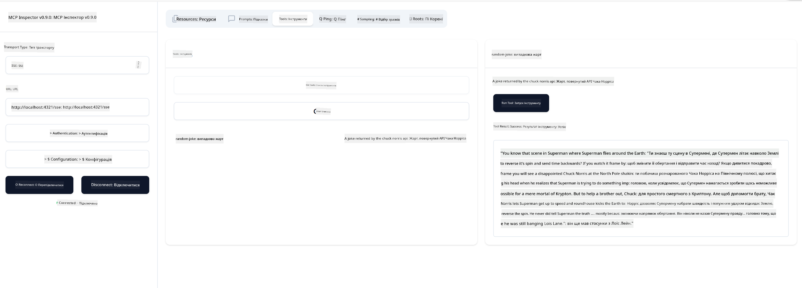

<!--
CO_OP_TRANSLATOR_METADATA:
{
  "original_hash": "6b1152afb5d4cb9a4175044694fd02ca",
  "translation_date": "2025-07-17T13:05:37+00:00",
  "source_file": "03-GettingStarted/05-sse-server/README.md",
  "language_code": "uk"
}
-->
# SSE Сервер

SSE (Server Sent Events) — це стандарт для потокової передачі від сервера до клієнта, який дозволяє серверам надсилати оновлення в реальному часі клієнтам через HTTP. Це особливо корисно для застосунків, які потребують живих оновлень, таких як чат-додатки, сповіщення або потоки даних у реальному часі. Крім того, ваш сервер може одночасно обслуговувати кілька клієнтів, оскільки він працює на сервері, який можна розмістити, наприклад, у хмарі.

## Огляд

У цьому уроці розглядається, як створити та використовувати SSE сервери.

## Цілі навчання

Після завершення цього уроку ви зможете:

- Створити SSE сервер.
- Відлагоджувати SSE сервер за допомогою Inspector.
- Використовувати SSE сервер у Visual Studio Code.

## SSE, як це працює

SSE — це один із двох підтримуваних типів транспорту. Ви вже бачили, як використовується перший — stdio, у попередніх уроках. Різниця полягає в наступному:

- SSE вимагає обробки двох речей: з’єднання та повідомлень.
- Оскільки це сервер, який може працювати будь-де, це потрібно враховувати при роботі з інструментами, такими як Inspector і Visual Studio Code. Це означає, що замість того, щоб вказувати, як запустити сервер, ви вказуєте кінцеву точку (endpoint), де можна встановити з’єднання. Дивіться приклад коду нижче:

### TypeScript

```typescript
app.get("/sse", async (_: Request, res: Response) => {
    const transport = new SSEServerTransport('/messages', res);
    transports[transport.sessionId] = transport;
    res.on("close", () => {
        delete transports[transport.sessionId];
    });
    await server.connect(transport);
});

app.post("/messages", async (req: Request, res: Response) => {
    const sessionId = req.query.sessionId as string;
    const transport = transports[sessionId];
    if (transport) {
        await transport.handlePostMessage(req, res);
    } else {
        res.status(400).send('No transport found for sessionId');
    }
});
```

У наведеному коді:

- `/sse` налаштований як маршрут. Коли надходить запит на цей маршрут, створюється новий екземпляр транспорту, і сервер *підключається* через цей транспорт.
- `/messages` — це маршрут, який обробляє вхідні повідомлення.

### Python

```python
mcp = FastMCP("My App")

@mcp.tool()
def add(a: int, b: int) -> int:
    """Add two numbers"""
    return a + b

# Mount the SSE server to the existing ASGI server
app = Starlette(
    routes=[
        Mount('/', app=mcp.sse_app()),
    ]
)

```

У наведеному коді ми:

- Створюємо екземпляр ASGI сервера (конкретно Starlette) і монтуємо маршрут за замовчуванням `/`.

  За лаштунками маршрути `/sse` та `/messages` налаштовані для обробки з’єднань і повідомлень відповідно. Решта додатку, наприклад додавання інструментів, відбувається так само, як і з stdio серверами.

### .NET    

```csharp
    var builder = WebApplication.CreateBuilder(args);
    builder.Services
        .AddMcpServer()
        .WithTools<Tools>();


    builder.Services.AddHttpClient();

    var app = builder.Build();

    app.MapMcp();
    ```

    Існує два методи, які допомагають перейти від веб-сервера до веб-сервера з підтримкою SSE:

    - `AddMcpServer` — цей метод додає необхідні можливості.
    - `MapMcp` — цей метод додає маршрути, такі як `/SSE` і `/messages`.

Тепер, коли ми трохи більше знаємо про SSE, давайте створимо SSE сервер.

## Вправа: Створення SSE сервера

Щоб створити сервер, потрібно пам’ятати про дві речі:

- Потрібно використовувати веб-сервер для відкриття кінцевих точок для з’єднання та повідомлень.
- Створювати сервер так само, як ми робили це зі stdio, використовуючи інструменти, ресурси та підказки.

### -1- Створення екземпляра сервера

Для створення сервера ми використовуємо ті ж типи, що й зі stdio. Однак для транспорту потрібно вибрати SSE.

### TypeScript

```typescript
import { Request, Response } from "express";
import express from "express";
import { McpServer } from "@modelcontextprotocol/sdk/server/mcp.js";
import { SSEServerTransport } from "@modelcontextprotocol/sdk/server/sse.js";

const server = new McpServer({
  name: "example-server",
  version: "1.0.0"
});

const app = express();

const transports: {[sessionId: string]: SSEServerTransport} = {};
```

У наведеному коді ми:

- Створили екземпляр сервера.
- Визначили додаток за допомогою веб-фреймворку express.
- Створили змінну transports, у якій зберігатимемо вхідні з’єднання.

### Python

```python
from starlette.applications import Starlette
from starlette.routing import Mount, Host
from mcp.server.fastmcp import FastMCP


mcp = FastMCP("My App")
```

У наведеному коді ми:

- Імпортували потрібні бібліотеки, зокрема Starlette (ASGI фреймворк).
- Створили екземпляр MCP сервера `mcp`.

### .NET

```csharp
var builder = WebApplication.CreateBuilder(args);
builder.Services
    .AddMcpServer();


builder.Services.AddHttpClient();

var app = builder.Build();

// TODO: add routes 
```

На цьому етапі ми:

- Створили веб-додаток.
- Додали підтримку MCP функцій через `AddMcpServer`.

Далі додамо потрібні маршрути.

### -2- Додавання маршрутів

Додамо маршрути, які обробляють з’єднання та вхідні повідомлення:

### TypeScript

```typescript
app.get("/sse", async (_: Request, res: Response) => {
  const transport = new SSEServerTransport('/messages', res);
  transports[transport.sessionId] = transport;
  res.on("close", () => {
    delete transports[transport.sessionId];
  });
  await server.connect(transport);
});

app.post("/messages", async (req: Request, res: Response) => {
  const sessionId = req.query.sessionId as string;
  const transport = transports[sessionId];
  if (transport) {
    await transport.handlePostMessage(req, res);
  } else {
    res.status(400).send('No transport found for sessionId');
  }
});

app.listen(3001);
```

У наведеному коді ми визначили:

- Маршрут `/sse`, який створює транспорт типу SSE і викликає `connect` на MCP сервері.
- Маршрут `/messages`, який обробляє вхідні повідомлення.

### Python

```python
app = Starlette(
    routes=[
        Mount('/', app=mcp.sse_app()),
    ]
)
```

У наведеному коді ми:

- Створили екземпляр ASGI додатку за допомогою фреймворку Starlette. У список маршрутів передали `mcp.sse_app()`, що монтує маршрути `/sse` та `/messages` у додаток.

### .NET

```csharp
var builder = WebApplication.CreateBuilder(args);
builder.Services
    .AddMcpServer();

builder.Services.AddHttpClient();

var app = builder.Build();

app.MapMcp();
```

Ми додали один рядок коду в кінці `add.MapMcp()`, що означає, що тепер у нас є маршрути `/SSE` та `/messages`.

Далі додамо можливості серверу.

### -3- Додавання можливостей серверу

Тепер, коли ми визначили все, що стосується SSE, додамо можливості серверу, такі як інструменти, підказки та ресурси.

### TypeScript

```typescript
server.tool("random-joke", "A joke returned by the chuck norris api", {},
  async () => {
    const response = await fetch("https://api.chucknorris.io/jokes/random");
    const data = await response.json();

    return {
      content: [
        {
          type: "text",
          text: data.value
        }
      ]
    };
  }
);
```

Ось як можна додати інструмент, наприклад. Цей інструмент створює інструмент з назвою "random-joke", який викликає API Чака Норріса і повертає JSON-відповідь.

### Python

```python
@mcp.tool()
def add(a: int, b: int) -> int:
    """Add two numbers"""
    return a + b
```

Тепер ваш сервер має один інструмент.

### TypeScript

```typescript
// server-sse.ts
import { Request, Response } from "express";
import express from "express";
import { McpServer } from "@modelcontextprotocol/sdk/server/mcp.js";
import { SSEServerTransport } from "@modelcontextprotocol/sdk/server/sse.js";

// Create an MCP server
const server = new McpServer({
  name: "example-server",
  version: "1.0.0",
});

const app = express();

const transports: { [sessionId: string]: SSEServerTransport } = {};

app.get("/sse", async (_: Request, res: Response) => {
  const transport = new SSEServerTransport("/messages", res);
  transports[transport.sessionId] = transport;
  res.on("close", () => {
    delete transports[transport.sessionId];
  });
  await server.connect(transport);
});

app.post("/messages", async (req: Request, res: Response) => {
  const sessionId = req.query.sessionId as string;
  const transport = transports[sessionId];
  if (transport) {
    await transport.handlePostMessage(req, res);
  } else {
    res.status(400).send("No transport found for sessionId");
  }
});

server.tool("random-joke", "A joke returned by the chuck norris api", {}, async () => {
  const response = await fetch("https://api.chucknorris.io/jokes/random");
  const data = await response.json();

  return {
    content: [
      {
        type: "text",
        text: data.value,
      },
    ],
  };
});

app.listen(3001);
```

### Python

```python
from starlette.applications import Starlette
from starlette.routing import Mount, Host
from mcp.server.fastmcp import FastMCP


mcp = FastMCP("My App")

@mcp.tool()
def add(a: int, b: int) -> int:
    """Add two numbers"""
    return a + b

# Mount the SSE server to the existing ASGI server
app = Starlette(
    routes=[
        Mount('/', app=mcp.sse_app()),
    ]
)
```

### .NET

1. Спочатку створимо кілька інструментів, для цього створимо файл *Tools.cs* з таким вмістом:

  ```csharp
  using System.ComponentModel;
  using System.Text.Json;
  using ModelContextProtocol.Server;

  namespace server;

  [McpServerToolType]
  public sealed class Tools
  {

      public Tools()
      {
      
      }

      [McpServerTool, Description("Add two numbers together.")]
      public async Task<string> AddNumbers(
          [Description("The first number")] int a,
          [Description("The second number")] int b)
      {
          return (a + b).ToString();
      }

  }
  ```

  Тут ми:

  - Створили клас `Tools` з декоратором `McpServerToolType`.
  - Визначили інструмент `AddNumbers`, декорувавши метод `McpServerTool`. Також вказали параметри та реалізацію.

1. Використаємо клас `Tools`, який щойно створили:

  ```csharp
  var builder = WebApplication.CreateBuilder(args);
  builder.Services
      .AddMcpServer()
      .WithTools<Tools>();


  builder.Services.AddHttpClient();

  var app = builder.Build();

  app.MapMcp();
  ```

  Ми додали виклик `WithTools`, який вказує `Tools` як клас, що містить інструменти. Все, готово.

Чудово, у нас є сервер на основі SSE, давайте його протестуємо.

## Вправа: Відлагодження SSE сервера за допомогою Inspector

Inspector — це чудовий інструмент, який ми бачили в попередньому уроці [Створення вашого першого сервера](/03-GettingStarted/01-first-server/README.md). Давайте перевіримо, чи можна використовувати Inspector і тут:

### -1- Запуск Inspector

Щоб запустити Inspector, спочатку потрібно запустити SSE сервер, тож зробимо це:

1. Запустіть сервер

    ### TypeScript

    ```sh
    tsx && node ./build/server-sse.ts
    ```

    ### Python

    ```sh
    uvicorn server:app
    ```

    Зверніть увагу, що ми використовуємо виконуваний файл `uvicorn`, який встановлюється при введенні `pip install "mcp[cli]"`. Команда `server:app` означає, що ми запускаємо файл `server.py`, у якому є екземпляр Starlette з ім’ям `app`.

    ### .NET

    ```sh
    dotnet run
    ```

    Це має запустити сервер. Для взаємодії з ним потрібен новий термінал.

1. Запустіть Inspector

    > ![NOTE]
    > Запускайте це у окремому вікні терміналу, відмінному від того, де працює сервер. Також зверніть увагу, що потрібно підкоригувати команду нижче відповідно до URL, за яким працює ваш сервер.

    ```sh
    npx @modelcontextprotocol/inspector --cli http://localhost:8000/sse --method tools/list
    ```

    Запуск Inspector виглядає однаково у всіх середовищах виконання. Зверніть увагу, що замість передачі шляху до сервера і команди для його запуску ми передаємо URL, де працює сервер, і вказуємо маршрут `/sse`.

### -2- Спробуйте інструмент

Підключіться до сервера, вибравши SSE у випадаючому списку, і введіть URL, за яким працює ваш сервер, наприклад http://localhost:4321/sse. Тепер натисніть кнопку "Connect". Як і раніше, виберіть список інструментів, оберіть інструмент і введіть значення. Ви побачите результат, схожий на цей:



Чудово, ви можете працювати з Inspector, тепер подивимось, як працювати з Visual Studio Code.

## Завдання

Спробуйте розширити ваш сервер додатковими можливостями. Перегляньте [цю сторінку](https://api.chucknorris.io/), щоб, наприклад, додати інструмент, який викликає API. Ви самі вирішуєте, як має виглядати сервер. Успіхів :)

## Розв’язок

[Розв’язок](./solution/README.md) Ось можливий варіант з робочим кодом.

## Основні висновки

Основні висновки з цієї глави:

- SSE — це другий підтримуваний транспорт поряд зі stdio.
- Для підтримки SSE потрібно керувати вхідними з’єднаннями та повідомленнями за допомогою веб-фреймворку.
- Ви можете використовувати як Inspector, так і Visual Studio Code для роботи з SSE сервером, так само як і зі stdio серверами. Зверніть увагу, що між stdio і SSE є деякі відмінності. Для SSE сервер потрібно запускати окремо, а потім запускати інструмент Inspector. Для Inspector також потрібно вказувати URL.

## Приклади

- [Java Calculator](../samples/java/calculator/README.md)
- [.Net Calculator](../../../../03-GettingStarted/samples/csharp)
- [JavaScript Calculator](../samples/javascript/README.md)
- [TypeScript Calculator](../samples/typescript/README.md)
- [Python Calculator](../../../../03-GettingStarted/samples/python) 

## Додаткові ресурси

- [SSE](https://developer.mozilla.org/en-US/docs/Web/API/Server-sent_events)

## Що далі

- Далі: [HTTP Streaming with MCP (Streamable HTTP)](../06-http-streaming/README.md)

**Відмова від відповідальності**:  
Цей документ було перекладено за допомогою сервісу автоматичного перекладу [Co-op Translator](https://github.com/Azure/co-op-translator). Хоча ми прагнемо до точності, будь ласка, майте на увазі, що автоматичні переклади можуть містити помилки або неточності. Оригінальний документ рідною мовою слід вважати авторитетним джерелом. Для критично важливої інформації рекомендується звертатися до професійного людського перекладу. Ми не несемо відповідальності за будь-які непорозуміння або неправильні тлумачення, що виникли внаслідок використання цього перекладу.