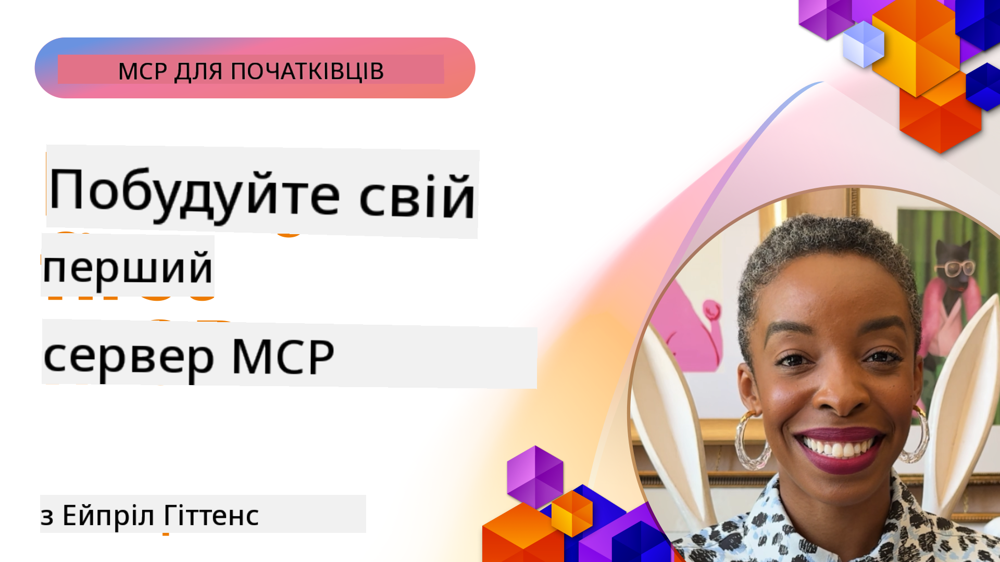

<!--
CO_OP_TRANSLATOR_METADATA:
{
  "original_hash": "858362ce0118de3fec0f9114bf396101",
  "translation_date": "2025-08-18T23:00:01+00:00",
  "source_file": "03-GettingStarted/README.md",
  "language_code": "uk"
}
-->
## Початок роботи  

_(Натисніть на зображення вище, щоб переглянути відео цього уроку)_

Цей розділ складається з кількох уроків:

- **1 Ваш перший сервер**. У цьому першому уроці ви дізнаєтеся, як створити свій перший сервер і перевірити його за допомогою інструменту інспекції — корисного способу тестування та налагодження вашого сервера, [до уроку](01-first-server/README.md)

- **2 Клієнт**. У цьому уроці ви навчитеся писати клієнта, який може підключатися до вашого сервера, [до уроку](02-client/README.md)

- **3 Клієнт із LLM**. Ще кращий спосіб написання клієнта — це додати до нього LLM, щоб він міг "домовлятися" з вашим сервером про те, що робити, [до уроку](03-llm-client/README.md)

- **4 Використання сервера в режимі GitHub Copilot Agent у Visual Studio Code**. Тут ми розглянемо запуск нашого MCP сервера безпосередньо у Visual Studio Code, [до уроку](04-vscode/README.md)

- **5 Використання SSE (Server Sent Events)**. SSE — це стандарт для потокової передачі даних від сервера до клієнта, що дозволяє серверам надсилати оновлення в реальному часі клієнтам через HTTP, [до уроку](05-sse-server/README.md)

- **6 HTTP стрімінг із MCP (Streamable HTTP)**. Дізнайтеся про сучасний HTTP стрімінг, повідомлення про прогрес і як реалізувати масштабовані MCP сервери та клієнти в реальному часі за допомогою Streamable HTTP, [до уроку](06-http-streaming/README.md)

- **7 Використання AI Toolkit для VSCode** для тестування ваших MCP клієнтів і серверів, [до уроку](07-aitk/README.md)

- **8 Тестування**. У цьому розділі ми зосередимося на різних способах тестування вашого сервера та клієнта, [до уроку](08-testing/README.md)

- **9 Розгортання**. У цьому розділі ми розглянемо різні способи розгортання ваших MCP рішень, [до уроку](09-deployment/README.md)

Протокол Model Context Protocol (MCP) — це відкритий протокол, який стандартизує спосіб надання контексту LLM. Уявіть MCP як порт USB-C для AI-додатків — він забезпечує стандартизований спосіб підключення AI моделей до різних джерел даних і інструментів.

## Навчальні цілі

До кінця цього уроку ви зможете:

- Налаштувати середовище розробки для MCP у C#, Java, Python, TypeScript і JavaScript
- Створювати та розгортати базові MCP сервери з кастомними функціями (ресурси, підказки, інструменти)
- Створювати хост-додатки, які підключаються до MCP серверів
- Тестувати та налагоджувати реалізації MCP
- Розуміти поширені проблеми налаштування та їх вирішення
- Підключати ваші реалізації MCP до популярних LLM сервісів

## Налаштування середовища MCP

Перед тим як почати працювати з MCP, важливо підготувати середовище розробки та зрозуміти основний робочий процес. Цей розділ допоможе вам пройти початкові кроки налаштування для забезпечення плавного старту з MCP.

### Попередні вимоги

Перед початком розробки з MCP переконайтеся, що у вас є:

- **Середовище розробки**: Для обраної вами мови (C#, Java, Python, TypeScript або JavaScript)
- **IDE/Редактор**: Visual Studio, Visual Studio Code, IntelliJ, Eclipse, PyCharm або будь-який сучасний редактор коду
- **Менеджери пакетів**: NuGet, Maven/Gradle, pip або npm/yarn
- **API ключі**: Для будь-яких AI сервісів, які ви плануєте використовувати у ваших хост-додатках

### Офіційні SDK

У наступних розділах ви побачите рішення, створені за допомогою Python, TypeScript, Java та .NET. Ось усі офіційно підтримувані SDK.

MCP надає офіційні SDK для кількох мов:
- [C# SDK](https://github.com/modelcontextprotocol/csharp-sdk) - Підтримується у співпраці з Microsoft
- [Java SDK](https://github.com/modelcontextprotocol/java-sdk) - Підтримується у співпраці з Spring AI
- [TypeScript SDK](https://github.com/modelcontextprotocol/typescript-sdk) - Офіційна реалізація для TypeScript
- [Python SDK](https://github.com/modelcontextprotocol/python-sdk) - Офіційна реалізація для Python
- [Kotlin SDK](https://github.com/modelcontextprotocol/kotlin-sdk) - Офіційна реалізація для Kotlin
- [Swift SDK](https://github.com/modelcontextprotocol/swift-sdk) - Підтримується у співпраці з Loopwork AI
- [Rust SDK](https://github.com/modelcontextprotocol/rust-sdk) - Офіційна реалізація для Rust

## Основні висновки

- Налаштування середовища розробки MCP є простим завдяки SDK для конкретних мов
- Створення MCP серверів включає створення та реєстрацію інструментів із чіткими схемами
- MCP клієнти підключаються до серверів і моделей для розширення можливостей
- Тестування та налагодження є важливими для надійних реалізацій MCP
- Варіанти розгортання варіюються від локальної розробки до хмарних рішень

## Практика

Ми підготували набір прикладів, які доповнюють вправи, що ви побачите у всіх розділах цього курсу. Крім того, кожен розділ має свої вправи та завдання.

- [Java Калькулятор](./samples/java/calculator/README.md)
- [.Net Калькулятор](../../../03-GettingStarted/samples/csharp)
- [JavaScript Калькулятор](./samples/javascript/README.md)
- [TypeScript Калькулятор](./samples/typescript/README.md)
- [Python Калькулятор](../../../03-GettingStarted/samples/python)

## Додаткові ресурси

- [Створення агентів за допомогою Model Context Protocol на Azure](https://learn.microsoft.com/azure/developer/ai/intro-agents-mcp)
- [Віддалений MCP із Azure Container Apps (Node.js/TypeScript/JavaScript)](https://learn.microsoft.com/samples/azure-samples/mcp-container-ts/mcp-container-ts/)
- [.NET OpenAI MCP Agent](https://learn.microsoft.com/samples/azure-samples/openai-mcp-agent-dotnet/openai-mcp-agent-dotnet/)

## Що далі

Далі: [Створення вашого першого MCP сервера](01-first-server/README.md)

**Відмова від відповідальності**:  
Цей документ був перекладений за допомогою сервісу автоматичного перекладу [Co-op Translator](https://github.com/Azure/co-op-translator). Хоча ми прагнемо до точності, будь ласка, майте на увазі, що автоматичні переклади можуть містити помилки або неточності. Оригінальний документ на його рідній мові слід вважати авторитетним джерелом. Для критичної інформації рекомендується професійний людський переклад. Ми не несемо відповідальності за будь-які непорозуміння або неправильні тлумачення, що виникають внаслідок використання цього перекладу.