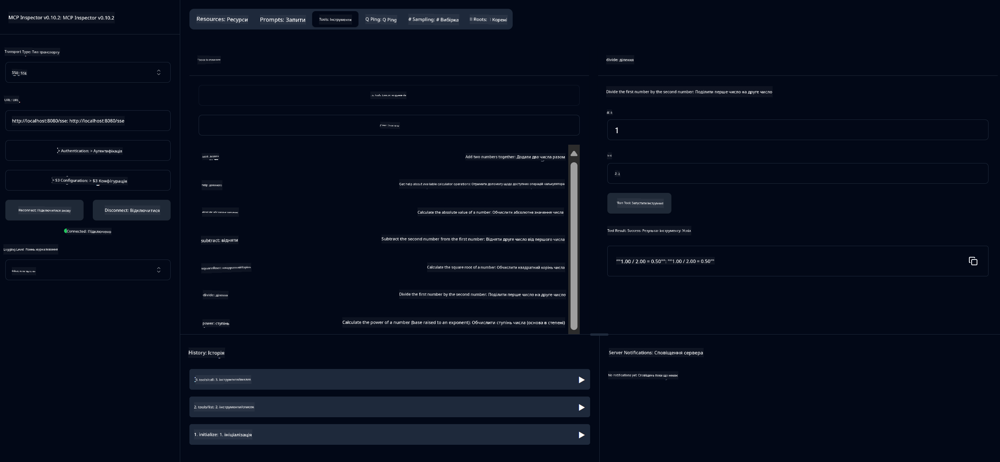

<!--
CO_OP_TRANSLATOR_METADATA:
{
  "original_hash": "13231e9951b68efd9df8c56bd5cdb27e",
  "translation_date": "2025-06-17T16:37:48+00:00",
  "source_file": "03-GettingStarted/samples/java/calculator/README.md",
  "language_code": "uk"
}
-->
# Basic Calculator MCP Service

Цей сервіс надає базові операції калькулятора через Model Context Protocol (MCP) з використанням Spring Boot і WebFlux транспорту. Він створений як простий приклад для початківців, які вивчають реалізації MCP.

Для детальнішої інформації дивіться довідкову документацію [MCP Server Boot Starter](https://docs.spring.io/spring-ai/reference/api/mcp/mcp-server-boot-starter-docs.html).

## Огляд

Сервіс демонструє:
- Підтримку SSE (Server-Sent Events)
- Автоматичну реєстрацію інструментів за допомогою анотації `@Tool` із Spring AI
- Базові функції калькулятора:
  - Додавання, віднімання, множення, ділення
  - Обчислення степеня та квадратного кореня
  - Обчислення модуля (залишку) та абсолютного значення
  - Функцію допомоги з описом операцій

## Особливості

Цей калькуляторний сервіс пропонує наступні можливості:

1. **Базові арифметичні операції**:
   - Додавання двох чисел
   - Віднімання одного числа від іншого
   - Множення двох чисел
   - Ділення одного числа на інше (з перевіркою на ділення на нуль)

2. **Розширені операції**:
   - Обчислення степеня (піднесення основи до степеня)
   - Обчислення квадратного кореня (з перевіркою на від’ємне число)
   - Обчислення модуля (залишку від ділення)
   - Обчислення абсолютного значення

3. **Система допомоги**:
   - Вбудована функція допомоги, що пояснює всі доступні операції

## Використання сервісу

Сервіс надає наступні API кінцеві точки через протокол MCP:

- `add(a, b)`: Додавання двох чисел
- `subtract(a, b)`: Віднімання другого числа від першого
- `multiply(a, b)`: Множення двох чисел
- `divide(a, b)`: Ділення першого числа на друге (з перевіркою на нуль)
- `power(base, exponent)`: Обчислення степеня числа
- `squareRoot(number)`: Обчислення квадратного кореня (з перевіркою на від’ємне число)
- `modulus(a, b)`: Обчислення залишку від ділення
- `absolute(number)`: Обчислення абсолютного значення
- `help()`: Отримання інформації про доступні операції

## Тестовий клієнт

Простий тестовий клієнт включений у пакет `com.microsoft.mcp.sample.client`. Клас `SampleCalculatorClient` демонструє доступні операції сервісу калькулятора.

## Використання клієнта LangChain4j

Проєкт містить приклад клієнта LangChain4j у `com.microsoft.mcp.sample.client.LangChain4jClient`, який демонструє, як інтегрувати сервіс калькулятора з LangChain4j та моделями GitHub:

### Необхідні умови

1. **Налаштування токена GitHub**:
   
   Для використання AI-моделей GitHub (наприклад, phi-4) потрібен персональний токен доступу GitHub:

   a. Перейдіть у налаштування свого акаунту GitHub: https://github.com/settings/tokens
   
   b. Натисніть "Generate new token" → "Generate new token (classic)"
   
   в. Дайте токену описову назву
   
   г. Виберіть наступні області доступу:
      - `repo` (Повний контроль приватних репозиторіїв)
      - `read:org` (Читання членства в організаціях і командах, читання проектів організації)
      - `gist` (Створення gist)
      - `user:email` (Доступ до адрес електронної пошти користувача (тільки для читання))
   
   д. Натисніть "Generate token" та скопіюйте новий токен
   
   е. Встановіть його як змінну середовища:
      
      На Windows:
      ```
      set GITHUB_TOKEN=your-github-token
      ```
      
      На macOS/Linux:
      ```bash
      export GITHUB_TOKEN=your-github-token
      ```

   ж. Для постійного налаштування додайте його у змінні середовища через системні налаштування

2. Додайте залежність LangChain4j GitHub у свій проєкт (вже включено у pom.xml):
   ```xml
   <dependency>
       <groupId>dev.langchain4j</groupId>
       <artifactId>langchain4j-github</artifactId>
       <version>${langchain4j.version}</version>
   </dependency>
   ```

3. Переконайтеся, що сервер калькулятора працює на `localhost:8080`

### Запуск клієнта LangChain4j

Цей приклад демонструє:
- Підключення до сервера калькулятора MCP через SSE транспорт
- Використання LangChain4j для створення чат-бота, який використовує операції калькулятора
- Інтеграцію з AI-моделями GitHub (тепер використовується модель phi-4)

Клієнт надсилає наступні приклади запитів для демонстрації функціоналу:
1. Обчислення суми двох чисел
2. Знаходження квадратного кореня числа
3. Отримання інформації про доступні операції калькулятора

Запустіть приклад і перегляньте вивід консолі, щоб побачити, як AI-модель використовує інструменти калькулятора для відповіді на запити.

### Конфігурація моделі GitHub

Клієнт LangChain4j налаштований на використання моделі phi-4 від GitHub з такими параметрами:

```java
ChatLanguageModel model = GitHubChatModel.builder()
    .apiKey(System.getenv("GITHUB_TOKEN"))
    .timeout(Duration.ofSeconds(60))
    .modelName("phi-4")
    .logRequests(true)
    .logResponses(true)
    .build();
```

Для використання інших моделей GitHub просто змініть параметр `modelName` на іншу підтримувану модель (наприклад, "claude-3-haiku-20240307", "llama-3-70b-8192" тощо).

## Залежності

Проєкт потребує наступних ключових залежностей:

```xml
<!-- For MCP Server -->
<dependency>
    <groupId>org.springframework.ai</groupId>
    <artifactId>spring-ai-starter-mcp-server-webflux</artifactId>
</dependency>

<!-- For LangChain4j integration -->
<dependency>
    <groupId>dev.langchain4j</groupId>
    <artifactId>langchain4j-mcp</artifactId>
    <version>${langchain4j.version}</version>
</dependency>

<!-- For GitHub models support -->
<dependency>
    <groupId>dev.langchain4j</groupId>
    <artifactId>langchain4j-github</artifactId>
    <version>${langchain4j.version}</version>
</dependency>
```

## Збірка проєкту

Зберіть проєкт за допомогою Maven:
```bash
./mvnw clean install -DskipTests
```

## Запуск сервера

### Використання Java

```bash
java -jar target/calculator-server-0.0.1-SNAPSHOT.jar
```

### Використання MCP Inspector

MCP Inspector — корисний інструмент для взаємодії з MCP сервісами. Щоб використовувати його з цим калькуляторним сервісом:

1. **Встановіть і запустіть MCP Inspector** у новому вікні терміналу:
   ```bash
   npx @modelcontextprotocol/inspector
   ```

2. **Відкрийте веб-інтерфейс**, натиснувши на URL, який відобразиться у додатку (зазвичай http://localhost:6274)

3. **Налаштуйте підключення**:
   - Встановіть тип транспорту "SSE"
   - Вкажіть URL SSE кінцевої точки вашого сервера: `http://localhost:8080/sse`
   - Натисніть "Connect"

4. **Використовуйте інструменти**:
   - Натисніть "List Tools", щоб побачити доступні операції калькулятора
   - Виберіть інструмент і натисніть "Run Tool" для виконання операції



### Використання Docker

Проєкт містить Dockerfile для розгортання у контейнері:

1. **Зберіть Docker образ**:
   ```bash
   docker build -t calculator-mcp-service .
   ```

2. **Запустіть Docker контейнер**:
   ```bash
   docker run -p 8080:8080 calculator-mcp-service
   ```

Це:
- Збере багатоступеневий Docker образ з Maven 3.9.9 та Eclipse Temurin 24 JDK
- Створить оптимізований контейнерний образ
- Відкриє порт 8080 для сервісу
- Запустить MCP калькуляторний сервіс у контейнері

Після запуску контейнера ви зможете отримати доступ до сервісу за адресою `http://localhost:8080`.

## Вирішення проблем

### Поширені проблеми з токеном GitHub

1. **Проблеми з дозволами токена**: Якщо ви отримуєте помилку 403 Forbidden, перевірте, чи має ваш токен потрібні дозволи, описані в розділі необхідних умов.

2. **Токен не знайдено**: Якщо з’являється помилка "No API key found", переконайтеся, що змінна середовища GITHUB_TOKEN встановлена правильно.

3. **Обмеження швидкості (rate limiting)**: GitHub API має обмеження на кількість запитів. Якщо ви отримуєте помилку з кодом 429, зачекайте кілька хвилин і спробуйте знову.

4. **Термін дії токена минув**: Токени GitHub можуть мати термін дії. Якщо після деякого часу виникають помилки аутентифікації, створіть новий токен і оновіть змінну середовища.

Якщо потрібна додаткова допомога, звертайтеся до [документації LangChain4j](https://github.com/langchain4j/langchain4j) або [документації GitHub API](https://docs.github.com/en/rest).

**Відмова від відповідальності**:  
Цей документ було перекладено за допомогою сервісу автоматичного перекладу [Co-op Translator](https://github.com/Azure/co-op-translator). Хоча ми прагнемо до точності, будь ласка, майте на увазі, що автоматичні переклади можуть містити помилки або неточності. Оригінальний документ рідною мовою слід вважати авторитетним джерелом. Для критично важливої інформації рекомендується звертатися до професійного людського перекладу. Ми не несемо відповідальності за будь-які непорозуміння або неправильні тлумачення, що виникли внаслідок використання цього перекладу.