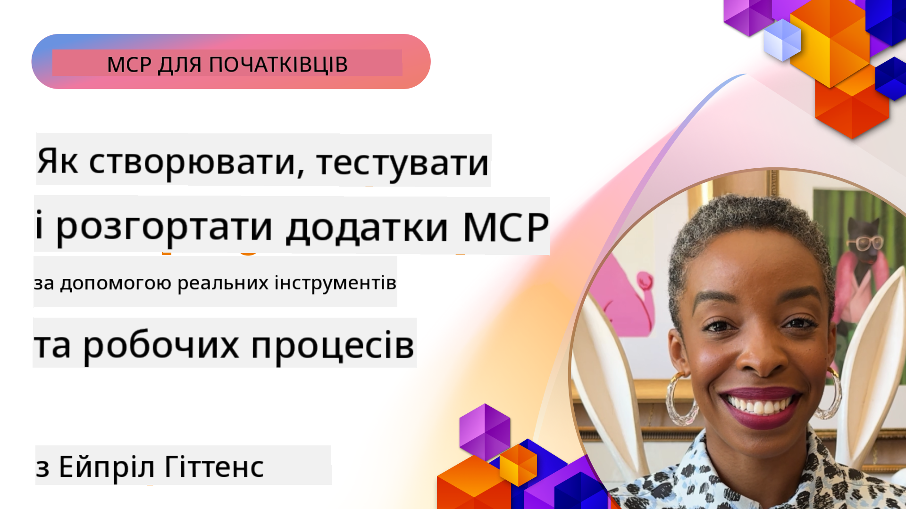

<!--
CO_OP_TRANSLATOR_METADATA:
{
  "original_hash": "83efa75a69bc831277263a6f1ae53669",
  "translation_date": "2025-08-19T19:12:02+00:00",
  "source_file": "04-PracticalImplementation/README.md",
  "language_code": "uk"
}
-->
# Практична реалізація

[](https://youtu.be/vCN9-mKBDfQ)

_(Натисніть на зображення вище, щоб переглянути відео цього уроку)_

Практична реалізація — це те, де сила Model Context Protocol (MCP) стає відчутною. Хоча розуміння теорії та архітектури MCP є важливим, справжня цінність проявляється, коли ви застосовуєте ці концепції для створення, тестування та розгортання рішень, які вирішують реальні проблеми. Цей розділ з'єднує розрив між концептуальними знаннями та практичною розробкою, допомагаючи вам втілити MCP-додатки в життя.

Незалежно від того, чи розробляєте ви інтелектуальних асистентів, інтегруєте ШІ у бізнес-процеси чи створюєте індивідуальні інструменти для обробки даних, MCP забезпечує гнучку основу. Його незалежний від мови дизайн та офіційні SDK для популярних мов програмування роблять його доступним для широкого кола розробників. Використовуючи ці SDK, ви можете швидко створювати прототипи, ітерувати та масштабувати свої рішення на різних платформах і в різних середовищах.

У наступних розділах ви знайдете практичні приклади, зразки коду та стратегії розгортання, які демонструють, як реалізувати MCP на C#, Java з Spring, TypeScript, JavaScript і Python. Ви також дізнаєтеся, як налагоджувати та тестувати MCP-сервери, керувати API та розгортати рішення в хмарі за допомогою Azure. Ці практичні ресурси створені для того, щоб прискорити ваше навчання та допомогти вам впевнено створювати надійні MCP-додатки, готові до використання у виробництві.

## Огляд

Цей урок зосереджений на практичних аспектах реалізації MCP у різних мовах програмування. Ми розглянемо, як використовувати MCP SDK у C#, Java з Spring, TypeScript, JavaScript і Python для створення надійних додатків, налагодження та тестування MCP-серверів, а також створення багаторазових ресурсів, підказок і інструментів.

## Цілі навчання

До кінця цього уроку ви зможете:

- Реалізовувати MCP-рішення за допомогою офіційних SDK для різних мов програмування
- Систематично налагоджувати та тестувати MCP-сервери
- Створювати та використовувати функції серверів (Ресурси, Підказки та Інструменти)
- Проєктувати ефективні робочі процеси MCP для складних завдань
- Оптимізувати реалізації MCP для продуктивності та надійності

## Офіційні ресурси SDK

Model Context Protocol пропонує офіційні SDK для кількох мов:

- [C# SDK](https://github.com/modelcontextprotocol/csharp-sdk)
- [Java з Spring SDK](https://github.com/modelcontextprotocol/java-sdk) **Примітка:** потребує залежності від [Project Reactor](https://projectreactor.io). (Див. [обговорення issue 246](https://github.com/orgs/modelcontextprotocol/discussions/246).)
- [TypeScript SDK](https://github.com/modelcontextprotocol/typescript-sdk)
- [Python SDK](https://github.com/modelcontextprotocol/python-sdk)
- [Kotlin SDK](https://github.com/modelcontextprotocol/kotlin-sdk)

## Робота з MCP SDK

Цей розділ надає практичні приклади реалізації MCP на різних мовах програмування. Ви можете знайти зразки коду в каталозі `samples`, організованому за мовами.

### Доступні зразки

Репозиторій включає [зразки реалізацій](../../../04-PracticalImplementation/samples) для наступних мов:

- [C#](./samples/csharp/README.md)
- [Java з Spring](./samples/java/containerapp/README.md)
- [TypeScript](./samples/typescript/README.md)
- [JavaScript](./samples/javascript/README.md)
- [Python](./samples/python/README.md)

Кожен зразок демонструє ключові концепції MCP та шаблони реалізації для конкретної мови та екосистеми.

## Основні функції серверів

MCP-сервери можуть реалізовувати будь-яку комбінацію цих функцій:

### Ресурси

Ресурси надають контекст і дані для користувача або моделі ШІ:

- Репозиторії документів
- Бази знань
- Структуровані джерела даних
- Файлові системи

### Підказки

Підказки — це шаблонні повідомлення та робочі процеси для користувачів:

- Попередньо визначені шаблони розмов
- Спрямовані шаблони взаємодії
- Спеціалізовані структури діалогу

### Інструменти

Інструменти — це функції, які модель ШІ може виконувати:

- Утиліти для обробки даних
- Інтеграції з зовнішніми API
- Обчислювальні можливості
- Функціонал пошуку

## Зразки реалізацій: Реалізація на C#

Офіційний репозиторій C# SDK містить кілька зразків реалізацій, які демонструють різні аспекти MCP:

- **Базовий MCP-клієнт**: Простий приклад створення MCP-клієнта та виклику інструментів
- **Базовий MCP-сервер**: Мінімальна реалізація сервера з базовою реєстрацією інструментів
- **Розширений MCP-сервер**: Повнофункціональний сервер із реєстрацією інструментів, автентифікацією та обробкою помилок
- **Інтеграція з ASP.NET**: Приклади інтеграції з ASP.NET Core
- **Шаблони реалізації інструментів**: Різні шаблони для реалізації інструментів із різним рівнем складності

C# SDK для MCP знаходиться в стадії попереднього перегляду, і API можуть змінюватися. Ми будемо постійно оновлювати цей блог у міру розвитку SDK.

### Основні функції

- [C# MCP Nuget ModelContextProtocol](https://www.nuget.org/packages/ModelContextProtocol)
- Створення вашого [першого MCP-сервера](https://devblogs.microsoft.com/dotnet/build-a-model-context-protocol-mcp-server-in-csharp/).

Для повних зразків реалізації на C# відвідайте [офіційний репозиторій зразків C# SDK](https://github.com/modelcontextprotocol/csharp-sdk).

## Зразок реалізації: Реалізація на Java з Spring

SDK для Java з Spring пропонує надійні варіанти реалізації MCP з функціями корпоративного рівня.

### Основні функції

- Інтеграція з Spring Framework
- Сильна типізація
- Підтримка реактивного програмування
- Комплексна обробка помилок

Для повного зразка реалізації на Java з Spring дивіться [зразок Java з Spring](samples/java/containerapp/README.md) у каталозі зразків.

## Зразок реалізації: Реалізація на JavaScript

SDK для JavaScript забезпечує легкий і гнучкий підхід до реалізації MCP.

### Основні функції

- Підтримка Node.js і браузера
- API на основі Promise
- Легка інтеграція з Express та іншими фреймворками
- Підтримка WebSocket для потокової передачі

Для повного зразка реалізації на JavaScript дивіться [зразок JavaScript](samples/javascript/README.md) у каталозі зразків.

## Зразок реалізації: Реалізація на Python

SDK для Python пропонує "пайтонічний" підхід до реалізації MCP з відмінною інтеграцією з ML-фреймворками.

### Основні функції

- Підтримка async/await з asyncio
- Інтеграція з FastAPI
- Проста реєстрація інструментів
- Рідна інтеграція з популярними ML-бібліотеками

Для повного зразка реалізації на Python дивіться [зразок Python](samples/python/README.md) у каталозі зразків.

## Управління API

Azure API Management — це чудове рішення для забезпечення безпеки MCP-серверів. Ідея полягає в тому, щоб розмістити екземпляр Azure API Management перед вашим MCP-сервером і дозволити йому обробляти функції, які вам, ймовірно, знадобляться, такі як:

- обмеження швидкості
- управління токенами
- моніторинг
- балансування навантаження
- безпека

### Зразок Azure

Ось зразок Azure, який робить саме це, тобто [створює MCP-сервер і захищає його за допомогою Azure API Management](https://github.com/Azure-Samples/remote-mcp-apim-functions-python).

Дивіться, як відбувається потік авторизації на зображенні нижче:


На попередньому зображенні відбувається наступне:

- Аутентифікація/авторизація здійснюється за допомогою Microsoft Entra.
- Azure API Management діє як шлюз і використовує політики для спрямування та управління трафіком.
- Azure Monitor реєструє всі запити для подальшого аналізу.

#### Потік авторизації

Давайте детальніше розглянемо потік авторизації:


#### Специфікація авторизації MCP

Дізнайтеся більше про [специфікацію авторизації MCP](https://modelcontextprotocol.io/specification/2025-03-26/basic/authorization#2-10-third-party-authorization-flow).

## Розгортання віддаленого MCP-сервера в Azure

Давайте подивимося, чи можемо ми розгорнути зразок, згаданий раніше:

1. Клонуйте репозиторій

    ```bash
    git clone https://github.com/Azure-Samples/remote-mcp-apim-functions-python.git
    cd remote-mcp-apim-functions-python
    ```

1. Зареєструйте постачальника ресурсів `Microsoft.App`.

   - Якщо ви використовуєте Azure CLI, виконайте `az provider register --namespace Microsoft.App --wait`.
   - Якщо ви використовуєте Azure PowerShell, виконайте `Register-AzResourceProvider -ProviderNamespace Microsoft.App`. Потім через деякий час виконайте `(Get-AzResourceProvider -ProviderNamespace Microsoft.App).RegistrationState`, щоб перевірити, чи завершена реєстрація.

1. Виконайте цю команду [azd](https://aka.ms/azd), щоб забезпечити службу управління API, функціональний додаток (з кодом) та всі інші необхідні ресурси Azure:

    ```shell
    azd up
    ```

    Ця команда повинна розгорнути всі хмарні ресурси в Azure.

### Тестування вашого сервера за допомогою MCP Inspector

1. У **новому вікні терміналу** встановіть і запустіть MCP Inspector:

    ```shell
    npx @modelcontextprotocol/inspector
    ```

    Ви повинні побачити інтерфейс, схожий на:

    

1. Натисніть CTRL, щоб завантажити веб-додаток MCP Inspector за URL-адресою, відображеною додатком (наприклад, [http://127.0.0.1:6274/#resources](http://127.0.0.1:6274/#resources)).
1. Встановіть тип транспорту на `SSE`.
1. Встановіть URL-адресу вашого працюючого SSE-ендпоінту API Management, відображеного після `azd up`, і **Підключіться**:

    ```shell
    https://<apim-servicename-from-azd-output>.azure-api.net/mcp/sse
    ```

1. **Список інструментів**. Натисніть на інструмент і **Запустіть інструмент**.

Якщо всі кроки виконані успішно, ви повинні бути підключені до MCP-сервера і змогли викликати інструмент.

## MCP-сервери для Azure

[Remote-mcp-functions](https://github.com/Azure-Samples/remote-mcp-functions-dotnet): Цей набір репозиторіїв є шаблоном швидкого старту для створення та розгортання індивідуальних віддалених MCP (Model Context Protocol) серверів за допомогою Azure Functions з Python, C# .NET або Node/TypeScript.

Зразки надають повне рішення, яке дозволяє розробникам:

- Створювати та запускати локально: Розробляти та налагоджувати MCP-сервер на локальній машині
- Розгортати в Azure: Легко розгортати в хмарі за допомогою простої команди azd up
- Підключатися з клієнтів: Підключатися до MCP-сервера з різних клієнтів, включаючи режим агента Copilot у VS Code та інструмент MCP Inspector

### Основні функції

- Безпека за дизайном: MCP-сервер захищений за допомогою ключів і HTTPS
- Варіанти автентифікації: Підтримка OAuth за допомогою вбудованої автентифікації та/або управління API
- Ізоляція мережі: Дозволяє ізоляцію мережі за допомогою Azure Virtual Networks (VNET)
- Безсерверна архітектура: Використовує Azure Functions для масштабованого, подієво-орієнтованого виконання
- Локальна розробка: Комплексна підтримка локальної розробки та налагодження
- Просте розгортання: Спрощений процес розгортання в Azure

Репозиторій включає всі необхідні конфігураційні файли, вихідний код та визначення інфраструктури, щоб швидко розпочати роботу з готовою до виробництва реалізацією MCP-сервера.

- [Azure Remote MCP Functions Python](https://github.com/Azure-Samples/remote-mcp-functions-python) - Зразок реалізації MCP за допомогою Azure Functions з Python.

- [Azure Remote MCP Functions .NET](https://github.com/Azure-Samples/remote-mcp-functions-dotnet) - Зразок реалізації MCP за допомогою Azure Functions з C# .NET.

- [Azure Remote MCP Functions Node/Typescript](https://github.com/Azure-Samples/remote-mcp-functions-typescript) - Зразок реалізації MCP за допомогою Azure Functions з Node/TypeScript.

## Основні висновки

- MCP SDK надають інструменти для реалізації надійних рішень MCP для конкретних мов
- Процес налагодження та тестування є критично важливим для надійних MCP-додатків
- Багаторазові шаблони підказок забезпечують послідовну взаємодію з ШІ
- Добре спроєктовані робочі процеси можуть оркеструвати складні завдання за допомогою кількох інструментів
- Реалізація MCP-рішень вимагає врахування безпеки, продуктивності та обробки помилок

## Вправа

Розробіть практичний робочий процес MCP, який вирішує реальну проблему у вашій галузі:

1. Визначте 3-4 інструменти, які були б корисними для вирішення цієї проблеми.
2. Створіть діаграму робочого процесу, яка показує, як ці інструменти взаємодіють.
3. Реалізуйте базову версію одного з інструментів, використовуючи вашу улюблену мову програмування.
4. Створіть шаблон підказки, який допоможе моделі ефективно використовувати ваш інструмент.

## Додаткові ресурси

---

Далі: [Розширені теми](../05-AdvancedTopics/README.md)

**Відмова від відповідальності**:  
Цей документ було перекладено за допомогою сервісу автоматичного перекладу [Co-op Translator](https://github.com/Azure/co-op-translator). Хоча ми прагнемо до точності, звертаємо вашу увагу, що автоматичні переклади можуть містити помилки або неточності. Оригінальний документ мовою оригіналу слід вважати авторитетним джерелом. Для критично важливої інформації рекомендується професійний людський переклад. Ми не несемо відповідальності за будь-які непорозуміння або неправильні тлумачення, що виникли внаслідок використання цього перекладу.